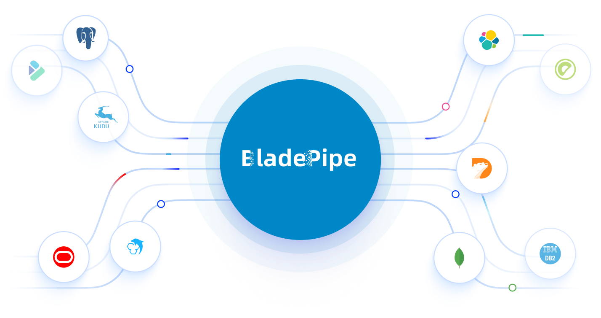

# BladePipe Official Site & Documentation

[](https://docusaurus.io/)
[](https://react.dev/)
[](https://www.typescriptlang.org/)

Official website and documentation source for BladePipe.

BladePipe is a real-time data integration and CDC pipeline platform for enterprise data synchronization, migration, replication, analytics, and AI data pipelines.

Visit the official BladePipe website: [Explore BladePipe](https://www.bladepipe.com)



## Why BladePipe

Modern data teams need pipelines that are low-latency, reliable, and operationally manageable at scale.
BladePipe is built for this exact problem: continuously move and transform changed data across heterogeneous systems without relying on fragile batch-only jobs.

Core value:
- Real-time data movement based on database changes
- One platform for replication, migration, analytics, and AI data preparation
- Operational visibility for production-grade pipelines

## What You Can Build

- Database-to-warehouse real-time sync
- Cross-cloud and cross-region replication
- Incremental migration pipelines with low downtime
- Event-driven downstream data delivery
- AI/RAG-ready data ingestion and updates

## Product Concepts

### CDC (Change Data Capture)
CDC captures row-level inserts, updates, and deletes from source systems and propagates only changed data downstream.  
Compared with periodic full reload, CDC reduces latency, lowers source pressure, and improves freshness.

### Data Replication vs Data Migration
- Data replication: continuous synchronization between systems (ongoing).
- Data migration: moving data from one system to another, usually for cutover (phase-based).

BladePipe supports both patterns and can combine full-load plus incremental sync in one workflow.

### ETL and ELT in Real-Time Pipelines
- ETL: transform before loading into destination.
- ELT: load first, transform in destination.

BladePipe focuses on real-time data movement and can serve either ETL-like or ELT-like architectures depending on destination and downstream design.

## Key Features

- Real-time CDC pipelines
- Full + incremental synchronization
- Multi-source / multi-destination connectors
- Cloud and on-premise deployment modes
- Pipeline lifecycle and runtime observability
- Documentation, best practices, and architecture guides

## Who This Repository Is For

- Data engineers building production pipelines
- Data platform / infrastructure engineers
- Analytics engineers and BI teams
- Backend teams integrating operational data
- Solution architects designing CDC and replication topologies

## Repository Overview

This repository hosts the BladePipe website and docs system.

Main content:
- BladePipe website pages and docs
- BladePipe blog and technical articles
- Multi-brand site builds (BladePipe, ClouGence/CloudCanal, CloudDM)
- SEO/GEO infrastructure (sitemap, robots, llms.txt, structured metadata)

## Quick Start

### Prerequisites

- Node.js `>=18`
- npm `>=9`

### Install

```bash
npm install
```

### Local Development

BladePipe:

```bash
npm run start
```

## Build Commands

BladePipe:

```bash
npm run build
```

Type check:

```bash
npm run typecheck
```
