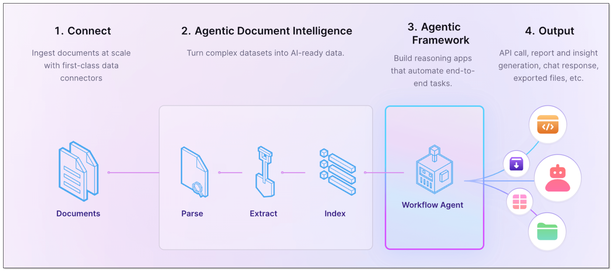
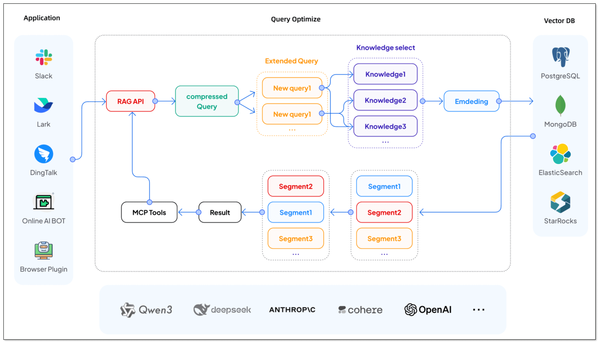
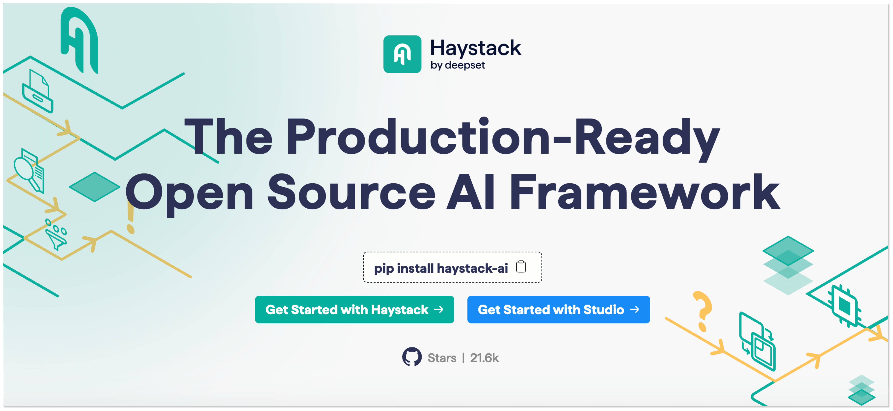
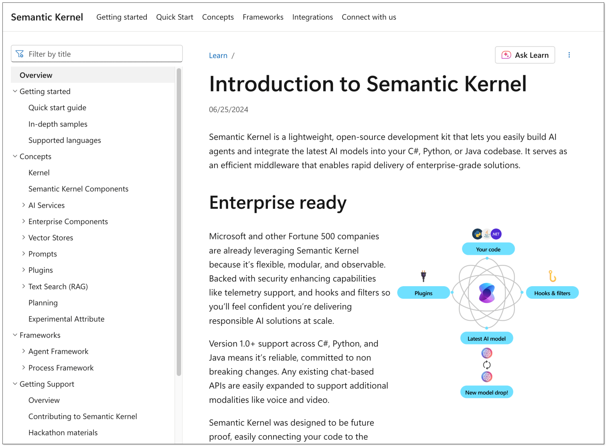
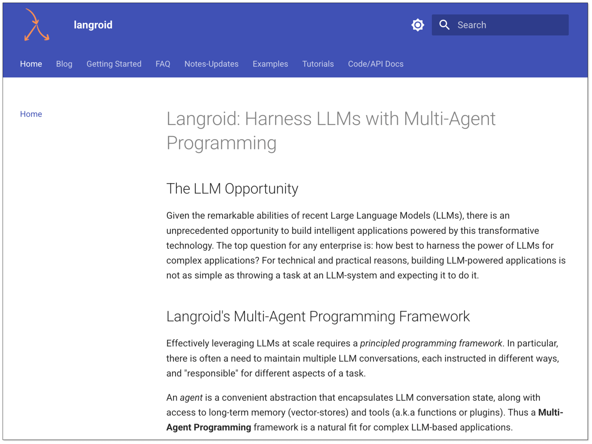
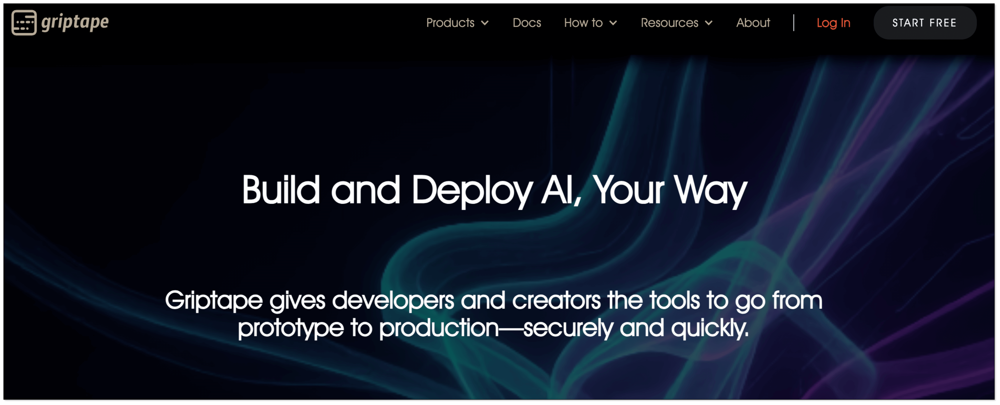
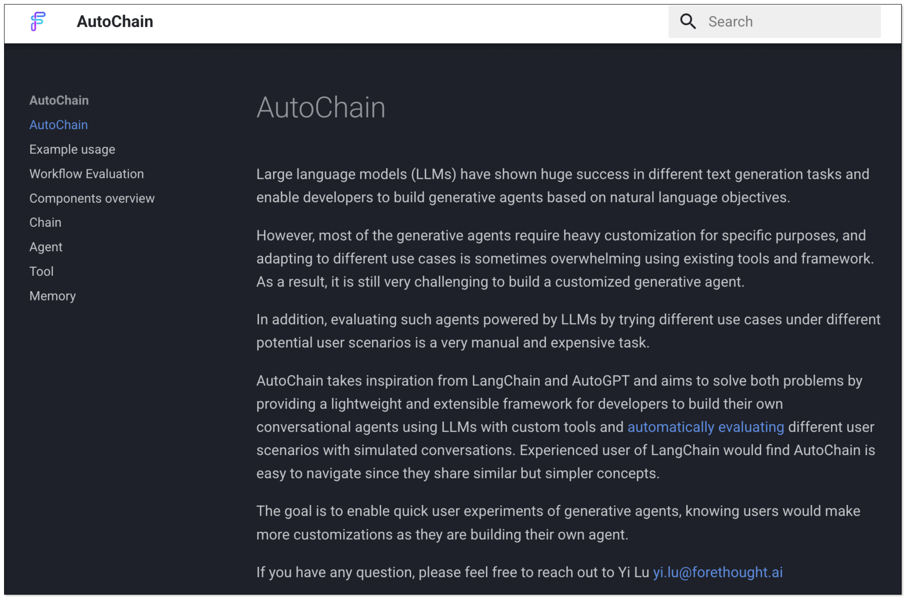
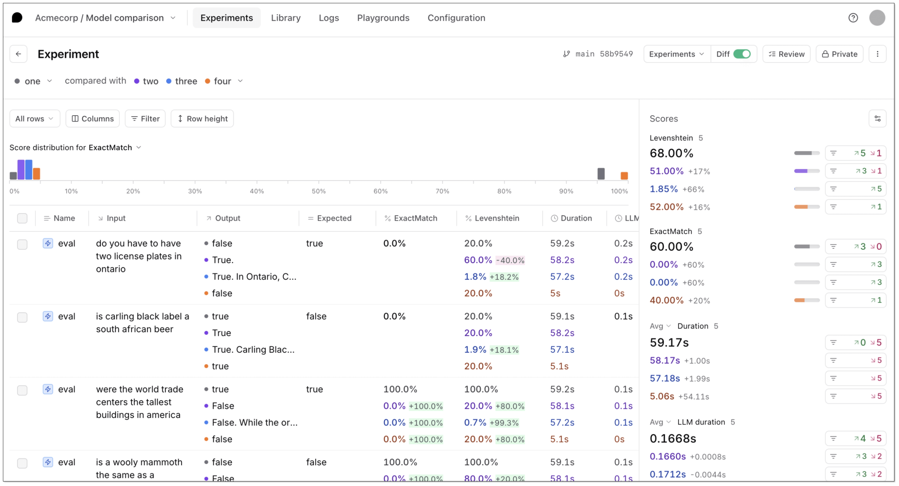
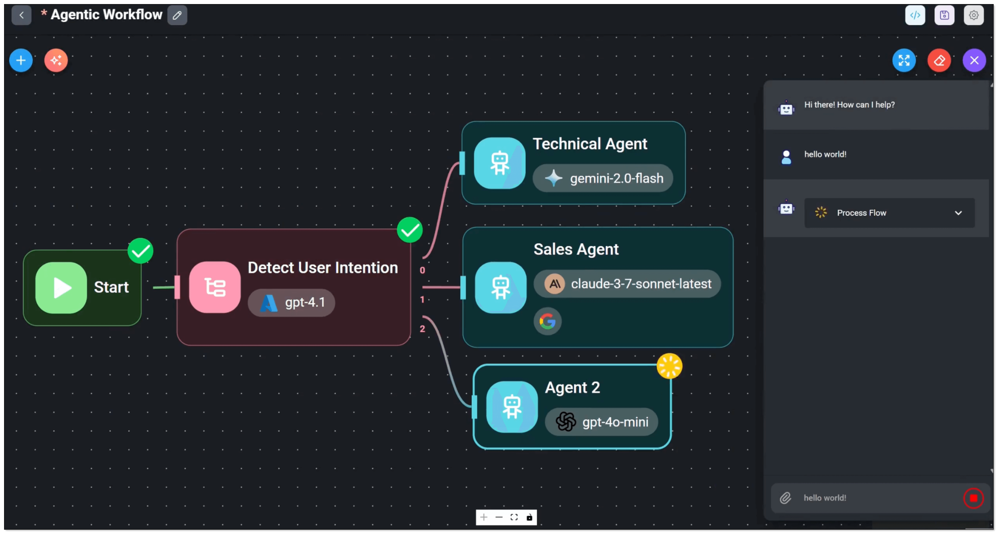
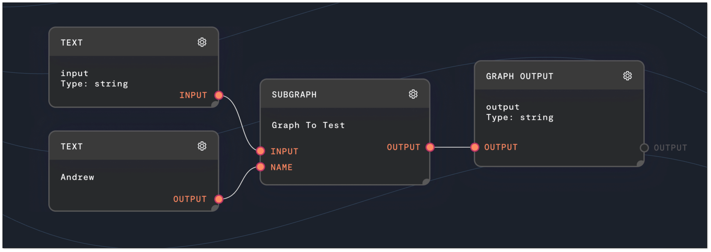

[LangChain](https://www.langchain.com/) has become a go-to framework for building LLM-powered applications, including retrieval-augmented generation (RAG) and autonomous agents. But it’s not the only option out there, and depending on your needs, it might not even be the best. 

If you’re hitting limits with LangChain, or just want to explore what else is out there, this post breaks down 10 top alternatives that give you more flexibility, performance, or control. Whether you need better data pipelines, simpler orchestration, or enterprise-ready agents, there’s likely a tool better suited to your use case.

## What is LangChain?
LangChain is an open-source framework designed to help developers build applications powered by large language models (LLMs). At its core, LangChain provides a modular and composable toolkit for "chaining" different components together. It allows developers to focus on comlplex workflows rather than raw prompts and API calls.

The framework is built around a few key concepts:

- **Chains**: Sequences of calls that form a complete application workflow.
- **Agents**: LLM-powered dynamic chains, determining which tools to use and in what order.
- **Tools & Function Calling**: External systems that agents interact with.
- **Memory**: Allow applications to remember past conversations.
- **Integrations**: Plug-and-play support for LLM, vector databases, document loaders, etc.

## LangChain Use Cases
LangChain's versatility has made it a popular choice for a wide range of AI applications. Some of the most common use cases include:

- **Retrieval-Augmented Generation (RAG)**: With RAG, user queries are enhanced with information retrieved from external sources like vector databases, file systems, or knowledge bases.
- **AI Agents**: Use LangChain to design complex workflows where LLMs interact with external tools and systems.
- **Enterprise Chatbots**: LangChain supports multi-turn conversations and memory management, making it suitable for applications that require context-aware interactions.
- **Document Analysis and Summarization**: LangChain is often used for applications that process, summarize, and analyze large volumes of text—across PDFs, email threads, research papers, or internal reports.

## Why Need to Consider LangChain Alternatives?
While LangChain is a powerful and widely-adopted framework, it's not without its drawbacks. Here are some common reasons developers and teams look elsewhere:

### Complexity  
LangChain’s abstractions are powerful, but they can also be **heavyweight**. For simple pipelines, it might feel like using a full orchestration engine to run a shell script.

### Performance Bottlenecks
The layered nature of LangChain can sometimes introduce performance overhead. For applications that require **low latency** and **high throughput**, this can be a significant issue.

### Difficult Debugging
LangChain can feel overly complex, especially for newcomers. The framework's abstraction layers, while powerful, can sometimes make it difficult to understand what's happening under the hood. **Debugging can be particularly challenging when things go wrong in a long chain.**

### Rapidly Evolving Ecosystem
The AI landscape is changing constantly. New frameworks are being developed with novel approaches, more intuitive interfaces, and better performance for specific tasks. Staying open to these alternatives is crucial for building the best possible applications.

## Top 10 LangChain Alternatives
Let’s explore ten powerful alternatives to LangChain, each with unique strengths across use cases like RAG, agents, automation, and orchestration.

### LlamaIndex

[LlamaIndex](https://www.llamaindex.ai/) is a data framework designed specifically to connect your private data with LLMs. While LangChain is about "chaining" different tools, LlamaIndex focuses on the "smart storage" and retrieval part of the equation, making it a powerful tool for RAG applications.

**Key Features:**
- Flexible document loaders and index types (list, tree, vector, keyword)
- Powerful query engines and retrievers
- Tool calling and agent integrations

**Best For:**     
Developers building LLM applications on top of private documents with fine-tuned control over retrieval.

### BladePipe

[BladePipe](https://www.bladepipe.com) is a real-time data integration tool. Its RagApi function automates the process of building RAG applications. Through two end-to-end data pipelines in BladePipe, you can deliver data to vector databases in real time and always keep the knowledge fresh. It supports both cloud and on-premise deployment, ideal for teams of all sizes to get the right AI application solution.

Compared to traditional RAG setups, which often involve lots of manual work, BladePipe RagApi offers several unique benefits:

- **Two DataJobs for a RAG service**: One to import documents, and one to create the API.
- **Zero-code deployment**: No need to write any code, just configure.
- **Adjustable parameters**: Adjust vector top-K, match threshold, prompt templates, model temperature, etc.
- **Multi-model and platform compatibility**: Support DashScope (Alibaba Cloud), OpenAI, DeepSeek, and more.
- **OpenAI-compatible API**: Integrate it directly with existing Chat apps or tools with no extra setup.

**Best For:**     
Individuals and teams needing production-grade data pipelines for AI/RAG with minimal operational overhead.

### Haystack

[Haystack](https://haystack.deepset.ai/) is an open-source framework for building search systems, question-answering applications, and conversational AI. It offers a modular, pipeline-based architecture that lets developers connect components like retrievers, readers, generators, and rankers with ease. 

**Key Features:**
- Modular components for indexing, retrieval and generation
- 70+ Integrations with LLMs, vector databases and transformer model.
- REST API support, Dockerized deployment

**Best For:**     
Building flexible, search-focused AI applications with full control over natural language processing (NLP) pipelines.

### Semantic Kernel

[Semantic Kernel](https://learn.microsoft.com/en-us/semantic-kernel/overview/) is an open-source SDK from Microsoft. It provides a lightweight framework for integrating cutting-edge AI models into existing applications. It's particularly strong for developers working in C#, Python, or Java and aims to act as an efficient middleware for building AI agents.

**Key Features:**     
- Native plugin model for AI skills
- Multi-language support (.NET, Python, JS)
- Integration with Microsoft ecosystem

**Best For:**     
Enterprise teams looking to build secure, composable AI agents integrated with Microsoft ecosystems.

### Langroid

[Langroid](https://langroid.github.io/langroid/) is an open-source Python framework that introduces a multi-agent programming paradigm. Instead of focusing on simple chains, Langroid treats agents as first-class citizens, enabling the creation of complex applications where multiple agents collaborate to solve a task.

**Key Features:**     
- Python-native agents with natural language and structured task definition
- Multi-agent orchestration
- Support various LLMs, vector databases, and function-calling tools

**Best For:**     
Developers building collaborative agents with clear execution paths and modular logic.

### Griptape

[Griptape](https://www.griptape.ai/) is a Python-based framework for building and running AI applications, specifically focused on creating reliable and production-ready RAG applications. It offers a structured approach to building LLM workflows, with strong control over data flow and governance.

**Key Features:**
- Secure AI agents building
- Cloud-native design with plugin support
- A structured way to define AI workflows

**Best For:**     
Enterprise AI workflows requiring traceability and production readiness.

### AutoChain

[AutoChain](https://autochain.forethought.ai/) is a lightweight and simple framework for building LLM applications. It's designed to be a more straightforward alternative to LangChain, focusing on ease of use and quick prototyping. The goal is to provide a clean and intuitive way to create multi-step LLM workflows.

**Key Features:**      
- lightweight and extensible generative agent pipeline
- simple memory tracking for conversation history and tools' outputs

**Best For:**     
Builders who want to move fast without complex abstractions.

### Braintrust

[Braintrust](https://www.braintrust.dev/) is an open-source framework for building, testing, and deploying LLM workflows with a focus on reliability, observability, and performance. It stands out with built-in support for prompt versioning, output evaluation, and detailed logging, making it ideal for optimizing AI behavior over time.

**Key Features:**
- Tools for continuous evaluation of LLM outputs
- Built-in monitoring, logging, and benchmarking
- Work with popular LLM providers

**Best For:** .    
Teams building production LLM apps with performance and traceability in mind.

### Flowise AI

[Flowise AI](https://flowiseai.com/) is a low-code, visual tool for building and managing LLM applications. It's perfect for those who prefer a drag-and-drop interface over writing code. It's built on top of the LangChain ecosystem but provides a much more accessible and user-friendly experience.

**Key Features:**
- Drag-and-drop interface for LLM apps
- 100+ integrations with LLMs, vector stores and more
- Local and cloud deployment

**Best For:**   
Non-technical users or rapid prototyping of LLM workflows visually.

### Rivet

[Rivet](https://rivet.ironcladapp.com/) is a visual programming environment for building and prototyping LLM applications. It uses a graph-based interface to allow developers to visually design and test their AI workflows. Rivet's focus is on providing a powerful, intuitive, and highly-performant tool for building complex AI graphs.

**Key Features:**
- Visual interface for prompt iterations and experiments
- Built-in prompt editor and playground for fine-tuning prompts.
- Real-time debugging

**Best For:**    
AI teams optimizing prompts, chain design, or evaluation strategies collaboratively.

## Getting Started with BladePipe
LangChain has paved the way for building powerful LLM applications, offering developers a flexible framework to prototype agents, RAG pipelines, and chatbots. But as teams move from experimentation to production, LangChain’s framework can introduce complexity, performance issues, and operational overhead.

If you're building RAG systems that depend on fresh and structured data, BladePipe is a strong contender. With built-in support for embedding and real-time sync, BladePipe turns your raw data into retrieval-ready intelligence. Skip the complexity. Try BladePipe and build AI systems that actually scale.