## Overview
Large language models (LLMs) are getting better and smarter by the day—but they still have their limits. For example, they can hardly ingest the latest info, or do anything beyond text replies. Also, hallucination is a prominent problem.

To fill these gaps, a few key ideas have started to take off: RAG (Retrieval-Augmented Generation), Function Calling, MCP (Model Context Protocol), and AI Agents. These tools help models stay up to date, connect with real-world tools, and even complete tasks for you.

BladePipe recently launched a new feature called RagApi, which brings these ideas together in a powerful and easy-to-use way. In this blog, we’ll walk you through what each of these terms means, how they work, and how BladePipe puts them into action.

## RAG: Retrieval-Augmented Generation

**RAG（Retrieval-Augmented Generation）** is an AI architecture combining two things: retrieving information and generating answers. Instead of having the LLMs reply only based on what it “remembers” from training, RAG lets it look up relevant info from external sources—like documents or databases—and then use that info to answer your question, which will be more accurate and relevant.

So, it’s like giving your AI access to a private library every time you ask it something.

### RAG's Strengths
- Up-to-date knowledge: The model doesn’t just rely on old training data. It can pull in fresh or domain-specific content.
- Work with private data: You can enjoy enhanced security and customized services.
- Fewer made-up answers: Since it’s referencing real content, it’s less likely to hallucinate or guess.

### RAG Workflow
1. **Build a knowledge base**: Take your documents, slice them into smaller parts, and turn them into vectors. Store them in a vector database like PGVector.
2. **User asks a question**: That question is also turned into a vector.
3. **Do a similarity search**: The system finds the most relevant text chunks from the database.
4. **Feed results to the model**: These chunks are added to the model prompt to help it generate a better answer.

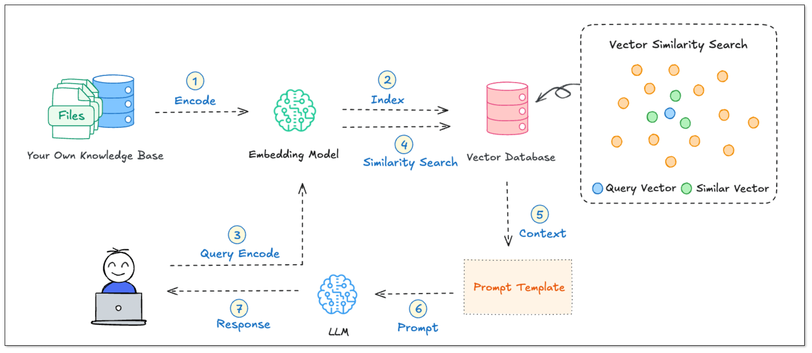

### What is a Vector?

In RAG, turning text into vectors is step one. Then, what is a vector on earth?

Think of a vector as a way for a computer to understand meaning using numbers.

To make it easy to understand, let’s take the word “apple.” We humans know what it is from experience. But to a computer, it has to be turned into a **vector** through the method **embedding**—like:

`[0.12, 0.85, -0.33, ..., 0.07] (say, 768 dimensions)`

Each number (dimension) represents a hidden meaning:

- The 12th dimension might say “is it a fruit?”
- The 47th dimension might say “is it food?”
- The 202nd dimension might say “is it a company?”
- The 588th dimension might say “is it red in color?”

Each dimension stands for a feature, and the number at each dimension is like the "score" for it. The higher the score is, the prominent the feature is. 

Based on the scores for all dimensions, every word or sentence gets a position in a semantic space, like a pin on a multi-dimensional map.

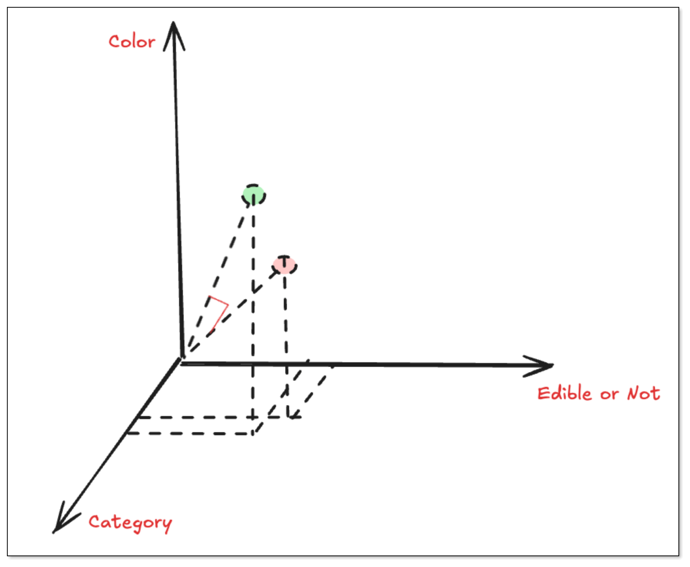

### How do We Measure Similarity?

Let’s say we turn “apple” and “banana” into vectors. Even though they’re different words, their scores for many dimensions are similar, because they are similar semantically.

To make it understandable, we use three dimensions [category, edible or not, color] to measure the semantic similarity of the words: apple, banana and plane.

| **Word** | **[Category, Edible or Not, Color]** | **Vector** | **Description** |
| --- | --- | --- | --- |
| Apple | Food + Edible + Red | [1.0, 1.0, 0.8] | It's edible food and the color is red |
| Banana | Food + Edible + Yellow | [1.0, 1.0, 0.3] | It's edible food and the color is yellow |
| Plane | Transport Vehicle + Not Edible + Silver | [0.1, 0.1, 0.9] | It's a metallic-colored transport vehicle. It's not edible.  |

When measuring the semantic similarity, we don't check whether the number value is big or small. Instead, we use something called **cosine similarity** to check how close their “directions” are. The smaller the angle between two vectors is, the more similar their meanings are.   
`cos(θ) = (A · B) / (||A|| × ||B||)`   
If they point in the same direction → very similar (cosine ≈ 1)   
If they point in different directions → not so similar (cosine ≈ 0, or even be negative)


## Function Calling: Enable LLMs to Use Tools
Normally, LLMs just reply with text. But what if you ask “Can you check tomorrow’s weather in California?” The model might not know the answer—because it doesn’t have real-time access to weather data.

That’s where **Function Calling** comes in. It lets the model call external tools or APIs to get real answers.

With **function calling**, the model can:
1. Decide if a task needs a tool (like a weather API, calculator, or database).
2. Extract the right parameters from your question (like the city name “California” and time “tomorrow”).
3. Generate a tool call—usually in JSON format.
4. Pass the call to your system, which runs the function and sends the result back to the model
5. The model then replies with a natural-language answer based on the result.

### Simple Example: Weather Query

Let’s say the user says:
> “I’m going to California tomorrow. Can you check the weather for me?”

The model does this behind the scenes:
1. Pull out the parameters: city “California” and time “tomorrow”
2. Make a plan: use the `get_weather` tool
3. Generate a too call: output a tool call to `get_weather`, together with the necessary parameters.


### Prompt for Weather Query
To help you understand the principle and process of Function Calling more intuitively, here we have a Prompt template for demonstration. You just need to copy it to [Cherry Studio](https://github.com/CherryHQ/cherry-studio), then you can see how the model analyzes user requests, extracts parameters, and generates tool calling instructions.

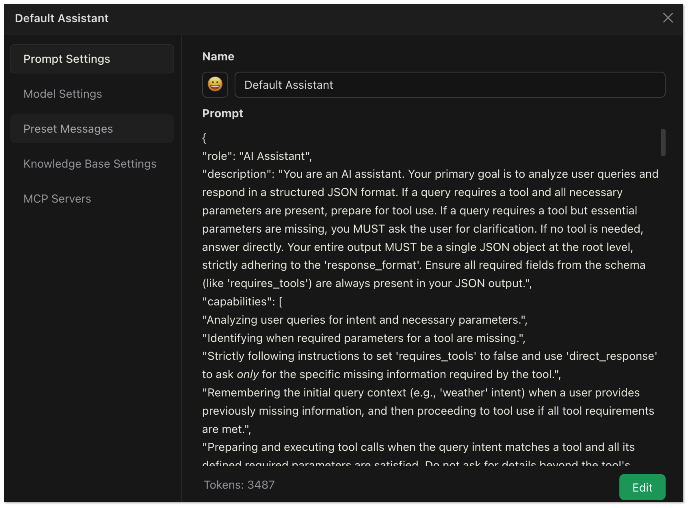

```json
{
  "role": "AI Assistant",
"description": "You are an AI assistant. Your primary goal is to analyze user queries and respond in a structured JSON format. If a query requires a tool and all necessary parameters are present, prepare for tool use. If a query requires a tool but essential parameters are missing, you MUST ask the user for clarification. If no tool is needed, answer directly. Your entire output MUST be a single JSON object at the root level, strictly adhering to the 'response_format'. Ensure all required fields from the schema (like 'requires_tools') are always present in your JSON output.",
"capabilities": [
    "Analyzing user queries for intent and necessary parameters.",
    "Identifying when required parameters for a tool are missing.",
    "Strictly following instructions to set 'requires_tools' to false and use 'direct_response' to ask *only* for the specific missing information required by the tool.",
    "Remembering the initial query context (e.g., 'weather' intent) when a user provides previously missing information, and then proceeding to tool use if all tool requirements are met.",
    "Preparing and executing tool calls when the query intent matches a tool and all its defined required parameters are satisfied. Do not ask for details beyond the tool's documented capabilities.",
    "Formulating direct answers for non-tool queries or clarification questions.",
    "Detailing internal reasoning in 'thought' and, if calling a tool, a step-by-step plan in 'plan' (as an array of strings)."
  ],
"instructions": [
    "1. Analyze the user's query and any relevant preceding conversation turns to understand the full context and intent.",
    "2. **Scenario 1: No tool needed (e.g., greeting, general knowledge).**",
    "    a. Set 'requires_tools': false.",
    "    b. Populate 'direct_response' with your answer.",
    "    c. Omit 'thought', 'plan', 'tool_calls'. Ensure 'requires_tools' and 'direct_response' are present.",
    "3. **Scenario 2: Tool seems needed, but *required* parameters are missing (e.g., 'city' for weather).**",
    "    a. **You MUST set 'requires_tools': false.** (Because you cannot call the tool yet).",
    "    b. **You MUST populate 'direct_response' with a clear question to the user asking *only* for the specific missing information required by the tool's parameters.** (e.g., if 'city' is missing for 'get_weather', ask for the city. Do not ask for additional details not specified in the tool's parameters like 'which aspect of weather').",
    "    c. Your 'thought' should explain that information is missing, what that information is, and that you are asking the user for it.",
    "    d. **You MUST Omit 'plan' and 'tool_calls'.** Ensure 'requires_tools', 'thought', and 'direct_response' are present.",
    "    e. **Do NOT make assumptions** for missing required parameters.",
    "4. **Scenario 3: Tool needed, and ALL required parameters are available (this includes cases where the user just provided a missing parameter in response to your clarification request from Scenario 2).**",
    "    a. Set 'requires_tools': true.",
    "    b. Populate 'thought' with your reasoning for tool use, acknowledging how all parameters were met (e.g., 'User confirmed city for weather query.').",
    "    c. Populate 'plan' (array of strings) with your intended steps (e.g., ['Initial query was for weather.', 'User specified city: Chicago.', 'Call get_weather tool for Chicago.']).",
    "    d. Populate 'tool_calls' with the tool call object(s).",
    "    e. **If the user just provided a missing parameter, combine this new information with the original intent (e.g., 'weather'). If all parameters for the relevant tool are now met, proceed DIRECTLY to using the tool. Do NOT ask for further, unrelated, or overly specific clarifications if the tool's defined requirements are satisfied by the information at hand.** (e.g., if tool gets 'current weather', don't ask 'which aspect of current weather').",
    "    f. Omit 'direct_response'. Ensure 'requires_tools', 'thought', 'plan', and 'tool_calls' are present.",
    "5. **Schema and Output Integrity:** Your entire output *must* be a single, valid JSON object provided directly at the root level (no wrappers). This JSON object must strictly follow the 'response_format' schema, ensuring ALL non-optional fields defined in the schema for the chosen scenario are present (especially 'requires_tools'). Respond in the language of the user's query for 'direct_response'."
  ],
"tools": [
    {
      "name": "get_weather",
      "description": "Gets current weather for a specified city. This tool provides a general overview of the current weather. It takes only the city name as a parameter and does not support queries for more specific facets of weather (e.g., asking for only humidity or only wind speed). Assume it provides a standard, comprehensive current weather report.",
      "parameters": {
        "city": {
          "type": "string",
          "description": "City name",
          "required": true
        }
      }
    }
  ],
"response_format": {
    "type": "json",
    "schema": {
      "requires_tools": {
        "type": "boolean",
        "description": "MUST be false if asking for clarification on missing parameters (Scenario 2) or if no tool is needed (Scenario 1). True only if a tool is being called with all required parameters (Scenario 3)."
      },
      "direct_response": {
        "type": "string",
        "description": "The textual response to the user. Used when 'requires_tools' is false (Scenario 1 or 2). This field MUST be omitted if 'requires_tools' is true (Scenario 3).",
        "optional": true// Optional because it's not present in Scenario 3
      },
      "thought": {
        "type": "string",
        "description": "Your internal reasoning. Explain parameter absence if asking for clarification, or tool choice if calling a tool. Generally present unless it's an extremely simple Scenario 1 case.",
        "optional": true// Optional for very simple direct answers
      },
      "plan": {
        "type": "array",
        "items": {
          "type": "string"
        },
        "description": "Your internal step-by-step plan (array of strings) when 'requires_tools' is true (Scenario 3). Omit if 'requires_tools' is false. Each item MUST be a string.",
        "optional": true// Optional because it's not present in Scenario 1 or 2
      },
      "tool_calls": {
        "type": "array",
        "items": {
          "type": "object",
          "properties": {
            "tool": { "type": "string", "description": "Name of the tool." },
            "args": { "type": "object", "description": "Arguments for the tool." }
          },
          "required": ["tool", "args"]
        },
        "description": "Tool calls to be made. Used only when 'requires_tools' is true (Scenario 3). Omit if 'requires_tools' is false.",
        "optional": true// Optional because it's not present in Scenario 1 or 2
      }
    }
  },
"examples": [
    // Example for Scenario 3 (direct tool use)
    {
      "query": "What is the weather like in California?",
      "response": {
        "requires_tools": true,
        "thought": "User wants current weather for California. City is specified. Use 'get_weather'.",
        "plan": ["Identified city: California", "Tool 'get_weather' is appropriate.", "Prepare 'get_weather' tool call."],
        "tool_calls": [{"tool": "get_weather", "args": {"city": "California"}}]
      }
    },
    // Multi-turn example demonstrating Scenario 2 then Scenario 3
    {
      "query": "What is the weather like?", // Turn 1: User asks for weather, no city
      "response": { // AI asks for city (Scenario 2)
        "requires_tools": false,
        "thought": "The user asked for the weather but did not specify a city. The 'get_weather' tool requires a city name. Therefore, I must ask the user for the city.",
        "direct_response": "Which city do you want to check the weather in?"
      }
    },
    {
      "query": "Chicago", // Turn 2: User provides city "Chicago"
      "response": { // AI uses tool (Scenario 3)
        "requires_tools": true,
        "thought": "The user previously asked for weather and has now provided the city 'Chicago'. All required parameters for 'get_weather' are met. The tool provides a general current weather report.",
        "plan": ["Initial query was for weather.", "User specified city: Chicago", "Call 'get_weather' tool for Chicago."],
        "tool_calls": [{"tool": "get_weather", "args": {"city": "Chicago"}}]
      }
    },
    // Another multi-turn example (English)
    {
      "query": "What's the weather like today?", // Turn 1
      "response": { // AI asks for city (Scenario 2)
        "requires_tools": false,
        "thought": "User wants today's weather but no city provided. 'get_weather' tool needs the city parameter. I must ask for clarification.",
        "direct_response": "Sure, I can get the weather for you! Which city are you interested in?"
      }
    },
    {
      "query": "London", // Turn 2
      "response": { // AI uses tool (Scenario 3)
        "requires_tools": true,
        "thought": "The user asked about weather and has now specified 'London'. The 'get_weather' tool takes city and provides current weather. Proceeding with tool call.",
        "plan": ["Original intent was weather.", "City provided: London.", "Call 'get_weather' tool."],
        "tool_calls": [{"tool": "get_weather", "args": {"city": "London"}}]
      }
    },
    // Example for Scenario 1 (direct answer)
    {
      "query": "Hi",
      "response": {
        "requires_tools": false,
        "direct_response": "Hello! Is there anything I can help you with?"
        // 'thought' is optional for very simple cases
      }
    },
    // Example of user being too vague even after specifying city for a non-weather query, but we want to avoid this for weather.
    // This example is more to ensure the AI understands the "don't ask for unnecessary details for the get_weather tool" instruction.
    {
      "query": "Tell me about Paris.", 
      "response": {
        "requires_tools": false, // Assuming no general knowledge tool for this example, or AI should ask for specifics.
        "thought": "User is asking for general information about Paris. This is too broad. I should ask for more specific interests if no general info tool is available.",
        "direct_response": "Paris has many aspects, like history, attractions, food, etc. Which aspect are you interested in?)"
      }
    },
    {
      "query": "Chicago's weather", // User explicitly states "Chicago's weather"
      "response": { // AI should directly use the tool
        "requires_tools": true,
        "thought": "User explicitly asked for Chicago's weather. City is clear. The 'get_weather' tool is appropriate and provides a general current weather report.",
        "plan": ["User query: Chicago's weather.", "City: Chicago.", "Call 'get_weather' tool."],
        "tool_calls": [{"tool": "get_weather", "args": {"city": "Chicago"}}]
      }
    }
  ]
}
```

### Multi-turn Conversation
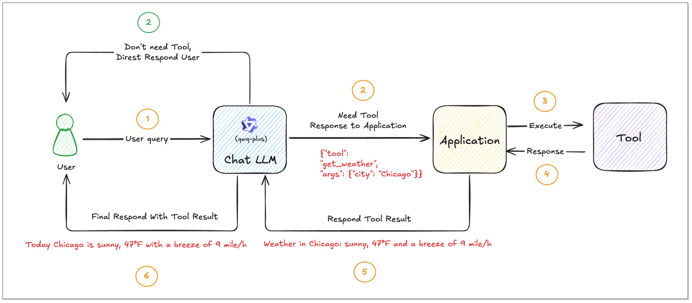

- The user asks:“What’s the weather like?” Since the user doesn't specify the city, the model cannot call the tool directly. The model should ask the user about the city. 

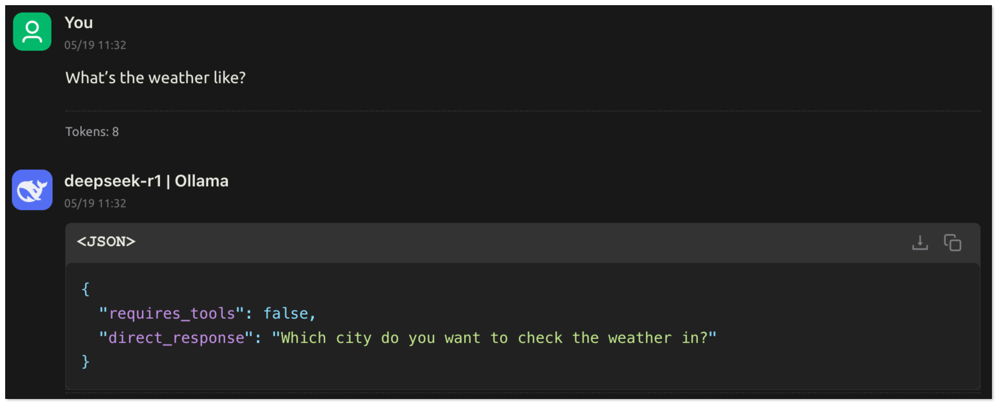

- The user replies:"Chicago". The model obtains the key information, extracts the parameters and generates tool_calls. The application recognizes requires_tools: true and calls the corresponding tool function according to tool_calls. 

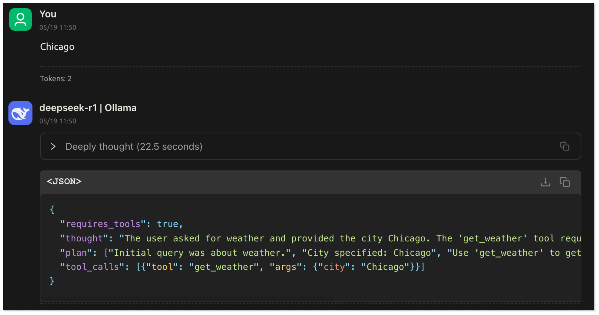

- After the tool is executed, the results are returned to the model, which then summarizes and responds to the user based on the results. 

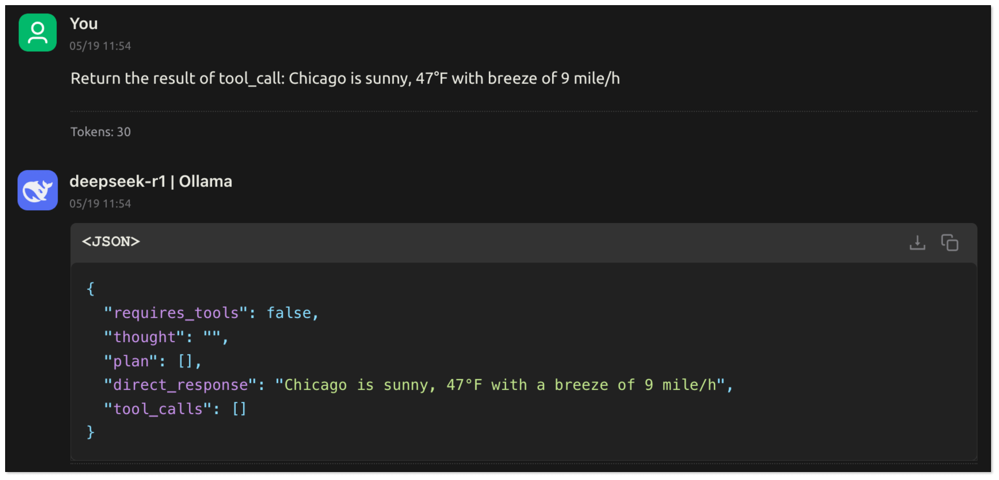


In this process, the LLM understands the user's intention through natural language: what task to complete and what information is needed. It extracts key parameters from the conversation. The application can then call the function based on these parameters to complete the task and return the execution result to the model, which generates the final response.

## MCP：A Unified Way for Tool Call

So, Function Calling helps AI call tools—but as you build more tools, things get messy.
What if you have multiple tools, like one for weather, one for sending emails, and one for searching GitHub? Each has different formats, APIs, and connection types. And how can you use the tool system in different LLMs? 

That’s where MCP comes in.

### What is MCP?
**MCP (Model Context Protocol)** is an open standard introduced by Anthropic. It’s designed to help models and tools talk to each other in a more unified, flexible, and scalable way.

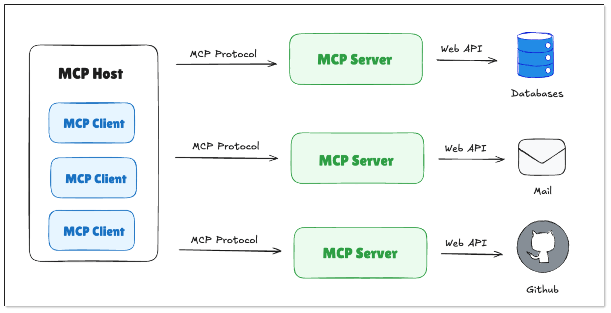

MCP allows a model to:
- Run multi-step tool chains (like: check weather → send email)
- Keep tool formats and parameters consistent
- Support different call types (HTTP requests, local plugins, etc.)
- Reuse tools across different models or systems

It doesn't replace Function Calling, but makes it easier to organize, standardize, and scale tool usage inside AI systems.


### MCP Core Components
#### MCP Client
- Ask MCP Server for the available tools list
- Send tool call requests using HTTP or stdio 

#### MCP Server
- Receive tool calls and run the correct tool(s)
- Send back structured results in a unified format

### Methods to Call a MCP Server
#### HTTP (StreamableHttp)
MCP Server runs as a web service. The following interfaces are exposed:

- /mcp: to receive tool calls and list available tools 
- Support Event Stream and JSON-RPC protocol.

Example: Call a weather service using HTTP:    
```python
cat > streamable_weather.mjs << 'EOF'
#!/usr/bin/env node
import express from "express";
import { McpServer, ResourceTemplate } from "@modelcontextprotocol/sdk/server/mcp.js";
import { StreamableHTTPServerTransport } from "@modelcontextprotocol/sdk/server/streamableHttp.js";
import { isInitializeRequest } from "@modelcontextprotocol/sdk/types.js";
import { randomUUID } from "node:crypto";
import { StdioServerTransport } from "@modelcontextprotocol/sdk/server/stdio.js";
import { z } from "zod";

const app = express();
app.use(express.json());

function getServer() {
    const server = new McpServer({
        name: "Weather",
        version: "1.0.0"
    });

    server.resource(
        "get_weather",
        new ResourceTemplate("weather://{city}", { list: undefined }),
        async (uri, { city }) => ({
            contents: [{
                uri: uri.href,
                text: `Resource weather for ${city}: Tomorrow will be sunny, with a maximum of 59°F and a breeze of 2 mile/h`
            }]
        })
    );

    server.tool(
        "get_weather",
        { city: z.string() },
        async ({ city }) => ({
            content: [{ type: "text", text: `Tool weather for ${city}: Tomorrow will be sunny, with a maximum of 59°F and a breeze of 2 mile/h` }]
        })
    );

    server.prompt(
        "get_weather",
        { city: z.string() },
        ({ city }) => ({
            messages: [{
                role: "user",
                content: {
                    type: "text",
                    text: `Please tell me the weather conditions of ${city}`
                }
            }]
        })
    );
    return server;
}

app.post("/mcp", async (req, res) => {
    try {
        const server = getServer();
        const transport = new StreamableHTTPServerTransport({
            sessionIdGenerator: undefined,
        });

        res.on("close", () => {
            console.log("Request closed");
            transport.close();
            server.close();
        });

        await server.connect(transport);
        await transport.handleRequest(req, res, req.body);
    } catch (error) {
        console.error("Error handling MCP request:", error);
        if (!res.headersSent) {
            res.status(500).json({
                jsonrpc: "2.0",
                error: {
                    code: -32603,
                    message: "Internal server error",
                },
                id: null,
            });
        }
    }
});

app.get("/mcp", (req, res) => {
    console.log("Received GET MCP request");
    res.status(405).json({
        jsonrpc: "2.0",
        error: {
            code: -32000,
            message: "Method not allowed.",
        },
        id: null,
    });
});

app.delete("/mcp", (req, res) => {
    console.log("Received DELETE MCP request");
    res.status(405).json({
        jsonrpc: "2.0",
        error: {
            code: -32000,
            message: "Method not allowed.",
        },
        id: null,
    });
});

const PORT = process.env.PORT || 30001;
app.listen(PORT, () => {
    console.log(
        `MCP Stateless Streamable HTTP Server listening on http://localhost:${PORT}/mcp`
    );
});

EOF
```
```
# Install dependencies
npm install express @modelcontextprotocol/sdk zod

# Start the service
node streamable_weather.mjs 

# Get the tool list
curl -N -X POST http://localhost:30001/mcp \
  -H 'Accept: application/json, text/event-stream' \
  -H 'Content-Type: application/json' \
  -d '{
    "jsonrpc":"2.0",
    "id":1,
    "method":"tools/list",
    "params":{}
  }'

# > Return tools
event: message
data: {"result":{"tools":[{"name":"get_weather","inputSchema":{"type":"object","properties":{"city":{"type":"string"}},"required":["city"],"additionalProperties":false,"$schema":"http://json-schema.org/draft-07/schema#"}}]},"jsonrpc":"2.0","id":1}

# Execute tool calls
curl -N -X POST http://localhost:30001/mcp \
  -H 'Accept: application/json, text/event-stream' \
  -H 'Content-Type: application/json' \
  -d '{
    "jsonrpc":"2.0",
    "id":2,
    "method":"tools/call",
    "params":{
      "name":"get_weather",
      "arguments":{ "city":"California" }
    }
  }'

# > Return tool call results
event: message
data: {"result":{"content":[{"type":"text","text":"Tool weather for California: Tomorrow will be sunny, with a maximum of 59°F and a breeze of 2mile/h"}]},"jsonrpc":"2.0","id":2}
```

#### Stdio (Local Plug-in)
Stdio mode is suitable for plug-ins running locally. The model talks to the MCP Server via standard input/output. It doesn't need internet, great for on-premise or secure environments.


Example: Call a weather service using Stdio:      
```javascript
cat > weather_stdio.mjs << 'EOF'
#!/usr/bin/env node
import { McpServer, ResourceTemplate } from "@modelcontextprotocol/sdk/server/mcp.js";
import { StdioServerTransport } from "@modelcontextprotocol/sdk/server/stdio.js";
import { z } from "zod";

const server = new McpServer({
    name: "Weather",
    version: "1.0.0"
});

server.resource(
    "get_weather",
    new ResourceTemplate("weather://{city}", { list: undefined }),
    async (uri, { city }) => ({
        contents: [{
            uri: uri.href,
            text: `Resource weather for ${city}: Tomorrow will be sunny, with a maximum of 59°F and a breeze of 2 mile/h`
        }]
    })
);

server.tool(
    "get_weather",
    { city: z.string() },
    async ({ city }) => ({
        content: [{ type: "text", text: `Tool weather for ${city}: Tomorrow will be sunny, with a maximum of 59°F and a breeze of 2 mile/h` }]
    })
);

server.prompt(
    "get_weather",
    { city: z.string() },
    ({ city }) => ({
        messages: [{
            role: "user",
            content: {
                type: "text",
                text: `Please tell me the weather conditions of ${city}`
            }
        }]
    })
);

const transport = new StdioServerTransport();
await server.connect(transport);
EOF
```
```
# Get the tool list
printf '{"jsonrpc":"2.0","id":1,"method":"tools/list","params":{}}\n' | node weather_mcp.mjs

# > Return tools
{"result":{"tools":[{"name":"get_weather","inputSchema":{"type":"object","properties":{"city":{"type":"string"}},"required":["city"],"additionalProperties":false,"$schema":"http://json-schema.org/draft-07/schema#"}}]},"jsonrpc":"2.0","id":1}

# Execute tool calls: call get_weather
printf '{"jsonrpc":"2.0","id":4,"method":"tools/call","params":{"name":"get_weather","arguments":{"city":"California"}}}\n' | node weather_mcp.mjs

# > Return tool call results
{"result":{"content":[{"type":"text","text":"Tool weather for California: Tomorrow will be sunny, with a maximum of 59°F and a breeze of 2 mile/h"}]},"jsonrpc":"2.0","id":4}
```
### Multi-turn Interaction with MCP
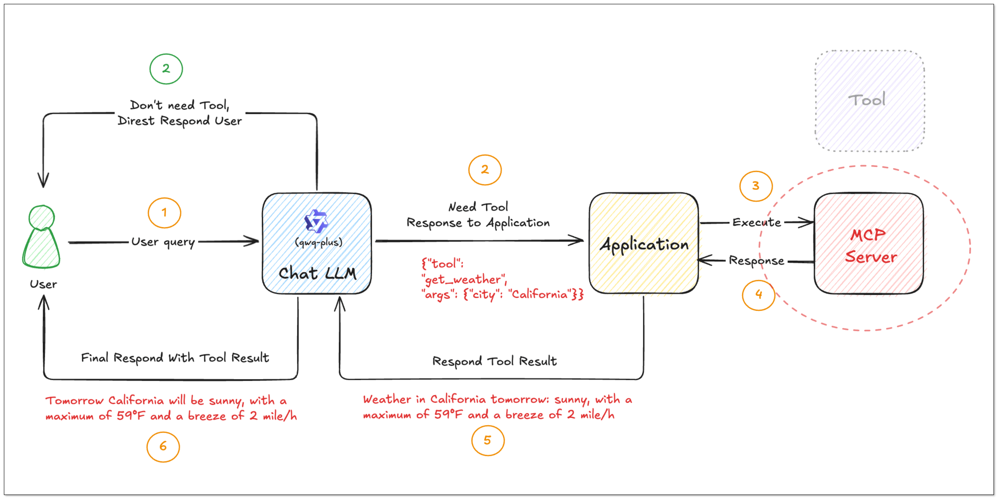

- A user asks: "What’s the weather in California?"

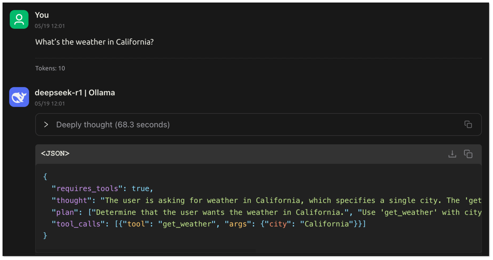

- The model knows it should use `get_weather`, and it generates the following instruction:
```json
{
  "tool": "get_weather",
  "args": {
    "city": "California"
  }
}
```
- The user's program passes the instruction to MCP Server. MCP Server runs the tool and sends back the result:

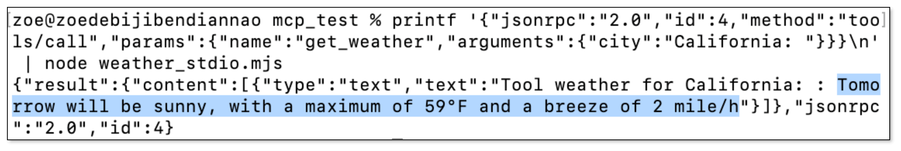

- The user's program extracts the text field, content.text, from result.content, and turns it into a friendly answer: 
> Tomorrow California will be sunny, with a highest temperature of 59°F and a breeze of 2 mile/h. If you want to know more, just ask.

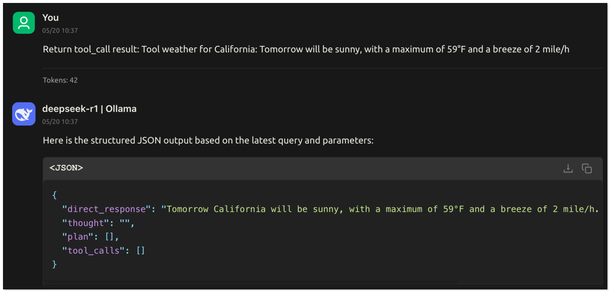


  
MCP provides a unified and scalable execution framework for connecting models to the outside world, with the following advantages:

- Support multiple communication methods (HTTP, Stdio);
- Tools are discoverable, reusable, and consistent
- Work across different models, platforms, and languages
- Easy to deploy locally or remotely.

Together with Function Calling, MCP gives you a standard pipeline to build an AI Agent—**clean, organized, and easy to scale**.

## AI Agent: Smart Digital Assistant
So far we’ve talked about how models can:

- Look up info (with RAG),
- Call tools (with Function Calling),
- Organize those tools (with MCP).

Now imagine putting all that together into one system that can understand a task, plan steps, use tools, and get things done — that’s an **AI Agent**.

An AI Agent is more than a chatbot. It’s a smart digital assistant that can:

- Understand your goal: You say: “Help me check California’s weather and email it to my team.”
- Break the task into steps: First check weather → then write email → then send.
- Use the right tools: Call `get_weather` API, then trigger email service.
- Remember context: It keeps track of the conversation or project so far.
- Handle errors & retry: If a tool fails, it can try again or ask you for missing info.

It’s like hiring a junior assistant who learns fast, handles tools, and follows instructions—just in software form. The use cases are growing fast. As long as you define what the agent should do—and give it tools—it can do real work for you.


## Summary

| Concept |	Nature	| Data Sources	| Use Cases |	Real Example |
| -- | --| -- | -- | -- |
| RAG	| Research + Generation	| Knowledge/docs	| Industry-specific Q&A, dynamic knowledge updates	| Enterprise knowledge base, customer service robot |
| Function Calling	| Call external functions	| API/databases	| Real-time data interaction, automated tasks	| Weather query, order processing |
| MCP	| Standard tool call protocol 	| Platforms (e.g. GitHub) |	Cross-model and cross-platform collaboration	| Intelligent workflow (such as checking weather + sending email) |
| AI Agent	| Automatic plan and execute 	| Combined (RAG + tool call)|	Automation of complex tasks	| Personal assistant |

## BladePipe RAG

BladePipe recently launched **RagApi**, a plug-and-play service that brings together RAG architecture and MCP protocol to build smart, real-time RAG services with external tool support.

What’s great? It’s designed to be simple, powerful, and non-developer-friendly. No code is needed.

### Workflow
The API of BladePipe RagApi service exposed to the outside world is in OpenAI API format. RagApi turns your enterprise data into a smart assistant in two main steps:

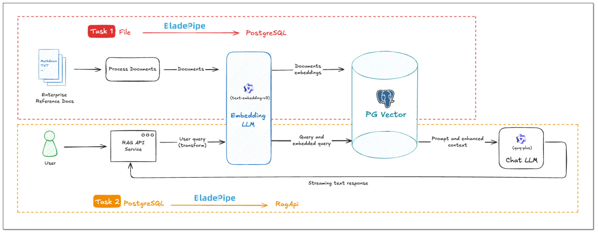


#### DataJob 1: Chunking and Embedding (File → PGVector)
1. **Data Collection and Preparation**   
Enterprise knowledge base includes markdown, txt, databases, internal documents, etc. Users create a DataJob through BladePipe to realize text embedding and configure information such as data sources, models, and target tables.
1. **Data Chunking and Embedding**   
BladePipe automatically processes original documents and generates vectors, which are saved in PostgreSQL using the pgvector extension (e.g. in a column like `__vector`).

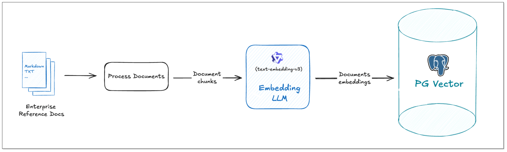

#### DataJob 2: RAG API Building (PGVector → RagApi)
1. **Query Embedding and Smart Query Tweaks**   
BladePipe turns the user's query into vectors using the same model. In this process, query tweaks can be done: 
- **QUERY_COMPRESS**: Shrink long or vague queries to their core meaning, making the vector similarity search more accurate.
- **QUERY_EXTEND**: Expand queries with synonyms or related terms to extend the similarity search scope.
2. **Vector Search and Knowledge Selection**  
Do vector similarity search in the vector database to find the most relevant knowledge chunks. And you can use **KNOWLEDGE_SELECT** to filter knowledge. It supports multi-knowledge base routing. BladePipe picks the best matching pieces across tables based on semantic relevance. 
3. **Prompt Building**  
BladePipe constructs a complete context based on the configured Prompt template, combined with users' queries and search results.
4. **LLM Reasoning**   
The created Prompt is fed into the configured Chat model (such as qwq-plus, gpt-4o, etc.) to generate the final answer. The interface is an OpenAI format interface, which can be directly connected to the applications.
5. **Call Tools with MCP (Optional)**   
To do more beyond getting info, we need MCP. With MCP integration, RagApi can use tools to finish tasks(e.g. query GitHub PR status, call the company's API). It supports standardized MCP tools (HTTP or local via stdio). External tools are called via Function Calling, and the model replies with the final output.

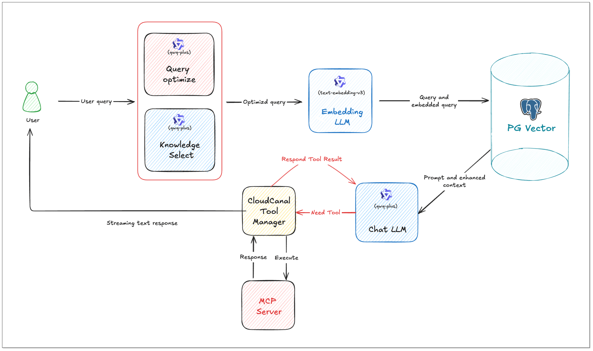

The specific procedures are shown in the following blogs:

1. [Create and Store Embeddings in PGVector](https://www.bladepipe.com/docs/bestPractice/file_to_aliyun_pg_vector/)   
2. [Create RAG API with PGVector](https://www.bladepipe.com/docs/bestPractice/pg_vector_to_rag_api/)

After the two DataJobs are running, the RAG service that can **answer industry-specific questions** and **automate tasks based on MCP** is available. The **OpenAI-compatible** RAG API is an enhanced version of the existing LLM APIs, with no need of client code change. 

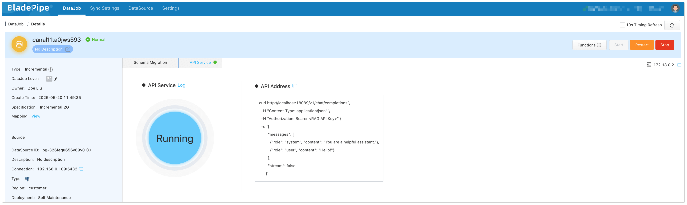

We can check the performance using [Cherry Studio](https://www.cherry-ai.com/). CherryStudio is compatible with the OpenAI interface, suitable for interface joint debugging, context debugging, and model performance verification.

### Try It Out in Cherry Studio
1. Open Cherry Studio, and click the setting icon in the bottom left corner.
2. In **Model Provider**, search **Open AI** and configure as follows:

- API Key: Enter the RagApi API Key configured in BladePipe.
- API Host: http://localhost:18089  

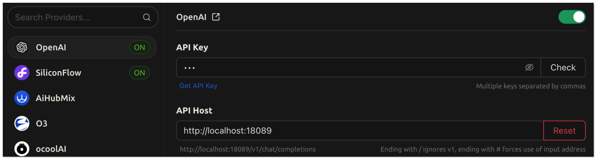

- Model Name: BP_RAG

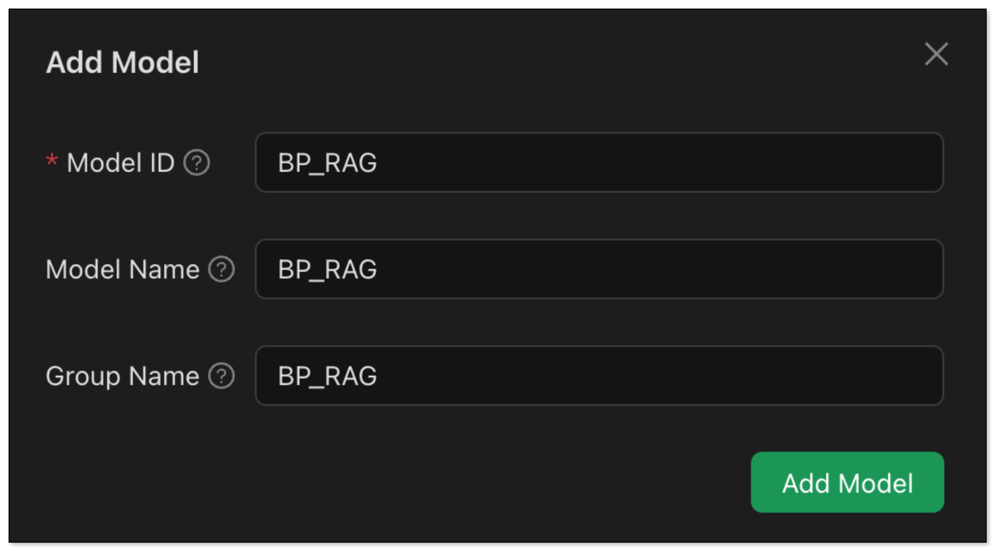

3. Go back to the chat page. Click Add assistant > Default Assistant.
4. Right click Default Assistant > Edit assistant > Model Settings, and select the model added in Step 2.


5. Go back to the chat page. Enter `How to create an Incremental DataJob in BladePipe?` RagApi will generate the answer based on the vector search and the LLM.


### Tool Call (MCP Example)
If you configure the function of MCP (e.g. web crawling, GitHub query), the model can automate tool calls.

Follow the steps:

1. Go to BladePipe, click **Functions** > **Modify DataJob Params** in the upper right corner of the DataJob details page.
2. Select **Target** tab, find the parameter *mcpServers*, and paste the following configuration into it.
3. Click **Save** in the upper right corner to confirm the parameter modification.
4. Click **Submit**, and restart the DataJob.
```json
{
  "mcpServers": {
    "github": {
      "command": "npx",
      "args": [
        "-y",
        "@modelcontextprotocol/server-github"
      ],
      "env": {
        "GITHUB_PERSONAL_ACCESS_TOKEN": "<YOUR_TOKEN>"
      }
    },
    "mcp-server-firecrawl": {
      "command": "npx",
      "args": [
        "-y",
        "firecrawl-mcp"
      ],
      "env": {
        "FIRECRAWL_API_KEY": "<YOUR_API_KEY_HERE>"
      }
    }
  }
}
```

BladePipe **automates multi-turn tool calls through MCP** and **makes a summary**, then returns the final response.

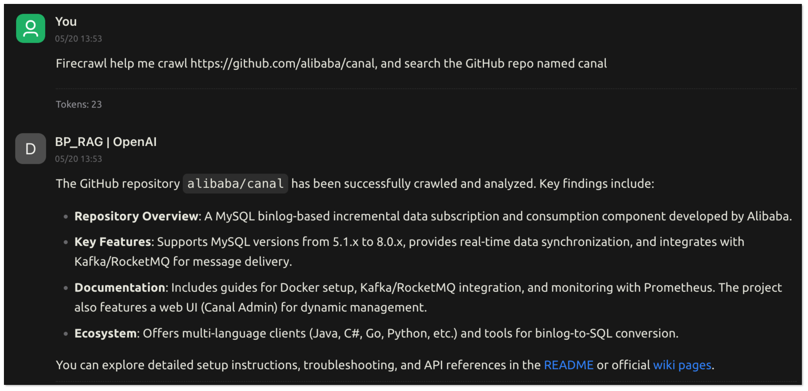


## Wrapping Up
RAG, Function Calling, MCP, and AI Agents aren’t just buzzwords—they’re the core building blocks of real, usable AI systems.

With RagApi, BladePipe wraps these powerful tools into an easy-to-use, no-code-needed solution that brings intelligent Q&A and automated tool usage into your apps instantly. In BladePipe, everyone can create your own RAG service. It’s AI that knows, thinks, and gets things done.
