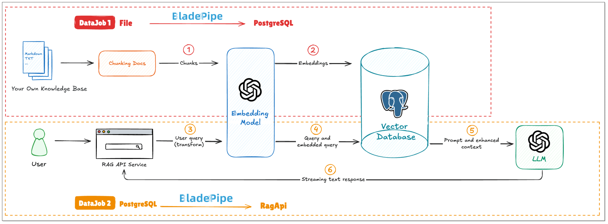
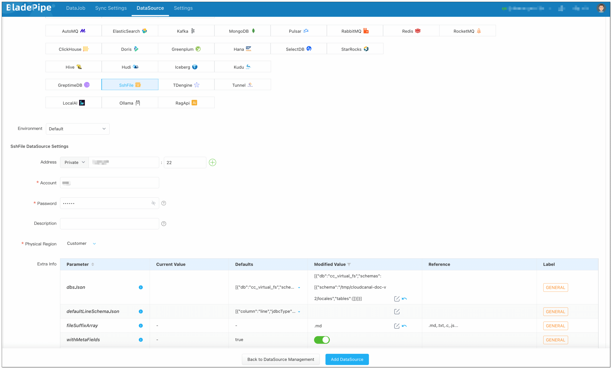
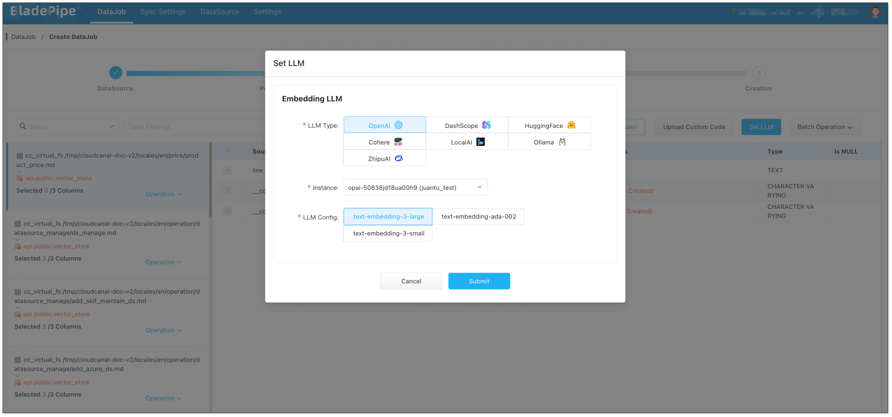
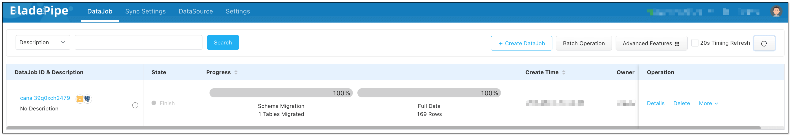
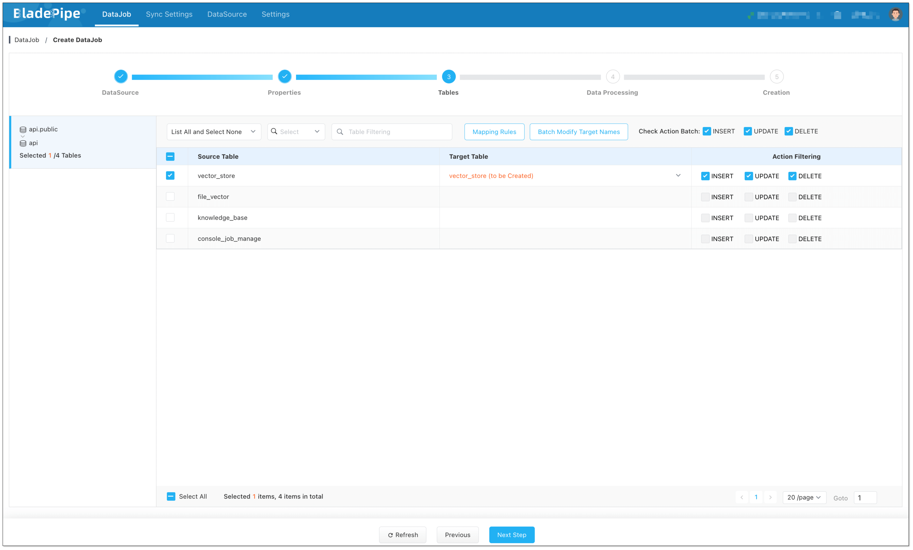
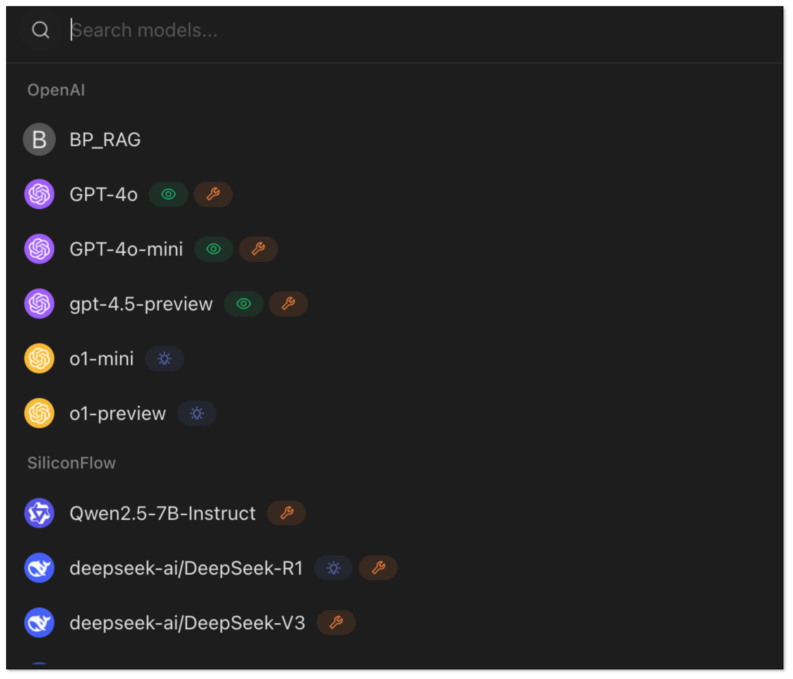
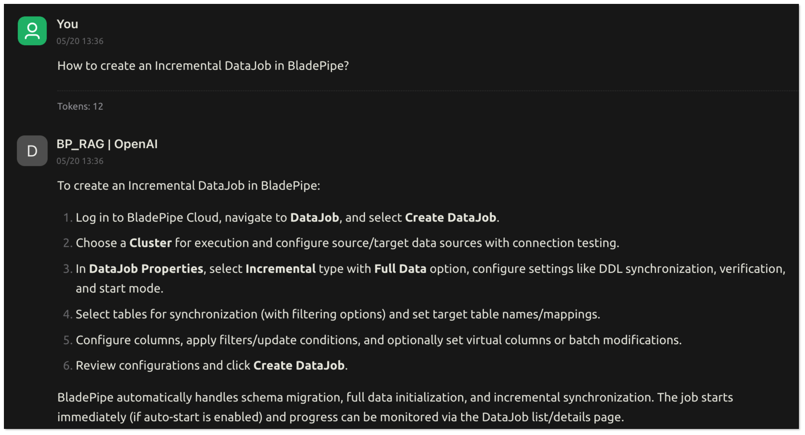

In [a previous article](https://www.bladepipe.com/blog/ai/rag_concept/), we explained key GenAI concepts like RAG, Function Calling, MCP, and AI Agents. Now the question is: how do we go from concepts to practice?  

Currently, you can find plenty of RAG building tutorials online, but most of them are based on frameworks like LangChain, which still have a learning curve for beginners.

[BladePipe](https://www.bladepipe.com), as a data integration platform, already supports the access to and processing of multiple data sources. This gives it a natural edge in setting up the semantic search foundations for a RAG system. Recently, BladePipe launched **RagApi**, which wraps up **vector search** and **Q&A capabilities** into a **plug-and-play API service**. With just two DataJobs in BladePipe, you can have your own RAG service—no coding required.

## Why BladePipe RagApi?

Compared to traditional RAG setups, which often involve lots of manual work, BladePipe RagApi offers several unique benefits:

- **Two DataJobs for a RAG service**: One to import documents, and one to create the API.
- **Zero-code deployment**: No need to write any code, just configure.
- **Adjustable parameters**: Adjust vector top-K, match threshold, prompt templates, model temperature, etc.
- **Multi-model and platform compatibility**: Support DashScope (Alibaba Cloud), OpenAI, DeepSeek, and more.
- **OpenAI-compatible API**: Integrate it directly with existing Chat apps or tools with no extra setup.

## Demo: A Q&A Service for BladePipe Docs
We’ll use BladePipe’s own documentation as a knowledge base to create a RAG-based Q&A service.

Here’s what we’ll need:

- **BladePipe** – to build and manage the RagApi service
- **PostgreSQL** – as the vector database
- **Embedding model** – OpenAI text-embedding-3-large
- **Chat model** – OpenAI GPT-4o

Here’s the overall workflow:



## Step-by-Step Setup
### Install BladePipe
Follow the instructions in [Install Worker (Docker)](https://www.bladepipe.com/docs/productOP/byoc/installation/install_worker_docker/) or [Install Worker (Binary)](https://www.bladepipe.com/docs/productOP/byoc/installation/install_worker_binary/) to download and install a BladePipe Worker.

### Prepare Your Resources
1. Log in [OpenAI API platform](https://openai.com/index/openai-api/) and create the API key. 
2. Install a local PostgreSQL instance:

```xml
#!/bin/bash

# create file docker-compose.yml
cat <<EOF > docker-compose.yml
version: "3"
services:
  db:
    container_name: pgvector-db
    hostname: 127.0.0.1
    image: pgvector/pgvector:pg16
    ports:
      - 5432:5432
    restart: always
    environment:
      - POSTGRES_DB=api
      - POSTGRES_USER=root
      - POSTGRES_PASSWORD=123456
    volumes:
      - ./init.sql:/docker-entrypoint-initdb.d/init.sql
EOF

# Start docker-compose automatically
docker-compose up --build

# Access PostgreSQL
docker exec -it pgvector-db psql -U root -d api
```

3. Create a privileged user and log in.
4. Switch to the target schema where you need to create tables (like `public`).
5. Run the following SQL to enable vector capability:

```shell
CREATE EXTENSION IF NOT EXISTS vector;
```

### Add DataSources
Log in to the [BladePipe Cloud](https://cloud.bladepipe.com). Click **DataSource** > **Add DataSource**.

**Add Files:**   

Select **Self Maintenance** > **SshFile**. You can set [extra parmeters](https://www.bladepipe.com/docs/reference/file_schema_format/).

+ **Address**: Fill in the machine IP where the files are stored and SSH port (default 22).
+ **Account & Password**: Username and password of the machine.
+ Parameter **fileSuffixArray**: set to `.md` to include markdown files.
+ Parameter **dbsJson**: Copy the default value and modify the **schema** value (the root path where target files are located)

```json
[
  {
    "db":"cc_virtual_fs",
    "schemas":[
      {
        "schema":"/tmp/cloudcanal-doc-v2/locales",
        "tables":[]
      }
    ]
   }
]
```



**Add the Vector Database:**   

Choose **Self Maintenance** > **PostgreSQL**, then connect.


**Add a LLM:**   
Choose **Independent Cloud Platform** > **Manually Fill** > **OpenAI**, and fill in the API key.


**Add RagApi Service:**    

Choose **Self Maintenance** > **RagApi**.

+ **Address**: Set host to `localhost` and port to 18089.
+ **API Key**: Create your own API key for later use. 


### DataJob 1: Vectorize Your Data
1. Go to **DataJob** > [**Create DataJob**](https://www.bladepipe.com/docs/operation/job_manage/create_job/create_full_incre_task/).
2. Choose source: **SshFile**, target: **PostgreSQL**, and test the connection.


3. Select **Full Data** for DataJob Type. Keep the specification as default (2 GB). 
4. In **Tables** page, 
    1. Select the markdown files you want to process.
    2. Click **Batch Modify Target Names** > **Unified table name**, and fill in the table name (e.g. `vector_store`). 


5. In **Data Processing** page,
    1. Click **Set LLM** > **OpenAI**, and select the instance and the embedding model (text-embedding-3-large).
    2. Click **Batch Operation** > **LLM embedding**. Select the fields for embedding, and check **Select All**.




6. In **Creation** page, click **Create DataJob**.



### DataJob 2: Build RagApi Service
1. Go to **DataJob** > [**Create DataJob**](https://www.bladepipe.com/docs/operation/job_manage/create_job/create_full_incre_task/).
2. Choose source: **PostgreSQL**(with vectors stored), target: **RagApi**, and test the connection.
   


3. Select **Incremental** for DataJob Type. Keep the specification as default (2 GB). 
4. In **Tables** page, select the vector table(s).



5. In **Data Processing** page, click **Set LLM**:
    1. **Embedding LLM**: Select OpenAI and the embedding model (e.g. `text-embedding-3-large`). **Note:** Make sure vector dimensions in PostgreSQL match the embedding model.

    2. **Chat LLM**: Select OpenAI and the chat model (e.g. `gpt-4o`). 


6. In **Creation** page, click **Create DataJob** to finish the setup. 


## Test
You can test the RagApi with [CherryStudio](https://cherry-ai.com/), a visual tool that supports OpenAI-compatible APIs.

1. Open [CherryStudio](https://cherry-ai.com/), click the Settings icon in the bottom left corner.
2. Under **Model Provider**, search for **OpenAI** and configure:
    - **API Key**: your RagApi key configured in BladePipe
    - **API Host**: http://localhost:18089
    - **Model ID**: BP_RAG


3. Back on the chat page:   
    - Click **Add Assistant** > **Default Assistant**.
    - Right click **Default Assistant** > **Edit Assistant** > **Model Settings**, and choose BP_RAG as the default model.



4. Now try asking: `How to create an incremental DataJob in BladePipe?`. RagApi will search your vector database and generate a response using the chat model.



## Wrapping Up
With just a few steps, we’ve built a fully functional RagApi service from scratch—vectorized the data, connected to a vector DB, configured LLMs, generated Prompt and deployed an OpenAI-compatible API.

With [BladePipe](https://www.bladepipe.com), teams can quickly build Q&A services based on outside knowledge without writing any code. It's a powerful yet accessible way to tap into GenAI for your own data.
