Retrieval-Augmented Generation (RAG) is becoming increasingly common in enterprise applications. Unlike lightweight Q&A systems designed for personal users, enterprise RAG solutions must be reliable, controllable, scalable, and most importantly—secure.

Many companies are cautious about sending internal data to public cloud-based models or vector databases due to the risk of sensitive information leakage. For industries with strict compliance needs, this is often a dealbreaker.

To address these challenges, BladePipe now supports building local RAG services with Ollama, enabling enterprises to run intelligent RAG services entirely within their own infrastructure. This article walks you through **building a fully private, production-ready RAG application**—without writing any code.

If you’re okay running your RAG stack on cloud LLMs (like OpenAI) and just want a quick, beginner-friendly setup, you can follow [Build A RAG Chatbot with OpenAI - A No-Code Beginner's Guide](https://www.bladepipe.com/blog/ai/ragapi_cloud/).

## What is an Enterprise-Grade RAG Service?
Enterprise-grade RAG emphasizes end-to-end integration, data control, and tight alignment with business systems. The goal isn’t just smart Q&A. It brings automation and intelligence that genuinely boost business.

Compared to hobby or research-focused RAG setups, enterprise systems have four key traits:

- **Fully private stack**: All components must run locally or in a private cloud. No data leaves the enterprise boundary.
- **Diverse data sources**: Beyond plain text files. Databases and more formats are supported.
- **Incremental data syncing**: Business data updates constantly. RAG indexes must stay in sync automatically.
- **Integrated tool calling (MCP-like capabilities)**: Retrieval and generation are only part of the story. Tools like SQL query, function calls, or workflow execution must be supported.

## Introducing BladePipe RagApi
[BladePipe](https://www.bladepipe.com)’s **RagApi** encapsulates both vector search and LLM-based Q&A capabilities and supports the MCP protocol. It’s designed to help every one quickly launch their own RAG services.

If you’re building RAG with code-first frameworks, our [roundup of the best LangChain alternatives](https://www.bladepipe.com/blog/ai/langchain_alternative/) can help you evaluate other orchestration stacks before you commit.

Compared to the traditional way to build RAG services, RagApi's key advantages include:

- **Two DataJobs for a RAG service**: Import documents + publish API.
- **Zero-code deployment**: Everything is configurable—no development needed.
- **Adjustable parameters**: Adjust vector top-K, match threshold, prompt templates, model temperature, etc.
- **Multi-model and platform support**: Support DashScope (Alibaba Cloud), OpenAI, DeepSeek, and more.
- **OpenAI-compatible API**: Easily integrate into your existing chat UI or toolchain.


## Demo
Here’s how to build a fully private, secure RAG service using:

- **Ollama** for local model reasoning and embedding.
- **PostgreSQL** for local vector storage.
- **BladePipe RagApi** for building and managing the RagApi service.

The overall workflow is like:

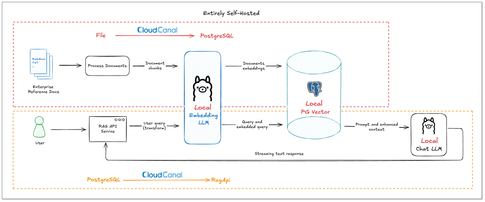

## Preparation
### Run Ollama Locally
Ollama allows you to deploy LLMs on your local machine. It will be used for both **embedding** and **reasoning**.

1. Download Ollama from https://ollama.com/download
2. After installation, run the following command to pull and run a suitable model for embedding and reasoning, such as `deepseek-r1`.
Note: Large models may require significant hardware resources.
```
ollama run deepseek-r1
```
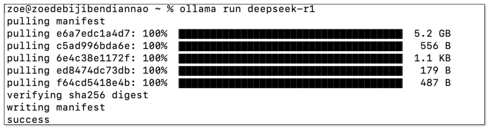

### Set Up PGVector
1. Install Docker (Skip if already installed):
For different operating systems, refer to the following steps for installation:
- **MacOS**: Refer to the official installation doc: [Docker Desktop for Mac](https://docs.docker.com/desktop/setup/install/mac-install/).
- **CentOS / RHEL**: Refer to the script below.

```shell
## centos / rhel
sudo yum-config-manager --add-repo https://mirrors.aliyun.com/docker-ce/linux/centos/docker-ce.repo

sudo yum install -y docker-ce-20.10.9-3.* docker-ce-cli-20.10.9-3.*

sudo systemctl start docker

sudo echo '{"exec-opts": ["native.cgroupdriver=systemd"]}' > /etc/docker/daemon.json

sudo systemctl restart docker
```
- **Ubuntu**: Refer to the script below.

```shell
## ubuntu
curl -fsSL https://mirrors.aliyun.com/docker-ce/linux/ubuntu/gpg | sudo apt-key add -

sudo add-apt-repository "deb [arch=amd64] https://mirrors.aliyun.com/docker-ce/linux/ubuntu $(lsb_release -cs) stable"

sudo apt-get update

sudo apt-get -y install docker-ce=5:20.10.24~3-0~ubuntu-* docker-ce-cli=5:20.10.24~3-0~ubuntu-*

sudo systemctl start docker

sudo echo '{"exec-opts": ["native.cgroupdriver=systemd"]}' > /etc/docker/daemon.json

sudo systemctl restart docker
```

2. Start PostgreSQL + pgvector Container Service:
Execute the following command to deploy the PostgreSQL environment in one go:

```shell
cat <<'EOF' > init_pgvector.sh
#!/bin/bash

# create docker-compose.yml
cat <<YML > docker-compose.yml
version: "3"
services:
  db:
    container_name: pgvector-db
    hostname: 127.0.0.1
    image: pgvector/pgvector:pg16
    ports:
      - 5432:5432
    restart: always
    environment:
      - POSTGRES_DB=api
      - POSTGRES_USER=root
      - POSTGRES_PASSWORD=123456
YML

# Start container service (run in background)
docker-compose up --build -d

# Wait for container to start, then enter database and enable vector extension
echo "Waiting for container to start..."
sleep 5

docker exec -it pgvector-db psql -U root -d api -c "CREATE EXTENSION IF NOT EXISTS vector;"
EOF

# Grant execution permissions and run the script
chmod +x init_pgvector.sh
./init_pgvector.sh
```
After execution, local PostgreSQL will automatically enable the pgvector extension, ready to store document embeddings securely on-prem.


### Deploy BladePipe (Enterprise)
Follow the [installation guide](https://www.bladepipe.com/docs/productOP/onPremise/installation/install_all_in_one_binary/) to download [BladePipe (Enterprise)](https://www.bladepipe.com/).

## RAG Building
### Add DataSources
Log in to BladePipe. Click **DataSource** > **Add DataSource**.

**Files(SshFile):**   
Select **Self Maintenance** > **SshFile**. You can set [extra parmeters](https://www.bladepipe.com/docs/reference/file_schema_format/).

- **Address**: Fill in the machine IP where the files are stored and SSH port (default 22).
- **Account & Password**: Username and password of the machine.
- **Parameter *fileSuffixArray***: set to `.md` to include markdown files.
- **Parameter *dbsJson***: Copy the default value and modify the schema value (the root path where target files are located)
```json
[
  {
    "db":"cc_virtual_fs",
    "schemas":[
      {
        "schema":"/Users/zoe/cloudcanal-doc-v2/locales",
        "tables":[]
      }
    ]
   }
]
```

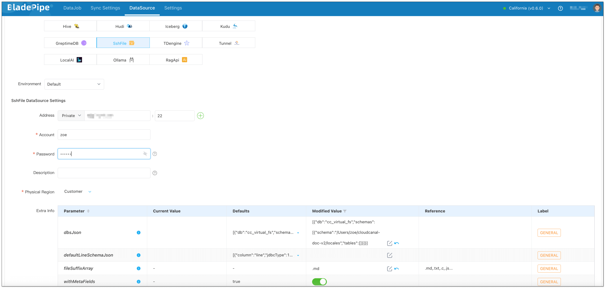

**Vector Database(PostgreSQL):**   
Choose **Self Maintenance** > **PostgreSQL**.   
Configuration Details:
- **Address**: localhost:5432
- **Account**: root
- **Password**: 123456

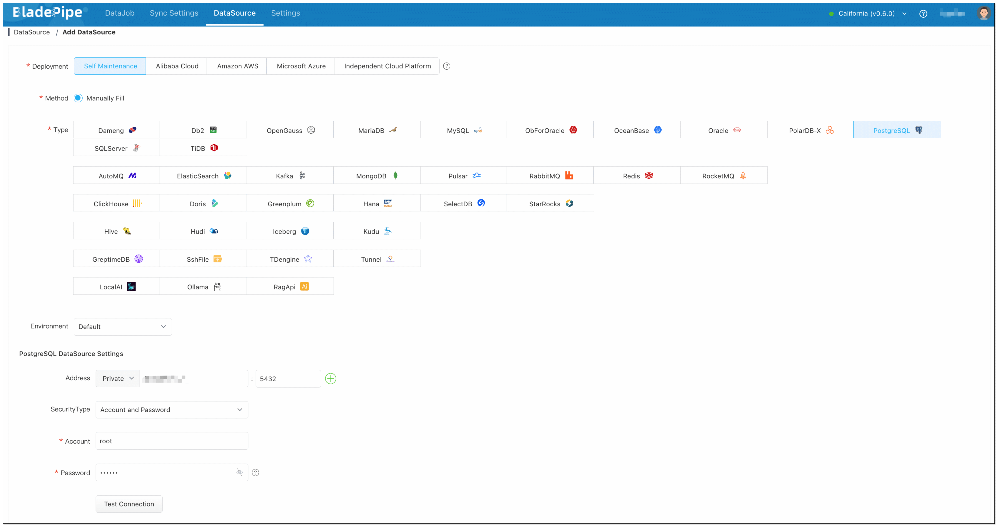

**LLM (Ollama):**   
Choose **Self Maintenance** > **Ollama**.   
Configuration Details:
- **Address**: localhost:11434
- **Parameter *llmEmbedding***:
```
{
  "deepseek-r1": {
    "dimension": 4096
  }
}
```

- **Parameter *llmChat***:
```
{
  "deepseek-r1": {
    "temperature": 1,
    "topP": 0.9,
    "showReasoning": false
  }
}
```

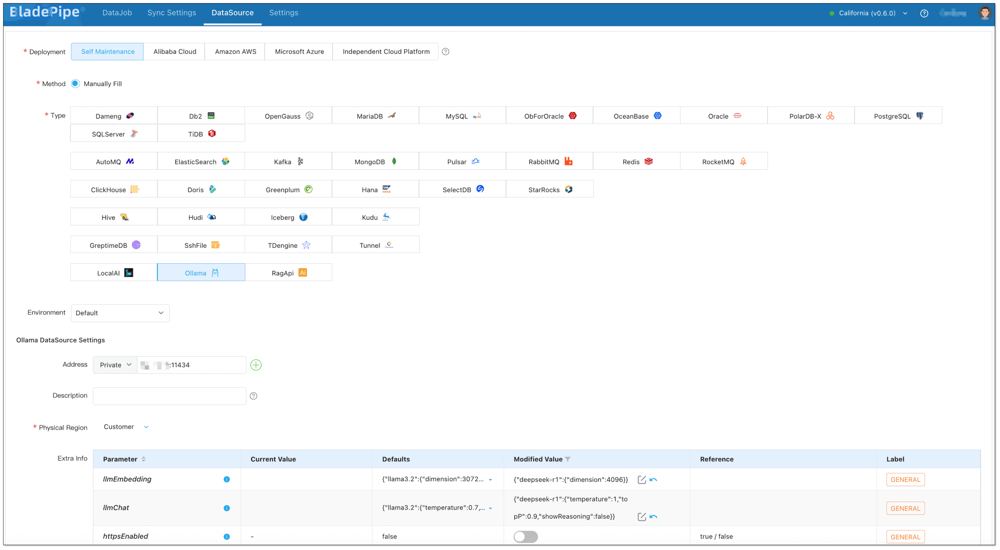

**RagApi Service (BladePipe):**   
Choose **Self Maintenance** > **RagApi**.

- **Address**: Set host to localhost and port to 18089.
- **API Key**: Customize a string (e.g. `my-bp-rag-key`), used for authentication when calling RagApi later.

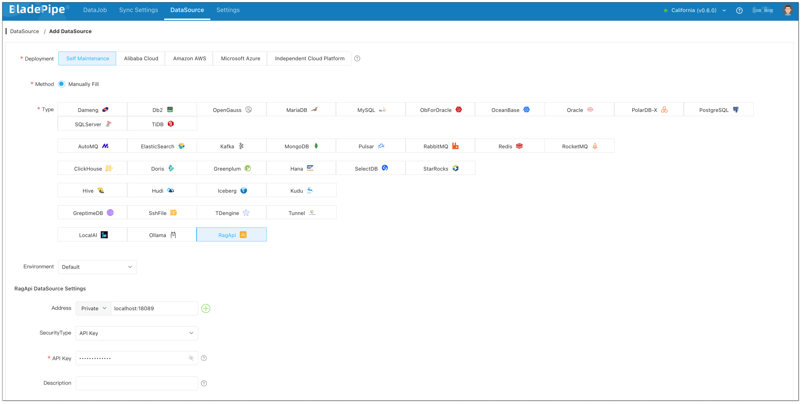

### DataJob 1: Vectorize the Docs
1. Go to **DataJob** > **Create DataJob**.
2. Choose **source: SshFile**, **target: PostgreSQL**, and test the connection.

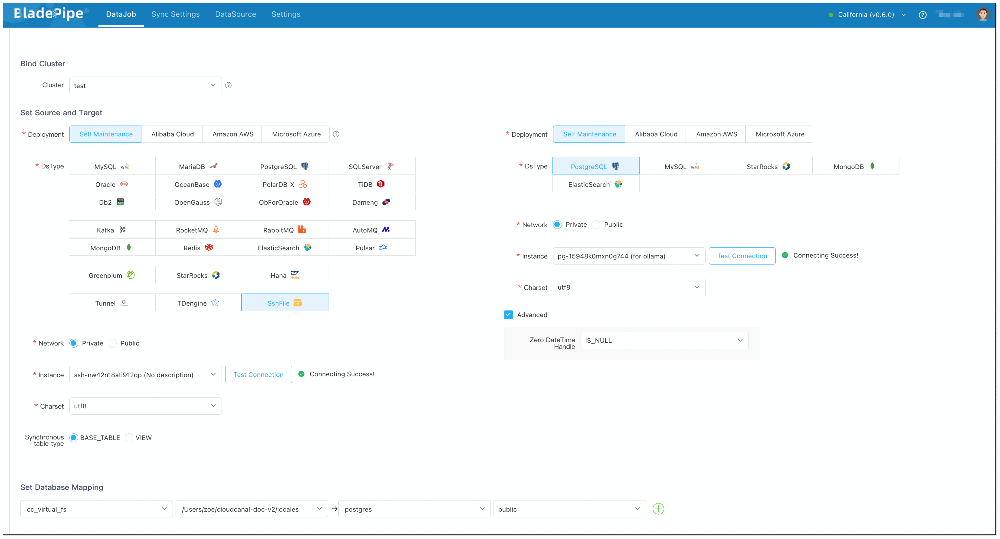

3. Select **Full Data** for DataJob Type. Keep the specification as default (2 GB).
4. In **Tables** page,
   1. Select the markdown files you want to process.
   2. Click **Batch Modify Target Names** > **Unified table name**, and fill in the table name (e.g. `knowledge_base`).
   3. Click **Set LLM** > **Ollama**, and select the instance and the embedding model.

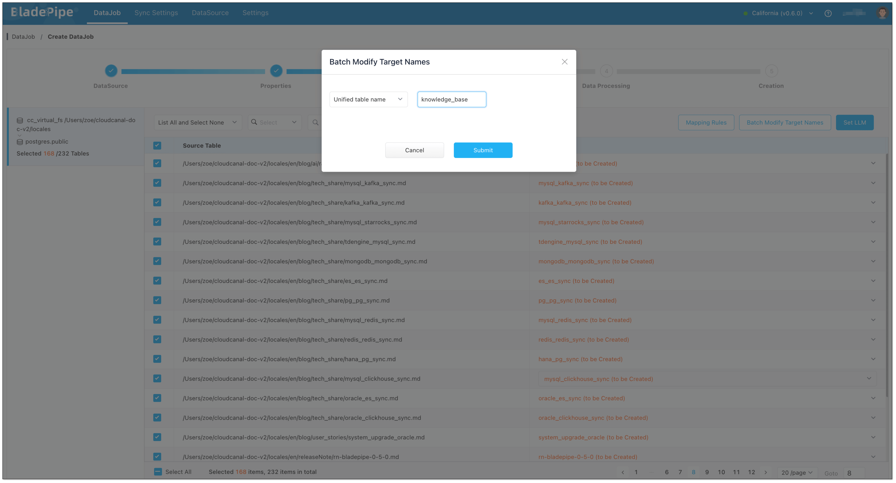
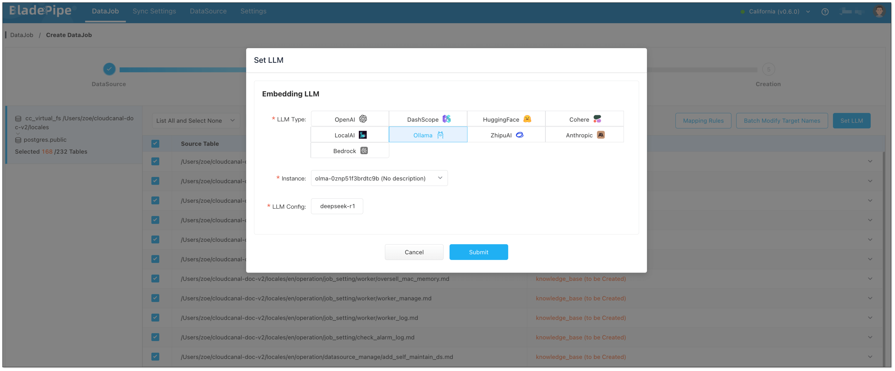

5. In **Data Processing** page, click **Batch Operation** > **LLM embedding**. Select the fields for embedding, and check **Select All**.

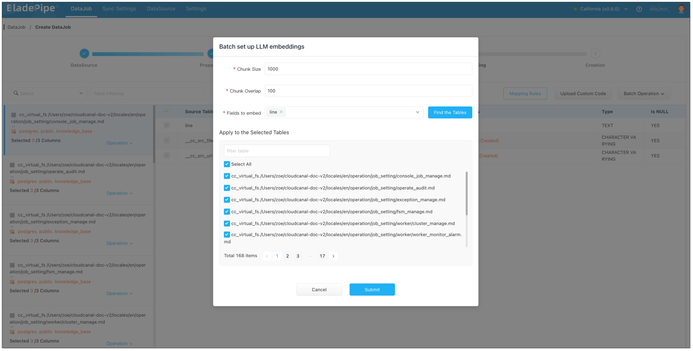

6. In **Creation** page, click **Create DataJob**.

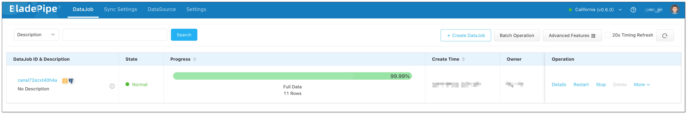

### DataJob 2: Build RagApi Service
1. Go to **DataJob** > **Create DataJob**.
2. Choose **source: PostgreSQL**(with vectors stored), **target: RagApi**, and test the connection.

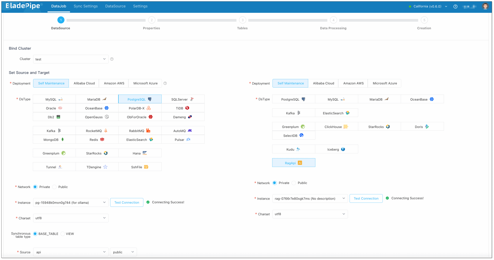

3. Select **Incremental** for DataJob Type. Keep the specification as default (2 GB).
4. In **Tables** page, select the vector table(s). Then, click **Set LLM**, and choose **Ollama** as the **Embedding LLM** and **Chat LLM**.

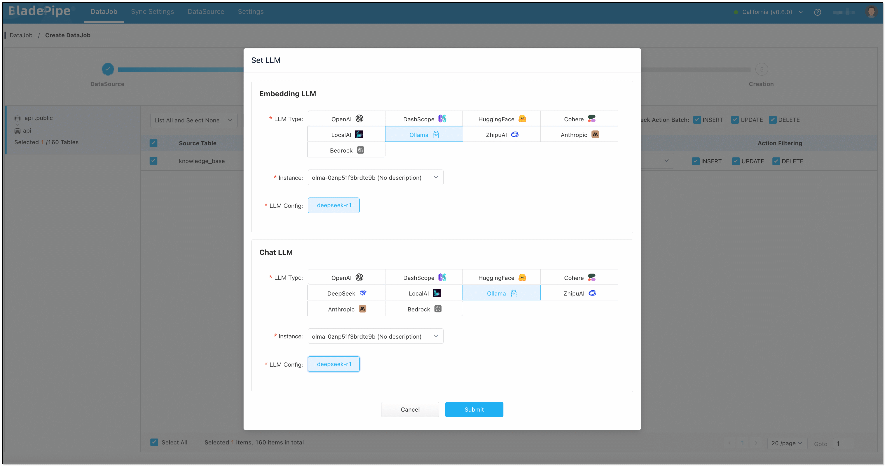

5. In **Creation** page, click **Create DataJob** to finish the setup.

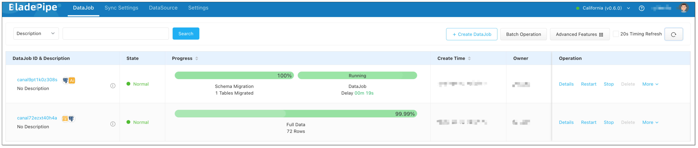

6. Perform a simple test using the following command:
```python
curl http://localhost:18089/v1/chat/completions \
  -H "Content-Type: application/json" \
  -H "Authorization: Bearer my-cc-rag-key" \
  -d '{
        "messages": [
          {"role": "system", "content": "You are a helpful assistant."},
          {"role": "user", "content": "Hello!"}
        ],
        "stream": false
      }'
```
   
## Test
You can test the RagApi with [CherryStudio](https://cherry-ai.com/), a visual tool that supports OpenAI-compatible APIs.

1. Open CherryStudio, click the Settings icon in the bottom left corner.
2. Under **Model Provider**, search for **OpenAI** and configure:
   - **API Key**: your RagApi key configured in BladePipe
   - **API Host**: http://localhost:18089
   - **Model ID**: BP_RAG

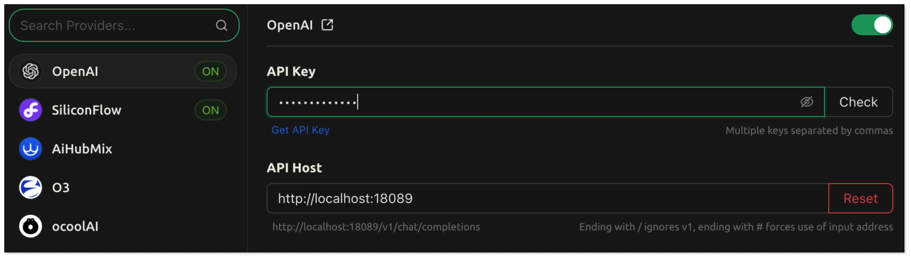
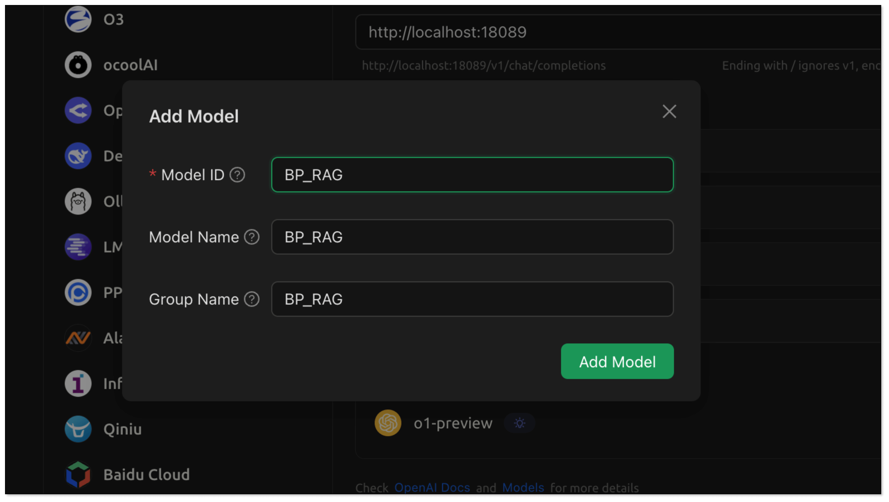

3. Back on the chat page:
   1. Click **Add Assistant** > **Default Assistant**.
   2. Right click **Default Assistant** > **Edit Assistant** > **Model Settings**, and choose BP_RAG as the default model.

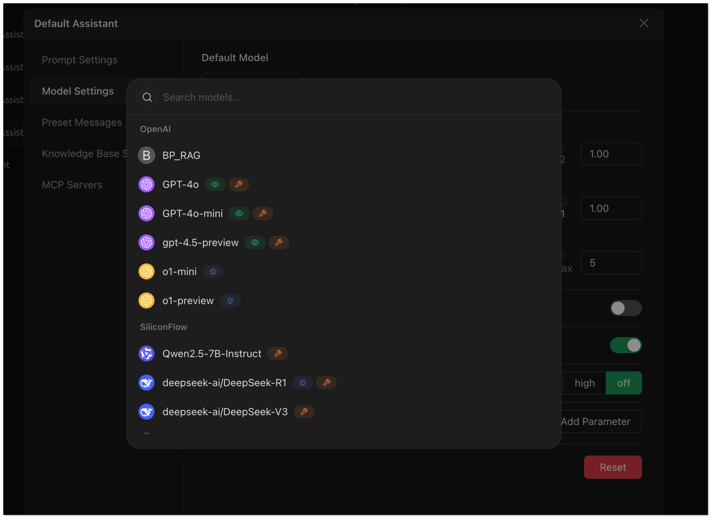

4. Now try asking: `What privileges does BladePipe require for a source MySQL?`. RagApi will search your vector database and generate a response using the chat model.

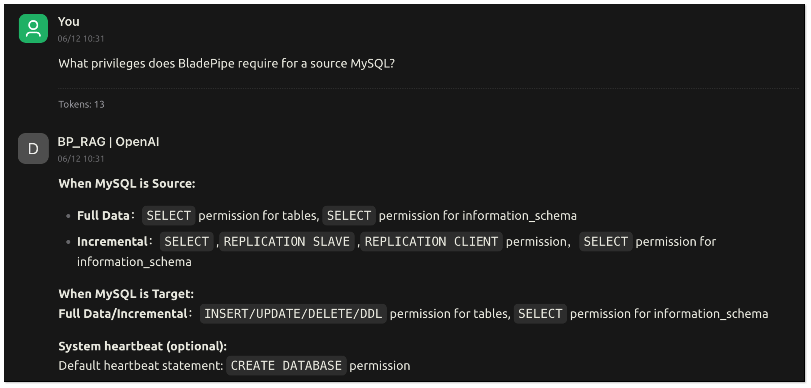


## Final Thoughts
Enterprise-grade RAG services prioritize data privacy and control. By combining BladePipe with Ollama, you can easily achieve a fully private RAG service deployment, creating a truly reliable enterprise-grade RAG solution that does not depend on public networks.
