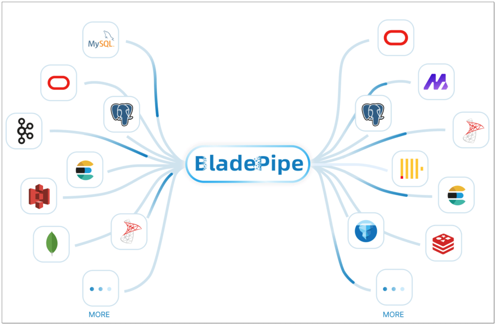
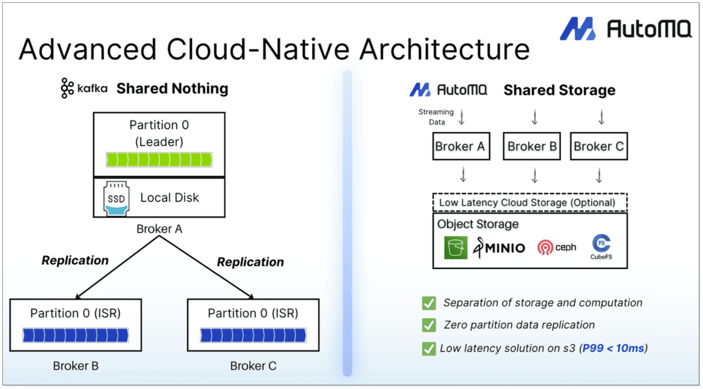
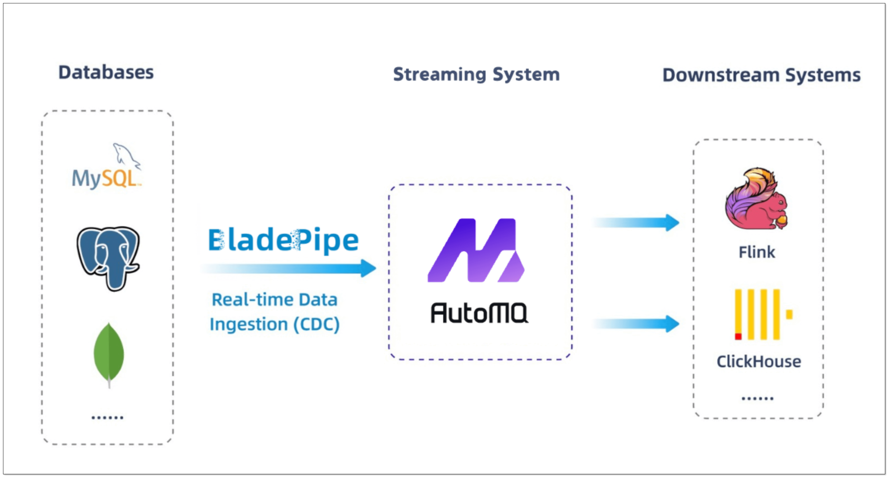

We’re excited to announce a strategic partnership between BladePipe and AutoMQ, teaming up to simplify how businesses move data in real time.

Together, we’re offering a fully integrated solution that connects operational databases to real-time processing engines through a fully automated CDC platform and a cloud-native, Kafka-compatible message pipeline. The collaboration brings faster insights, lower costs, and a much smoother path to real-time analytics at scale.

## About BladePipe
[**BladePipe**](https://www.bladepipe.com) is a **real-time end-to-end data integration tool**, offering **40+** out-of-the-box connectors for analytics or AI. Built based on **Change Data Capture (CDC)** technique, BladePipe brings **sub-second** latency and high reliability. Designed for teams of all sizes, it provides a **one-stop** data movement solution, including schema evolution, data migration and sync, verification and correction, monitoring and alerting. All is done automatically.

BladePipe offers unique features, including:

+ **Real-Time CDC**: BladePipe captures and delivers data changes to the target instantly, maintaining sub-second latency.
+ **End-to-End Pipeline**: Move data from the source directly to the target, shortening the pipeline and facilitating O&M. 
+ **Operational Stability**: Robust observability, alerting, fault recovery, and resumable pipelines ensure reliability.
+ **Enhanced Data Consistency**: It supports data verification and correction, making it easy for users to check data accuracy and integrity.

Adopted across industries like finance, gaming, energy, and pharma, BladePipe simplifies the complexity and reduces the cost of building real-time infrastructure at scale.

## About AutoMQ
[**AutoMQ**](https://www.automq.com) is a **next-generation Kafka distribution redesigned with a cloud-native architecture**. It is now **fully open source** and remains **100%** compatible with the Apache Kafka protocol—delivering up to 10× cost savings and 100× elasticity compared to traditional Kafka deployments. By leveraging a shared storage architecture, AutoMQ achieves true separation of compute and storage—bringing higher performance, stronger scalability, and significantly lower operational overhead. It is **easier to deploy and manage in the cloud** than conventional Kafka, making it an ideal Kafka alternative for cloud-native environments.

As an open source project, AutoMQ encourages developers and enterprises to freely use, deploy, and extend the platform—collaborating to build the next generation of real-time data infrastructure.

By decoupling compute and storage via a shared storage architecture, AutoMQ offers:

+ **Extreme Cost Efficiency**: Compared to traditional Kafka deployments, reduce TCO by up to 90% with object storage and shared compute.
+ **Self-Balancing & Self-Healing**: With built-in traffic-aware load balancing and automated recovery, AutoMQ eliminates hot spots and single points of failure—ensuring continuous service without manual intervention.
+ **Elastic Scaling in Seconds**: AutoMQ scales on demand within seconds to add GB/s-level throughput capacity, enabling rapid response to traffic spikes or business surges.
+ **Fully Managed, Zero Ops**: Features like automatic partition reassignment, elastic scaling, and state management simplify Kafka operations and enhance team productivity.

AutoMQ is committed to building the next-generation real-time data infrastructure. It empowers enterprises in scenarios such as financial risk control, intelligent operations, IoT data collection, and marketing analytics—enabling faster data responsiveness and smarter decision-making.

## How BladePipe and AutoMQ Work Together
Traditional Kafka + custom CDC setups are often expensive, brittle, and hard to scale. Kafka clusters tend to be resource-intensive and prone to backlogs, while CDC tools require ongoing development and maintenance.

[**BladePipe**](https://www.bladepipe.com) and [**AutoMQ**](https://www.automq.com) address these challenges through a fully integrated real-time streaming architecture:

+ **Data Capture Layer**: BladePipe captures changes from a wide range of mainstream databases with high accuracy and sub-second latency.
+ **Messaging Layer**: AutoMQ, with full Kafka compatibility, delivers high-throughput, low-latency, and elastic messaging that dramatically reduces infrastructure costs.
+ **Streaming Consumption**: Platforms like Flink or ClickHouse consume AutoMQ data in real time, powering key use cases such as user profiling, risk control, and personalized recommendations.

The solution is fully compatible with existing Kafka clients, requiring no code or infrastructure changes.

### Joint Application Scenarios
+ **User Behavior Analytics & Recommendations**    
Capture behavioral events (clicks, views, purchases) via integrating data to BladePipe, stream to AutoMQ, and process with Flink to power real-time recommendations and BI dashboards.
+ **IoT Data Ingestion & Monitoring**     
Sync real-time device telemetry from PostgreSQL to AutoMQ via BladePipe. Consumers generate KPIs, trigger alerts, or feed ML inference models for intelligent equipment management.
+ **Real-Time Risk Control & Transaction Monitoring**     
Orders and payments flow through BladePipe and AutoMQ into real-time rule engines—enabling fraud detection, anomaly recognition, and risk scoring with millisecond latency.

### What it brings
+ **Faster Insights**: Cut data processing latency to sub-second levels, enabling timely responses to business events.
+ **Lower Cost**: BladePipe eliminates custom CDC development and maintenance overhead, and AutoMQ reduces Kafka infrastructure spend by 50%+.
+ **Simplified Stack**: Replace fragmented architectures with a unified data flow—from source to stream.
+ **Agile Innovation**: Real-time metrics, faster experimentation, and rapid deployment of recommendation or risk engines.

With BladePipe and AutoMQ, teams can move faster, build smarter, and unlock the full potential of real-time streaming data.

## Partnership and Future Outlook
The partnership between [**BladePipe**](https://www.bladepipe.com) and [**AutoMQ**](https://www.automq.com) goes far beyond product integration. It’s a shared vision for the future of real-time data infrastructure. By combining automated, low-latency, and visualized BladePipe with high-performance, cost-efficient, cloud-native AutoMQ, we’re turning the idea of end-to-end real-time pipelines into reality.

Real-time data is becoming the new foundation of enterprise data capabilities. Moving forward, BladePipe and AutoMQ will continue deepening the collaboration across more enterprise scenarios, building faster, more resilient infrastructure and empowering data to become a true driver of business innovation.

