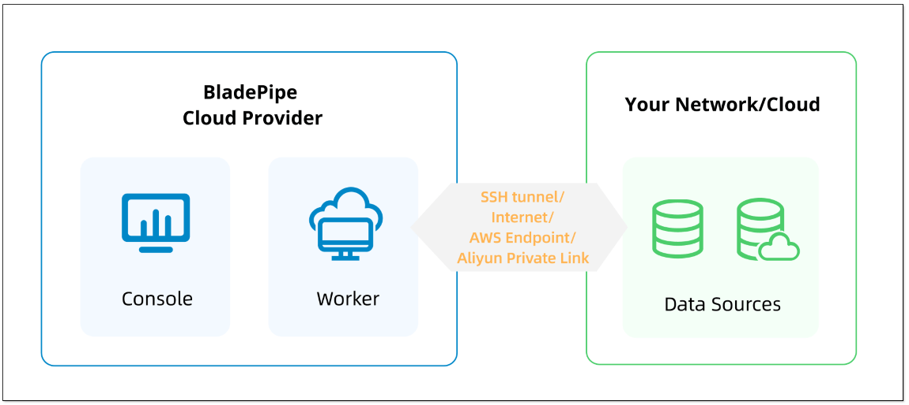

When you need to sync data across clouds or regions, traditional migration tools often feel too complex to deploy, too hard to configure, and too costly to maintain.

That’s why BladePipe has launched its SaaS Managed mode. No deployment or maintenance is required, and you'll enjoy secure and effortless real-time replication.

This article walks through the design and key features of this new mode.

## Why Fully Managed?
Before this release, BladePipe offered two common deployment options:
- **On-Prem**: Best for enterprises with strict data control, but requires managing resources yourself.
- **BYOC (Bring Your Own Cloud)**: Runs on your own cloud environment for flexibility, yet still involves managing servers and networks. 

However, we noticed a gap. Many small teams or temporary projects simply don’t want to deal with infrastructure and ops.

So we built **SaaS Managed** mode, where BladePipe takes care of task scheduling, execution, and monitoring on the platform side. You simply create sync tasks to enable end-to-end data integration. It’s a perfect fit for **small to medium-scale, cross-region data sync**.

BladePipe SaaS is now available in **Singapore** and **California** for low-latency access.

## Architecture Overview
Traditional data replication setups usually involve three parts: a control platform, data sync clients, and source/target databases.

In the SaaS Managed mode, BladePipe hosts both the control platform and the data sync clients in the cloud.

The BladePipe system handles:
- Task scheduling and execution
- Dynamic resource allocation
- Real-time health monitoring
- Automatic recovery

You don’t need to deploy any components. Just log in to the console and start syncing data. All compute nodes are managed by the BladePipe platform, enabling true zero-deployment and instant setup.

## Enhanced Security
"Fully managed" doesn’t mean less secure. BladePipe builds in a multi-layer protection framework to safeguard every data flow:
- **Multiple connection methods**: Support SSH tunnel, AWS Private Endpoint, Alibaba Cloud Private Link, and public access.
- **IP whitelist control**: Only whitelisted connections are allowed.
- **SSL encryption**: Full path data encryption prevents man-in-the-middle attacks.
- **Dual authentication**: Database credentials combined with SSH authentication for enhanced access security.

BladePipe manages task scheduling and status monitoring only. It never stores your business data. Your data flow stays under your control.

## Zero Maintenance Overhead
Traditionally, users must handle upgrades, recovery, and monitoring themselves.

In SaaS mode, the BladePipe platform takes care of all of it, ranging from version management to performance monitoring. A visual console displays real-time metrics like latency and throughput, helping you monitor task health at a glance.

Even teams without a full-time DBA can run enterprise-grade replication effortlessly.

## Cost Efficiency & Predictablity
BladePipe’s SaaS model uses a **pay-as-you-go** pricing strategy with daily billing for full transparency. You only pay for the actual data volume synchronized, with no hidden infrastructure or maintenance costs.

Billing is managed through **prepaid credits**, preventing unexpected charges and keeping costs predictable.

For small teams, short-term projects, cross-cloud migrations, or multi-environment syncs, this model offers exceptional cost efficiency.

## Making Data Flow Effortless
With security and control built in, BladePipe SaaS Managed turns cross-cloud and cross-region data sync into a ready-to-use service.

Now, any team can get started in minutes.

Try it for free today: https://www.bladepipe.com