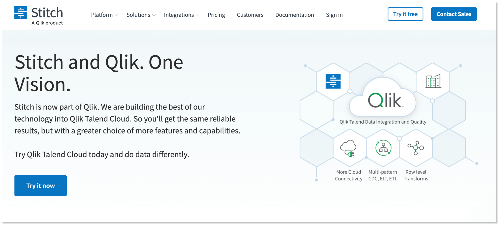
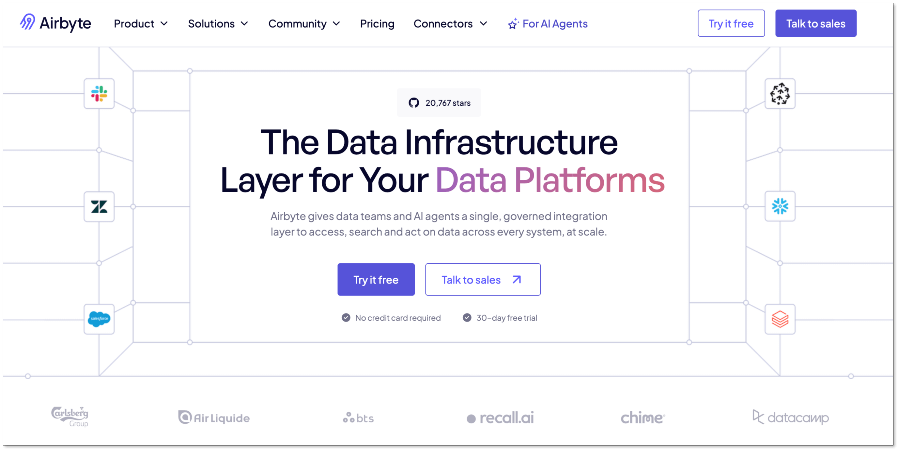
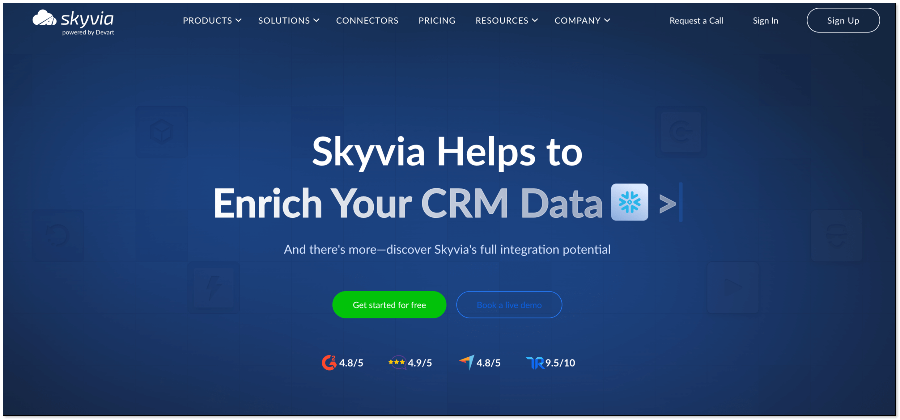
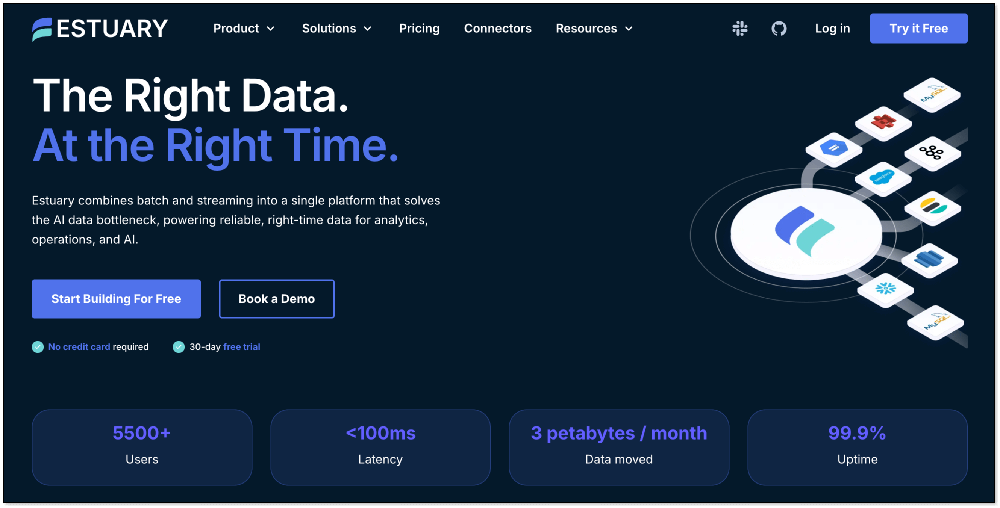
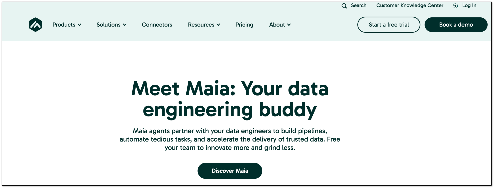

For a small business, data comes from everywhere: your sales platform, website analytics, social media, and more. To make senese of it all, you need everything in one place. That’s where ETL comes in.

But here’s the problem. Many ETL tools are built for large enterprises. They are usually complex, expensive, and heavy to maintain.

So which one actually offers the best value for a small business?

In this guide, we’ll break down 8 strong ETL tools for small businesses in 2026. We will look at features, pricing, strengths, and trade-offs. By the end, you’ll have a clear idea of what fits your team.

## Key Takeaways
- ETL helps centralize data from multiple sources into a single, reliable view for better decisions.
- Choose simple, low-maintenance tools. Small teams should avoid heavy setup and ongoing ops work.
- Pricing can scale quickly. Watch for usage-based costs that grow with your data.
- Pick based on your needs. No-code for ease, open-source for flexibility, managed tools for reliability.
- Real-time is a growing need. CDC/streaming tools enable faster insights when it matters.

## Key Features of an ETL Tool for Small Business
You may have been overwhelmed by hundreds of ETL options. To make it easier, just focus on these six key things. Getting these right will help you find a great tool that fits your business perfectly.

#### **1. Ease of Use**
For small businesses, simplicity is a requirement. A good ETL tool for small businesses should allow you to:

+ Set up in minutes
+ Connect sources and destinations quickly
+ Configure pipelines visually
+ Minimize custom scripting

If you need multiple DevOps steps, servers, or deep platform knowledge just to get started, it’s probably too heavy. 

#### **2. Affordable Cost**
For a small business, every dollar counts. The best tools have clear, predictable pricing with no nasty surprises. Many now offer a "pay-as-you-go" model, which is great because you only pay for the data you actually use. Always look for a free trial so you can test drive the tool before you commit.

#### **3. Automation & Reliability**
The whole point of an ETL tool is to save you time by putting your data on autopilot while keeping it running reliably. 

A production-ready ETL tool should include:

+ Scheduled migration (hourly, daily, real-time if needed)
+ [Incremental data loading](https://www.bladepipe.com/docs/operation/job_manage/create_job/create_full_incre_task/) (instead of full reloads)
+ Auto-retry on failures
+ Monitoring dashboards
+ Alert notifications

#### **4. Connectors**
An ETL tool is only useful if it can talk to the other software you use. Before you choose, make a quick list of your key platforms, like MySQL, PostgreSQL, RedShift. Then, check if the ETL tool has [pre-built connectors](https://www.bladepipe.com/connector/) for them. These pre-built links let you plug in your apps in just a few clicks, saving you a huge technical headache.

#### **5. Scalability**
Your business is going to grow, and your data will too. Your ETL tool needs to be able to handle that growth without slowing down. A good ETL tool can:

+ Handle increasing volumes
+ Support incremental sync
+ Manage schema changes
+ Add new pipelines easily

#### **6. Customer Support**
When something goes wrong, you need to know you can get help. Check out what kind of customer support the tool offers. Do they have helpful guides and tutorials? Is there a way to reach a real person through chat or email when you're stuck? For small businesses especially, strong documentation and fast support can save days of troubleshooting.

## Top 8 ETL Tools for Small Business in 2026

Here’s a closer look at the 8 strong ETL tools that small businesses commonly consider in 2026, each with different strengths. 

### BladePipe

[**BladePipe**](https://www.bladepipe.com/) is a powerful and cost-effective data integration tool designed for moving, transforming, and loading data in real-time. It supports both traditional **ETL** and **Change Data Capture (CDC)**, which allows it to replicate data with very low latency.

**Pros:**

+ **Easy Setup**: No signup for trial. Just [install it using one command](https://www.bladepipe.com/docs/productOP/onPremise/installation/install_all_in_one_docker/), and you can get started. Or you can start directly with [Cloud](https://www.bladepipe.com/docs/quick/quick_start_mgr/) edition.
+ **Real-Time Data:** It's built to replicate data with very low latency (under 3 seconds). 
+ **Automatic Schema Evolution**: Automatically detect DDL changes and adjust the downstream pipeline without manual intervention.
+ **Flexible Deployment**: Support self-hosting, BYOC and fully managed cloud deployments.
+ **Automated Workflows:** Set up your data pipelines once and let them run automatically.
+ **Smart Transformation**: It has multiple built-in data transformations, like data masking and data type conversion. Besides, you can write Java for custom transformation.
+ **Monitoring and Alert**: Continuous monitoring and exception alert notification reduce heavy engineering workloads.
+ **Cost-effective**: BladePipe offers competitive pricing compared to many alternatives while keeping production-ready services.

**Pricing:**  
BladePipe has [three plans](https://www.bladepipe.com/pricing/):

+ **Community**: Self-hosted and **free to use**. For new users, you'll get the tool activated for 15 days automatically. Then you'll need to renew free license every 3 months.
+ **Cloud**: **Pay-as-you-go** pricing model. Start at $0.01 for every million rows of data. It is pre-paid based and you'll get the bill every day, ensuring the maximum cost predictability.
+ **Enterprise**: **Quote-based** pricing model. [Contact the sales team](https://www.bladepipe.com/about/) for a price tailored to your specific needs. 

**Best for**: 

+ Any team that wants to start data integration in minutes.
+ Teams who want to sync data but without a skilled data engineer.
+ Teams who need real-time data for [analytics and reporting at any time](https://www.bladepipe.com/real-time-analytics/).
+ Small to medium teams with a tight budget.

### Stitch

Stitch is a clean, simple, and reliable cloud-based tool designed to make moving data easy. It focuses on getting your data from your sources to your data warehouse with as little fuss as possible. It was acquired by Qlik, and it’s known for being lightweight and developer-friendly.

**Pros:**

+ **Easy to Set Up:** You can get your first data pipeline running in minutes.
+ **130+ Sources:** Has connectors for most popular SaaS tools and databases.
+ **Open-Source Foundation:** Built on Singer, which means there's a large community contributing new connectors.
+ **Simple UI:** The interface is very straightforward and easy to navigate.

**Cons**:

+ **Limited Destinations**: Only support 10+ destinations.
+ **Increasing Costs**: Costs can get expensive as volume grows.
+ **Limited Transformations**: It focuses on data movement ("EL") but not transformation. Complex transformations need to be done separately.

**Pricing:**  
Stitch has a usage-based pricing model that depends on the number of rows of data you process each month. It offers a 14-day free trial to test it out.

+ **Standard**: Start at $100 for up to 5 million rows per month.
+ **Advanced**: $1,500/month for up to 100 million rows. Billed annually.
+ **Premium**: $3,000/month for up to 1 billion rows. Billed annually.

**Best for**: 

+ Early-stage startups who need to centralize their data to a data warehouse.
+ Small teams with a small or moderate data volume.
+ Startups without dedicated data engineers.

### Hevo

Hevo is a cloud-based ETL and ELT tool designed to be fully automated and incredibly user-friendly. It’s a great choice for teams that don't have a data engineer and just want a tool that works smoothly in the background.

**Pros:**

+ **150+ Connectors:** An extensive library covering databases, marketing apps, sales platforms, and more.
+ **No-Code Interface:** A visual, point-and-click setup that requires no technical expertise.
+ **Built-in Transformations:** Support basic data transformations before data loading.
+ **Managed Infrastructure**: No need to maintain servers.

**Cons:**

+ **Limited deep customization**: Not ideal for highly complex transformation logic.
+ **Cost Concerns**: Pricing scales with data volume. The pricing is based on the number of events, which can sometimes be tricky to predict.

**Pricing:**

+ **Free**: Free to use for up to 1 million events and limited connectors.
+ **Starter**: Start at $299/month for up to 5 million events ($239 if billed annually).
+ **Professional**: Start at $849/month for up to 20 million events ($679 if billed annually).
+ **Business Critical**: Quote-based pricing.

**Best for**: 

+ Small to mid-sized businesses that want no-code, near real-time data pipelines.
+ Startups who rely heavily on SaaS tools and need a simple data replication tool.

### Airbyte

Airbyte has quickly become a favorite in the data world because it's open-source. This gives users ultimate flexibility: you can use their paid cloud service or download the software and run it yourself for free. It has a massive and rapidly growing library of connectors.

**Pros:**

+ **600+ Connectors:** The largest and fastest-growing connector library on the market.
+ **Open-Source Option:** The core product is free to use if you host it yourself.
+ **Custom Connectors:** You can build your own connectors if you can't find the one you need.
+ **Flexibility**: With so many connectors and the ability to build your own, your options are nearly limitless.
+ **Active Community**: A large community of users is constantly adding features and helping each other.

**Cons:**

+ **Heavy Maintenance**: Hosting it yourself means you’re responsible for maintenance and updates, which requires some technical skill.
+ **Limited Transformations**: It doesn't support in-pipeline data transformations before loading to the target.
+ **Latency**: It is batch-based processing, with a minimum interval of 5 minutes.

**Pricing:**

+ **Core**: Free to use and need self-hosting.
+ **Standard**: Start at $10/month. Typical database/file sources priced around $10/GB. 
+ **Plus**: Volume-based pricing.
+ **Pro**: Capacity-based pricing.

**Best for:**

+ Technical teams that want open-source flexibility.
+ Medium teams who have technical resources and want more control over the data stack.

### Fivetran

Fivetran is like the luxury car of ETL tools. It’s known for being incredibly reliable, powerful, and completely automated. You set it up once, and you can trust that your data will always be where it needs to be, on time. But the high costs halt many teams.

**Pros:**

+ **Enterprise-Grade Connectors:** Its connectors are robust and automatically adapt to the changes at the source.
+ **Fully Managed:** Frees up your team to focus on analyzing data, not fixing pipelines.
+ **Guaranteed Uptime:** They offer a 99.9% uptime guarantee for their service.
+ **Simple to Use:** The setup process is very straightforward.

**Cons:**

+ **Cost Concerns**: Billing scales quickly with data growth. And many users complain that the pricing is [highly unpredictable](https://www.reddit.com/r/dataengineering/comments/1ii4ry5/fivetran_pricing/) due to the complex pricing model.
+ **Primarily ELT-focused**: Less emphasis on complex pre-load transformations.
+ **Limited Customization**: Less flexibility compared to open-source tools at lower tiers.

**Pricing:**  
Fivetran uses a usage-based pricing by Monthly Active Rows (MAR). That means you pay based on the number of unique rows updated or inserted each month across your connectors. Such a pricing model makes costs highly unpredictable. Some startups find Fivetran affordable at first, but expensive 6–12 months later.

**Best for:**

+ Businesses that prioritize reliability and hands-off automation, and are willing to pay for it.

### Skyvia

Skyvia is much more than just an ETL tool. It's an all-in-one data platform. It can handle data integration, backups, syncing data between different cloud apps, and managing data via an API.

**Pros:**

+ **Versatile:** Combines ETL with other data management tools. Solve many different data problems with a single subscription.
+ **No-Code Visual Builder**: An intuitive, drag-and-drop interface for building data workflows.
+ **Cloud-based & managed**: No infrastructure to maintain.

**Cons**:

+ **Latency**: For free and basic plan, the max execution frequency is one day, which may not meet the real time demand for some businesses.
+ **Less dedicated**: Because it has many functions beyond ETL, it might feel less specialized than a dedicated ETL tool.

**Pricing:**  
Skyvia has a number of subscription plans, including a great free plan. Paid plans are tiered based on the number of records you process and how often you run your pipelines.

+ **Free**: Free to use for 10k records/month.
+ **Basic**: $99/month for up to 5 million records ($79 if billed annually).
+ **Standard**: $199/month for up to 5 million records ($159 if billed annually).
+ **Professional**: $499/month for up to 10 million records ($399 if billed annually).
+ **Enterprise**: Quote-based pricing.

**Best for**:

+ Businesses that want one tool to handle multiple data jobs, not just ETL.
+ Budget-conscious small businesses.

### Estuary

Estuary is a modern data platform built for the real-time world. It specializes in capturing data changes as they happen (a process called Change Data Capture, or CDC) and streaming them to your destination in seconds. 

**Pros:**

+ **Streaming and Batch**: Designed for both continuous data flow and batch jobs.
+ **Highly Scalable**: Built on a modern tech stack that can handle increasing data efficiently.
+ **ETL and ELT**: Can transform data in-flight or load it raw for later transformation.
+ **Various Deployment Options**: Support public cloud, private cloud and self-hosting.

**Cons:**

+ **Cost**: It charges for both the connector and the data volume, which is not ideal for startups with small datasets.
+ **Require Certain Skills**: It has a slightly steeper learning curve for complete beginners.

**Pricing:**  
Estuary offers a free developer tier. Paid plans are usage-based, determined by the amount of data processed and the number of connectors.

+ **Developer**: Free to use for up to 10 GB and 2 concurrent connectors.
+ **Cloud**: $0.5/GB plus $100/connector per month. 
+ **Enterprise**: Quote-based pricing.

**Best for:**

+ Small businesses that need real-time or streaming data pipelines.

### Matillion

Matillion is a cloud-native data integration and ETL platform. It's designed to help businesses load, transform, and synchronize data from a variety of sources into cloud data warehouses such as Snowflake. Especially, it excels at transforming data into analysis-ready tables.

**Pros:**

+ **Best-in-Class Transformations**: If you have messy data or complex business logic, Matillion is a fantastic choice.
+ **Visual Workflow Builder**: Makes it easy to see and manage even complicated data flows.
+ **Orchestration feature**: You can manage complex workflows in a graphic interface.
+ **Ease of Use:** Its drag-and-drop interface makes it accessible for both technical and non-technical users.

**Cons:**

+ **Cost**: Can be expensive, especially as data volumes and transformations scale.
+ **Limited connectors**: It supports 70+ pre-built connectors, fewer than the other options in the list.

**Pricing:**  
Matillion's pricing is credit-based and comes in different editions such as Developer, Teams, and Scale. The detailed pricing isn't public on the website. Some reported the cost of a small team is over [$20,000-$35,000/year](https://mammoth.io/blog/matillion-pricing/).

**Best for:**

+ Teams that want to automate their data pipelines and workflows.
+ Companies that need to perform complex data transformations.

## Quick Comparison
| **Tool** | **Ease of Use** | **Pricing Model** | **Best For** |
| --- | --- | --- | --- |
| **[BladePipe](#bladepipe)** | Easy setup, no-code/low-code | Free Community, Pay-as-you-go Cloud (Start at $0.01/month), Quote-based Enterprise | Teams that want fast setup and automated pipelines without heavy engineering. |
| **[Stitch](#stitch)** | Very easy, simple UI | Usage-based (rows/month), Start at $100/month | Early-stage startups with moderate data volume. |
| **[Hevo](#hevo)** | Very easy, no-code | Tiered, based on events,  Start at $299/month | Non-technical teams wanting automated pipelines. |
| **[Airbyte](#airbyte)** | Open-source requires technical skill, Cloud is easier | Open-source (free), Cloud (credit-based), Start at $10/month | Technical teams wanting flexibility and control. |
| **[Fivetran](#fivetran)** | Very easy, fully automated | Usage-based (Monthly Active Rows) | Businesses prioritizing reliability over cost. |
| **[Skyvia](#skyvia)** | Easy, no-code visual builder | Tiered, based on records; Start at $99/month | Budget-conscious businesses needing an all-in-one data platform. |
| **[Estuary](#estuary)** | Moderate learning curve | Usage-based; $0.5/GB plus $100/connector per month.  | Businesses needing real-time streaming data pipelines. |
| **[Matillion](#matillion)** | Easy, drag-and-drop | Credit-based, quote required | Companies with complex data transformation needs using cloud data warehouses. |

## Conclusion
Choosing the right ETL tool is a critical decision for any small business looking to harness the power of its data. As we've seen, the market in 2026 offers a wide range of options, from easy-to-use, no-code platforms to powerful, highly customizable open-source solutions. 

There is no one-size-fits-all answer. The best ETL tool for your business will depend on your specific needs, technical resources, and budget. If you'd like to start moving data with the least efforts, try [BladePipe](https://www.bladepipe.com/login/), and you'll see you data flow in just minutes.

## FAQ
**Q: How can ETL benefit a small business's data analytics?**

ETL (Extract, Transform, Load) benefits a small business by consolidating data from various sources—like sales platforms, social media, and website analytics—into a single, unified repository. That allows for more comprehensive data analysis, leading to better insights into customer behavior, operational efficiency, and overall business performance.

**Q: What ETL solutions are easiest for non-technical small business owners to use?**

For non-technical users, the best options are ETL tools with intuitive, no-code, or low-code interfaces. The tools we reviewed in the article are well-suited for beginners, such as BladePipe offering an intuitive interface. Even non-technical users can build and manage pipelines easily.

**Q: Where can I download free trials of ETL tools designed for small businesses?**

Most of the ETL tools we've reviewed offer free trials or free tiers directly on their websites. For example, you can [install BladePipe using one command](https://www.bladepipe.com/docs/quick/quick_start/) without signup, and get started for free.

> **Suggested Reading**
>  
> - [10 Best Data Integration Tools](data_integration_tools.md)
> - [10 Best Data Migration Tools](best_data_migration_tools.md)
> - [7 Best CDC Tools](top_cdc_tool.md)