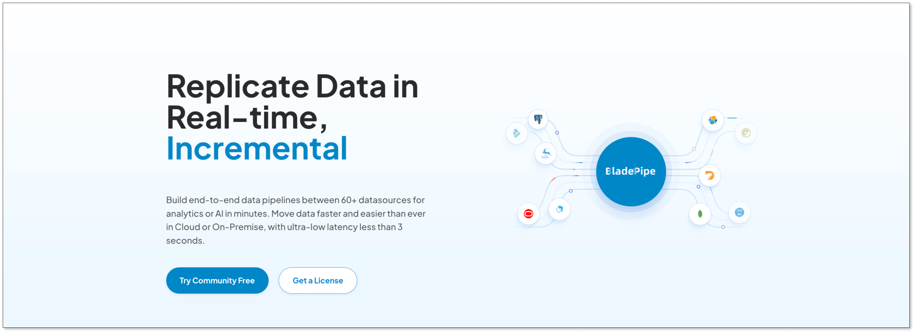
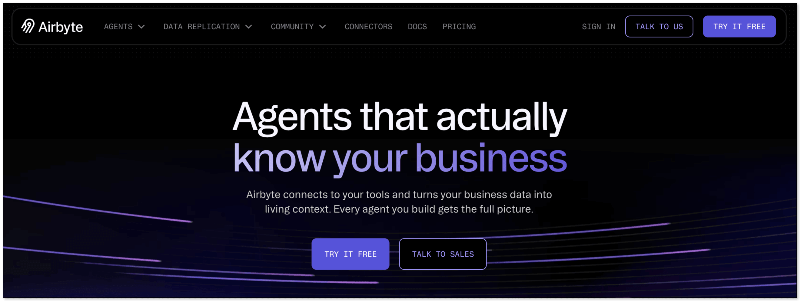
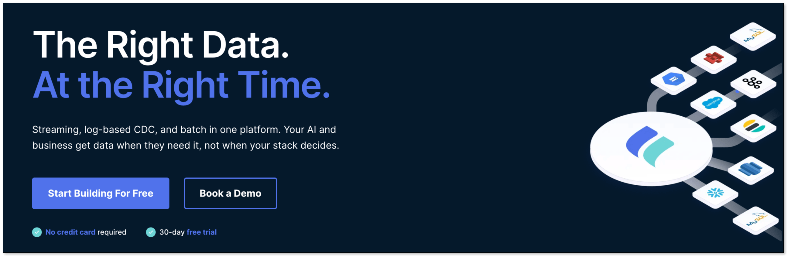
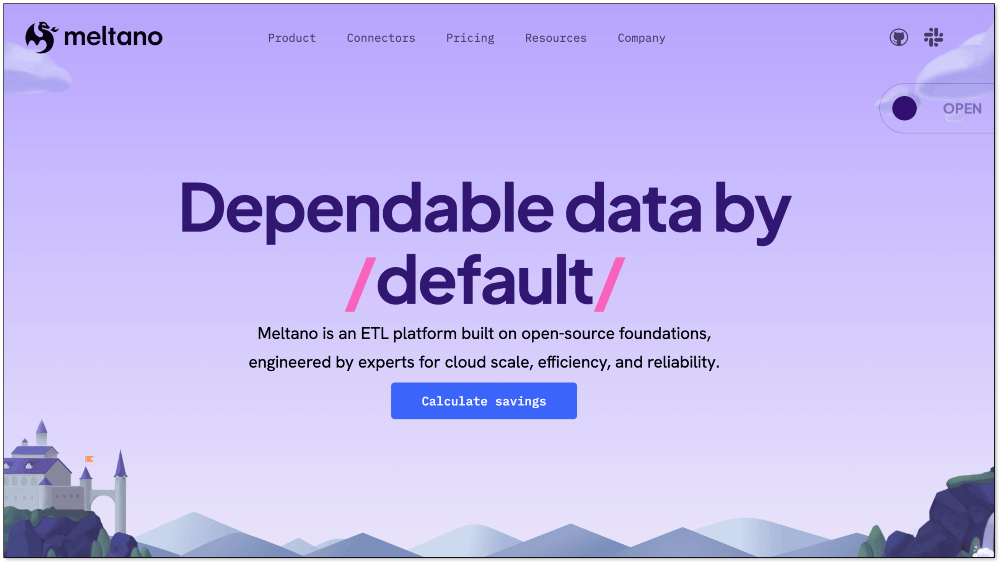
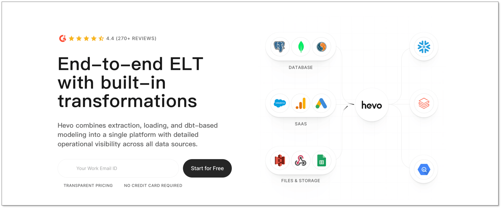

Are you searching for the **best Fivetran alternatives for startups**? You’ve probably spent hours comparing options, only to realize that most recommendations completely miss what startup teams actually need.

The **problem** isn’t that the tools being recommended are bad. It’s that many comparison articles evaluate data pipeline platforms through an **enterprise lens**. They focus on feature depth, connector catalogs, and enterprise-grade governance while ignoring the realities of startup teams. Many options are either **too expensive or too heavy** to maintain for a startup team.

**For startups**, the core challenge is rarely “Which platform has the most advanced enterprise functionality?” The real question is much simpler: Which tool helps you move data reliably without draining your budget, overwhelming your engineering team, or introducing operational complexity you cannot afford to maintain?

That's why we spent days researching and analyzing the most credible Fivetran competitors specifically through a startup lens. These tools are more **affordable, simpler to operate, and much easier to get up and running**.

## What Startups Actually Need From a Fivetran Alternative

Before comparing tools, it’s important to define what matters most for startup teams again. Many early-stage companies make the mistake of evaluating data infrastructure tools using enterprise criteria. This often leads to overpaying for capabilities they do not need.

If you already have hands-on experience with data pipeline tools and know exactly what criteria matter for your team, feel free to jump straight to the [Best Fivetran Alternatives for Startups](#best-fivetran-alternatives-for-startups) section below. If you’re still figuring out what to evaluate, we strongly recommend reading this section first—it will help you make a much better decision.

### 1. Affordable and Predictable Pricing

Pricing flexibility is one of the biggest factors when evaluating cheaper alternatives to Fivetran.

Startups need **transparent pricing models** that scale gradually as data volume grows. Unpredictable billing structures can quickly create budget pressure, especially for teams still validating product-market fit.

The ideal alternative offers pricing that is **simple to forecast** and **proportional to actual business growth**.

### 2. Fast Setup With Minimal Engineering Effort

Startups cannot afford month-long implementation cycles. The best Fivetran alternatives should allow teams to connect databases, warehouses, and SaaS applications quickly with **minimal configuration**.

Rapid deployment means **faster experimentation**, **quicker access to analytics**, and **less engineering time** spent on infrastructure.

### 3. Low Operational Overhead

A startup-friendly solution should not require constant babysitting. Lean engineering teams need **low-maintenance** connectors, reliable sync performance, automatic schema evolution handling, and minimal troubleshooting requirements.

The **less time spent maintaining pipelines**, the more time your team can spend shipping product.

### 4. Scalability for Growth

Even if your current data volume is modest, your infrastructure must scale with growth.

The best startup tools offer **enough scalability** for fast-growing companies without forcing them into enterprise-level pricing or operational complexity too early.

### 5. Essential Functionality Without Enterprise Bloat

Most startups do not need highly advanced governance layers, compliance-heavy configurations, or hundreds of obscure connectors. They need the core capabilities that **solve immediate data movement problems efficiently**.

## Why Fivetran Can Be Overkill for Startups

To be clear, Fivetran is an excellent product. It has earned its reputation through reliability, broad connector coverage, and mature automation.

However, many startup teams discover that Fivetran’s strengths can also become drawbacks depending on their stage.

**The first challenge is pricing.** Fivetran bills per connection using **Monthly Active Rows (MAR)**—the number of *distinct* destination rows that are **inserted, updated, or deleted** in a given month. That makes costs sensitive not just to “data size”, but to **change rate** (frequent updates, hard deletes, history mode, and high sync frequency can all increase billable activity). Since **March 1, 2025**, tiering/discounts moved from the **account level to the connection level**, so adding more connectors can increase baseline spend even if each connector is small. And as of **January 1, 2026**, Standard connections include a **$5/month minimum charge per connection**. (References: Fivetran MAR [pricing FAQ](https://www.fivetran.com/docs/getting-started/mar-pricing-faq) and [pricing updates](https://www.fivetran.com/docs/getting-started/mar-pricing-updates))

**The second issue is complexity** relative to actual startup needs. Many startups pay for enterprise-grade capabilities they rarely use.

**Third**, for small engineering teams, there are often easier implementation paths available through **lighter-weight tools** that prioritize simplicity over feature depth.

**So, is Fivetran worth it for startups?**

- For later-stage scaleups with mature analytics operations, often **yes**.
- For seed-stage and Series A startups, often **no**.

That is why exploring startup-focused Fivetran pricing competitors makes sense.

## Best Fivetran Alternatives for Startups

Here are the strongest alternatives based on startup affordability, implementation simplicity, maintenance requirements, and long-term scalability.

### 1. BladePipe

[BladePipe](https://www.bladepipe.com/) is **one of the easiest Fivetran alternatives** for small engineering teams. It is designed specifically for teams that need reliability without enterprise complexity. It focuses on startup-friendly pricing, rapid deployment, and operational simplicity, making it a strong alternative for lean teams that need production-grade CDC without paying enterprise premiums.

**Best for:** Early-stage and growth-stage startups that want simple, affordable, low-maintenance CDC pipelines.

**Pricing Model:** Based on rows processed ($0.01 per 1 million rows for full data, $10 per 1 million rows for incremental data) or per pipeline for Enterprise. See [BladePipe Pricing](https://www.bladepipe.com/pricing/).

**Free Version:** Free Community edition available for [self-hosted deployments](https://www.bladepipe.com/docs/quick/quick_start/), plus a 90-day cloud(SaaS/BYOC) [free trial](https://www.bladepipe.com/register/).

**Estimated Monthly Cost (10M rows/month with CDC):** $100–$1,000 depending on sync requirements.

**Setup:** One of the fastest implementation paths available—many end-to-end CDC pipelines can be deployed in **~5-10 minutes** (excluding source/target provisioning and network/VPC work).

**Pros:** Predictable pricing, quick deployment, minimal maintenance, startup-oriented simplicity, easy scaling.

**Trade-offs:** Smaller connector ecosystem compared to larger incumbents.

**Startup Fit Score:** 9.5/10

BladePipe is often the strongest option for early-stage teams looking for the easiest implementation.

### 2. Airbyte

Airbyte has become one of the most recognized **open-source alternatives to Fivetran**. Its extensibility makes it attractive for engineering-heavy startups. Its large connector library and active community also make it attractive for teams experimenting with varied data sources.

**Best for:** Technical startups that want flexibility, open-source control, and scalable connector coverage.

**Pricing Model:** Airbyte Core is open-source and self-managed (free). Airbyte Cloud offers managed plans—its Standard tier is volume-based and **starts at $10/month** (Plus/Pro are via sales). See [Airbyte Pricing](https://airbyte.com/pricing).

**Free Version:** Yes (Airbyte Core, self-managed).

**Estimated Monthly Cost:** $0 software cost if self-managed (plus your infra). Airbyte Cloud: **$10/month minimum** on Standard, then scales with usage/credits (see pricing page).

**Setup:** Cloud: create a workspace, configure source/destination + schedule (**~15–60 minutes** for a first pipeline). Self-managed: deploy Airbyte (Docker/Kubernetes) (**~1–3 hours** for a basic Docker deployment; longer if you need Kubernetes, SSO, private networking, and observability).

**Pros:** Open-source flexibility, broad connector ecosystem, strong community.

**Trade-offs:** Operational overhead for self-hosting, occasional connector instability, steeper learning curve.

**Startup Fit Score:** 9/10

Excellent if your team can handle infrastructure complexity.

### 3. Estuary

If low-latency replication is critical, Estuary is a compelling CDC-focused alternative. Its modern architecture is a major advantage over batch-oriented tools, but it requires stronger technical familiarity and may be overkill for teams with simple warehouse sync requirements.

**Best for:** Real-time analytics startups and event-driven data platforms.

**Pricing Model:** Usage-based and publicly documented: **$0.50/GB** data volume + connector fees (**$100/month per connector for the first 6**, then **$50/month** per additional connector; prorated). See [Estuary Pricing](https://docs.estuary.dev/getting-started/pricing/).

**Free Version:** Yes. Free plan supports **up to 2 connectors** and **up to 10 GB/month**; exceeding limits triggers a 30-day free trial. See [Estuary Pricing](https://docs.estuary.dev/getting-started/pricing/).

**Estimated Monthly Cost (example):** 2 connectors + 100 GB/month ≈ $200 (connectors) + $50 (volume) = **$250/month** at list price (before discounts/proration).

**Setup:** Configure a capture (source), materialization (destination), and bindings; then monitor task hours + data volume (**~30–90 minutes** for a first pipeline, assuming credentials/networking are ready).

**Pros:** Real-time streaming architecture, strong CDC performance, modern streaming-first design.

**Trade-offs:** More technical setup, narrower beginner accessibility.

**Startup Fit Score:** 8.7/10

Strong for real-time product analytics use cases.

### 4. Stitch

Stitch is a simpler and more affordable managed alternative. It offers a cleaner onboarding experience than many enterprise-focused ELT platforms and is generally easier for small teams to understand and deploy.

**Best for:** Small startups needing lightweight managed ELT for basic analytics pipelines.

**Pricing Model:** Row-based tiering. Stitch Standard **starts at $100/month** and covers **5–300 million rows/month** (with a built-in pricing slider); Advanced and Premium are higher tiers. See [Stitch Pricing](https://www.stitchdata.com/pricing/).

**Free Version:** 14-day free trial (no credit card required).

**Estimated Monthly Cost:** **$100/month and up**, depending on your configured rows/month tier and add-ons (destinations/rows).

**Setup:** Connect sources + a destination warehouse, choose tables/fields, and set replication frequency/schedule (**~30–60 minutes** for a first pipeline).

**Pros:** Easy onboarding, low friction implementation, clean interface, strong basic connector support.

**Trade-offs:** Limited advanced transformation flexibility, less powerful CDC capabilities. Connector depth and scalability can lag behind premium competitors.

**Startup Fit Score:** 8.2/10

Solid for smaller teams with basic needs.

### 5. Meltano

Meltano takes a fundamentally different approach. Rather than being a turnkey managed platform, it provides an open-source ELT framework built for technical teams that want complete control over orchestration and extensibility. It is highly attractive for engineering-heavy startups with strong DevOps maturity, but absolutely not ideal for teams seeking low-maintenance deployment.

**Best for:** Technical startups with engineering resources and infrastructure ownership preferences.

**Pricing Model:** Meltano Open is open-source and self-managed; Meltano Cloud is a managed offering with usage-based pricing (contact sales / calculator). See [Meltano Pricing](https://meltano.com/pricing).

**Free Version:** Fully open-source.

**Estimated Monthly Cost:** Infrastructure-dependent if self-managed (software is free).

**Setup:** Moderate to advanced—set up a Meltano project, select Singer taps/targets, configure orchestration/runtime (**~1–3 hours** to get a first pipeline running locally; **~0.5–2 days** to productionize with CI/CD, scheduling, secrets, and monitoring).

**Pros:** Open-source control, extensibility, ecosystem flexibility, no vendor lock-in.

**Trade-offs:** Requires maintenance, steeper learning curve, less plug-and-play.

**Startup Fit Score:** 8.4/10

Best if customization matters more than convenience.

### 6. Hevo Data

Hevo is often recommended for teams prioritizing ease of use. Hevo positions itself as a no-code, fully managed data pipeline platform optimized for fast deployment. It appeals strongly to startups because it reduces engineering lift and enables non-specialist data teams to build production pipelines quickly.

**Best for:** Startups prioritizing no-code usability and fast implementation.

**Pricing Model:** Event-based managed pricing. Hevo defines an “event” as each record inserted/updated/deleted in the destination, and plans scale by events/month. See [Hevo Data Pricing](https://hevodata.com/pricing/pipeline/).

**Free Version:** Yes: **Free** includes **up to 1M events/month**.

**Estimated Monthly Cost:** Starter **starts at $299/month** (monthly) or **$239/month** billed annually; higher tiers scale up from there.

**Setup:** Configure source + destination connectors, pick objects/tables, and set sync schedule; Hevo runs as a managed service (**~15–45 minutes** for a first pipeline).

**Pros:** Excellent UI, fast onboarding, low-code experience, managed infrastructure, responsive support.

**Trade-offs:** Pricing may rise quickly with scale, less infrastructure control.

**Startup Fit Score:** 8.8/10

Good for teams without deep data engineering resources.

### 7. Debezium

For technically sophisticated startups, Debezium paired with Kafka Connect represents the ultimate self-managed CDC stack. It delivers exceptional flexibility and deep database replication capabilities. However, this is infrastructure software—not a plug-and-play SaaS. Operational complexity is significantly higher than any managed Fivetran alternative.

**Best for:** Infrastructure-heavy startups building custom CDC systems at scale.

**Pricing Model:** Open-source (Apache 2.0); infrastructure costs only. See https://debezium.io/license/.

**Free Version:** Fully open-source.

**Estimated Monthly Cost:** Depends entirely on infrastructure footprint.

**Setup:** Advanced—deploy Kafka Connect + Debezium connectors, manage offsets/schemas, and operate the cluster (**~0.5–2 days** for an initial production-grade setup, depending on Kafka footprint and security/networking requirements).

**Pros:** Maximum flexibility, enterprise-grade CDC, no per-row vendor pricing.

**Trade-offs:** High maintenance burden, significant DevOps requirements, slower implementation.

**Startup Fit Score:** 7.8/10

Best suited for infrastructure-heavy technical teams.

## Quick Comparison Table: Which Alternative Fits Your Startup?

| Tool      | Billed By (Primary)                  | Free Option                        | Public Starting Price (List) | Managed vs Self-Hosted |
| --------- | ------------------------------------ | ---------------------------------- | ---------------------------- | ---------------------- |
| BladePipe | Rows processed (full vs incremental) | Yes (Community Edition, self-host) | $0 (Community)               | Both                   |
| Airbyte   | Cloud usage/credits; OSS is self-run  | Yes (Airbyte Core, self-host)      | $10/month (Cloud Standard)   | Both                   |
| Estuary   | $/GB + per-connector monthly fee      | Yes (2 connectors + 10 GB/month)   | $0 (Free) / $100 per connector + $0.50/GB | Managed (SaaS)         |
| Stitch    | Rows/month tier                       | 14-day trial                       | $100/month (Standard tier)   | Managed (SaaS)         |
| Meltano   | Self-managed OSS; Cloud is usage-based | Yes (Meltano Open, self-host)      | Public pricing varies (Cloud: usage-based) | Both                   |
| Hevo Data | Events/month                          | Yes (up to 1M events/month)        | $299/month (Starter, monthly) | Managed (SaaS)         |
| Debezium  | Infrastructure only                   | Yes (open-source)                  | $0 software                  | Self-hosted            |

## Which Type of Startup Should Choose Which Tool?

The right choice depends heavily on your team’s context.

If you are a seed-stage startup with one or two engineers, BladePipe or Hevo Data are likely your best options because they minimize implementation burden.

If your product depends on real-time event processing or low-latency replication, Estuary or Debezium may be better suited.

If your highest priority is minimizing cost, open-source options like Airbyte or Meltano deserve serious consideration.

If you need no-code simplicity, BladePipe and Hevo Data offers one of the smoothest experiences.

If you expect aggressive scaling and want a migration path that avoids future re-platforming, BladePipe provides one of the best balances between startup simplicity and long-term growth.

## How to Evaluate a Fivetran Alternative Before Switching

Before migrating away from Fivetran, evaluate each tool across six critical dimensions.

**First, verify connector coverage.** Ensure the platform supports all required databases and SaaS integrations.

**Second**, analyze **pricing** behavior under projected growth scenarios.

**Third, assess latency requirements.** Some tools are optimized for batch sync while others specialize in real-time CDC.

**Fourth, estimate operational overhead.** Ask how much engineering involvement is required to keep pipelines healthy.

**Fifth, review schema evolution support.** Startup systems change rapidly, and your tooling must adapt automatically.

**Finally**, project scaling **costs** over the next 12 to 24 months.

A cheaper tool today can become expensive tomorrow if pricing scales poorly.

## Our Final Verdict: The Best Fivetran Alternatives for Startups

After comparing the market, here is our recommendation.

For the best overall startup balance of affordability, simplicity, and scalability: BladePipe.

For the cheapest flexible option: Airbyte.

For the easiest no-code implementation: Hevo Data.

For the strongest real-time CDC capabilities: Estuary.

For maximum technical control: Meltano.

Most startups do not need the enterprise complexity of Fivetran. They need a solution that gets data flowing quickly, stays affordable as they grow, and does not create operational headaches. That is the real benchmark for choosing the best Fivetran alternative.

## Frequently Asked Questions

### What is the cheapest alternative to Fivetran?

Open-source tools like Airbyte and Meltano are often the lowest-cost options, though they may require more engineering effort.

### Is Fivetran worth it for startups?

It depends on your scale. For early-stage startups, the pricing and complexity often outweigh the benefits.

### What is the easiest Fivetran alternative for small engineering teams?

BladePipe and Hevo Data are among the easiest to implement and maintain.

### Are there no-code Fivetran alternatives for startups?

Yes. Hevo Data and BladePipe both provide startup-friendly low-maintenance experiences.

### What is the best real-time alternative to Fivetran?

Estuary is one of the strongest real-time CDC-focused alternatives.

### Should startups choose open-source over managed alternatives?

Only if they have sufficient engineering resources to manage the additional operational complexity.

For most lean startup teams, managed simplicity usually delivers better ROI.
