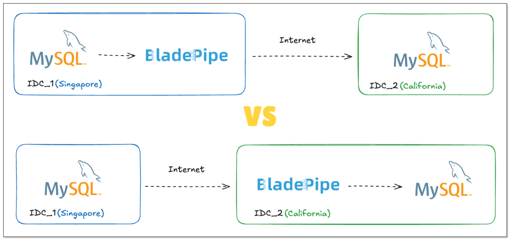
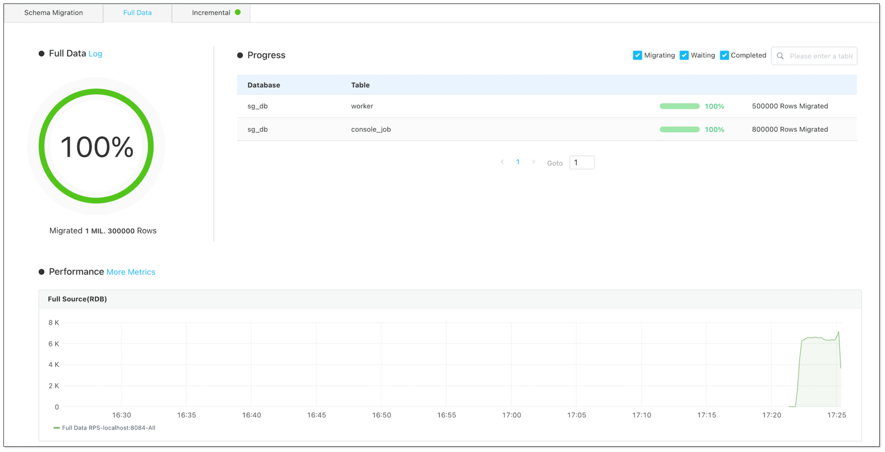
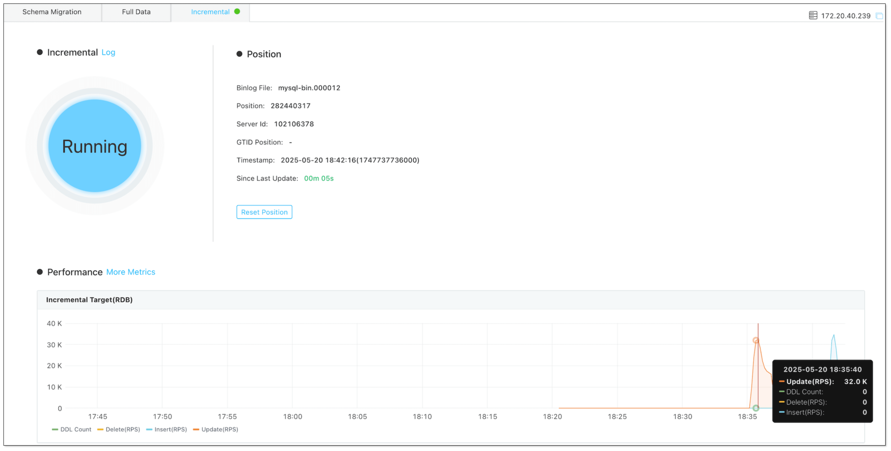
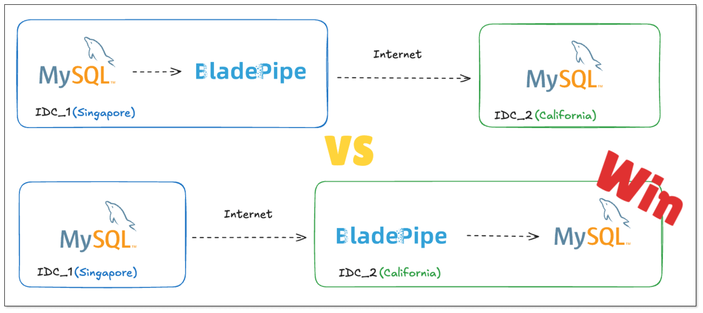

When it comes to moving data across vast distances, particularly between continents, businesses often face a range of challenges that can impact performance. At [BladePipe](https://www.bladepipe.com), we regularly help enterprises tackle these hurdles. The most common question we receive is: **What’s the best way to deploy BladePipe for optimal performance?**

While we can offer general advice based on our experience, the reality is that these tasks come with many variables. This article explores the best practice for intercontinental data migration and sync, blending theory with hands-on insights from real-world experiments.

## Challenges of Intercontinental Data Sync

Intercontinental data migration is no easy feat. There are two primary challenges that stand in the way of fast and reliable data transfers:

- **Unavoidable network latency:** For instance, network latency between Singapore and the U.S. typically ranges from 150ms to 300ms, which is significantly higher compared to the sub-5ms latency of typical relational database INSERT/UPDATE operations.

- **Complex factors affecting network quality:** Factors such as packet loss and routing paths can degrade the performance of intercontinental data transfers. Unlike intranet communication, intercontinental transfers pass through multiple layers of switches and routers in data centers and backbone networks.

Beyond these, it’s critical to consider the load on both the source and target databases, network bandwidth, and the volume of data being transferred.

When using BladePipe, understanding its data extraction and writing mechanisms is essential to determine the best deployment strategy.

## BladePipe Migration & Sync Techniques 

### Data Migration Techniques

For relational databases, BladePipe uses **JDBC-based data scanning**, with support for **resumable migration** using techniques like pagination. Additionally, it supports **parallel data migration**—both inter-table and intra-table parallelism (via multiple tasks with specific filters).

On the target side, since all data is inserted via INSERT operations, BladePipe uses several batch writing techniques:
- Batching
- Spliting and parallel writing
- Bulk inserts
- INSERT rewriting (e.g., converting multiple rows into `insert..values(),(),()`)

### Data Sync Techniques
BladePipe supports different methods for capturing incremental changes depending on the source database. Here’s a quick look:

|  Source Database   |Incremental Capture Method  | 
| ------------ | ----- |
| MySQL   | Binlog parsing   |
| PostgreSQL  |  logical WAL subscription   |
| Oracle | LogMiner parsing | 
| SQL Server | SQL Server CDC table scan      | 
| MongoDB | Oplog scan / ChangeStream  | 
| Redis | PSYNC command      | 
| SAP Hana | Trigger      | 
| Kafka | Message subscription      | 
| StarRocks | Periodic incremental scan  |
| ... | ...|

These methods largely rely on the source database to emit incremental changes, which can vary based on network conditions.

On the target side, unlike data migration, **more operations** (INSERT/UPDATE/DELETE) need to be handled while **order consistency** must be kept in data sync. BladePipe offers a variety of techniques to improve data sync performance:

|  Optimization   | Description  | 
| ------------ | ----- |
| Batching   | Reduce network overhead and help with merge performance   |
| Partitioning by unique key  |  Ensure data order consistency |
| Partitioning by table | Looser method when unique key changes occur | 
| Multi-statement execution | Reduce network latency by concatenating SQL      |
| Bulk load | For data sources with full-image and upsert capabilities, INSERT/UPDATE operations are converted into INSERT for batch overwriting |
| Distributed tasks | Allow parallel writes of the same amount of data using multiple tasks |

## Exploring the Best Practice

BladePipe’s design emphasizes performance optimizations on the target side, which are **more controllable**. Typically, we recommend deploying BladePipe near the source data source to mitigate the impact of network quality on data extraction.

But does this theory hold up in practice? To test this, we conducted an intercontinental MySQL-to-MySQL migration and sync experiment.

### Experimental Setup

**Resources:**

- Source MySQL: located in Singapore (4 cores, 8GB RAM)
- Target MySQL: located in Silicon Valley, USA (4 cores, 8GB RAM)
- BladePipe: deployed on VMs in both Singapore and Silicon Valley (8 cores, 16GB RAM)

**Test Plan:** We migrated and synchronized the same data twice to compare performance with BladePipe deployed in different locations.

### Process

1. Generate 1.3 million rows of data in Singapore MySQL.
2. Use **BladePipe deployed in Singapore** to migrate data to **the U.S.** and record performance. 

3. Make data changes (INSERT/UPDATE) at **Singapore MySQL** and record sync performance.

4. Stop the DataJob and delete target data.
5. Use **BladePipe deployed in the U.S.** to migrate the data again from **Singapore MySQL** and record performance.

6. Make data changes at **Singapore MySQL** and record sync performance again.

### Results & Analysis

|  Deployment Location   |Task Type  | Performance |
| ------------ | ----- |----- |
| Source (Singapore)   |  Migration  | 6.5k records/sec |
| Target (Silicon Valley)   |  Migration   | 15k records/sec|
| Source (Singapore)   |  Sync  | 8k records/sec |
| Target (Silicon Valley)     |  Sync  | 32k records/sec |

Surprisingly, deploying BladePipe at the target (Silicon Valley) significantly outperformed the source-side deployment.    

**Potential Reasons:**    
- Network policies and bandwidth differences between the two locations.
- Target-side batch writes are less affected by poor network conditions compared to binlog/logical scanning on the source side.
- Other unpredictable network variables.

## Recommendations

While the experiment offers valuable insights to intercontinental data migration and sync, real-world environments can differ:
- Production databases may be under heavy load, impacting the ability to push incremental changes efficiently.
- Dedicated network lines may offer more consistent network quality.
- Gateway rules and security policies vary across data centers, affecting performance.

**Our recommendation:** During the POC phase, deploy BladePipe on both the source and target sides, compare performance, and **choose the best deployment strategy based on real-world results**.

