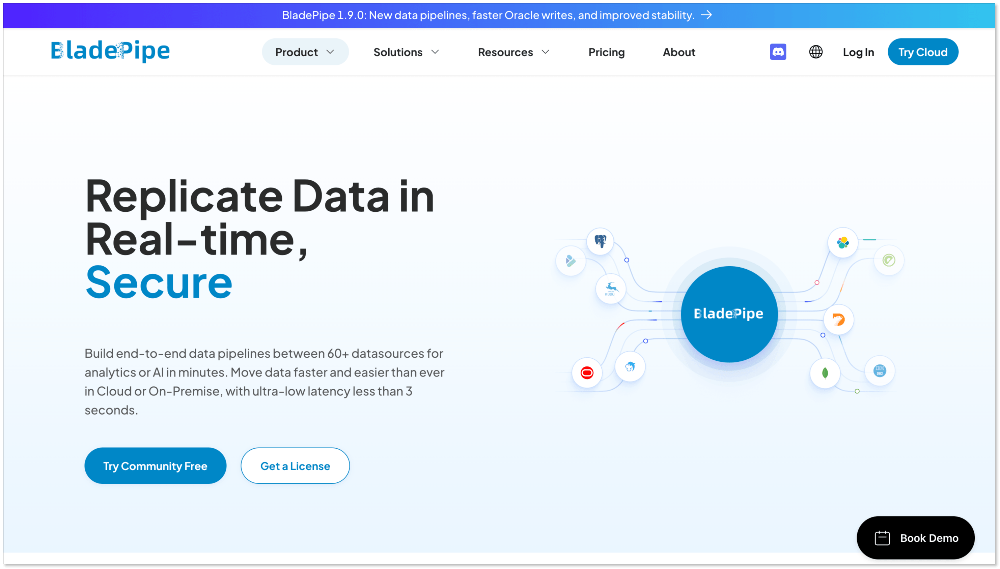
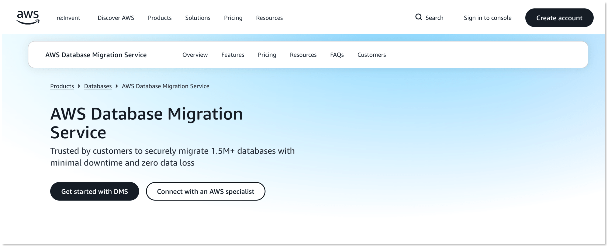
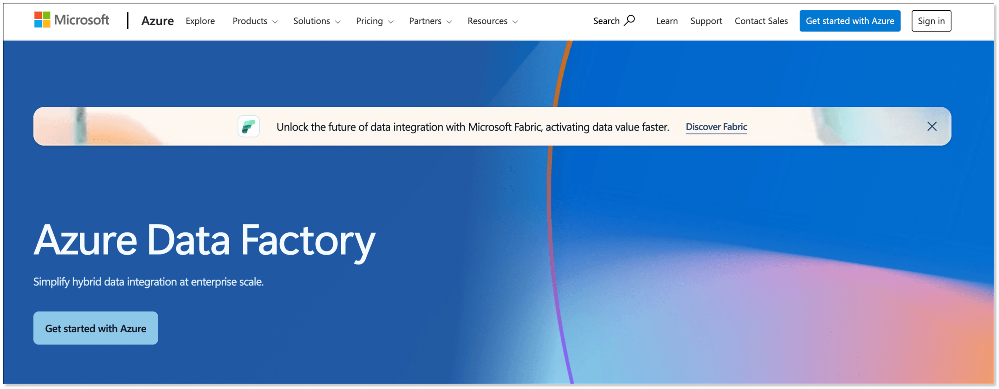
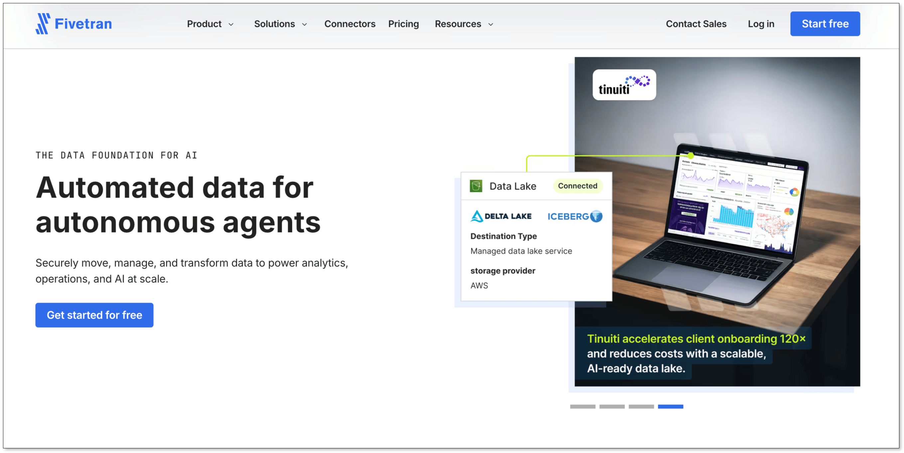
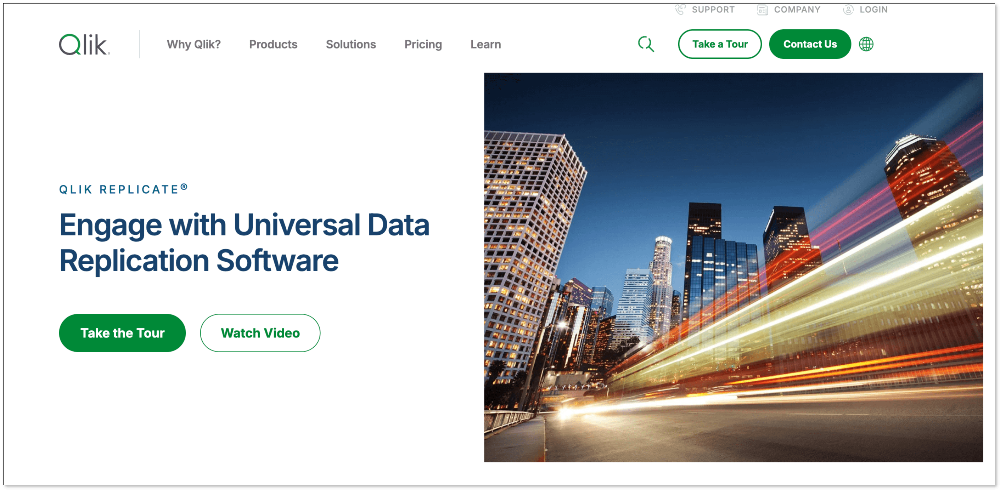
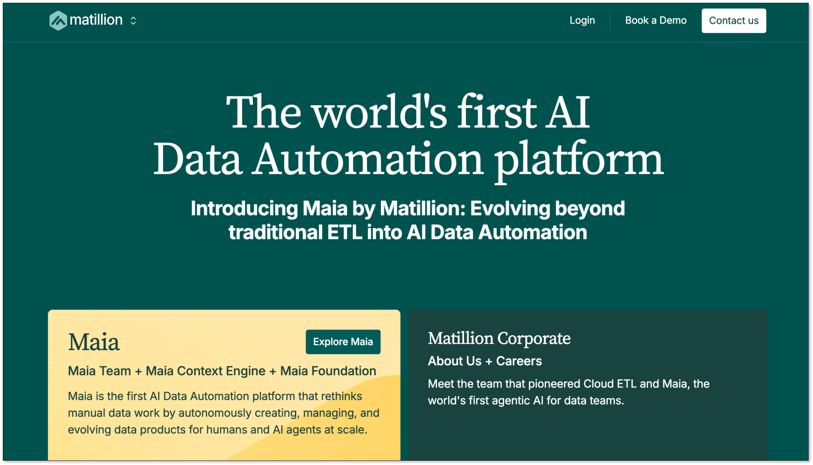
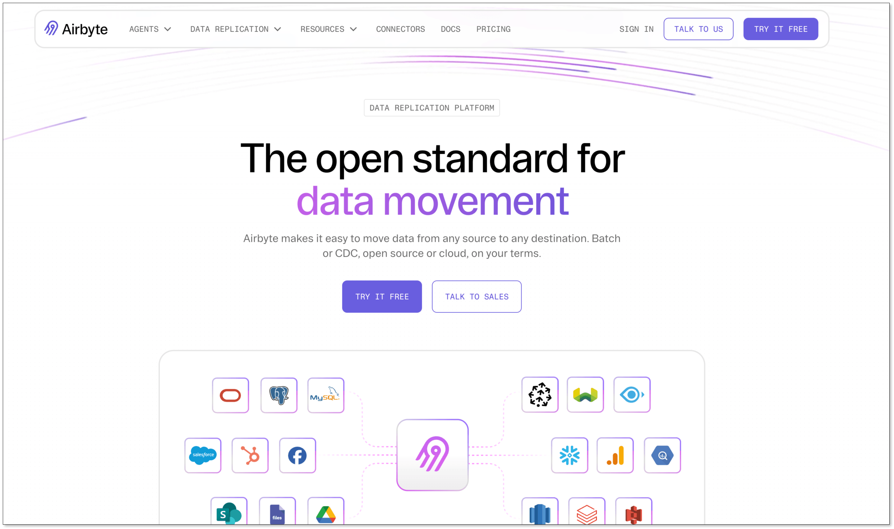

You have decided to move your analytics workloads from [SQL Server](https://www.bladepipe.com/connector/sql-server/) to [Amazon Redshift](https://www.bladepipe.com/connector/redshift/). The next question usually comes quickly: **what is the best way to migrate the data without disrupting existing systems?**

At first glance, SQL Server to Redshift migration may look like a simple data transfer task. Export the tables, load them into Redshift, and you are done, at least that is how it looks on paper.

In real production environments, things are usually more complicated. Large databases may take hours or even days to migrate, business applications continue generating new data, and differences between SQL Server and Redshift can create unexpected issues.

The right migration tool depends on your situation. Do you need a one-time data move or continuous synchronization? Is downtime acceptable? Do you need schema conversion, data validation, or real-time replication?

In this guide, we compare the best SQL Server to Redshift migration tools, including CDC-based replication platforms, cloud migration services, and ETL solutions, to help you choose the approach that fits your workload.

## Why Move Data from SQL Server to Redshift?

Many teams start with SQL Server because it is reliable, familiar, and widely used for business applications. However, as data volumes grow, analytics requirements often become harder to handle within the same operational database.

Running large reports or complex analytical queries directly on SQL Server can compete with application workloads. This is where a cloud data warehouse like Amazon Redshift becomes valuable.

By moving analytical workloads to Redshift, teams can:

- Build centralized data warehouses
- Support BI dashboards and reporting
- Reduce infrastructure management
- Prepare data for [advanced analytics](https://www.bladepipe.com/real-time-analytics/) and machine learning

## Common Approaches to Move Data from SQL Server to Redshift

There are two common approaches for SQL Server to Redshift migration: ETL-based migration and CDC-based replication.

The right approach depends on whether you need a one-time data move or continuous synchronization.

### ETL-based Migration

ETL tools extract data from SQL Server, transform it into a format suitable for Redshift, and load it into the target warehouse.

A typical workflow looks like:

```
SQL Server → Extract → Transform → Load → Redshift
```

This approach works well for historical data migration or scheduled data pipelines where real-time synchronization is not required.

#### Advantages

- Simple migration workflow
- Flexible data transformation
- Suitable for analytics pipelines

#### Limitations

- Data is not continuously synchronized
- Large migrations may require longer downtime
- Keeping source and target consistent during migration can be challenging

Tools such as Azure Data Factory, Matillion, and Airbyte are commonly used for ETL-based workflows.

### CDC-based Migration

Change Data Capture (CDC) captures changes from SQL Server transaction logs and continuously replicates them to Redshift.

Instead of waiting for a complete export and import, CDC allows teams to migrate data while the source database continues running.

A typical workflow looks like:

```
SQL Server → Capture Changes → Replicate → Redshift
```

#### Advantages

- Supports low-downtime migration
- Reduces the risk of data gaps during cutover
- Enables real-time or near real-time data pipelines

#### Limitations

- Requires additional configuration on the source database, such as enabling transaction log access
- Initial setup and monitoring can be more complex than simple batch migration
- Some transformations may require additional processing before loading into Redshift

CDC-based migration is commonly used for production databases where downtime is limited.

Tools such as BladePipe, AWS DMS, Fivetran HVR, and Qlik Replicate support this approach.

## Best SQL Server to Redshift Migration Tools Compared

### 1. BladePipe



**Best for: Low-downtime SQL Server to Redshift migration with automated CDC replication**

[BladePipe](https://www.bladepipe.com/) is a real-time data replication platform that helps teams migrate and synchronize data between SQL Server and Amazon Redshift. 

Instead of building separate workflows for initial migration and ongoing synchronization, BladePipe provides an automated pipeline that covers the entire migration journey. 

With built-in connectors, a no-code configuration experience, and support for multiple deployment options, BladePipe is designed for teams that need a simpler way to move production data with minimal downtime. It also provides advanced capabilities such as visual data transformation, schema evolution, and scalable pipeline management for long-running replication workloads.

#### Pros

- End-to-end migration workflow from initial load to continuous synchronization
- Low-latency replication for production workloads
- No-code pipeline configuration and management
- Flexible deployment options for different infrastructure environments
- Built-in transformation and schema evolution capabilities
- Easy to extend as data sources and workloads grow

#### Cons

- More focused on data migration and replication scenarios than complex ETL workflows with heavy data modeling requirements

#### Pricing

BladePipe offers [3 plans](https://www.bladepipe.com/pricing/):
- **Community**: **Free to use** based on on-premise deployment
- **Cloud**: Pay-as-you-go pricing model. $0.01 per ETL-based million rows and $10 per CDC-based million rows.
- **Enterprise**: License-based pricing model.

### 2. AWS Database Migration Service (AWS DMS)



**Best for: AWS-native SQL Server to Redshift migration**

AWS Database Migration Service (AWS DMS) is a managed migration service provided by AWS. It supports SQL Server sources and Amazon Redshift targets, allowing users to perform both full data migration and ongoing CDC replication.

[AWS DMS](https://www.bladepipe.com/blog/data_insights/aws_dms_vs_bladepipe/) is widely adopted by teams already running workloads on AWS because it integrates naturally with other AWS services. It is often used together with AWS Schema Conversion Tool (AWS SCT) when schema conversion is required.

#### Pros

- Fully managed AWS service
- Supports full load and CDC migration
- Native integration with Amazon Redshift
- No infrastructure management required

#### Cons

- Advanced transformations usually require additional services
- Large-scale migrations may need careful tuning and monitoring
- Best experience is within AWS environments

#### Pricing

AWS DMS follows a pay-as-you-go pricing model, with costs based on replication instance usage and running time.


### 3. Azure Data Factory



**Best for: Microsoft ecosystem users**

Azure Data Factory (ADF) is a cloud data integration service designed for building ETL and data movement pipelines. For SQL Server to Redshift migration, ADF is often used when organizations already rely on Microsoft data services and need a visual way to orchestrate data workflows.

ADF provides connectors, pipeline orchestration, and transformation capabilities, making it a flexible option for batch migration and analytics data pipelines. However, it is generally positioned more as a data integration platform than a dedicated database replication solution.

#### Pros

- Strong SQL Server integration
- Visual pipeline development
- Flexible ETL capabilities
- Good fit for Azure environments

#### Cons

- Requires more pipeline design and maintenance for complex migrations
- Less optimized for continuous database replication
- Works best when combined with other Azure services

#### Pricing

Azure Data Factory uses a consumption-based pricing model, with costs based on pipeline execution, data movement, and integration runtime usage.

### 4. Fivetran HVR



**Best for: Enterprise data replication**

Fivetran HVR is an enterprise data replication platform designed for moving large volumes of data between operational databases and analytical systems. It is commonly used in organizations that require continuous replication from SQL Server and other enterprise databases.

Compared with traditional ETL tools, HVR focuses more on high-volume CDC-based replication, helping enterprises maintain synchronized copies of operational data for analytics and reporting.

#### Pros

- Strong CDC capabilities
- Designed for large-scale replication
- Supports complex enterprise environments
- Good monitoring and management features

#### Cons

- Higher cost compared with many migration tools
- May require more planning for deployment and operation
- More suitable for enterprise-scale needs than simple migrations

#### Pricing

[Fivetran](https://www.bladepipe.com/blog/data_insights/best_fivetran_alternatives_for_startups/) HVR uses enterprise pricing, which is generally more expensive than lightweight migration tools. The final cost depends on data volume, replication workloads, and deployment requirements.

### 5. Qlik Replicate



**Best for: Complex enterprise CDC scenarios**

Qlik Replicate is a log-based CDC replication platform designed for moving data across heterogeneous database environments. It is widely used for enterprise modernization projects where organizations need reliable replication between operational databases and analytics platforms.

For SQL Server to Redshift migration, Qlik Replicate can continuously capture database changes and deliver them to the target system, making it suitable for large production environments with strict availability requirements.

#### Pros

- Mature log-based CDC technology
- Broad database support
- Handles large-scale replication workloads
- Enterprise-grade reliability

#### Cons

- Higher licensing cost for smaller teams
- Requires dedicated management for complex deployments
- May provide more capabilities than needed for simple migrations

#### Pricing

Qlik Replicate uses enterprise pricing and is generally positioned as a higher-cost solution for large-scale replication scenarios. The final cost depends on deployment options, data sources, and replication requirements.


### 6. Matillion



**Best for: Redshift-focused ETL workflows**

Matillion is an ETL platform built for cloud data warehouses, including Amazon Redshift. Instead of focusing on database replication, it helps analytics teams extract data from different sources, transform it, and prepare it for warehouse analysis.

For SQL Server to Redshift migration, Matillion is a good fit when the main goal is building analytics pipelines and applying business transformations during the loading process.

#### Pros

- Strong Redshift integration
- Visual transformation workflows
- Friendly for analytics teams
- Good support for cloud data warehouses

#### Cons

- Requires separate solutions for CDC requirements
- Better suited for analytics engineering than migration operations

#### Pricing

Matillion uses subscription-based pricing, with costs depending on product edition and usage requirements.


### 7. Airbyte



**Best for: Open-source data integration**

Airbyte is an open-source data integration platform that provides connectors for databases, applications, and analytics destinations. It is often considered by teams that want more control over their data pipelines or prefer self-hosted solutions.

For SQL Server to Redshift migration, Airbyte can help build custom ingestion workflows, especially for teams comfortable managing their own infrastructure and pipeline operations.

#### Pros

- Open-source platform
- Self-hosting option
- Large connector ecosystem
- Flexible customization

#### Cons

- Requires more engineering effort
- Connector capabilities vary
- Operational maintenance may be needed

#### Pricing

[Airbyte](https://www.bladepipe.com/blog/data_insights/best_airbyte_alternatives/) offers a free open-source edition and paid cloud options. Pricing depends on deployment method and usage.

## SQL Server to Redshift Migration Tools Comparison

| Tool | Approach | CDC Support | Deployment | Key Strength | Pricing |
| --- | --- | --- | --- | --- | --- |
| BladePipe | Full Load + CDC Migration | Yes | Cloud / Self-hosted / Hybrid | Automated migration from full load to continuous sync | Free / Paid |
| AWS DMS | Full Load + CDC Migration | Yes | Cloud (AWS Managed) | AWS-native database migration | Usage-based |
| Azure Data Factory | ETL | Limited | Cloud (Azure Managed) | Flexible data integration and transformation workflows | Consumption-based |
| Fivetran HVR | CDC-based Replication | Yes | Self-hosted / Cloud VM | Enterprise-scale data replication | Paid |
| Qlik Replicate | CDC-based Replication | Yes | Self-hosted | Enterprise-grade log-based replication | Paid |
| Matillion | ELT | Limited | Cloud / SaaS | Redshift-focused analytics workflows | Subscription |
| Airbyte | ELT / Data Integration | Depends on connector | Cloud / Self-hosted | Open-source and customizable pipelines | Free / Paid |

## How to Choose the Right SQL Server to Redshift Migration Tool?

The right choice depends on your migration goals, data volume, infrastructure environment, and whether you need ongoing synchronization.

| Scenario | Recommended Tools |
| --- | --- |
| Need minimal downtime migration from a production SQL Server database | BladePipe, AWS DMS, Qlik Replicate, Fivetran HVR |
| Already using AWS infrastructure | AWS DMS |
| Need ETL pipelines with complex transformations | Azure Data Factory, Matillion |
| Need enterprise-grade CDC replication | BladePipe, Qlik Replicate, Fivetran HVR |
| Prefer open-source and self-hosted solutions | Airbyte |
| Need both initial migration and continuous synchronization | BladePipe, AWS DMS |
| Small teams with limited budget | BladePipe, Airbyte |

## Best Practices for SQL Server to Redshift Migration

A successful SQL Server to Redshift migration requires more than selecting the right tool. Differences between the source and target systems, migration timing, and data validation strategy can all affect the final result.

Here are some practical considerations to keep in mind before and during migration.

### Understand schema differences before migration

SQL Server and Amazon Redshift are built for different workloads, so their database designs are not always directly compatible.

Before moving data, teams should review how SQL Server objects map to Redshift, especially for complex schemas and application-specific logic.

For simple migrations, automated schema conversion may be enough. For more complex environments, additional manual adjustments may be required before loading data into Redshift.

### Plan initial load and ongoing synchronization together

For small databases, a one-time export and import may be sufficient. However, production SQL Server databases usually continue receiving new data during migration.

In these scenarios, separating the migration into two phases can reduce downtime risk:

1. Perform the initial data load from SQL Server to Redshift
2. Capture ongoing changes using CDC
3. Validate that both systems are synchronized
4. Switch workloads to Redshift

This approach allows teams to migrate large databases while keeping the source system available.

### Validate data after migration

Moving data successfully does not always mean the migration is complete. Data validation helps ensure that no records are missing or incorrectly transformed during the process.

Teams should verify:

- Row counts between source and target tables
- Data samples for critical business tables
- Key metrics used in reporting
- Query results after migration

For large-scale migrations, automated validation and reconciliation features can significantly reduce manual checking.

### Optimize Redshift after loading data

SQL Server and Redshift use different approaches to optimize queries. A schema design that works well in SQL Server may not perform well in Redshift.

After migration, teams should review Redshift-specific configurations, including distribution keys, sort keys, table design and query workloads

Performance tuning after migration helps ensure that Redshift can deliver the expected analytics performance.

## Conclusion
A successful SQL Server to Redshift migration depends on more than moving data from one system to another. Migration speed, downtime, data consistency, and long-term maintenance all rely on choosing an approach that matches your workload.

ETL and ELT tools are often a good fit for batch data loading and analytics workflows. For production databases that require minimal disruption, full load combined with CDC can provide a smoother migration path by keeping data synchronized throughout the transition.

For teams looking for an automated SQL Server to Redshift migration workflow, **BladePipe** provides an automated workflow from initial load to continuous synchronization, plus features like schema evolution, data transformation, and flexible deployment options.

Ready to see how SQL Server data is moved to Redshift in minutes? [Try BladePipe for free](https://www.bladepipe.com/login/).

## FAQ

**Q: What is the best tool to migrate SQL Server to Redshift?**

The best tool depends on your migration requirements.

For low-downtime production migration, CDC-based tools such as BladePipe is commonly used because it can keep SQL Server and Redshift synchronized during the transition.

For ETL or ELT workflows, tools like Azure Data Factory, Matillion, and Airbyte may be a better fit when data transformation is a major requirement.

**Q: What is the difference between ETL and CDC migration for SQL Server to Redshift?**

ETL migration typically extracts data from SQL Server, transforms it, and loads it into Redshift. It works well for batch migrations, scheduled pipelines, and scenarios where real-time synchronization is not required.

CDC-based migration captures changes from SQL Server transaction logs and continuously replicates them to Redshift. It is more suitable for production migrations that require lower downtime and ongoing synchronization.

**Q: Does SQL Server to Redshift migration require coding?**

It depends on the migration tool.

Traditional ETL workflows may require building and maintaining data pipelines. BladePipe provides a no-code configuration experience, allowing teams to create and manage SQL Server to Redshift migration tasks through a visual interface without writing complex migration scripts.


**Q: What is the difference between BladePipe and AWS DMS for SQL Server to Redshift migration?**

Both BladePipe and AWS DMS support full load migration and CDC replication.

AWS DMS is a managed AWS service that works well for teams already using AWS infrastructure. BladePipe focuses more on an automated migration experience, providing features such as no-code pipeline configuration, visual data transformation, schema evolution, and flexible deployment options.

**Q: What should I consider before choosing a SQL Server to Redshift migration tool?**

Key factors include:

- Migration downtime requirements
- Data volume and replication frequency
- Schema conversion needs
- Deployment requirements
- Data transformation complexity
- Whether ongoing synchronization is required

For teams that need continuous replication and production-ready migration capabilities, CDC-based tools are often a better fit than traditional batch migration solutions.
