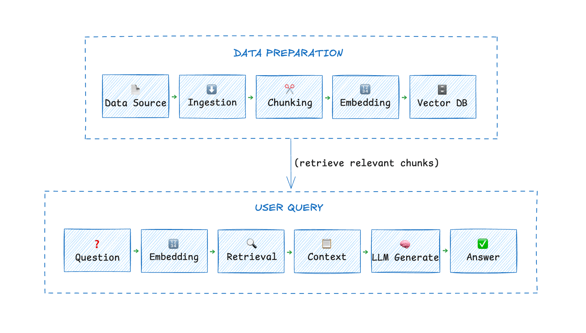

You trained a model. It scores 0.98 on your test set. You deploy it. Within a week, predictions drift, recall drops, and someone discovers the training data never included records from the Asia region.

The model wasn't the problem. The **data pipeline** was.

Most AI initiatives fail not because of weak models, but because data pipelines break in ways teams didn't anticipate. This guide cuts through the vendor talk and tells you what actually goes wrong and how to fix it.

## Why Your AI Project Is Probably Sitting on Bad Data

Here's what happens when you try to feed raw operational data into an ML system:

**Dates arrive in three formats.** Your CRM uses YYYY-MM-DD. Your payment processor uses MM/DD/YY. Your logs use Unix timestamps. The model sees "01/02/2023" and can't tell if that's January 2nd or February 1st.

**Fields go missing.** Not occasionally-systematically. Your checkout flow logs user email 90% of the time. The other 10%, some JavaScript fails silently and you get nulls. Your fraud model learns that null emails correlate with legitimate transactions because the data looks that way. It doesn't. It's just broken instrumentation.

**Your "ground truth" is yesterday's news.** You train on data labeled last quarter. But user behavior changed last week. The model keeps recommending winter coats because that's what the training data says. It's June.

These aren't edge cases. They're the default state of production data.

## AI Data Pipeline: What It Actually Is

Forget the diagrams with boxes and arrows and pretty layers. An AI data pipeline is one thing: **infrastructure that prevents your model from eating garbage.**

It moves data from source systems to your model while doing three things:

- Removing the crap
- Standardizing what's left
- Delivering it before it's stale

If it fails at any of these, your model fails.

## The AI Data Pipeline Components That Matter

Most pipeline architectures overcomplicate this. Here's what you actually need to care about.

### Data Sources Are Where Your Problems Start

You're pulling from:

- Transactional DBs (MySQL, Postgres)
- SaaS platforms (Salesforce, HubSpot)
- Event streams (Kafka, Segment)
- Logs (CloudWatch, Datadog)

Each speaks a different dialect. Each updates on its own schedule. Each has its own failure modes. Your pipeline's job isn't to celebrate this diversity-it's to hide it from your model.

### Ingestion: Batch Is Dead for AI

If you're still running nightly batch jobs to feed your recommendation engine, you're building a 2015 system.

Real-time AI requires real-time data. A user buys a product. Your model should stop recommending that product immediately, not tomorrow.

[**Change Data Capture (CDC)**](change_data_capture_cdc.md) is the mechanism here. Tools like Debezium or BladePipe read your database transaction logs directly. When a row updates, the pipeline knows within milliseconds. No batch queries. No performance hit on your source DB.

### Processing: Where Data Goes to Die or Get Cleaned

This stage is where most engineering time disappears. You'll handle:

**Deduplication.** Your event stream fired twice for the same user action. Now your model thinks that user is twice as engaged as they really are.

**Format normalization.** That date problem? Solved here. Convert everything to a single standard before the model sees it.

**Missing value strategy.** Drop the row? Impute with mean? Flag as explicitly missing? The choice matters and depends on your use case.

**Bias detection.** Your training data is 80% desktop users because mobile tracking was broken for six months. The pipeline should catch this imbalance before you train on it.

**Feature engineering.** Raw data rarely goes straight into models. You're generating embeddings, encoding categoricals, creating aggregates. This isn't optional.

### Storage: Warehouses, Lakes, and Vector DBs

Once processed, data lands somewhere:

- **Warehouses** (Snowflake, BigQuery) for structured analytics
- **Data lakes** (S3, ADLS) for raw storage
- **Vector databases** (Pinecone, Milvus) for embeddings and similarity search

RAG systems depend on vector DBs. Document chunks become embeddings. Queries retrieve relevant chunks via vector similarity. Without this layer, your LLM is **guessing** based on its training data, not your actual knowledge base.

## Batch vs Real-Time: Stop Pretending You Need Both Equally

Here's the truth: most AI workloads don't need true real-time. They need **fresh enough.**

- Fraud detection: real-time required
- Recommendation engines: near-real-time (seconds to minutes)
- Churned customer prediction: batch (daily) is fine
- Marketing audience segmentation: batch is fine

Design for your actual latency requirements. Real-time pipelines cost more to build and maintain. Don't pay that cost unless you have to.

## Case Study: RAG Systems Are Just Data Pipelines With LLMs Attached

RAG (retrieval-augmented generation) looks fancy. It's not.

**Documents → Ingest → Chunk → Embed → Vector DB → LLM**



That's a [RAG data pipeline](https://www.bladepipe.com/ai-rag/). The LLM is just the final consumer.

Here's what breaks in production:

**Document updates.** You add a new policy document. If your pipeline doesn't re-ingest it, the LLM answers based on the old policy.

**Deletions.** You remove a product. If the vector DB still has its embeddings, the LLM might still recommend it.

**Versioning.** You have three conflicting versions of the same document. Which one does the pipeline prioritize?

These aren't LLM problems. They're data pipeline problems.

A working [RAG implementation](https://www.bladepipe.com/blog/ai/ragapi_ollama/) using CDC might look like:

1. MySQL captures document changes
2. Pipeline streams changes to processing service
3. Service re-chunks and re-embeds updated content
4. Vector DB updates or removes affected vectors
5. LLM queries always see current state

## Three AI Data Pipeline Use Cases

### AI Copilots

Your internal AI assistant needs access to:

- HR policies (in Google Docs)
- Engineering docs (in Notion)
- Customer tickets (in Zendesk)
- Product data (in PostgreSQL)

Each updates differently. Each has different access patterns. A pipeline that syncs all these to a unified index lets the copilot answer questions based on live data, not last week's export.

### Recommendation Engines

Netflix doesn't recommend shows based on what you watched yesterday. They recommend based on what you watched 30 minutes ago.

Real-time user activity streams into feature stores. Models score items against fresh user state. Recommendations update continuously.

The pipeline: clickstream → Kafka → Flink aggregation → feature store → model inference.

### Fraud Detection

Transaction occurs. You have 200ms to decide: approve or block.

The model needs:

- User's transaction history (from DB)
- Device fingerprint (from real-time stream)
- Velocity checks (aggregated over last 5 minutes)
- Global fraud patterns (updated hourly)

All this must arrive within the latency budget. That's a pipeline problem, not a model problem.

## Building AI Data Pipelines: Three Approaches

There is no single "correct" stack for building AI data pipelines. Organizations typically choose among three approaches depending on their scale and engineering capacity.

### Option 1: Open Source Stack

- **Ingestion**: Debezium + Kafka
- **Processing**: Spark Structured Streaming or Flink
- **Storage**: Iceberg on S3 + Milvus
- **Orchestration**: Airflow

**Pros:** Full control, no vendor lock, massive community

**Cons:** You now run a distributed systems team. Hope you're hiring.

### Option 2: Managed Cloud Services

- **Ingestion**: AWS DMS + Kinesis
- **Processing**: Glue or EMR
- **Storage**: S3 + Redshift + Pinecone
- **Orchestration**: Step Functions

**Pros:** Less operational overhead, integrates with cloud ecosystem

**Cons:** Vendor-specific, can get expensive at scale, some lock-in

### Option 3: Commercial Platforms

Another option is specialized pipeline platforms such as [**BladePipe**](https://www.bladepipe.com/). These systems focus on moving data from operational databases into downstream systems using real-time synchronization technologies such as CDC.

**Pros:** Fastest to implement, minimal engineering investment

**Cons:** Cost, potential data gravity, less flexibility

BladePipe offers both [self-hosted and cloud versions](https://www.bladepipe.com/pricing/). The recently launched **Community Edition** is completely [free-deploy locally with one click](https://www.bladepipe.com/docs/productOP/onPremise/installation/install_all_in_one_docker/) and see if the architecture fits. If you'd rather walk through it with a technical expert, just hit the **Book Demo** button at the bottom-right corner of the page. No sales pitch, just a working pipeline.

This approach is often used by teams that want real-time pipelines without building their own streaming infrastructure.

## Example Implementation

### MySQL Changes → AI Search Index

To make the discussion concrete, consider a simple but common scenario: A company wants to power an AI search system using product data stored in MySQL.

Whenever the product table changes, the search index must update automatically.

### Step 1: Capture Database Changes

Enable MySQL binlog and stream changes:

```sql
binlog_row_image = FULL
binlog_format = ROW
```

This tells MySQL to write every row change to its binary log with complete before-and-after data.

A [CDC tool](top_cdc_tool.md) reads binlog events and converts them into structured change events.

Example event:

```json
{
  "table": "products",
  "operation": "UPDATE",
  "id": 123,
  "price": 19.99
}
```

That's it. No complex API calls. No `SELECT * FROM products WHERE updated_at > last_run`. Just the change, as it happens.

### Step 2: Transform Data for Search

Raw database rows aren't what your search index needs. You need searchable documents, and if you're doing semantic search, you need embeddings.

Pseudo-code for the transform:

```python
def transform(event):
    # Load the full product from your DB or cache
    product = load_product(event.id)

    # Build a searchable document
    document = {
        "id": product.id,
        "title": product.name,
        "description": product.description,
        "price": product.price
    }

    # Generate embedding for semantic search
    # This turns text into vectors for similarity matching
    document.embedding = embedding_model.encode(
        f"{product.name} {product.description}"
    )

    return document
```

The embedding step is what makes this "AI search" rather than just keyword matching. Users can query "comfy shoes for running" and get relevant products even if those exact words aren't in the description.

### Step 3: Update the Search Index

Last step: push the transformed document to wherever queries hit.

```python
# Elasticsearch
index.update(document.id, document)

# Or vector DB
vector_db.upsert(
    id=document.id,
    vector=document.embedding,
    metadata=document
)
```

That's the pipeline. Now every product update flows through automatically:

1. Staff updates price in admin panel (MySQL row changes)
2. CDC captures the change within milliseconds
3. Transform service regenerates the document and embedding
4. Search index updates instantly

No cron jobs. No manual exports. No "please wait 24 hours for search to reflect new prices."

**Cost of building this yourself:** weeks of engineering time to handle failures, schema changes, backfills, and scaling.

**Cost of using a platform:** configuration and maybe a credit card.

**Try BladePipe:** the cloud version gives you a [**90-day trial**-**no credit card**](https://www.bladepipe.com/register/) required. Prefer to keep things local? The Community Edition [deploys in one click](https://www.bladepipe.com/docs/productOP/onPremise/installation/install_all_in_one_docker/) and stays **free**. Either way, you're running in minutes, not weeks.

## What Actually Breaks in Production

Things the diagrams don't show you:

**Schema changes.** Your DB adds a column. The pipeline breaks because it expected six fields and got seven.

**Backfills.** You fix a tracking bug and now have 2 million historical events to reprocess. Your pipeline falls over.

**Data skew.** One customer generates 80% of your events. Your partitioning strategy fails and that shard melts.

**Late-arriving data.** Mobile devices sync hours later. Your real-time pipeline marked those users as inactive, then suddenly they're active again with old timestamps.

Build for these failure modes or don't bother building at all.

## The Bottom Line

If your AI system depends on static datasets, it will slowly become wrong.

Documents change. Users change. Products change.

The model may stay the same. The **data pipeline cannot**.

Production AI systems are not just model deployments. They are **continuous data synchronization systems with models attached**.