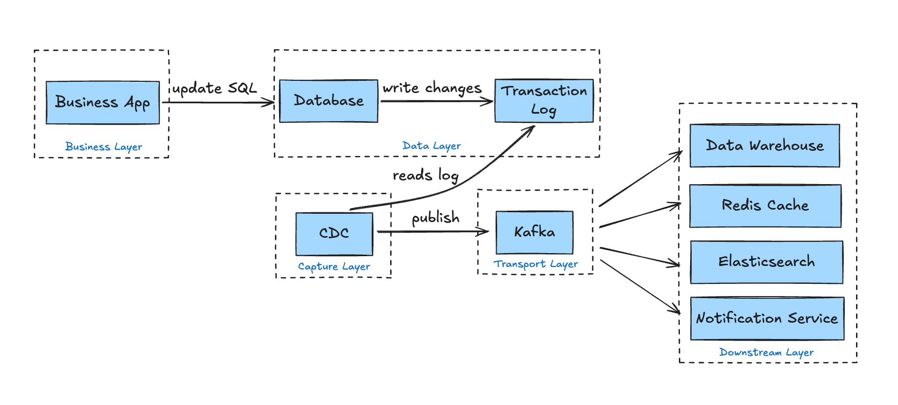
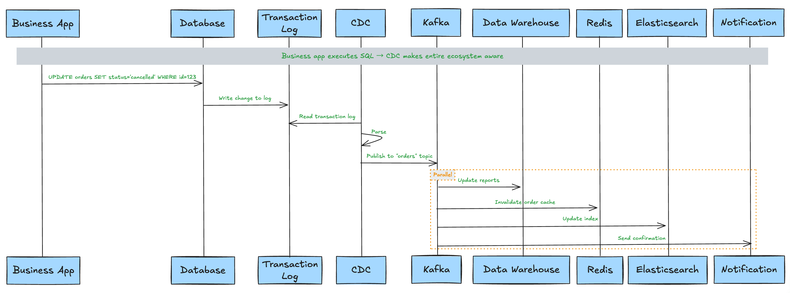

If you work in data engineering, analytics, or platform architecture, you've probably searched **"what is CDC"** or **"what does CDC stand for"** at some point.

In data systems, **CDC stands for Change Data Capture** - not the Centers for Disease Control. In databases, **Change Data Capture (CDC)** refers to the process of identifying, capturing, and delivering changes (inserts, updates, deletes) made to data in real time or near real time.

This guide explains:

- [**What is Change Data Capture in a database**](#what-is-change-data-capture-cdc)
- [How **CDC in database systems** actually works](#how-does-change-data-capture-work)
- [Different **change data capture techniques**](#methods-of-change-data-capture)
- [How CDC fits into **data pipelines and data warehouses**](#cdc-in-etl-and-elt-pipelines)
- [Common **change data capture use cases**](#common-change-data-capture-use-cases)
- [How to choose the right **change data capture tool**](#how-to-choose-a-production-grade-change-data-capture-tool)

Whether you're building a modern **CDC data pipeline**, syncing an OLTP system to a warehouse, or planning zero-downtime migration, this pillar guide will give you the full picture.

## What Is Change Data Capture (CDC)?

At its core, **Change Data Capture (CDC)** is a method for tracking and delivering changes made to a database.

Instead of repeatedly copying entire tables (full loads), CDC captures only the data that changed - and sends those changes downstream.

In the context of a database, **CDC in database systems** means: Monitoring insert, update, and delete operations and converting them into structured change events for downstream systems.

So if you're asking:

- **What is CDC in database?**
- **What is CDC in data systems?**
- **What is change data capture?**

The answer is simple: CDC is incremental data synchronization powered by change detection.

### What Does CDC Produce?

One critical detail many articles miss:

**CDC does not just move rows - it produces change events.**

Each event typically includes:

- Operation type (INSERT, UPDATE, DELETE)
- Before and/or after values
- Transaction metadata
- Timestamp
- Log position (LSN, binlog offset, etc.)

This makes CDC the foundation of:

- Real-time data pipelines
- Event-driven architectures
- Data warehouse synchronization
- Database replication systems

## Why Change Data Capture Matters in Modern Architectures

Modern systems demand **real-time data movement**, not overnight batch syncs.

Here's why **change data capture solutions** have become essential.

### [Real-Time Analytics](https://www.bladepipe.com/real-time-analytics/)

Traditional ETL runs hourly or daily.

CDC enables:

- Near real-time dashboard updates
- Streaming metrics
- Operational analytics

This is especially critical for SaaS platforms, fintech, e-commerce, and logistics systems.

### Data Warehouse Synchronization

**The most mature use case for CDC? Keeping data warehouses continuously updated.**

Instead of: Full table copy every night

You get: Continuous incremental sync

This reduces cost, latency, and compute load.

### Reduced System Load vs Full Loads

Full reloads:

- Lock tables
- Increase IO pressure
- Cause replication lag
- Waste compute resources

CDC captures only what changed, dramatically reducing overhead.

### Microservices & Event-Driven Systems

In distributed architectures:

- Services need real-time state propagation.
- Caches must stay synchronized.
- Event streams need reliable change events.

CDC is often used to publish database changes into streaming platforms like Kafka.

## How Does Change Data Capture Work?

If you're searching **"how change data capture works"**, here's a practical, architecture-level breakdown of the typical CDC workflow.



Although different **change data capture techniques** exist, most implementations follow the same five high-level stages.

### **Step 1: A Data Change Occurs**

An application executes a SQL statement such as: `INSERT/UPDATE/DELETE`

For example:

```sql
UPDATE orders SET status='cancelled' WHERE id=123;
```

At this moment, different CDC implementations begin to capture the change in different ways:

- **Log-Based CDC:** Before a transaction is finalized, the database writes the change into its **transaction log** (WAL, binlog, redo log, etc.). This log exists to guarantee durability and crash recovery. A CDC tool later reads from this log.

- **Query-Based CDC:** The business table must maintain a timestamp column such as last_updated. Changes are detected later by querying:

  ```sql
  SELECT * FROM orders WHERE last_updated > last_checkpoint;
  ```

- **Trigger-Based CDC:** A database trigger is activated during the modification and writes the change into a dedicated change log table.

### **Step 2: The CDC Connector Captures the Change**

Once changes exist in the database, a CDC connector retrieves them. Again, the capture mechanism depends on the approach.

- **Log-Based CDC:** The connector works by acting as replication clients to read transaction logs - such as MySQL's binlog, PostgreSQL's WAL via logical replication slots, or SQL Server's transaction log.

- **Query-Based CDC:** The connector periodically executes queries such as:

  ```sql
  SELECT * FROM table WHERE last_updated > last_run;
  ```

- **Trigger-Based CDC:** The connector reads from a shadow change table populated by database triggers.

### **Step 3: Parsing and Event Transformation**

Raw changes - especially from binary logs - are not yet usable. They must be parsed and transformed into structured events. Taking the log-based CDC as an example, the binary logs are parsed like this:

```json
{
  "op": "u",              
  "ts_ms": 1643728900123, 
  "source": {
    "db": "shop",
    "table": "orders"
  },
  "before": {
    "id": 1001,
    "status": "pending",
    "amount": 299.99
  },
  "after": {
    "id": 1001,
    "status": "paid",
    "amount": 299.99
  }
}
```

Where:

- `op` indicates operation type (c=insert, u=update, d=delete, r=snapshot read)
- `before` represents previous state
- `after` represents new state
- Metadata preserves ordering and source information

This transformation step converts low-level database logs into standardized change events - the foundation of a modern **CDC data pipeline**.

### **Step 4: Events Are Published to a Message Queue**

Once structured, events are typically sent to a messaging or streaming system such as Apache Kafka.

Common characteristics:

- Each table maps to a topic
- Events maintain ordering guarantees
- Offsets track delivery progress
- Consumers can replay events if needed

### **Step 5: Downstream Systems Consume the Events**

Various systems subscribe to the relevant topics and react independently:

- **Data warehouses** update analytical tables in near real time
- **Caches (e.g., Redis)** refresh or invalidate keys
- **Search engines (e.g., Elasticsearch)** update indexes
- **Microservices** trigger business workflows

This is where CDC becomes more than replication - it becomes infrastructure for distributed systems.

### **An Example**



Let's walk through a scenario. A user cancels an order in an e-commerce platform. The application executes:

```sql
UPDATE orders SET status='cancelled' WHERE id=123;
```

Here's the CDC workflow behind the scenes:

1. **Database**: Writes the UPDATE into the transaction log.
2. **CDC Connector**: Reads the log entry. Extracts:
   
   before: `{id: 123, status: 'paid'}`
   
   after: `{id: 123, status: 'cancelled'}`
3. **Message Queue**: Publishes the update event to the `orders` topic.
4. **Downstream Systems React:**
   
   Data warehouse updates reporting tables.
   
   Cache invalidates or refreshes order 123.
   
   Search index updates order status.
   
   Inventory service restores stock.
   
   Notification service may send confirmation.

The business application does nothing special. It simply executes the UPDATE statement. CDC ensures the entire data ecosystem becomes aware of that change.

**Summary:** 

The working principle of **Change Data Capture (CDC)** can be summarized as: A CDC system reads database transaction logs (or alternative change sources), converts each data change into structured events, and reliably distributes those events to downstream systems through message queues.

The core advantage is that business systems only need to focus on their own database operations, while CDC makes the entire technical ecosystem "aware" of these changes.

## Methods of Change Data Capture

There are multiple **change data capture techniques**, but not all of them provide the same reliability, scalability, or performance characteristics. Below are the four primary methods used in real-world systems.

### 1. Log-Based CDC (Recommended)

This is the most robust and scalable form of **change data capture**

**How it works:** All database modifications are recorded in transaction logs (such as MySQL's binlog, PostgreSQL's WAL, SQL Server's transaction log). The log- based CDC tools act as "log readers," parsing these logs in real time.

**Characteristics:**

- **Non-intrusive**: No schema changes, no triggers, no modifications to business tables
- **Low latency**: Changes are captured in near real time (often milliseconds)
- **Complete information**: Access to before/after values and transaction metadata
- **Minimal performance impact**: Logs are already written by the database for durability

This approach underpins modern CDC platforms such as [BladePipe](https://www.bladepipe.com/) and Debezium and represents the current industry standard for scalable **CDC in database systems**.

### 2. Trigger-Based CDC

This method relies on database triggers to intercept changes.

**How it works:** Create triggers on tables. When INSERT/UPDATE/DELETE operations occur, the trigger writes the changes to a separate change table.

**Characteristics:**

- Works when transaction log access is unavailable

- **Performance overhead**: Triggers execute within the transaction path
- **Operational complexity**: Each table requires trigger maintenance
- **Business risk**: Trigger failures can affect primary transactions
- Hard to scale across many tables

While functional, this method is rarely recommended for modern high-throughput systems.

### 3. Query-Based CDC

This method was common in early [ETL tools](https://www.bladepipe.com/blog/data_insights/best_etl_tool_for_small_business/) and is sometimes mistaken for true CDC.

**How it works:** Add a timestamp column or version number column to tables, and periodically execute `SELECT * FROM table WHERE last_updated > last_run` to query changed data.

**Characteristics**:

- **Easy to implement**
- **Intrusive**: Requires adding columns to business tables
- **Higher latency**: Depends on polling frequency (often minutes)
- **Performance impact**: Repeated queries increase database load
- **Cannot reliably capture deletes** (unless soft-delete patterns are used)
- **No strict ordering guarantees**

Although sometimes labeled as "CDC", this method is more accurately described as incremental polling.

It does not capture low-level transactional changes and lacks the guarantees of log-based systems.

### 4. Polling-Based CDC

Polling-based approaches generalize query-based detection but may use more complex comparison logic.

**How it works:** A system periodically polls database tables and detects changes based on: timestamps, version fields, conditional queries, and comparison logic.

**Characteristics**:

- Not truly event-driven
- Introduces artificial latency
- Scales poorly for large datasets
- Typically cannot guarantee ordering
- Often misses edge cases such as rapid updates or deletes

Polling-based CDC may be acceptable when log access is impossible, but it should be considered a fallback rather than a primary architecture.

### Method Comparison

| Method        | Real-Time | Captures Deletes | Performance Impact | Recommended |
| ------------- | --------- | ---------------- | ------------------ | ----------- |
| Log-Based     | Yes       | Yes              | Low                | Yes         |
| Trigger-Based | Near      | Yes              | Medium             | Limited     |
| Query-Based   | No        | No               | Medium             | ×           |
| Polling-Based | No        | Partial          | Medium             | ×           |

Capturing changes is only half of the story. Once captured, those changes must be delivered reliably across distributed systems. This is where delivery semantics and consistency guarantees become critical.

## CDC Delivery Semantics and Data Consistency

Once you deploy CDC and see data flowing, it's tempting to think the job is done. But production-grade CDC must answer a deeper question: **How are changes delivered - and how reliable are they?** This is the dimension that separates "toy pipelines" from real distributed data systems.

A CDC pipeline is not just a replication mechanism. It is a **distributed event delivery system**, and every distributed system must address three core concerns:

### 1. Will Data Be Lost? (Delivery Guarantees)

**At-Most-Once:** Messages may be lost, but never duplicated. Rarely acceptable for serious data systems.

**At-Least-Once:** Messages are never lost, but may be delivered more than once. This is the default behavior of most CDC systems.

**Exactly-Once:** No duplicates, no loss. The most difficult to achieve - typically requires coordination with downstream systems and idempotent writes.

Most production CDC architectures operate at **At-Least-Once delivery + idempotent consumption**.

### 2. Will Events Arrive Out of Order? (Ordering Guarantees)

Database transaction logs are strictly ordered. But once events pass through a distributed queue like Apache Kafka, ordering semantics change.

**Single-Partition Ordering:** If all events for the same primary key are routed to the same partition, the order is preserved for that row.

**Cross-Partition Disorder:** When multiple tables are involved, a transaction updates multiple rows, or events land in different partitions, global ordering is no longer guaranteed.

This is where architectural design decisions matter.

### 3. Is the Data Consistent? (Consistency Guarantees)

Different systems require different levels of consistency:

**Eventual Consistency:** Downstream systems will eventually reflect the source of truth. Often acceptable for analytics and dashboards.

**Read-Your-Writes:** After a user updates data, refreshing the page should reflect the new state.

**Transactional Consistency:** When a transaction spans multiple tables, downstream systems should not observe partial updates. 

This is where CDC semantics directly impact business correctness.

### An Example: Orders and Inventory

Consider a typical e-commerce transaction:

```
Database transaction begins
1. INSERT INTO orders (id=1001, status='paid')    -- Order created
2. UPDATE inventory SET stock=stock-1 WHERE sku='P001'  -- Inventory deducted
Database transaction commits
```

This transaction involves two tables: `orders` and `inventory`.

#### When CDC Doesn't Consider Delivery Semantics

The change events from both tables enter different Kafka topics (or different partitions):

- **Scenario A**: The inventory deduction event is **consumed first**, while the order creation event is **consumed later**
- **Downstream data warehouse**: First sees "SKU P001 stock reduced by 1," then later sees "Order 1001 created"
- **The problem**: If someone queries at the intermediate moment, they would see an inventory deduction with **"no corresponding order"** - **data inconsistency**

#### When CDC Doesn't Consider Duplicate Delivery

- A consumer process restarts, Kafka Rebalance occurs, and a batch of messages is **consumed twice**
- **Downstream cache**: Receives two "order 1001 status=paid" updates - not a problem (idempotent)
- **Downstream analytics system**: If it performs a `COUNT(*)`, the same order might be **counted twice** - **data duplication**

### How CDC Systems Address These Problems

#### **1. Checkpointing and Offset Management**

CDC connectors record the log position they've read (Offset/Binlog Position). Whether a process restarts or a network crash occurs, they can resume reading from the **exact position** after restarting.

- What it guarantees: Foundation for At-Least-Once delivery, no data loss
- What it doesn't guarantee: If downstream systems commit repeatedly, idempotency still needs to be handled

#### **2. Partition Keys and Ordering Guarantees**

In message queues like Kafka, CDC connectors typically use primary keys or business keys as partition keys:

`Partition Key = Primary Key (id=1001) → All events for the same row → Same partition`

- What it guarantees: Strict ordering of modifications for the same row
- What it doesn't guarantee: Transaction order across different rows or tables

#### **3. Transaction Boundary Markers**

Modern CDC tools (such as Debezium) can inject **transaction metadata** into the event stream:

```
Event 1: {"op": "c", "table": "orders", "id": 1001, "txId": 12345}
Event 2: {"op": "u", "table": "inventory", "sku": "P001", "txId": 12345}
Event 3: {"op": "tx", "txId": 12345, "status": "END"}  // Transaction end marker
```

Downstream consumers can buffer events belonging to the same transaction until they see the "END" marker, then process them all at once.

- What it guarantees: Transaction-level atomic visibility
- Trade-off: Increases downstream complexity and latency

#### **4. Idempotent Consumption**

This is the **final line of defense** against duplication caused by "at-least-once" delivery:

- Database UPSERT: Use primary keys with INSERT ON CONFLICT UPDATE
- Cache atomic operations: Redis SET operations are naturally idempotent
- Deduplication tables: Record already-processed event IDs

#### **Consistency Requirements by Scenario**

| Scenario                      | Acceptable Consistency           | Notes                               |
| ----------------------------- | -------------------------------- | ----------------------------------- |
| Real-Time Dashboards          | Eventual Consistency             | Short delay acceptable              |
| Cache Invalidation            | Read-Your-Writes                 | User must see updated state         |
| Cross-Microservice State Sync | Transaction Boundary Consistency | No partial state exposure           |
| Audit Logging                 | Exactly-Once                     | No duplicates or omissions allowed  |
| Data Lake Ingestion           | At-Least-Once + Idempotency      | Deduplication can happen downstream |

**Summary:**

CDC is not just about replication - it is a distributed change propagation protocol.

- **If you only care about trends:** At-Least-Once + Eventual Consistency is sufficient
- **If you're building core transaction systems:** You need Exactly-Once + Transaction Boundary Consistency
- **If you're synchronizing caches:** You need low latency + ordering guarantees

Many CDC introductions stop at "how changes are captured." Production-grade architectures must also answer: **How are changes delivered - and with what guarantees?**

## Common Change Data Capture Use Cases

With a clear understanding of how CDC delivers changes reliably, let's explore what you can build with it. Here are practical **change data capture use cases**:

### Real-Time Data Warehousing

Keep Snowflake, BigQuery, and ClickHouse continuously synced - eliminating costly full refreshes and reducing time-to-insight from hours to seconds.

### Zero-Downtime Migration

Migrate between databases or clouds without application downtime by continuously replicating changes during transition.

### Cache and Search Index Synchronization

Automatically refresh Redis, Elasticsearch, or OpenSearch whenever source data changes - eliminating stale data and manual invalidation.

### Audit and Compliance

Capture every data change with before/after values, creating an immutable audit trail essential for regulated industries.

### Event-Driven Microservices

Use database changes as the source of truth for propagating state across distributed services.

**Looking for more?** We've written a comprehensive guide on [CDC use cases](./change_data_capture_use_cases.md).

## CDC in ETL and ELT Pipelines

If you work with data, you've likely heard of ETL and ELT. **ETL** (Extract, Transform, Load) transforms data before loading it to the target, while **ELT** (Extract, Load, Transform) loads raw data first and transforms later. CDC fits differently into these architectures.

### CDC in Traditional ETL

In ETL, data is transformed before loading. CDC reduces the extraction burden - instead of periodic full table scans, pipelines can pull only changed rows. This enables more frequent runs with less impact on source systems.

### CDC in ELT

With ELT, raw data lands in the warehouse first, transformations happen later. CDC provides a continuous stream of fresh data directly into the warehouse, replacing traditional batch windows with near-real-time ingestion.

### CDC in Real-Time Pipelines

Beyond batch windows, CDC powers streaming pipelines. Changes become events that flow through streaming platforms like Kafka, enabling sub-second latency for use cases like fraud detection or personalization.

### CDC vs Full Load

Full loads are simple but expensive - they lock tables, consume resources, and scale poorly. CDC offers a lightweight alternative: only changes are moved. For initial syncs, many pipelines combine a full snapshot followed by continuous CDC.

Want to know the difference between ETL and ELT? Check out our guide on [**ETL vs ELT**](https://www.bladepipe.com/blog/data_insights/etl_vs_elt/).

## How to Choose a Production-Grade Change Data Capture Tool

Choosing a CDC tool should start with the hard problems - not the feature list.

Ask first:
- Can it handle schema evolution safely?
- Does it coordinate snapshot and streaming without duplication?
- What delivery guarantees does it provide?
- How does it manage offsets and recovery after failure?
- What level of observability does it expose?

These questions determine whether the system will survive real production conditions.

### **Log-Based CDC Support**

Log-based capture minimizes database impact while providing low-latency, complete change visibility. It has become the foundation of modern CDC architectures.

### **Schema Evolution Handling**

A robust tool must detect column changes, propagate metadata updates, and prevent pipeline breakage when tables evolve.

### **Snapshot + Streaming Coordination**

Initial backfills should transition seamlessly into continuous streaming without data gaps or duplication - a common failure point in weaker implementations.

### **Delivery Semantics**

Understand whether the system operates with at-least-once or exactly-once guarantees, and whether it preserves transaction boundaries across tables.

### **Observability and Scalability**

 Production CDC requires visibility into replication lag, throughput, error rates, and offset checkpoints. It should also scale horizontally and integrate cleanly with cloud-native environments.

Choosing a CDC tool is not just about database support - it's about guarantees, scalability, and operational safety. For a deeper comparison of leading CDC solutions, see our breakdown of the **[7 best CDC tools](https://www.bladepipe.com/blog/data_insights/top_cdc_tool/)**.

## Why Use BladePipe for Change Data Capture?

**[BladePipe](https://www.bladepipe.com/)** is built for modern real-time data infrastructure.

It provides:

- Log-based real-time CDC
- Distributed, fault-tolerant architecture
- Snapshot + streaming unification
- Schema evolution handling
- Enterprise-grade delivery guarantees
- Both [Cloud and On-premise deployment](https://www.bladepipe.com/pricing/)
- [Security & compliance](https://trust.bladepipe.com/) (SOC 2, ISO 27001, GDPR readiness)

Whether you're building a **CDC data pipeline**, syncing to a warehouse, or migrating systems, BladePipe delivers reliability without operational complexity. Start a [90-day free trial of the Cloud version](https://www.bladepipe.com/register/) (no credit card required) or [download the free Community Edition](https://www.bladepipe.com/docs/productOP/onPremise/installation/install_all_in_one_docker/) with one click.

## FAQs

**Is CDC real-time?**

Most CDC systems operate in near real time, typically with latency measured in milliseconds or seconds, depending on infrastructure and load.

**Is CDC better than ETL?**

CDC is better for continuous, low-latency data movement. ETL is better for batch transformations and large periodic data processing. They serve different purposes.

**Does CDC affect database performance?**

Log-based CDC has minimal impact because it reads from transaction logs. Query-based or trigger-based approaches can increase database load.

**CDC vs Change Tracking?**

CDC captures detailed row-level changes (including before/after values). Change Tracking only records that a row changed, without full change data.

**Can CDC handle schema changes?**

Modern CDC tools can detect and propagate schema changes, but proper configuration and downstream compatibility are required.

**What is log-based CDC?**

Log-based CDC reads directly from a database's transaction log to capture inserts, updates, and deletes without modifying application tables.

**What is the difference between CDC and ETL?**

CDC focuses on capturing and streaming incremental changes in real time. ETL extracts and transforms larger data sets in scheduled batches.

**What Is SQL Server CDC?**

SQL Server CDC is a built-in feature of Microsoft SQL Server that captures insert, update, and delete activity from transaction logs. For a detailed explanation, see our [guide on SQL Server CDC](https://www.bladepipe.com/blog/data_insights/sql_server_change_data_capture/).