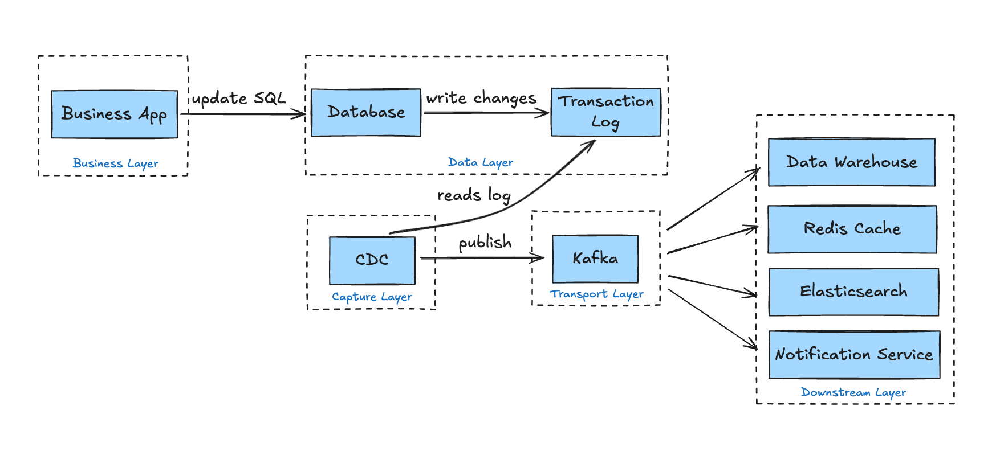

**Change Data Capture (CDC)** is a database technique for capturing row-level changes such as inserts, updates, and deletes, then delivering those changes to downstream systems.

Instead of copying full tables on a schedule, CDC moves only what changed. That makes it useful for real-time analytics, database replication, search indexing, cache synchronization, event-driven applications, and [low-downtime migrations](best_data_migration_tools.md).

This article explains how CDC works, compares the main CDC methods, covers delivery guarantees, and links to deeper database-specific CDC guides.

<!-- truncate -->

## Change Data Capture in One Minute

A CDC pipeline usually has five stages:

1. A row changes in the source database.
2. The change is captured from a transaction log, trigger table, timestamp column, or polling process.
3. The raw change is converted into a structured event.
4. The event is delivered to a target system or message stream.
5. Downstream systems apply the insert, update, or delete.



Example CDC event:

```json
{
  "op": "u",
  "source": {
    "db": "shop",
    "table": "orders"
  },
  "before": {
    "id": 1001,
    "status": "pending"
  },
  "after": {
    "id": 1001,
    "status": "paid"
  }
}
```

The event tells consumers what changed, where it changed, and the row state before and after the update.

## How Change Data Capture Works

### Step 1: A Database Change Happens

An application writes to the database:

```sql
UPDATE orders SET status = 'cancelled' WHERE id = 123;
```

The database records that change somewhere. In log-based CDC, it records the operation in a transaction log such as MySQL binlog, PostgreSQL WAL, SQL Server transaction log, or Oracle redo logs.

### Step 2: A CDC Connector Reads the Change

A CDC connector reads the change source:

- Log-based CDC reads database transaction logs.
- Trigger-based CDC reads change tables populated by triggers.
- Query-based CDC scans timestamp or version columns.
- Polling-based CDC compares table state on a schedule.

Log-based CDC is the most common production approach because it avoids adding triggers or repeatedly scanning large source tables.

### Step 3: The Change Becomes an Event

The CDC connector parses raw changes and emits events with operation type, table name, key fields, before/after values, source offset, and timestamp metadata.

These events can go directly to a target database or data warehouse, or they can flow through a message system such as Kafka.

### Step 4: Downstream Systems Apply the Change

Consumers use CDC events to update their own state:

- Data warehouses update analytical tables.
- Search engines update indexes.
- Caches refresh or invalidate keys.
- Data lakes ingest changed rows.
- Microservices react to domain events.

CDC is useful because the source application does not need to call every downstream system. It only writes to its database; the CDC pipeline distributes the change.

## Change Data Capture Methods Compared

### Log-Based CDC

Log-based CDC reads the database transaction log. It is the default choice for most production systems.

**Strengths**

- Low source impact because logs are already written for durability
- Captures inserts, updates, and deletes
- Preserves stronger ordering information than polling
- Supports low-latency replication
- Works well for full load plus incremental sync

**Watch outs**

- Requires access to database logs or replication features
- Needs offset management and failure recovery
- Database-specific setup varies by source

Database-specific guides:

- [MySQL CDC](./mysql_cdc.md)
- [PostgreSQL CDC](./postgresql_change_data_capture.md)
- [SQL Server CDC](./sql_server_change_data_capture.md)
- [Oracle CDC](./oracle_change_data_capture.md)

### Trigger-Based CDC

Trigger-based CDC uses database triggers to write changes into a separate table.

**Strengths**

- Works when transaction log access is unavailable
- Can capture inserts, updates, and deletes
- Easy to inspect because changes land in ordinary tables

**Watch outs**

- Adds work to the write transaction path
- Requires trigger maintenance on each tracked table
- Can affect business transactions if triggers fail
- Becomes harder to manage at high table counts

### Query-Based CDC

Query-based CDC uses timestamp or version columns such as `updated_at`:

```sql
SELECT * FROM orders WHERE updated_at > last_checkpoint;
```

**Strengths**

- Simple to implement
- Useful for low-volume tables
- Does not require log access

**Watch outs**

- Usually misses hard deletes unless the application uses soft deletes
- Depends on polling frequency
- Adds recurring query load to the source database
- Provides weak ordering guarantees
- Requires application tables to include reliable tracking columns

### Polling-Based CDC

Polling-based CDC periodically scans or compares tables to detect changes. It is best treated as a fallback when logs and triggers are unavailable.

**Strengths**

- Can work with limited database privileges
- Easy to prototype

**Watch outs**

- Not truly event-driven
- Scales poorly for large tables
- Can miss rapid updates or deletes
- Creates artificial latency

### CDC Method Comparison

| Method | Captures Deletes | Latency | Source Impact | Best Fit |
| :--- | :--- | :--- | :--- | :--- |
| Log-based CDC | Yes | Low | Low | Production replication and migration |
| Trigger-based CDC | Yes | Low to medium | Medium | Systems without log access |
| Query-based CDC | Usually no | Medium | Medium | Small tables with timestamp columns |
| Polling-based CDC | Partial | Medium to high | Medium to high | Fallback or prototype workloads |

## CDC vs Batch ETL

CDC and batch ETL solve different problems.

| Area | CDC | Batch ETL |
| :--- | :--- | :--- |
| Data freshness | Near real time | Scheduled |
| Extraction pattern | Changed rows only | Full or partitioned extracts |
| Delete handling | Supported by CDC events | Often requires extra logic |
| Source impact | Lower with log-based CDC | Can be high for full scans |
| Best for | Replication, migration, operational analytics | Periodic transformations and reporting |

CDC is usually better when freshness, deletes, updates, or low-downtime migration matter. Batch ETL can still be better for scheduled transformations inside a warehouse. For more context, see [ETL vs ELT](./etl_vs_elt.md) and [Data Ingestion vs Data Integration](./data_ingestion_vs_data_integration.md).

## Delivery Guarantees and Consistency

Capturing changes is only half of CDC. Production pipelines also need reliable delivery.

### At-Least-Once Delivery

Most CDC systems favor at-least-once delivery: events are not lost, but a downstream consumer may see the same event more than once after retries or restarts.

The usual fix is idempotent consumption:

- Use upserts by primary key.
- Store processed event IDs.
- Commit offsets only after writes succeed.
- Make cache operations deterministic.

### Ordering

Transaction logs preserve source order, but message queues and parallel consumers can change ordering behavior.

Common design rules:

- Route events for the same primary key to the same partition.
- Avoid cross-partition assumptions when transactions touch multiple tables.
- Use transaction metadata when downstream systems need atomic visibility.

### Snapshot and Streaming Handoff

Most real CDC pipelines need both:

- An initial snapshot to copy existing data
- Incremental CDC to capture new changes

The handoff matters. If the pipeline starts CDC from the wrong log position, the target can miss or duplicate changes.

### Schema Changes

CDC pipelines must handle DDL changes such as added columns, dropped columns, type changes, and renamed fields. Some systems propagate schema changes automatically; others require manual coordination with downstream consumers.

## Common Change Data Capture Use Cases

CDC is most useful when downstream systems need fresh data without repeatedly scanning the source database.

| Use Case | Why CDC Helps |
| :--- | :--- |
| Real-time analytics | Dashboards and metrics update without waiting for nightly jobs. |
| Data warehouse sync | Warehouses receive inserts, updates, and deletes continuously. |
| Low-downtime migration | The target stays current while applications still write to the source. |
| Search index sync | Elasticsearch or OpenSearch indexes stay aligned with database changes. |
| Cache sync | Redis or application caches can refresh changed keys. |
| Event-driven systems | Services can react to committed database changes. |
| Audit trails | Before/after values help track sensitive data changes. |

For a fuller list, see [Change Data Capture Use Cases](./change_data_capture_use_cases.md).

## How to Choose a CDC Tool

Start with the guarantees you need, not the vendor checklist.

A production-ready CDC tool should handle:

- Log-based capture for your source databases
- Initial snapshot plus incremental CDC in one workflow
- Offset management and recovery after failure
- Inserts, updates, deletes, and schema changes
- Monitoring for lag, throughput, and errors
- Validation between source and target
- Target-specific writes such as upserts, deletes, or append-only events

If you are comparing vendors and open-source options, see [Best CDC Tools](./top_cdc_tool.md) and [Debezium Alternatives](./debezium_alternatives.md).

## Where BladePipe Fits

[BladePipe](https://www.bladepipe.com/) is a CDC-first data integration platform for database migration, real-time synchronization, replication, analytics, and AI data pipelines.

It is useful when teams want full load, incremental CDC, schema migration, monitoring, verification, and recovery in one workflow instead of building separate snapshot scripts, CDC readers, target writers, and operational dashboards.

## FAQ

### What is Change Data Capture?

Change Data Capture is a method for identifying database inserts, updates, and deletes and delivering those changes to downstream systems.

### What is the best CDC method?

Log-based CDC is the best default for production because it reads transaction logs, captures deletes, preserves better ordering information, and avoids repeatedly scanning source tables.

### Is CDC real time?

CDC is usually near real time. Latency can be milliseconds or seconds for log-based systems, but actual latency depends on source load, network, queueing, target writes, and checkpointing.

### Is CDC better than ETL?

CDC is better for continuous incremental movement, low-downtime migration, and targets that need updates and deletes. ETL is better for scheduled transformations and periodic batch processing.

### Does CDC affect database performance?

Log-based CDC usually has low source impact because it reads transaction logs. Trigger-based and query-based CDC can add more load because they run extra writes or recurring queries on the source database.

### What is the difference between CDC and database replication?

CDC is the change-capture mechanism. Replication is the broader system that uses captured changes to keep another database, warehouse, cache, search index, or application synchronized.
