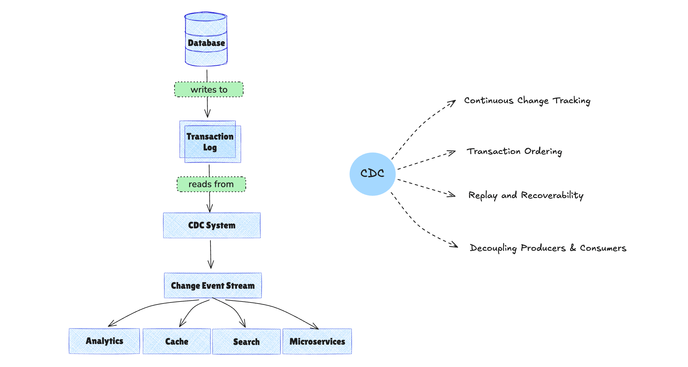

Modern applications generate data continuously - user signups, orders, payments, inventory updates, status changes. Yet many data systems still operate in **batches**, moving snapshots of data every few hours or once per day.

That **mismatch** creates a gap between what the business does and what systems can respond to.

[**Change Data Capture (CDC)**](./change_data_capture_cdc.md) closes that gap. But beyond [incremental data sync](https://www.bladepipe.com/docs/operation/job_manage/create_job/create_full_incre_task/), what can you actually build with CDC? In other words, what are the most impactful **change data capture use cases** in modern data architecture?

Let's break it down.

## Why Use CDC Instead of Batch ETL?

For years, [batch ETL](../data_insights/etl_vs_elt.md#what-is-etl-and-how-does-it-work) pipelines were good enough. Extract data nightly, transform it, load it into a warehouse, and generate reports the next morning.

But today's systems operate differently.

### 1. Business Moves in Real Time

Customers expect instant confirmations. Fraud detection must happen within seconds. Inventory levels must reflect reality immediately. Product recommendations adapt dynamically.

A nightly data job can't support that.

This shift toward immediacy is one of the main drivers behind growing interest in change data capture use cases and real-time data pipelines.

### 2. Dual Writes Create Risk

Many teams try to compensate by writing data to multiple systems at once:

- Write to the database
- Write to the cache
- Write to the analytics pipeline
- Publish an event manually

This "dual write" pattern introduces inconsistency. If one write fails, systems drift apart. Debugging becomes painful. Recovery is complex.

One of the most practical **database CDC use cases** is eliminating dual writes by allowing downstream systems to react to committed database changes automatically. 

### 3. Snapshots Miss Context

Full data dumps show the current state, but they hide *how* the system got there.

A database change is more than a row mutation - it's a business event:

- An order was created.
- A payment was completed.
- A user upgraded their plan.
- An account was deleted.

When you capture changes continuously, you capture the flow of business itself.

That's why static snapshots are no longer enough. Modern systems need a reliable stream of change - which is exactly what most **CDC applications** are designed to provide.

## How Change Data Capture Turns Databases into Event Streams

At its core, Change Data Capture reads changes from a database's transaction log (such as binlog or WAL) and streams them downstream in near real time.

But technically reading logs is not the main value. The real power lies in the properties CDC provides.

### 1. Continuous Change Tracking

Instead of querying tables repeatedly, CDC observes row-level INSERT, UPDATE, and DELETE operations as they happen.

This enables true **incremental data synchronization** rather than expensive full-table scans.

### 2. Transaction Ordering

Because CDC is based on commit logs, it preserves transaction order.

Many streaming data use cases depend on strict ordering guarantees. Without ordered delivery, downstream systems such as analytics platforms or microservices can produce inconsistent results.

### 3. Replay and Recoverability

A reliable CDC system tracks offsets or log positions. If a downstream consumer fails, it can resume from the last processed change.

This ability to replay events is critical for resilience and auditing.

### 4. Decoupling Producers and Consumers

With CDC, the database becomes a source of truth and an event producer. Downstream systems - analytics, caches, microservices, search engines - subscribe to changes independently.

This removes tight coupling between systems and eliminates risky dual-write patterns.

**In short:** CDC transforms a transactional database into a reliable event source.

Once you understand that shift, the range of possible applications becomes much broader.

## What Are the Most Common Change Data Capture Use Cases?

Now that we've covered why CDC matters and how it works, let's look at concrete answers to a common question: **what is CDC used for** in production systems?

### 1. How to Use CDC for Real-Time Analytics and Dashboards

One of the most common change data capture use cases is powering real-time analytics.

Instead of waiting for scheduled ETL jobs, analytics platforms can consume database changes continuously.

This enables:

- Real-time revenue dashboards
- Live inventory tracking
- Immediate operational metrics
- Streaming KPI updates

For fast-moving businesses, even a one-hour delay can reduce decision quality. CDC removes that delay and [**keeps data always ready for analytics**](https://www.bladepipe.com/real-time-analytics/).

### 2. Incremental Data Warehouse and Data Lake Updates

Traditional data warehouse pipelines rely on periodic full loads or timestamp-based queries.

CDC improves this by:

- Syncing only changed records
- Reducing compute costs
- Minimizing warehouse load
- Keeping analytics systems continuously updated

Whether syncing from OLTP databases to Snowflake, BigQuery, ClickHouse, or data lakes, CDC ensures efficient incremental updates.

### 3. How CDC Helps Eliminate Dual Writes in Microservices

In distributed systems, services often need access to shared data - user profiles, orders, inventory, billing status.

Instead of implementing fragile dual writes, services can:

- Write to the primary database
- Use CDC to propagate state changes
- Subscribe independently to relevant events

This pattern improves consistency and reduces cross-service dependencies.

CDC becomes a safer alternative to manual event publishing.

### 4. How to Sync Redis Caches and Elasticsearch Indexes with CDC

Caches (such as Redis) and search indexes (such as Elasticsearch) require fresh data.

Without CDC, teams often implement periodic refresh jobs or manual invalidation logic.

With CDC:

- Updates propagate instantly
- Cache invalidation becomes deterministic
- Search indexes stay aligned with the source of truth

For teams wondering **what is CDC used for in operational systems**, cache and search synchronization is one of the clearest examples. This reduces stale data issues and improves user experience.

### 5. How to Do Zero-Downtime Migration Using CDC

[Migrating databases or systems](https://www.bladepipe.com/blog/data_insights/best_data_migration_tools/) traditionally requires maintenance windows or risky cutovers.

CDC enables:

- Running old and new systems in parallel
- Continuously replicating changes
- Performing gradual traffic switching
- Rolling back safely if needed

This makes large-scale migrations significantly safer.

### 6. Can CDC Be Used for Audit Logging and Compliance?

Because CDC captures every data change, it can support:

- Change history tracking
- Regulatory compliance
- Data lineage reconstruction
- Forensic analysis

Unlike application-level logging, CDC operates at the data layer, providing more complete visibility.

### 7. Event-Driven Architectures

Many organizations aim to build event-driven systems, but struggle with reliable event production. Since the database already records all state changes, CDC can serve as the foundation for event-driven design. Rather than building separate event publishing logic, teams can leverage database changes as the event stream.

## From Data Movement to Application Enablement

When implemented correctly, CDC is not just a replication tool. It's an architectural capability.

It provides:

- Low-latency change propagation
- Ordered event delivery
- Reliable replay and recovery
- Scalable decoupled pipelines

Building production-grade CDC systems requires handling log parsing, fault tolerance, schema evolution, scaling, and monitoring.

Modern [data integration platforms such as BladePipe](https://www.bladepipe.com/) are designed to deliver these capabilities out of the box, enabling teams to turn database changes into reliable, real-time data applications without reinventing the underlying infrastructure. **Experience it yourself-[try BladePipe free](https://www.bladepipe.com/pricing/).**

## FAQs

### Why use CDC instead of batch ETL?
Batch ETL moves periodic snapshots, so it’s inherently delayed and can miss the *sequence of change*. CDC streams committed changes continuously, which is better for low-latency analytics, incremental syncing, and event-driven downstream updates.

### When should you use CDC?
Use CDC when downstream systems need to reflect database changes quickly and reliably—for example real-time dashboards, cache/search index sync, microservice state propagation, audit trails, or migrations with minimal downtime.

### What problems does CDC solve?
CDC helps you avoid polling and full reloads, preserves transaction ordering, enables replay/recovery after failures, and decouples producers (the database) from consumers (analytics, caches, services) without fragile point-to-point integrations.

### How does CDC helps avoid data inconsistency?
By reducing the need for dual writes. Services write once to the source-of-truth database, and CDC propagates the *committed* changes downstream in order, making it easier to keep multiple systems aligned and recover cleanly after partial failures.

### Can CDC be used to build near real-time data pipelines?
Yes. A typical pattern is: database log (binlog/WAL) → CDC pipeline → message bus/warehouse/search/cache. With proper backpressure, retries, and monitoring, this supports near real-time propagation while retaining ordering and replayability.

## Final Thoughts

If you only view Change Data Capture as an incremental sync mechanism, you'll miss its broader impact. But if you see it as a way to transform your database into a consistent event stream, the possibilities expand dramatically.

Real-time analytics, microservice coordination, cache synchronization, zero-downtime migration, and event-driven systems all become achievable - not through complex dual writes, but through a single reliable source of change.

The question is no longer whether you can capture database changes. It's what you choose to build with them.
