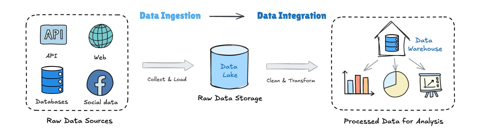

**Data ingestion** and **data integration** are often mentioned together, which leads to common questions like: *Are they the same thing?* And if not, *what actually sets them apart?*

After years of building integrated data solutions for modern data stacks, we see this confusion all the time. The answer is straightforward: **data ingestion and data integration are not the same**. Data ingestion is the first step in the data moving, while data integration is the complete process of refining and making data usable.

If the distinction still feels a bit abstract, don’t worry. Let’s break it down step by step — using simple analogies, clear explanations, and real-world examples — and see how each fits into the data pipeline.

## Data Ingestion vs Data Integration in the Data Pipeline
At a high level, data ingestion happens **upstream**, while data integration happens **downstream**.

**Data ingestion gets data in.**

**Data integration makes data usable.**

Let’s break this down step by step.

## A Simple Analogy to Understand the Difference
To make the difference easier to grasp, let’s step away from technical terms for a moment and look at a simple, everyday analogy.
### Data Ingestion
Imagine going to different supermarkets and markets (your [data sources](https://www.bladepipe.com/connector/)) to buy vegetables, meat, and ingredients (raw data).

**Data ingestion is the act of bringing all those ingredients into your kitchen (a data lake or storage system).**

At this stage, you only care about:
- Did everything arrive?
- Is it stored safely?
- Is it complete?

You don’t worry yet about cleaning, cutting, or cooking.

### Data Integration
Now you’re in the kitchen.

You wash the vegetables, cut the meat, combine ingredients, cook them properly, and plate the final dishes.

**That’s data integration.**

It focuses on **consistency, quality, structure, and usability**, so the data can actually be consumed by analysts, dashboards, and business teams.

## What Is Data Ingestion?
### Data Ingestion Definition
Data ingestion is the process of moving data from different sources—like databases, apps, files, or APIs—into one central storage system, such as a data lake or data warehouse.

Its main job is **moving and loading data** reliably.

### Key Characteristics of Data Ingestion
1. **What it does:** It’s focused on transferring data from point A to point B.
2. **What it aims for:** To get data reliably and efficiently into one place.
3. **How much it changes the data:** Ideally minimal—often limited to format conversion, compression, or basic validation. In practice, some pipelines may also apply light normalization or filtering.
4. **Where the data ends up:** In a staging area, data lake, or similar storage, still in its original form.
5. **Common Ingestion Patterns**
    - **Batch ingestion:** Moving large chunks of data on a schedule, like once a day.
    - **Streaming ingestion:** Moving data continuously, in near real-time, using tools like [Kafka](https://www.bladepipe.com/docs/dataMigrationAndSync/connection/kafka2/).
    - **Change data capture (CDC):** Captures only inserts, updates, and deletes from source systems via change logs, rather than extracting full datasets. Tools such as [Bladepipe](https://www.bladepipe.com/) enable incremental replication to downstream systems.

### A Practical Example of Data Ingestion
You take daily sales logs, website clickstreams, and social media feed data from different places, and copy all of it into Amazon S3. That’s data ingestion.
### Why It Matters
If ingestion doesn’t work well, data won’t be available on time—or at all—for the next steps like cleaning, reporting, or analysis. It’s the necessary first move before you can actually use the data.

## What Is Data Integration?
### Data Integration Definition
**Data integration** is the process of combining, cleaning, transforming, and unifying data from multiple sources to provide a consistent, trusted, and usable view for business and analytics.

The core focus is **transformation, alignment, and deliver ready-to-use data**.
### Key Characteristics of Data Integration
1. **What it focuses on:** The meaning, relationships, and quality of data.
2. **What it aims for:** To produce clean, consistent, reliable, and usable data for analytics, reporting, and decision-making.
3. **How much processing it does:** A lot. Data integration typically involves:
    - **[Data cleaning](https://www.bladepipe.com/blog/data_insights/etl_transform/#data-cleaning):** Handling missing values, outliers, and duplicate records.
    - **Data transformation:** Standardizing formats (like dates), converting units, and calculating new fields.
    - **Data modeling:** Building star or snowflake schemas, creating dimension and fact tables.
    - **Schema integration:** Resolving naming conflicts and structural differences—for example, making “CustomerID” and “UserNumber” refer to the same thing.
    - **Data matching/merging:** Identifying and combining records that refer to the same entity, such as customer info from CRM and ERP systems.
4. **Where the data ends up:** Clean, integrated datasets in a data warehouse or data mart, ready for direct use by BI tools or data scientists.
5. **Common Integration Approaches**
    - **ETL (Extract, Transform, Load):** The traditional method. Data is transformed before being loaded into the target database.
    - **ELT (Extract, Load, Transform):** The modern approach, often used with cloud data warehouses. Data is loaded first, then transformed inside the target system.
### A Practical Example of Data Integration
You take raw sales data, customer records, and product information from a data lake. You clean up incorrect entries, standardize customer IDs, map product codes to descriptions, and finally create a single table that shows sales, customer regions, and product categories. This table can then be used by finance and marketing teams for reporting.
### Why it matters
Without data integration, data remains scattered and inconsistent. Integration turns raw data into trustworthy information that teams can actually use for insights and decisions.

## Data Ingestion vs Data Integration: Key Differences
| Feature | Data Ingestion | Data Integration |
| :--- | :--- | :--- |
| **Core Goal** | Collect and store raw data | Prepare data for analysis and business use |
| **Pipeline Stage** | Upstream starting point | Downstream processing stage |
| **Main Activities** | Data transfer, loading, light formatting | Cleansing, transformation, modeling, unification |
| **Data State** | Raw, fragmented, minimally processed | Clean, consistent, analytics-ready |
| **Output Destination** | Data lakes, staging areas | Data warehouses, data marts |
| **Primary Users** | Data engineers, infrastructure teams | Analysts, data scientists, business users |
| **Analogy** | Moving ingredients into the kitchen | Cooking and serving finished dishes |

## How Data Ingestion and Data Integration Work Together in Modern ELT Architectures
In modern cloud data stacks, data ingestion and data integration are no longer a strictly linear, one-way process where one step ends before the next begins.

Driven by the **ELT paradigm**, they now often operate as a tightly coordinated, continuously running cycle rather than a traditional waterfall flow.
### Stage 1: Data Ingestion Establishes the "Single Source of Truth"
At this stage, the core task is **"Extract & Load" (E&L).**

**Goal:** To move data from all sources—business databases, SaaS applications, log files, IoT devices, etc.—into a central storage system (typically a cloud data lake like Amazon S3 or ADLS Gen2) as quickly and reliably as possible, keeping it largely in its original form.

**Key Characteristics:**
- **Automation & Scheduling:** Using [data integration tools](data_integration_tools.md) (like **BladePipe**) or custom scripts to automate data extraction and synchronization in a low-code or no-code manner, significantly reducing operational overhead.
- **Preservation of Raw State:** Data is stored in its original or lightly processed formats (JSON, Parquet, Avro), maintaining maximum flexibility and traceability.
- **High Frequency & Real-time Capability:** Supports both batch and streaming ingestion to ensure the data lake consistently reflects the latest state of the source systems.

**Outcome:** A **centralized data lake** containing all of an organization's raw data, serving as the **single, trusted input** for all data integration work.

### Stage 2: Data Integration Builds the "Trusted Consumption Layer"
At this stage, the core task is **"Transform" (T)**, which occurs **after** the data is loaded into the target system (typically a data warehouse).

**Goal:** To use the raw data in the data lake as the input and, through a series of transformation steps, produce **clean, consistent, and easily understandable** datasets ready for direct use in business analysis and applications.

**Key Characteristics:**
- **Compute within the Target System:** Leverages the powerful processing capabilities of modern cloud data warehouses (like Snowflake, BigQuery, Redshift) or data lake query engines (like Spark on Databricks) to perform transformations, eliminating the need for a separate ETL server.
- **Code-Centric (SQL):** Transformation logic is typically written in SQL or SQL-based frameworks (like dbt), enabling version control, testing, and collaboration.
- **Modular & Layered:** The transformation process is organized into clear layers (e.g., raw -> staging -> business -> mart), with each layer adding business value and quality assurance.

**Outcome:** **Verified datasets, data models, and aggregate tables** residing in the data warehouse, ready to connect directly to BI tools (like Tableau, Looker) and data applications.

### How They Work Together
The success of a modern ELT architecture depends on the seamless collaboration between ingestion and integration. The design of **integrated data operation platforms** like **BladePipe** is precisely to support this efficient collaborative cycle smoothly—enabling engineers to manage the complete workflow from multi-source data synchronization to complex transformation tasks within a unified interface, ensuring reliability and observability.
1. **Agility & Iteration:** Because the raw data is already securely stored in the data lake, data teams can re-run or modify integration logic at any time without re-initiating complex data ingestion. This supports rapid experimentation and iteration.
2. **Separation of Responsibilities:** Data engineers focus on building and maintaining reliable, efficient data ingestion pipelines (ensuring "data is in place"). Data analysts then focus on writing transformation logic and defining business rules within the data warehouse (ensuring "data is usable").
3. **Cost & Performance Optimization:** By deferring expensive transformation computations to the elastically scalable cloud data warehouse, performance bottlenecks that might occur on intermediate servers are avoided. The separation of storage and compute also optimizes costs.
### A Practical Collaboration Example
Consider an e-commerce company:
1. **Data Ingestion:** Automated pipelines load daily order data (from MySQL), user clickstreams (from Kafka), and advertising spend data (from the Google Ads API) in raw JSON format into Amazon S3.
2. **Data Integration:** In Redshift, the data team runs a series of dbt models:
    - Cleans and parses the raw JSON data.
    - Unifies and links "user identifiers" from the three sources.
    - Joins order, click, and ad data to create an aggregated wide table showing **"revenue conversion rate per marketing channel."**
3. **Business Value:** The marketing team can view this aggregated table in their Looker dashboard the next day and use it to optimize advertising budgets.

**In summary,** within a modern ELT architecture, data ingestion and integration are no longer just sequential steps. They form a virtuous cycle: efficient and reliable ingestion fuels high-quality integration, while the requirements and feedback from integration continuously drive the extension and refinement of ingestion pipelines. Together, they transform raw data streams into business insights that drive decision-making.

## Final Thoughts
So, are data ingestion and data integration the same thing?

By now, the difference — and why it matters — should be clear.

Getting data into your platform is only the first step. The real challenge starts when that data needs to be cleaned, aligned, and transformed into something teams can actually rely on. This is where many organizations realize that tools alone aren’t enough.

At **Bladepipe**, we [work with teams every day](https://www.bladepipe.com/blog/tags/stories/) to design and implement scalable ingestion and integration pipelines — from architecture design to hands-on execution. Whether you’re building a modern ELT stack or fixing pipelines that no longer scale, our **[data integration consulting services](https://www.bladepipe.com/about/)** help turn raw data into reliable, analytics-ready assets.

If you’re unsure whether your challenge is ingestion, integration, or both, **[talk to the Bladepipe team](https://www.bladepipe.com/about#contact)**. A short conversation is often enough to clarify the next step.