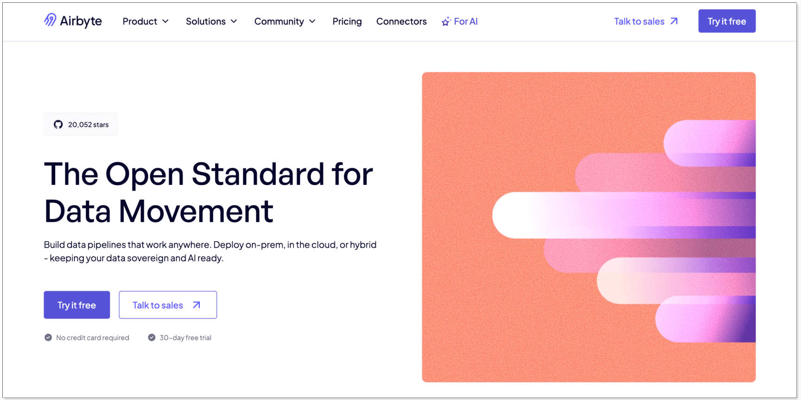
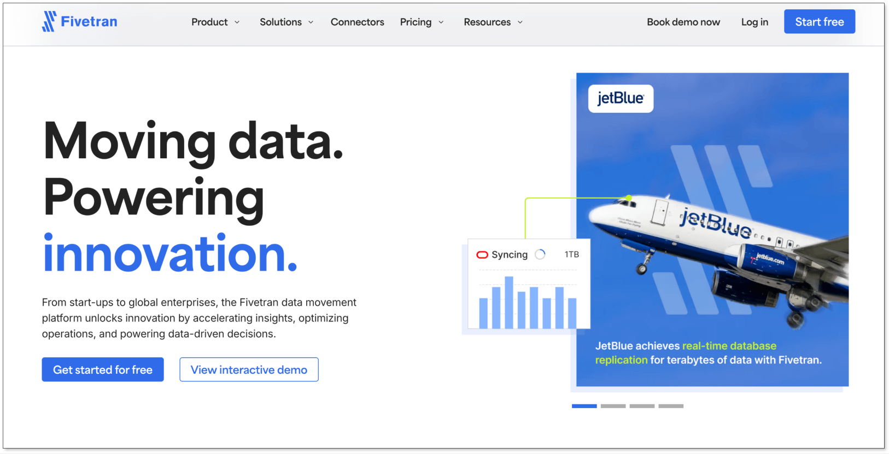
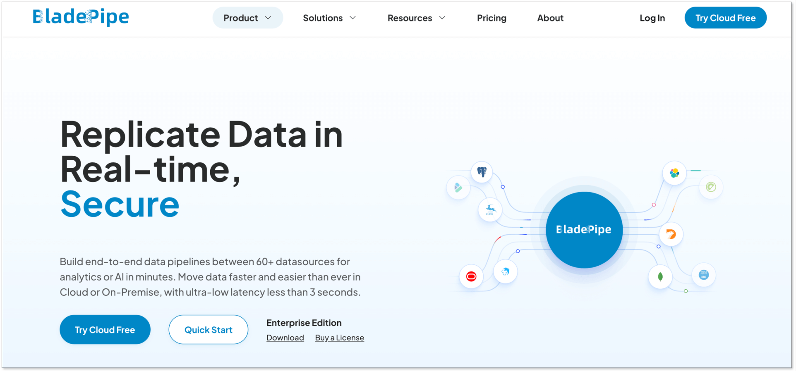
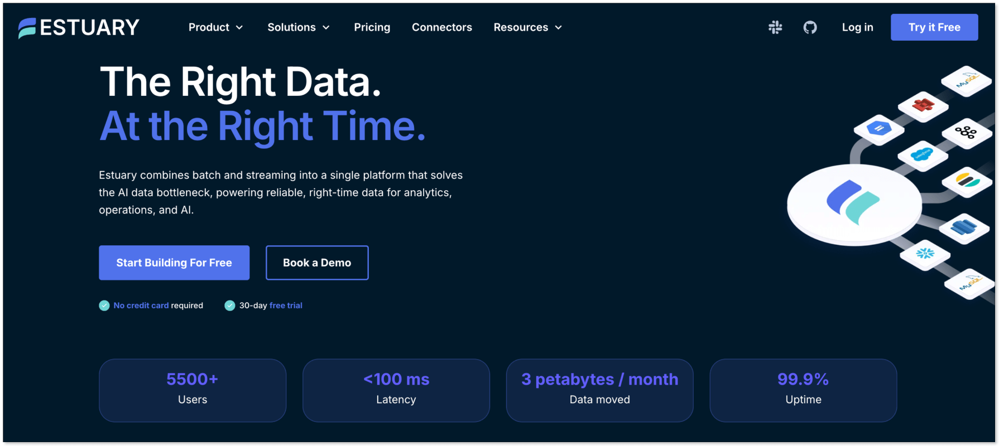
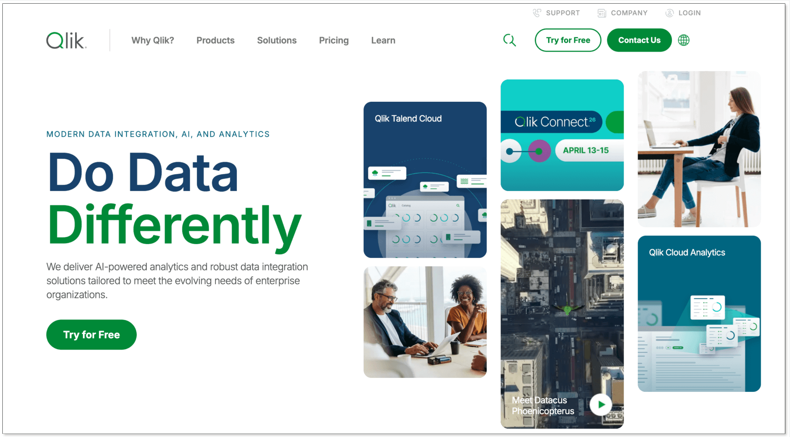
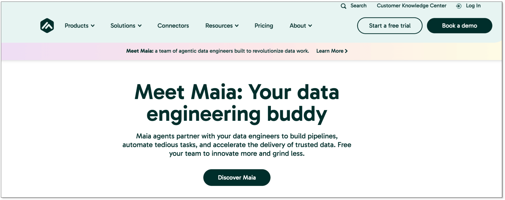
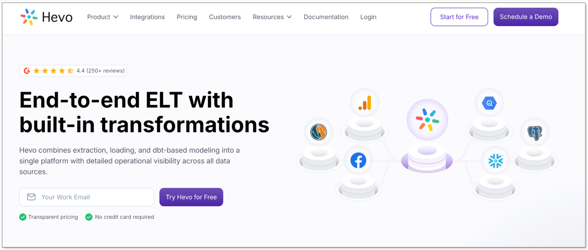
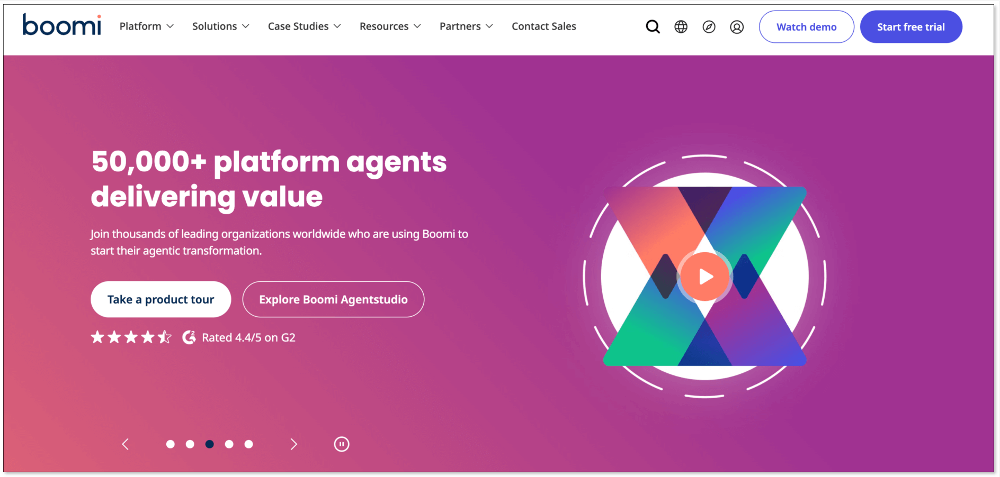
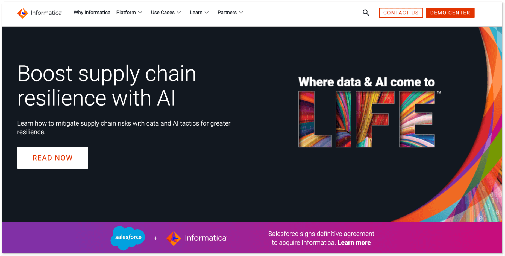
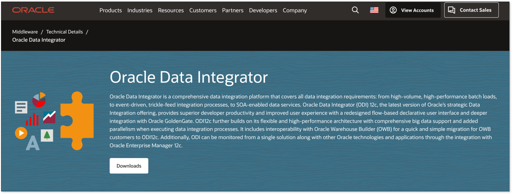

In 2026, data volume is booming. Organizations are generating terabytes of data across cloud apps, databases, and analytics systems, all of which must stay synchronized to power real-time insights, AI, and operations.

That's why **data integration tools** matter. Teams now rely on modern data integration platforms that automate ingestion, transformation, and synchronization. Such tools connect every system with reliability and speed.

But the challenge is: **among so many data integration services, what kind of solution better fits your case?** Don't worry. This guide breaks down what data integration tools do, how to evaluate them, and the **10 best platforms** leading the market in 2026.

## What is a Data Integration Tool?
A **data integration tool** connects and consolidates data from different sources into a unified, analysis-ready format. It automates how data is moved, transformed, validated, and monitored. Whether you’re powering real-time dashboards, feeding AI models, or centralizing business data into a warehouse or lakehouse, choosing a right data integration solution is now a core part of every data strategy.

## Why Data Integration Tools Matter?
Using a modern data integration platform offers several strategic benefits:

+ **Real-time decision-making:** Streaming pipelines deliver fresh data instantly to analytics dashboards, AI models, and operational systems.
+ **Less engineering effort:** Pre-built connectors and automated pipelines minimize coding and maintenance.
+ **Improved data quality and consistency:** Tools manage schema changes and verify data to reduce errors and inconsistencies.
+ **Scalable performance:** Easily manage growing data volumes and an expanding ecosystem of sources and destinations.
+ **Lower operational costs:** Avoid maintaining custom ETL/ELT infrastructure.
+ **Faster analytics and AI adoption:** Unified, continuously updated data accelerates insights and machine learning.

## Top 10 Data Integration Tools
### 1. Airbyte

[Airbyte](https://airbyte.com/) is an open-source ELT platform offering more than 300 pre-built connectors and the ability to create custom connectors for special sources. While primarily batch-oriented, it is popular for its flexibility, extensibility, and strong open-source community.

**Key Features:**

+ **Open-source and extensible:** Customize or build new connectors easily.
+ **Wide coverage:** Supports 300+ databases, APIs, and SaaS systems.
+ **ELT architecture:** Pushes transformations downstream for flexibility.
+ **Community-driven:** Frequent releases and transparent roadmap.

[**Pricing:**](https://airbyte.com/pricing)

+ Standard plan starts at $10/month.
+ Additional credits at $2.50 each; typical database/file sources priced around $10 per GB synced.

### 2. Fivetran

[Fivetran](https://www.fivetran.com/) is a fully managed ELT platform built for automation and reliability. It synchronizes data from hundreds of sources to major data warehouses with minimal configuration. Schema changes and maintenance are handled automatically, freeing data teams from operational overhead.

**Key Features:**

+ **Hands-free pipelines:** Automatic schema updates and maintenance.
+ **Broad connectivity:** 700+ connectors for databases, SaaS, and files.
+ **Cloud-native analytics:** Integrates with Snowflake, BigQuery, and other cloud targets.

[**Pricing:**](https://www.fivetran.com/pricing)

Usage-based pricing by Monthly Active Rows (MAR). Many users complain that the pricing is [highly unpredictable](https://www.reddit.com/r/dataengineering/comments/1ii4ry5/fivetran_pricing/) due to the complex pricing model.

### 3. BladePipe

[**BladePipe**](https://www.bladepipe.com/) is a **real-time, end-to-end data integration platform** built for teams of all sizes. With 60+ pre-built connectors and CDC-based replication, it moves data seamlessly with **sub-second latency**. Its **no-code interface** simplifies setup for real-time analytics and AI workloads, while **flexible deployment options** (On-prem/BYOC/fully managed) adapt to any environment.

**Key Features:**

+ **Real-time CDC**: Keeps data up to date with sub-second latency. 
+ **Flexible data transformation**: Supports filtering and mapping, and has multiple built-in data transformation scripts. Complex transformations can be done using custom Java code.
+ **High data integrity**: Built-in schema evolution, [data verification and correction](https://www.bladepipe.com/docs/operation/job_manage/create_job/create_period_verification_correction_job).
+ **Enhanced stability**: Enables resumable data sync, automatic failover, and [alert notification](https://www.bladepipe.com/docs/operation/job_manage/job_op/job_alarm), ensuring healthy pipelines.
+ **Multiple deployment options**: Offers on-premise, SaaS managed and BYOC modes for deployment, giving flexibility for various sizes of teams.

[**Pricing:**](https://www.bladepipe.com/pricing)

+ **Cloud**: Pay-as-you-go model. Example, $0.01 per million rows processed for Cloud. Pricing varies by operation type.
+ **Enterprise**: Custom quote based on the number of pipelines and the duration.

### 4. Estuary Flow

[Estuary Flow](https://estuary.dev/) is a unified data movement platform built for real-time and batch processing. It connects databases, streams, and SaaS apps through no-code pipelines that support CDC and durable streaming. With integrated transformation via SQL or TypeScript, teams can deliver low-latency analytics without managing infrastructure.

**Key Features:**

+ **Unified streaming and batch:** Combines real-time CDC with batch ingestion.
+ **Automated setup:** Build, deploy, and monitor pipelines with minimal engineering.
+ **Scalable architecture:** Handles high-volume data flow across hybrid environments.
+ **Data transformations:** Supports SQL and TypeScript transformations and dbt for ELT.

[**Pricing:**](https://estuary.dev/pricing/)

+ **Free**: Up to 10 GB/month with 2 connector instances.
+ **Cloud**: $0.50 per GB of change data moved; a connector instance is typically $100/month for first six.
+ **Enterprise**: Custom quote based on specific requirements.

### 5. Qlik

[Qlik](https://www.qlik.com/us) Data Integration is an enterprise-grade platform that automates data ingestion, transformation, and delivery across hybrid and multi-cloud systems. Its visual interface and built-in governance make it a strong choice for large-scale, compliance-focused organizations.

**Key Features:**

+ **Visual design:** Drag-and-drop integration for rapid development.
+ **Real-time replication:** Supports CDC and hybrid cloud pipelines.
+ **Data governance:** Centralized metadata and lineage tracking.
+ **Scalable deployment:** Optimized for complex enterprise architectures.

[**Pricing:**](https://www.qlik.com/us/pricing/data-integration-products-pricing)

+ **Starter**: Starts at $200/month, including 10 users and 25 GB data for analysis.
+ **Standard**: Starts at $825/month. Starts with 25 GB of data for analysis.
+ **Premium**: Starts at $825/month. Starts with 50 GB of data for analysis.
+ **Enterprise**: Custom quote on request.

### 6. Matillion

[Matillion](https://www.matillion.com/) is a cloud-native ETL and ELT platform tailored for modern warehouses like Snowflake, Redshift, and BigQuery. It provides a visual interface and scripting flexibility to design, orchestrate, and monitor complex data transformations at scale.

**Key Features:**

+ **Visual workflows:** Intuitive drag-and-drop pipeline builder.
+ **Multi-language support:** SQL, Python, and dbt integration.
+ **Transformation-rich:** Handles advanced logic with reusable components.
+ **Cloud-native integration:** Seamlessly fits into major cloud data ecosystems.

[**Pricing:**](https://www.matillion.com/pricing)

Typical pricing starts at around $1,000/month and includes 500 credits. Credits often priced around $2–$2.50 per virtual core hour depending on plan.

### 7. Hevo Data

[Hevo Data](https://hevodata.com/) is a no-code data integration platform designed for real-time analytics. With 150+ connectors and event-based billing, it allows teams to automate ingestion, transformation, and monitoring without writing code.

**Key Features:**

+ **No-code UI:** Drag-and-drop pipeline creation.
+ **Automation-first design:** Minimal setup, automatic schema mapping.
+ **Reverse ETL support**: Allows to turn processed data back to data stored in operation systems.

[**Pricing:**](https://hevodata.com/pricing/pipeline/)

+ **Free**: 1M events/month for limited connectors.
+ **Starter**: Starts from $239/month for 5M events.
+ **Professional**: Starts from $679/month for 20M events.
+ **Business Critical**: Custom quote on demand.

### 8. Boomi

[Boomi](https://boomi.com/) is a cloud-based Integration Platform as a Service (iPaaS) that connects data, applications, and APIs. It offers visual workflow design, automation, and governance, helping enterprises unify systems across cloud and on-prem environments.

**Key Features:**

+ **Comprehensive integration:** Data, applications, and APIs in one platform.
+ **Visual workflow builder:** Intuitive drag-and-drop interface.
+ **Monitoring and alerts:** Tracks workflow health and performance.
+ **Security and compliance:** Enterprise-grade controls and certifications.

[**Pricing:**](https://boomi.com/pricing/)

+ **Pay-as-you-go**: Starts at $99/month plus usage.
+ **Subscription plan**: Varies based on the connectors and required features.

### 9. Informatica PowerCenter

[Informatica PowerCenter](https://www.informatica.com/) is a proven enterprise ETL solution designed for large-scale, mission-critical workloads. It provides advanced data transformation, metadata management, and orchestration for highly governed data environments.

**Key Features:**

+ **Robust ETL engine:** Handles complex transformations and dependencies.
+ **Workflow orchestration:** Automates multi-stage integration jobs.
+ **Metadata-driven design:** Manages a repository for metadata. Tracks lineage and schema evolution.

[**Pricing:**](https://www.informatica.com/products/cloud-integration/pricing.html)

Pricing varies depending on the enterprise size, required features, etc. Contact Informatica sales for a quotation.

### 10. Oracle Data Integrator (ODI)

[Oracle Data Integrator (ODI) ](https://www.oracle.com/middleware/technologies/data-integrator.html)is an enterprise ELT platform optimized for Oracle databases and cloud services. It uses push-down processing to perform transformations directly inside the target database for maximum efficiency.

**Key Features:**

+ **Push-down ELT:** Executes transformations where data lives for high performance.
+ **Rich transformation library:** Supports advanced logic and mappings.
+ **Deep Oracle integration:** Native support for Oracle DB, OCI, and Exadata.

[**Pricing:**](https://www.oracle.com/integration/pricing/)

+ **Oracle Data Integrator Cloud Service**: $0.7742/OCPU per hour
+ **Oracle Data Integrator Cloud Service (BYOL)**: $0.1935/OCPU per hour

## How to Choose the Right Data Integration Tool
When selecting a data integration tool, consider the following factors:

+ **Data latency:** Determine whether real-time streaming or periodic batch processing suits your needs.
+ **Source and target coverage:** Ensure the tool supports your databases, SaaS apps, message queues, files, and destinations like warehouses or lakes.
+ **Scalability:** The tool should handle current and future data volumes efficiently.
+ **Data quality and governance:** Look for validation, error correction, and schema management features.
+ **Deployment flexibility:** Check whether the deployment options meet your demand.
+ **Cost:** Choose a tool with transparent, predictable pricing that fits your data scale.
+ **Security and compliance:** Ensure enterprise-grade security, access control, and regulatory compliance.
+ **Ecosystem compatibility:** The tool should integrate with your BI, AI, and data lakehouse systems and support future growth.

## Wrapping Up
The data landscape in 2026 demands more than just connectivity. It demands **speed, reliability, and adaptability**. Whether your goal is to power real-time dashboards, feed AI models, or unify enterprise systems, the right data integration platform can dramatically reduce engineering overhead and accelerate decision-making.

+ **For real-time processing pipelines**, choose a tool like **BladePipe**. 
+ **For flexibility and customization**, open-source platforms like **Airbyte** are ideal.
+ **For a fully managed solution**, **Fivetran** or **Qlik** can be considered.

If your team needs **sub-second replication, schema evolution, and verifiable data integrity** across systems, **BladePipe** provides a no-code/low-code way to make your data always ready for analytics and AI.

[**Try BladePipe for free**](https://www.bladepipe.com/) to see how fast your pipelines can be.

