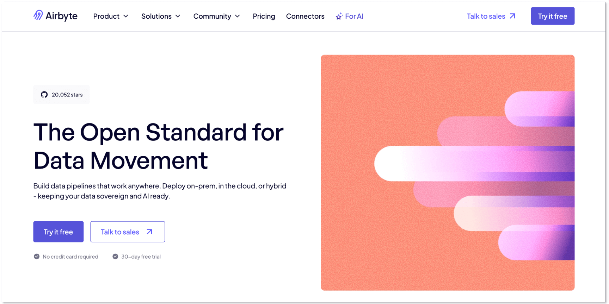
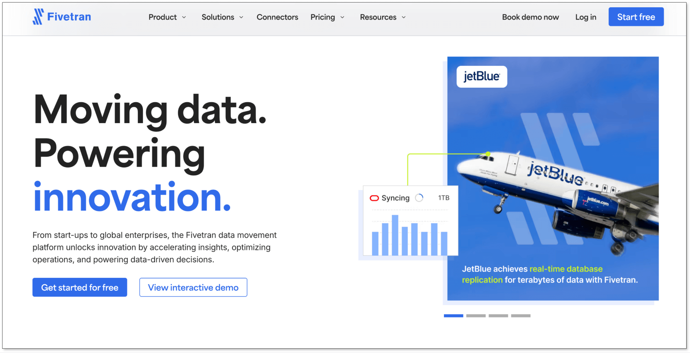
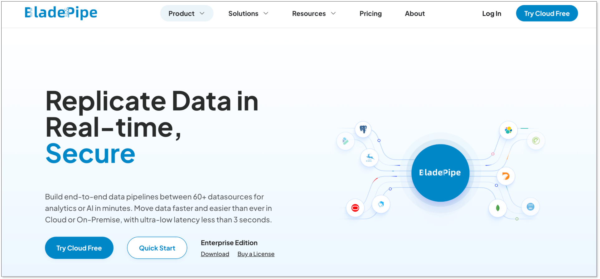
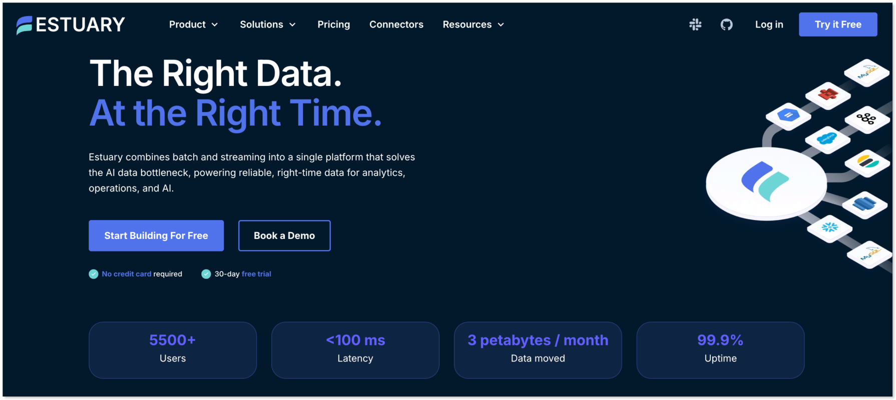
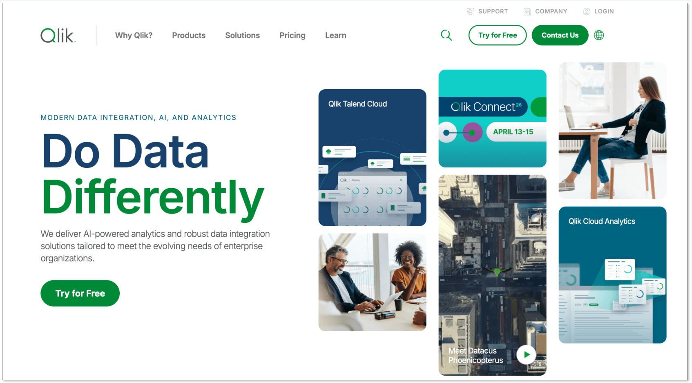
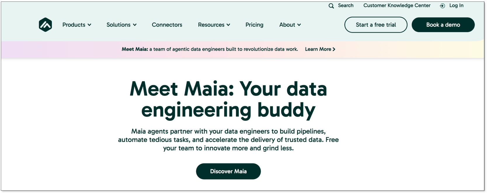
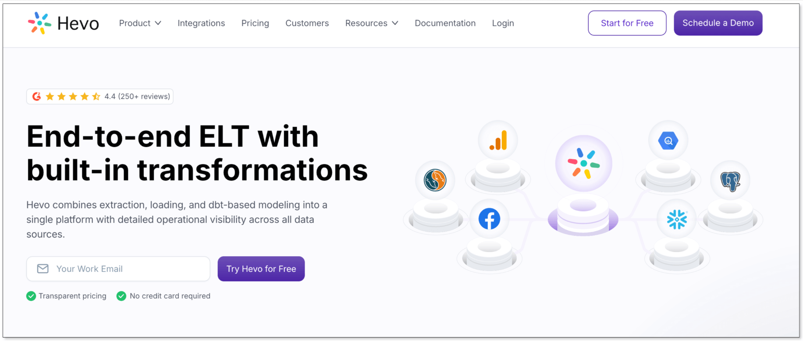
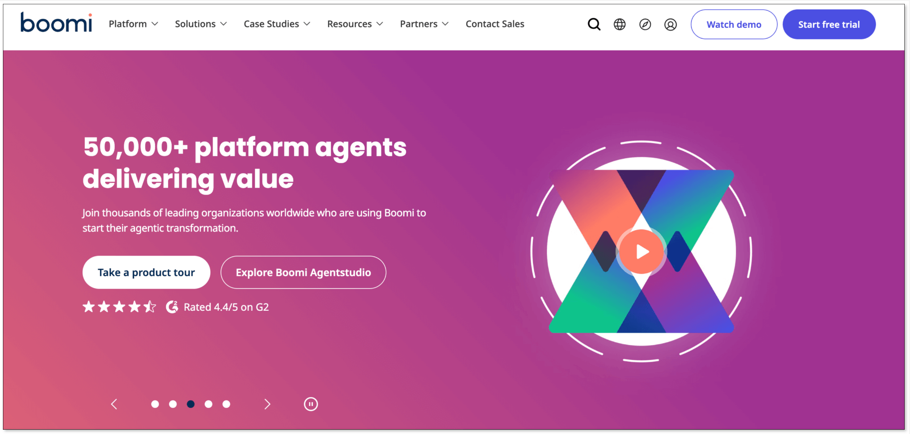
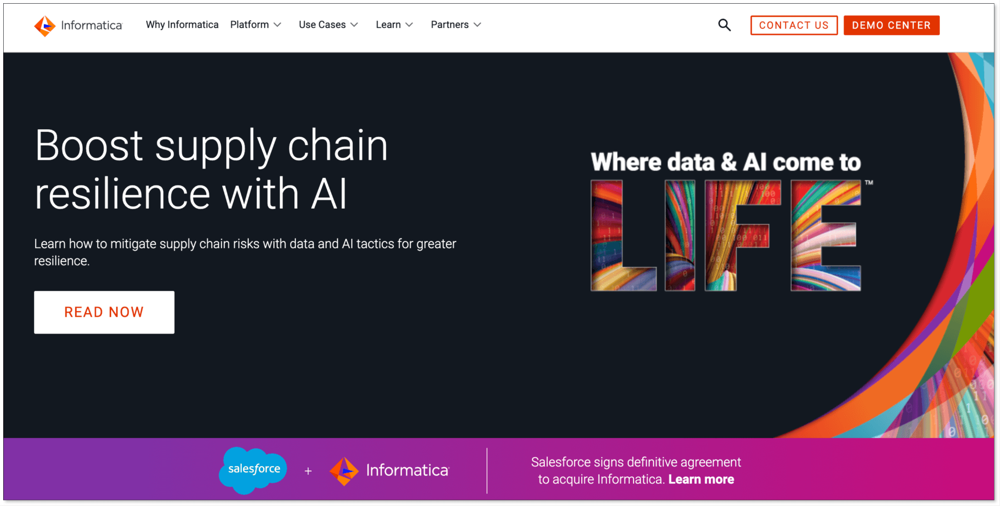
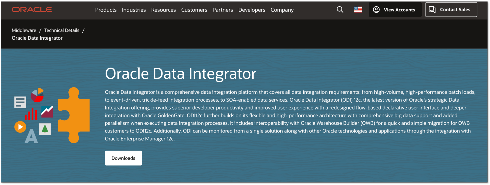

Choosing a data integration platform is no longer just about moving data from point A to point B. Enterprise teams now need real-time synchronization, scalable pipelines, hybrid deployment options, and support for modern analytics and AI workloads.

This guide compares 10 leading data integration tools and platforms in 2026, including managed ELT platforms, CDC-based replication solutions, and enterprise integration systems. It covers strengths, limitations, pricing considerations, pipeline reliability, and ideal use cases.

<!-- truncate -->

## Best Data Integration Tools by Use Case

If you want the short version first, start with the workload you need to solve:

| Use case | Best-fit tools | Why |
| --- | --- | --- |
| Real-time CDC and database replication | BladePipe, Qlik, Estuary, Striim | Capture inserts, updates, and deletes with low latency. |
| Managed warehouse ELT | Fivetran, Hevo, Matillion | Load SaaS and application data into Snowflake, BigQuery, Redshift, or Databricks with less setup. |
| Open-source connector flexibility | Airbyte | Broad connector ecosystem and customizable ingestion. |
| Enterprise ETL and governance | Informatica PowerCenter, Qlik, Boomi | Strong fit for controlled enterprise environments with metadata, lineage, and security needs. |
| Application and API integration | Boomi | Better fit when data movement is tied to application workflows and APIs. |
| Oracle-centric ELT | Oracle Data Integrator | Best when the stack is already heavily Oracle-based. |
| Source-to-target migration and sync | CDC tools, ELT tools, lakehouse ingestion tools | Match the tool to the exact source and target route before shortlisting. |

## How We Rated These Data Integration Tools
“Best-rated” depends on your use case. For this list, we focus on the criteria that most teams use to evaluate modern data integration systems:

- **Reliability**: retries, resume/recovery, ordering, and failure handling
- **Latency**: batch vs streaming/CDC, and freshness requirements
- **Connector coverage**: sources/destinations and maintenance quality
- **Schema evolution**: handling schema drift and DDL changes
- **Transformations**: built-in transforms vs ELT (dbt/SQL) workflows
- **Governance & security**: access control, compliance, and auditability
- **Deployment options**: managed, BYOC, and self-hosted/on-prem
- **Pricing**: cost model and predictability for your workload

## Best Data Integration Tools for Source-to-Target Migration

For the source-to-target projects, the shortlist should be based on latency, schema conversion, CDC support, validation, and cutover risk.

| Source-to-target need | What matters most | Tool categories to compare |
| --- | --- | --- |
| MySQL to Databricks | Full load, incremental sync, schema drift handling, lakehouse ingestion | Managed ELT tools, lakehouse ingestion tools, CDC tools that support the route |
| SQL Server to Databricks | SQL Server change capture, lakehouse file/table format, backfill and replay | Managed ELT tools, lakehouse ingestion tools, migration tools |
| Oracle DB to Databricks | Oracle schema and data type conversion, CDC support, validation | Enterprise migration tools, lakehouse ingestion tools, CDC tools that support the route |
| MySQL to ClickHouse | Low-latency updates, delete handling, high-throughput writes | CDC tools, database replication tools |
| Oracle DB to ClickHouse | Redo-log CDC, schema mapping, data type conversion, validation | CDC replication tools, enterprise data movement platforms |
| SQL Server to ClickHouse | Transaction log capture, type mapping, target write performance | CDC tools, migration tools |
| SAP HANA to ClickHouse | Enterprise source support, permissions, operational monitoring | Enterprise data integration tools |
| SAP HANA to Databricks | Enterprise source support, lakehouse loading pattern, validation | Enterprise ELT tools, lakehouse ingestion tools |
| ServiceNow to ClickHouse | Connector availability, API limits, transformation needs | SaaS ELT tools, iPaaS tools, custom pipeline frameworks |
| NetSuite to Databricks | SaaS API coverage, incremental extraction, warehouse/lakehouse loading | Managed ELT tools, SaaS connectors, lakehouse ingestion tools |
| SaaS apps to Snowflake or BigQuery | Connector coverage and managed operations | Managed ELT platforms |

If the project is mostly SaaS-to-warehouse reporting, managed ELT tools such as Fivetran, Hevo, or Matillion may be enough. If the project depends on fresh database changes, deletes, cutover safety, or source-target consistency, CDC-first platforms such as BladePipe, Qlik, or Estuary are usually more relevant when they support the required source and target.

## What Makes a Data Integration Platform Pipeline Reliable?

Many teams searching for data integration platforms are really asking which platform has the best pipeline for production use. Connector count matters, but pipeline reliability depends on what happens after the first sync starts.

| Pipeline feature | Why it matters |
| --- | --- |
| Resume and retry | Failed jobs should continue from a checkpoint instead of restarting a full load. |
| Schema drift handling | Source DDL changes should not silently break downstream tables or dashboards. |
| CDC latency visibility | Teams need to know when data freshness degrades, not hours later. |
| Backfill and replay | Historical loads and correction runs should be controlled and repeatable. |
| Delete and update handling | A pipeline that only appends rows may be wrong for operational data. |
| Monitoring and alerts | Production teams need clear failure reasons, lag metrics, and notification paths. |
| Data validation | Critical migrations need source-target comparison, not only successful job status. |

For database-to-database or database-to-analytics workloads, CDC capability and validation usually matter more than a large SaaS connector catalog. For SaaS-to-warehouse reporting, connector breadth and managed maintenance often matter more.

## Why Data Integration Tools Matter?
Using a modern data integration platform offers several strategic benefits:

+ **Real-time decision-making:** Streaming pipelines deliver fresh data instantly to analytics dashboards, AI models, and operational systems.
+ **Less engineering effort:** Pre-built connectors and automated pipelines minimize coding and maintenance.
+ **Improved data quality and consistency:** Tools manage schema changes and verify data to reduce errors and inconsistencies.
+ **Scalable performance:** Easily manage growing data volumes and an expanding ecosystem of sources and destinations.
+ **Lower operational costs:** Avoid maintaining custom ETL/ELT infrastructure.
+ **Faster analytics and AI adoption:** Unified, continuously updated data accelerates insights and machine learning.

Industry requirements also affect tool choice. For example, [healthcare data integration](healthcare_data_integration.md) often requires EMR/EHR connectivity, strict access control, auditability, and low-latency updates without stressing clinical systems.

## Top 10 Data Integration Tools
### 1. Airbyte

[Airbyte](https://airbyte.com/) is an open-source ELT platform offering more than 300 pre-built connectors and the ability to create custom connectors for special sources. While primarily batch-oriented, it is popular for its flexibility, extensibility, and strong open-source community.

**Best For:** Teams that want connector breadth and customizable ELT into warehouses.

Choose Airbyte when open-source control and connector customization are more important than strict real-time latency. Watch out for connector quality, self-hosting overhead, and route-specific CDC behavior in production.

**Key Features:**

+ **Open-source and extensible:** Customize or build new connectors easily.
+ **Wide coverage:** Supports 300+ databases, APIs, and SaaS systems.
+ **ELT architecture:** Pushes transformations downstream for flexibility.
+ **Community-driven:** Frequent releases and transparent roadmap.

[**Pricing:**](https://airbyte.com/pricing)

+ Standard plan starts at $10/month.
+ Additional credits at $2.50 each; typical database/file sources priced around $10 per GB synced.

### 2. Fivetran

[Fivetran](https://www.fivetran.com/) is a fully managed ELT platform built for automation and reliability. It synchronizes data from hundreds of sources to major data warehouses with minimal configuration. Schema changes and maintenance are handled automatically, freeing data teams from operational overhead.

**Best For:** Teams that want a hands-off managed ELT experience and minimal pipeline maintenance.

Choose Fivetran when your priority is managed SaaS and warehouse ingestion with little infrastructure ownership. Watch out for usage-based pricing, sync frequency requirements, and whether the connector handles your source changes the way your use case expects.

**Key Features:**

+ **Hands-free pipelines:** Automatic schema updates and maintenance.
+ **Broad connectivity:** 700+ connectors for databases, SaaS, and files.
+ **Cloud-native analytics:** Integrates with Snowflake, BigQuery, and other cloud targets.

[**Pricing:**](https://www.fivetran.com/pricing)

Usage-based pricing by Monthly Active Rows (MAR). Many users complain that the pricing is [highly unpredictable](https://www.reddit.com/r/dataengineering/comments/1ii4ry5/fivetran_pricing/) due to the complex pricing model.

### 3. BladePipe

[**BladePipe**](https://www.bladepipe.com/) is a **real-time, end-to-end data integration platform** built for teams of all sizes. With [60+ pre-built connectors](https://www.bladepipe.com/connector/) and [CDC-based](change_data_capture_cdc.md) replication, it moves data seamlessly with **sub-second latency**. Its **no-code interface** simplifies setup for real-time analytics and AI workloads, while **flexible deployment options** (On-prem/BYOC/fully managed) adapt to any environment.

**Best For:** Near real-time CDC pipelines where correctness, verification, and schema evolution matter.

Choose BladePipe for supported database, messaging, and analytics routes where low-latency replication, DDL handling, and source-target verification are central requirements. Watch out for route fit if your project is primarily SaaS-to-lakehouse ELT or needs a very broad API connector catalog.

**Key Features:**

+ **Real-time CDC**: Keeps data up to date with sub-second latency. 
+ **Flexible data transformation**: Supports filtering and mapping, and has multiple built-in data transformation scripts. Complex transformations can be done using custom Java code.
+ **High data integrity**: Built-in schema evolution, [data verification and correction](https://www.bladepipe.com/docs/operation/job_manage/create_job/create_period_verification_correction_job/).
+ **Enhanced stability**: Enables resumable data sync, automatic failover, and [alert notification](https://www.bladepipe.com/docs/operation/job_manage/job_op/job_alarm/), ensuring healthy pipelines.
+ **Multiple deployment options**: Offers on-premise, SaaS managed and BYOC modes for deployment, giving flexibility for various sizes of teams.

[**Pricing:**](https://www.bladepipe.com/pricing/)

+ **Cloud**: Pay-as-you-go model. Example, $0.01 per million rows processed for Cloud. Pricing varies by operation type.
+ **Enterprise**: Custom quote based on the number of pipelines and the duration.

### 4. Estuary Flow

[Estuary Flow](https://estuary.dev/) is a unified data movement platform built for real-time and batch processing. It connects databases, streams, and SaaS apps through no-code pipelines that support CDC and durable streaming. With integrated transformation via SQL or TypeScript, teams can deliver low-latency analytics without managing infrastructure.

**Best For:** Unified streaming + batch pipelines with durable CDC and minimal infrastructure management.

**Key Features:**

+ **Unified streaming and batch:** Combines real-time CDC with batch ingestion.
+ **Automated setup:** Build, deploy, and monitor pipelines with minimal engineering.
+ **Scalable architecture:** Handles high-volume data flow across hybrid environments.
+ **Data transformations:** Supports SQL and TypeScript transformations and dbt for ELT.

[**Pricing:**](https://estuary.dev/pricing/)

+ **Free**: Up to 10 GB/month with 2 connector instances.
+ **Cloud**: $0.50 per GB of change data moved; a connector instance is typically $100/month for first six.
+ **Enterprise**: Custom quote based on specific requirements.

### 5. Qlik

[Qlik](https://www.qlik.com/us) Data Integration is an enterprise-grade platform that automates data ingestion, transformation, and delivery across hybrid and multi-cloud systems. Its visual interface and built-in governance make it a strong choice for large-scale, compliance-focused organizations.

**Best For:** Enterprise data replication with governance across hybrid and multi-cloud environments.

Choose Qlik when enterprise governance, heterogeneous replication, and commercial support are more important than lightweight setup. Watch out for procurement complexity and the operational model required for your environment.

**Key Features:**

+ **Visual design:** Drag-and-drop integration for rapid development.
+ **Real-time replication:** Supports CDC and hybrid [cloud pipelines](what_is_cloud_data_integration.md).
+ **Data governance:** Centralized metadata and lineage tracking.
+ **Scalable deployment:** Optimized for complex enterprise architectures.

[**Pricing:**](https://www.qlik.com/us/pricing/data-integration-products-pricing)

+ **Starter**: Starts at $200/month, including 10 users and 25 GB data for analysis.
+ **Standard**: Starts at $825/month. Starts with 25 GB of data for analysis.
+ **Premium**: Starts at $825/month. Starts with 50 GB of data for analysis.
+ **Enterprise**: Custom quote on request.

### 6. Matillion

[Matillion](https://www.matillion.com/) is a cloud-native ETL and ELT platform tailored for modern warehouses like Snowflake, Redshift, and BigQuery. It provides a visual interface and scripting flexibility to design, orchestrate, and monitor complex data transformations at scale.

**Best For:** Warehouse-first teams building transformation-heavy pipelines for Snowflake/Redshift/BigQuery.

**Key Features:**

+ **Visual workflows:** Intuitive drag-and-drop pipeline builder.
+ **Multi-language support:** SQL, Python, and dbt integration.
+ **Transformation-rich:** Handles advanced logic with reusable components.
+ **Cloud-native integration:** Seamlessly fits into major cloud data ecosystems.

[**Pricing:**](https://www.matillion.com/pricing)

Typical pricing starts at around $1,000/month and includes 500 credits. Credits often priced around $2–$2.50 per virtual core hour depending on plan.

### 7. Hevo Data

[Hevo Data](https://hevodata.com/) is a no-code data integration platform designed for real-time analytics. With 150+ connectors and event-based billing, it allows teams to automate ingestion, transformation, and monitoring without writing code.

**Best For:** No-code ingestion for analytics teams that want quick setup and broad warehouse destinations.

**Key Features:**

+ **No-code UI:** Drag-and-drop pipeline creation.
+ **Automation-first design:** Minimal setup, automatic schema mapping.
+ **Reverse ETL support**: Allows to turn processed data back to data stored in operation systems.

[**Pricing:**](https://hevodata.com/pricing/pipeline/)

+ **Free**: 1M events/month for limited connectors.
+ **Starter**: Starts from $239/month for 5M events.
+ **Professional**: Starts from $679/month for 20M events.
+ **Business Critical**: Custom quote on demand.

### 8. Boomi

[Boomi](https://boomi.com/) is a cloud-based Integration Platform as a Service (iPaaS) that connects data, applications, and APIs. It offers visual workflow design, automation, and governance, helping enterprises unify systems across cloud and on-prem environments.

**Best For:** iPaaS workflows that integrate data + applications + APIs with governance and automation.

**Key Features:**

+ **Comprehensive integration:** Data, applications, and APIs in one platform.
+ **Visual workflow builder:** Intuitive drag-and-drop interface.
+ **Monitoring and alerts:** Tracks workflow health and performance.
+ **Security and compliance:** Enterprise-grade controls and certifications.

[**Pricing:**](https://boomi.com/pricing/)

+ **Pay-as-you-go**: Starts at $99/month plus usage.
+ **Subscription plan**: Varies based on the connectors and required features.

### 9. Informatica PowerCenter

[Informatica PowerCenter](https://www.informatica.com/) is a proven enterprise ETL solution designed for large-scale, mission-critical workloads. It provides advanced data transformation, metadata management, and orchestration for highly governed data environments.

**Best For:** Highly governed enterprise ETL with complex workflows, metadata, and lineage.

**Key Features:**

+ **Robust ETL engine:** Handles complex transformations and dependencies.
+ **Workflow orchestration:** Automates multi-stage integration jobs.
+ **Metadata-driven design:** Manages a repository for metadata. Tracks lineage and schema evolution.

[**Pricing:**](https://www.informatica.com/products/cloud-integration/pricing.html)

Pricing varies depending on the enterprise size, required features, etc. Contact Informatica sales for a quotation.

### 10. Oracle Data Integrator (ODI)

[Oracle Data Integrator (ODI) ](https://www.oracle.com/middleware/technologies/data-integrator.html)is an enterprise ELT platform optimized for Oracle databases and cloud services. It uses push-down processing to perform transformations directly inside the target database for maximum efficiency.

**Best For:** Oracle-centric ELT where push-down transformations and OCI integration are priorities.

**Key Features:**

+ **Push-down ELT:** Executes transformations where data lives for high performance.
+ **Rich transformation library:** Supports advanced logic and mappings.
+ **Deep Oracle integration:** Native support for Oracle DB, OCI, and Exadata.

[**Pricing:**](https://www.oracle.com/integration/pricing/)

+ **Oracle Data Integrator Cloud Service**: $0.7742/OCPU per hour
+ **Oracle Data Integrator Cloud Service (BYOL)**: $0.1935/OCPU per hour

## How to Choose the Right Data Integration Tool
When selecting a data integration tool, consider the following factors:

+ **Data latency:** Determine whether real-time streaming or periodic batch processing suits your needs.
+ **Source and target coverage:** Ensure the tool supports your databases, SaaS apps, message queues, files, and destinations like warehouses or lakes.
+ **Scalability:** The tool should handle current and future data volumes efficiently.
+ **Data quality and governance:** Look for validation, error correction, and schema management features.
+ **Reliability and correctness:** Prioritize tools that can recover cleanly from failures (retries, resume-from-offset, backpressure) and provide a way to prove data matches the source over time.
+ **Deployment flexibility:** Check whether the deployment options meet your demand.
+ **Cost:** Choose a tool with transparent, predictable pricing that fits your data scale.
+ **Security and compliance:** Ensure enterprise-grade security, access control, and regulatory compliance.
+ **Ecosystem compatibility:** The tool should integrate with your BI, AI, and data lakehouse systems and support future growth.

## Wrapping Up
The data landscape in 2026 demands more than just connectivity. It demands **speed, reliability, and adaptability**. Whether your goal is to power real-time dashboards, feed AI models, or unify enterprise systems, the right data integration platform can dramatically reduce engineering overhead and accelerate decision-making.

+ **For real-time processing pipelines**, choose a tool like **BladePipe**. 
+ **For flexibility and customization**, open-source platforms like **Airbyte** are ideal.
+ **For a fully managed solution**, **Fivetran** or **Qlik** can be considered.

If your team needs **sub-second replication, schema evolution, and verifiable data integrity** across systems, **BladePipe** provides a no-code/low-code way to make your data always ready for analytics and AI.

[**Try BladePipe for free**](https://www.bladepipe.com/) to see how fast your pipelines can be.

## FAQ

### What are the best modern data integration systems?

The best modern data integration systems depend on your architecture. For broad enterprise shortlists, teams commonly compare BladePipe, Fivetran, Qlik, Boomi, Informatica, and Airbyte. The right choice depends on whether you care most about CDC, governance, ELT convenience, or deployment flexibility.

### What is the difference between a data integration tool and a data pipeline tool?

A data integration tool focuses on connecting systems and moving or synchronizing data between them. A data pipeline tool is a broader category that can also include orchestration, transformation, observability, and streaming infrastructure. If you want a broader pipeline-stack view, see [best data pipeline tools](best_data_pipeline_tools.md).

### What is the best data integration software for source-to-target migration?

The best data integration software depends on the exact source and target. For database routes, prioritize CDC support, schema mapping, delete handling, validation, and cutover recovery. For SaaS-to-warehouse routes, prioritize connector coverage, API reliability, and managed maintenance.

### Which data integration tools support real-time CDC?

Several enterprise-ready tools support real-time CDC, including BladePipe, Qlik, and Estuary. Others are stronger in batch ELT or near-real-time warehouse sync rather than true low-latency CDC.

### Are open-source data integration tools good for production?

Open-source data integration tools can work well in production when your team can own deployment, upgrades, monitoring, and connector debugging. If you have limited platform engineering capacity, a managed data integration platform may have a lower total cost of ownership.

### Which data integration platform is best for enterprise governance?

Governance-heavy teams often evaluate Informatica, Qlik, and Boomi because of lineage, metadata, security controls, and hybrid-enterprise support. Teams that also need stronger CDC and verification often compare those options with BladePipe.

> **Suggested Reading**
>  
> - [10 Best Data Migration Tools](best_data_migration_tools.md)
> - [7 Best CDC Tools](top_cdc_tool.md)
> - [8 Best ETL Tools](best_etl_tool_for_small_business.md)
