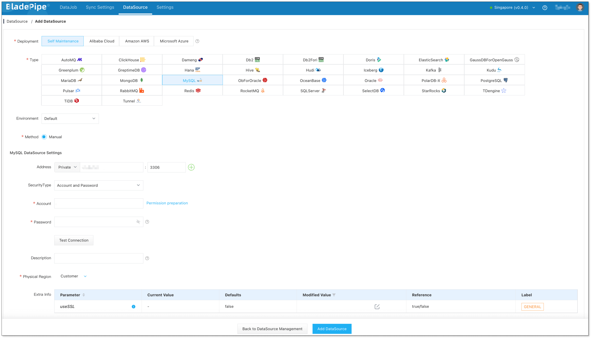
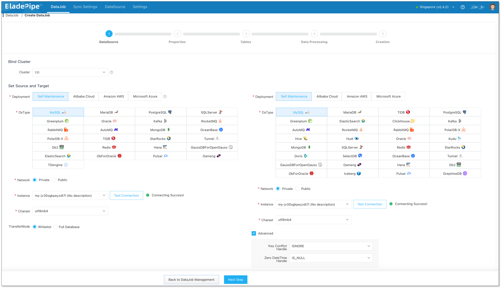
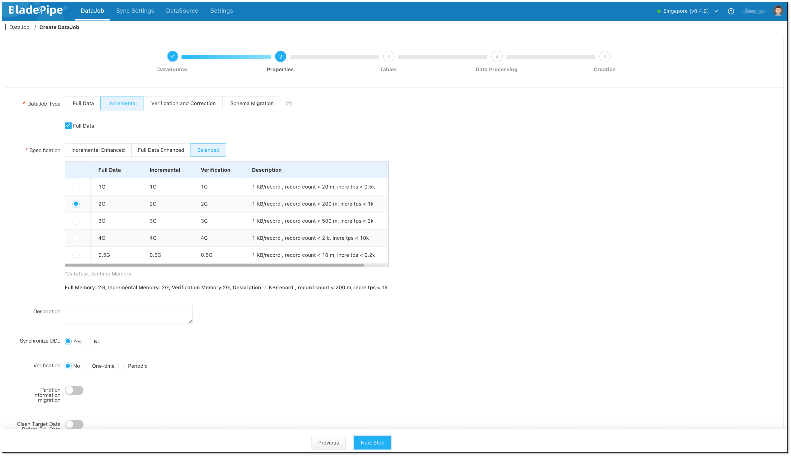
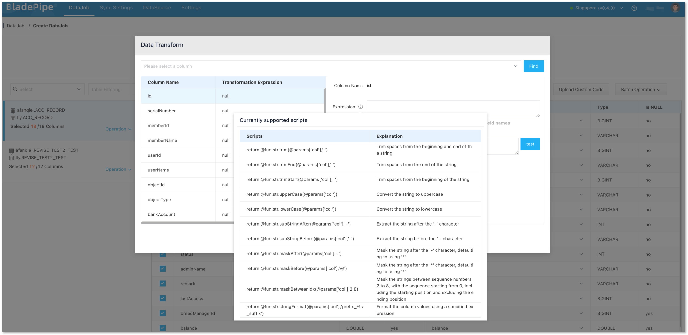
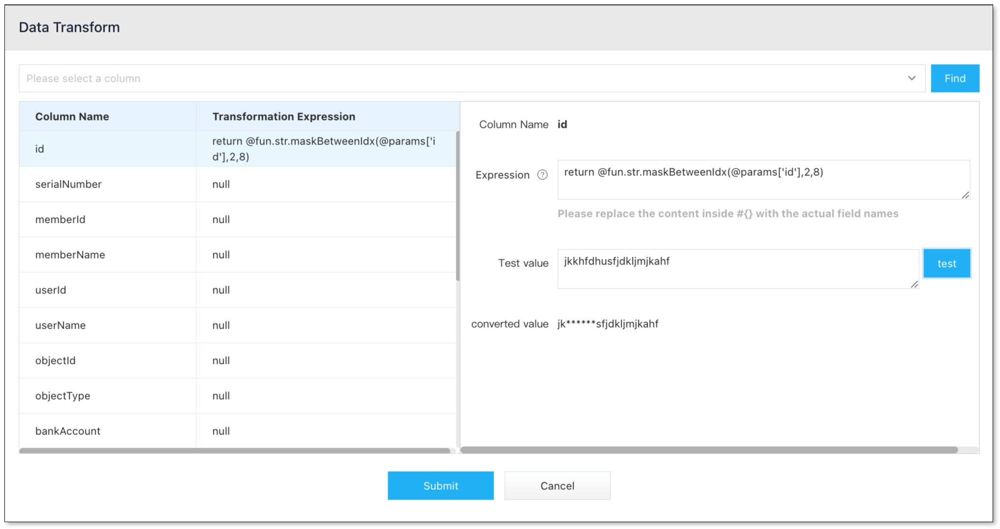
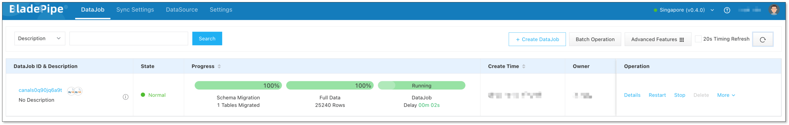

In today’s data-driven world, keeping sensitive information safe is more important than ever. That’s where data masking comes in. It hides or replaces private data so teams can work freely without risking exposure. In this blog, we’ll dive into data masking—what it is, when to use it, and how modern tools make it easy to mask your data as you move it. 

## What is Data Masking?

When moving or syncing data, especially personally identifiable information (PII), data masking is a key step. It keeps your data safe, private, and compliant—especially when you're migrating, testing, or sharing data. Any time sensitive data is being transferred, data masking should be part of the plan. It helps prevent leaks and protects your business.

There are two main types of data masking: static and dynamic.

**Static data masking** means masking data in bulk. It creates a new dataset where sensitive information is hidden or replaced. This masked data is safe to use in non-production environments like development, testing, or analytics. 

**Dynamic data masking** happens in real-time. It shows different data to different users based on their roles or permissions. It is usually used in live production systems.

In this blog, we'll focus on static data masking, and how to statically mask data in data replication.

## Use Cases

Data masking is useful in many situations where there’s a risk of data breach. It’s especially important when people from different departments—or even outside the organization—need to access the data. Masking keeps private information safe and secure.

Once data is statically masked and separated from the live production system, teams of different departments can use it freely—read it, write it, test with it—without risking the real data. Here are some common use cases for static data masking:

- **Software development and testing** Developers often need real data to test new features or troubleshoot bugs. But dev environments usually aren’t as secure as production environments. Static masking hides the sensitive parts of the data, so developers can work safely without seeing private info.

- **Scientific research:** Researchers need lots of real-world data to get meaningful results. But using raw data with personal or sensitive info is not compliant with privacy laws. With data masking, researchers get access to realistic data, just without the sensitive details, keeping things both useful and compliant.

- **Data sharing:** Businesses often need to share data with partners or third-party vendors. Sharing raw data is risky for the potential of data breach. Masking it first removes that risk. Partners get the insights they need, but none of the sensitive stuff. It’s a win-win for privacy and collaboration.

## Common Static Data Masking Techniques

There are several ways to apply static data masking. Each method helps hide sensitive information.

| Masking Type |  How It Works | Example |
| --- | --- | --- |
| Substitution | Replace real data with fake but seemingly realistic values | Rose → Monica |
| Shuffling | Mix up the order of characters or fields | 12345 → 54123 |
| Encryption | Use algorithms like AES or RSA to encrypt the data | 123456 → Xy1#Rt |
| Masking | Hide part of the data with asterisks | 13812345678 → 138**5678 |
| Truncation | Keep only part of the original data | 622712345678 → 6227 |

## Data Masking in Real-time Replication

In the use cases mentioned above, we often need both data migration/syncing and data masking. The best approach? Mask the data during the sync process itself. That way, teams get masked data right away—no need for extra tools. It’s faster, simpler, and safer. Plus, it lowers the risk of leaks and helps you stay compliant.

BladePipe, a professional end-to-end data replication tool, makes this easy. It supports data transformation during sync. Before, users had to write custom code to do masking while syncing, which is not ideal for non-developers. Now, with BladePipe’s new scripting support, masking can be done with built-in scripts. You can set masking rules for specific fields. When the data sync task runs, it automatically calls the script and applies the transformation. That means: **“Sync and mask data at the same time.”**

This works for full data migration, incremental sync, data verification and correction.

BladePipe now supports built-in masking rules, including masking and truncation. You can mask your data in several flexible ways:
- Keep only the part **after** a certain character
- Keep only the part **before** a certain character
- Mask the part **after** a certain character
- Mask teh part **before** a certain character
- Mask **a specific part** of the string

## Procedure

Here we show how to mask data in real time while replicating data from MySQL to MySQL.

### Step 1: Install BladePipe

Follow the instructions in [Install Worker (Docker)](https://www.bladepipe.com/docs/productOP/byoc/installation/install_worker_docker/) or [Install Worker (Binary)](https://www.bladepipe.com/docs/productOP/byoc/installation/install_worker_binary/) to download and install a BladePipe Worker.

### Step 2: Add DataSources

1. Log in to the [BladePipe Cloud](https://cloud.bladepipe.com).
2. Click **DataSource** > **Add DataSource**.
3. Select the source and target DataSource type, and fill out the setup form respectively.

### Step 3: Create a DataJob

1. Click **DataJob** > [**Create DataJob**](https://doc.bladepipe.com/operation/job_manage/create_job/create_full_incre_task/).
2. Select the source and target DataSources.
   
3. Select **Incremental** for DataJob Type, together with the **Full Data** option.
   
4. Select the tables to be replicated.
5. In the **Data Processing** step, select the table on the left side of the page and click **Operation** > **Data Transform**.
6. Select the column(s) that need data transformation, and click the icon next to **Expression** on the right side of the dialog box. Select the data transformation script in the pop-up dialog box, and click it to automatically copy the script.
    
7. Paste the copied script into the **Expression** input box, and replace `col` in @params['col'] of the script with the corresponding column name.
8. In the **Test Value** input box, enter a test value and click **Test**. Then you can view how the data is masked.
   
9.   Confirm the DataJob creation.
10. Now the DataJob is created and started. The selected data is being masked in real time when moving to the target instance. 
  

## Wrapping Up
Data masking isn’t just a checkbox for compliance—it’s a smart move to protect your business and your users. Especially when working with real data in non-production environments or sharing it with others, static data masking gives you the safety net you need without slowing things down.

By integrating data masking directly into the data migration and sync process, tools like BladePipe make it easier than ever. No more juggling extra tools or writing custom code. You get clean, safe, ready-to-use data—all in one smooth step.

Whether you're testing, analyzing, or sharing data, masking should be part of your workflow. And now, it’s finally simple enough for everyone to use.