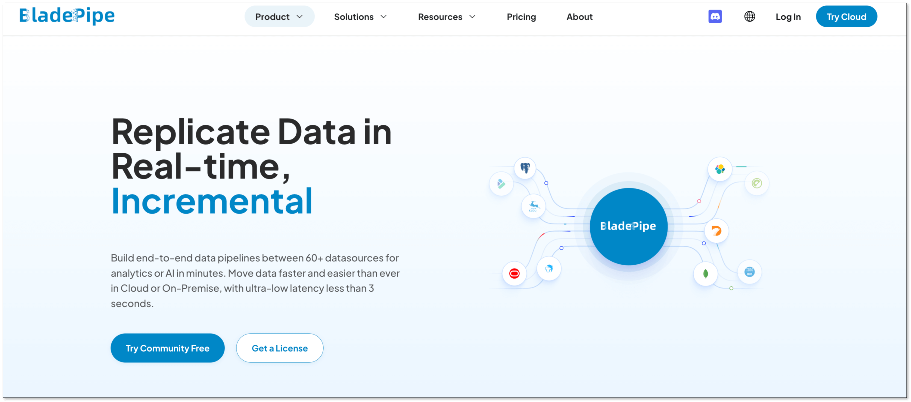
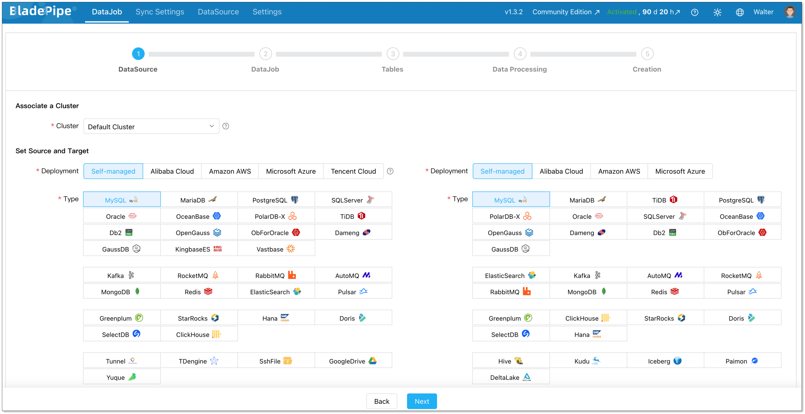
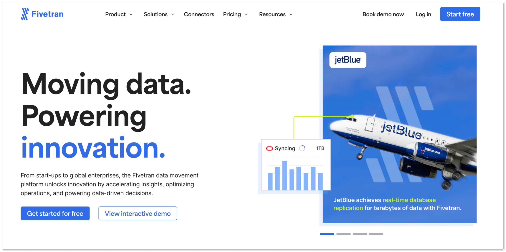
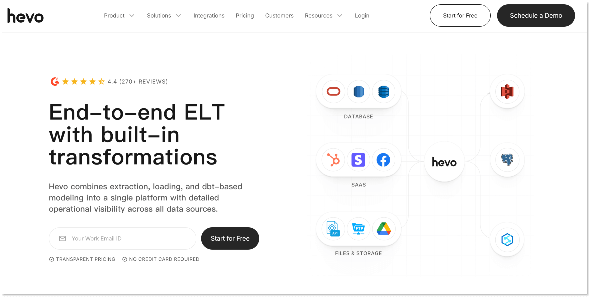
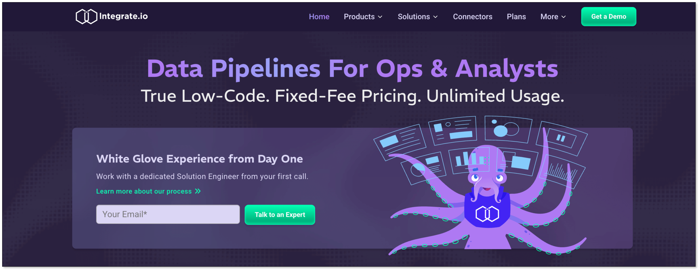
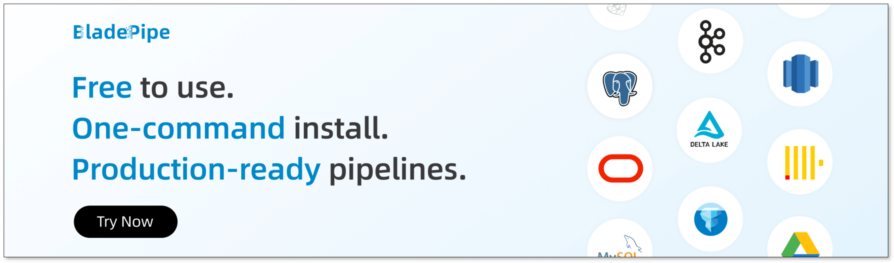

Your dashboard shows outdated numbers. A migration fails halfway. A schema change silently breaks a pipeline overnight. Sound familiar? Behind many data issues is one common root cause: unreliable data movement. That’s why choosing the right data replication solutions matters more than most teams realize.

In this guide, we’ll break down how data replication works, the trade-offs between different replication models, modern data replication solutions, and how to choose the right tool for your architecture.

## What Is Data Replication?
Data replication is the process of copying data from a source system to one or more target systems. The goal is to ensure that data remains consistent, accessible, and resilient, even in distributed or hybrid environments. 

Unlike backup, replication is continuous. It keeps systems aligned in near real time or at scheduled intervals. By implementing data replication, organizations can:

+ Reduce downtime and improve system reliability.
+ Facilitate disaster recovery and business continuity.
+ Improve application performance by distributing workloads across multiple servers.

At scale, replication is not just about copying data. It is about maintaining transactional order, handling schema changes, and minimizing impact on production systems.

## Types of Data Replication
While the concept sounds simple, the underlying mechanics can be quite complex, particularly when deciding when and how the data gets written to the replica. This brings us to the three primary types of data replication.

### Synchronous Data Replication
In a synchronous setup, a write is only considered successful after the data is written on both the primary and replica, so copies stay in lockstep.

+ **Pros:** Strong consistency between systems.
+ **Cons:** Higher latency, sensitive to network delays.
+ **Use Cases**: Mission‑critical OLTP, financial systems.

### Asynchronous Data Replication
In an asynchronous setup, a write is acknowledged as soon as it is committed on the primary. Changes are shipped to replicas later, often in the background or in batches.

+ **Pros:** Faster performance and less impact on production workloads.
+ **Cons:** Risk of temporary data inconsistency.
+ **Use Cases**: Analytics replication, disaster recovery, reporting systems

### Near-Synchronous Data Replication
To balance performance and consistency, here comes near‑synchronous replication. It is a middle ground between synchronous and asynchronous replication. It introduces only a very small, controlled delay before data is copied to the replicas, reducing both latency impact and potential data loss. That makes it an ideal choice for most of teams requiring both speed and accuracy.

## Modern Data Replication Solutions
As data environments have evolved, so too have the solutions designed to sync them. Today, modern replication tools are generally categorized by their deployment environments and their speed.

### For Cloud Environments
The shift to the cloud has birthed new replication solutions built specifically for distributed, scalable architectures.

+ **Cloud-Native Managed Services:** These are SaaS-based data replication solutions that operate entirely in the cloud. They require zero infrastructure management, scale automatically, and specialize in moving data from various SaaS apps and on-premise databases into cloud data warehouses (like Snowflake, BigQuery, or Redshift).
+ **Multi-Cloud and Hybrid Replication:** Many enterprises don't rely on just one cloud provider. Hybrid solutions allow data to flow seamlessly from an on-premise legacy Oracle database into an AWS environment, or from Azure to Google Cloud, ensuring high availability and avoiding vendor lock-in.

### For Real-Time Replication
Historically, data was replicated in nightly batches (ETL). Today, businesses need to make decisions by the second. That birthed the solutions for [real-time needs](https://www.bladepipe.com/real-time-analytics/).

+ [**Change Data Capture (CDC)**](https://www.bladepipe.com/blog/data_insights/top_cdc_tool/)**:** CDC is the gold standard for real-time data replication. Instead of copying entire tables, CDC tools capture only changes by reading the database's transaction logs, and then deliver them to the target instantly. This results in ultra-low latency (often sub-second) and minimal impact on the source's performance.
+ **Streaming Replication:** Utilizing message brokers like [Apache Kafka](https://www.bladepipe.com/blog/tech_share/mysql_kafka_sync/), these solutions stream continuous flows of data across systems, ideal for real-time analytics, fraud detection, and live operational dashboards.

## How to Choose the Right Tool
With dozens of tools on the market, selecting the right one requires a strategic evaluation of your business needs. Consider the following criteria:

+ **Latency Requirements:** Do you need real-time data for operational dashboards, or are hourly/daily batch updates sufficient for your analytics? If you need real-time, prioritize tools with strong Log-based CDC capabilities.
+ **Source and Target Connectors:** Audit your current data stack. The right tool should have [pre-built, native connectors](https://www.bladepipe.com/connector/) for your specific databases, SaaS apps, and data warehouses.
+ **Ease of Use:** Does the tool require a team of specialized data engineers to write complex code, or does it offer an intuitive, no-code/low-code visual interface? In most cases, a simple, automated tool is better considering the long-term maintanence cost.
+ **Deployment Options:** Determine if your compliance team requires you to keep data entirely within your own Virtual Private Cloud (BYOC/Self-hosted) or if a fully managed SaaS solution is acceptable.
+ **Pricing Model:** Pricing structures vary wildly. Some charge by the volume of data processed, which can may be expensive as data scales. Others charge a flat rate per connector or pipeline. Choose a model that aligns with your projected data growth.

## Top 5 Data Replication Tools Worth Considering
Based on performance, scalability, ease of use, and feature sets, here's a curated list of popular data replication solutions for various scenarios in 2026.

### 1. BladePipe

[BladePipe](https://www.bladepipe.com/) is a modern, high-performance solution specializing in real-time Change Data Capture (CDC). It is designed for teams that prioritize ultra-low latency, reliability and automation. With an intuitive UI, even non-engineers can build and manage pipelines in minutes.

**Features:**
+ **Real-time Delivery**: Captures row-level changes without impacting source performance.
+ **Automated Schema Evolution**: Automatically handles DDL changes and table migrations.
+ **Transformation Variety**: Provides various [built-in transformations](https://www.bladepipe.com/docs/operation/job_manage/job_op/data_transform/) and flexibility with Java custom code.
+ **Deployment Flexibility**: Offers fully managed Cloud SaaS, BYOC, and On-Premise options.
+ **Ease of Use**: All operations can be done through clicks in the interface.

[**Pricing**](https://www.bladepipe.com/pricing/)**:**
+ **Free Community**: Self-hosted. For new users, you'll get the tool activated for 15 days automatically. Then you'll need to renew free license every 3 months.
+ **Cloud**: **Pay-as-you-go** pricing model. Start at $0.01 for every million rows of data. It is pre-paid based and you'll get the bill every day, ensuring the maximum cost predictability.
+ **Enterprise**: **Quote-based** pricing model. Contact the sales team for a price tailored to your specific needs. 

#### **3 Steps to Set Up a Pipeline**  
Setting up a high-performance pipeline in BladePipe takes just minutes without writing a single line of code:

1. [Install BladePipe](https://www.bladepipe.com/docs/productOP/onPremise/installation/install_all_in_one_docker/) using one command.
2. Connect your source and target databases.
3. Define your replication type (Full or Incremental) and select the tables/columns to sync.

### 2. Fivetran

Fivetran is a fully managed, cloud-native data replication tool that automates ETL process. With a massive library of over 700 fully managed connectors, Fivetran is used by many companies for centralizing data from SaaS applications into cloud data warehouses for analytics. 

**Features:**
+ **700+ Connectors:** The largest library of pre-built integrations in the market.
+ **Automated Schema Management:** Automatically adjusts target tables when source schemas change.
+ **High Availability:** Managed infrastructure ensures 99.9% uptime.

**Pricing:**    
Fivetran pricing is based on Monthly Active Rows (MAR). That means you pay based on the number of unique rows updated or inserted each month across your connectors. Such a pricing model makes costs highly unpredictable. 

Besides, since Jan, 2026, users have to pay a $5 base charge per connection for usage under 1M MAR, then scales with volume.

### 3. Oracle GoldenGate

Oracle GoldenGate is a robust software suite for real-time data integration, providing sub-second latency for large-scale enterprise data fabrics. It offers transactional consistency and extreme performance, often used in financial services, telecom, and large enterprises.

However, it is a complex middleware solution that requires specialized engineering expertise to configure, manage, and troubleshoot, making it overkill for smaller or purely cloud-native analytics setups.

**Features:**
+ **Extreme Performance:** Capable of handling millions of transactions per second.
+ **High Scalability:** Supports petabyte-scale databases.
+ **Bidirectional Sync:** Enables active-active database configurations for zero downtime.

**Pricing:**
+ **OCI GoldenGate (Standard)**: $1.3441 per OCPU/hour
+ **OCI GoldenGate (BYOL)**: ~$0.3226 per OCPU/hour.

### 4. Hevo Data

Hevo is a user-friendly, no-code platform that bridges the gap between simple SaaS integration and complex database replication. It supports over 150 integrations, and provides both ETL and ELT capabilities, allowing users to cleanse and shape data before it hits the warehouse.

**Features:**
+ **Python Transformations:** Allows users to write custom logic in-flight using Python.
+ **Reverse ETL:** Move data from your warehouse back into operational tools.
+ **Real-Time Monitoring:** Granular dashboards to track pipeline health.

**Pricing:**
+ **Free**: Free to use for up to 1 million events and limited connectors.
+ **Starter**: Start at $299/month for up to 5 million events ($239 if billed annually).
+ **Professional**: Start at $849/month for up to 20 million events ($679 if billed annually).
+ **Business Critical**: Quote-based pricing.

### 5. Integrate.io

Integrate.io is a low-code data integration platform that focuses on making ETL, ELT, and Reverse ETL accessible to non-engineers. It features powerful in-pipeline data engine transformations, allowing you to prep and clean data before it reaches the warehouse, saving on cloud computing costs at the destination.

**Features:**

+ **Visual UI:** Drag-and-drop interface with 220+ transformation operations.
+ **Data Observability:** Built-in alerts to identify data quality issues before they reach the warehouse.
+ **Data Security:** Strong compliance including HIPAA, GDPR, and SOC 2.

**Pricing:**
+ **Core**: $1,999/month 

## Quick Comparison of Tools
| **Feature / Tool** | **BladePipe** | **Fivetran** | **Oracle GoldenGate** | **Hevo Data** | **Integrate.io** |
| --- | --- | --- | --- | --- | --- |
| **Deployment** | Cloud/On-prem | Cloud | Cloud/On-prem | Cloud | Cloud |
| **Latency** | < 3 seconds   | > 1 minute | Sub-second (Real-time) | > 1 minute | 60-second CDC / Batch |
| **Schema Management** | Automated | Automated | Manual / Complex | Automated | Configurable |
| **Ease of Use** | High | High | Medium | High | Medium |
| **Pricing Model** | Free / $0.01 per million rows of data | Monthly Active Rows (MAR) + $5+ base charge per connection | $1.3441 per OCPU/hour | Free / $299+ per month | $1,999 per month |

## Best Practices for Designing Your Data Replication Solution
To ensure your data replication architecture is robust, scalable, and secure, adhere to these industry best practices:

+ **Embrace Log-Based CDC:** Whenever possible, avoid query-based extraction that puts a heavy load on your production databases. Use log-based CDC to read database changes silently and efficiently.
+ **Automate Schema Evolution:** Choose a tool that automatically propagates DDL changes from the source to the target. If a developer adds a new column to a production table, your pipeline should adapt without breaking.
+ **Implement Strict Data Governance:** Migration and replication don't excuse you from compliance. Ensure data is encrypted in transit and at rest. Utilize tools with Role-Based Access Control (RBAC) and robust audit logging.
+ **Monitor and Alert:** Utilize integrated dashboards to monitor data freshness, pipeline latency, and throughput. Set up automated webhook or email alerts for pipeline failures or latency spikes.
+ **Validate Your Data:** Implement automated [data verification](https://www.bladepipe.com/blog/data_insights/data_verification/). Periodically compare row counts and data types between the source and target to guarantee consistency.

## Conclusion
Data replication solutions don’t have to be complicated. At the core, you just want your data to move safely and quickly from one system to another. Sometimes you need real-time updates. Sometimes batch is enough. Sometimes schema changes break everything, and you spend hours fixing pipelines. The real goal is simple: stable pipelines, low latency, and fewer surprises.

There are many tools that can help. Some are built for large enterprises. Some are fully managed for analytics teams. If you’re looking for a developer-friendly option that focuses on real-time replication, automatic schema evolution, and fast setup, [**BladePipe**](https://www.bladepipe.com/login/) is worth exploring. It keeps the process straightforward, so you can spend less time managing pipelines and more time using your data.

## FAQ
**Q: What is the difference between replication and synchronization?**       
While often used interchangeably, there is a subtle difference. Replication copies data to multiple systems for consistency and availability, while synchronization ensures two systems are identical at all times, sometimes requiring bi-directional updates.

**Q: How does schema evolution affect replication?**       
Schema changes, such as adding or altering columns, can break replication pipelines, causing data loss or downtime until an engineer fixed the mapping. Tools with automatic schema evolution handle these changes seamlessly without manual intervention.

**Q: How to choose a reliable data replication service provider?**       
Look for providers that offer robust SLAs (Service Level Agreements), high availability architecture, and excellent customer support. It is highly recommended to utilize free trials to test a provider's true latency and ease of use in a staging environment before committing.

**Q: Are there any affordable data replication tools for small businesses?**       
Yes. Tools like **BladePipe** and **Hevo** provide cloud-based, pay-as-you-go or free-tier options suitable for small businesses with limited budgets.  
