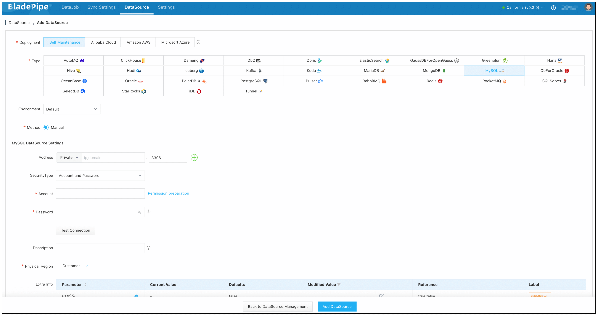
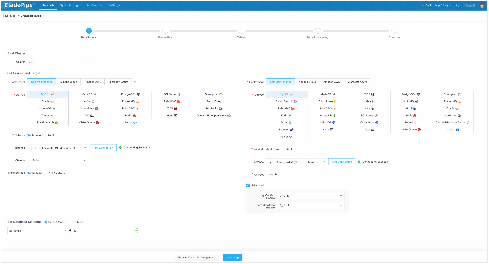
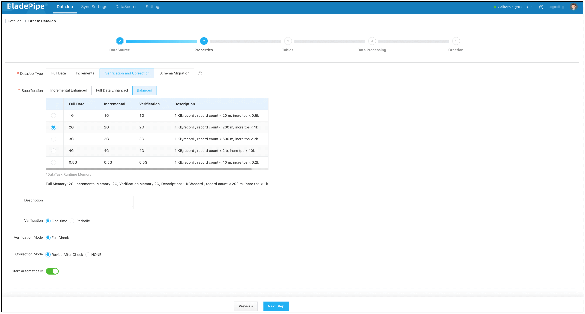
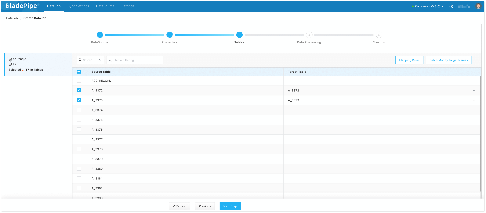
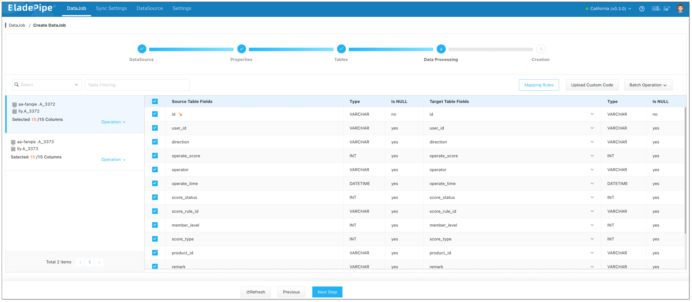
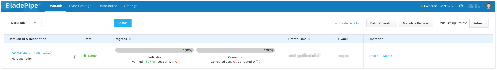

When data moves from one system to another, you may have a question: does all the data stored in the target system in a correct way? If not, how can I identify the missing or wrong data? Data verification is introduced to resolve your concern. Verification acts as a safeguard, ensuring that all data is accurately replicated, intact, and functional in the new system.

## What is Data Verification?
Data verification is the process of ensuring that all data has been accurately and completely replicated from the source instance to the target instance. It involves validating data integrity, consistency, and correctness to confirm that no data is lost, altered, or corrupted during the replication process.

## Why Data Verification is Needed?

### Ensuring Data Quality
In data replication, some data records may be skipped or failed to move to the target instance. That results in data loss and inconsistencies. Verification plays a key role in ensuring that data is completely and accurately moved from the source to the target. 

Key aspects of data verification:
- **Completeness**: Ensure that all data of the source instance is present in the target instance.
- **Integrity**: Confirm that the data has not been altered or tampered with.
- **Consistency**: Verify that the data in the source instance is in line with that in the target instance.

### Enhancing Data Reliability
Stakeholders, including users and management, need confidence that the data replication is successfully done. Data verification provides solid evidence on data reliability. When data is verified, users have more trust in what they get, and more confidence to use the data for analytics.

### Supporting Decision-making
Accurate and complete data is the backbone for data-driven insights. Any minor inconsistency, if not be identified and corrected, may lead to misunderstanding and huge costs. Data verification ensures that the data represents the accurate and real situation, offering a basis for wise decision making.

## How to Verify Data?
### Manual Verification
Manual verification involves human efforts to check data integrity, completeness, and consistency. For small datasets or specific cases requiring human judgment, you may find it's a cost-effective choice, because no specialized tools are needed. However, when there are hundreds of thousands of records of data to be verified, the manual way is time-consuming and labor-intensive, and human errors are tend to occur. That makes it hard to trust in data quality even after verification. 

### Automated Verification
Compared with the manual way, automated tools are faster, and more efficient, especially for large datasets. A large volume of data can be verified in only a few seconds, helping accelerate your data replication project. No human intervention is needed in this process, reducing human errors and ensuring consistency of every verification. Also, automated tool usually can correct the discrepancies automatically, saving much of your time and energy.

## Best Practice
Here, we introduce a tool for automatic data verification and correction after data replication -- [BladePipe](https://www.bladepipe.com). 

BladePipe fetches data from the source instance batch by batch, then uses the primary key to fetch the corresponding data from the target instance using SQL IN or RANGE. The data with no matching data found in the target is marked as Loss, and then each row of data is compared on a field-by-field basis.

By default, all data is verified. Also, you can narrow the data range to be verified using filtering conditions. For the discrepancies, BladePipe performs 2 additional verifications to minimize the false result caused by the latency of data sync, thus improving the verification performance significantly.

With BladePipe, data can be verified and corrected in a few clicks.

### Step 1: Install BladePipe

Follow the instructions in [Install Worker (Docker)](https://www.bladepipe.com/docs/productOP/byoc/installation/install_worker_docker/) or [Install Worker (Binary)](https://www.bladepipe.com/docs/productOP/byoc/installation/install_worker_binary/) to download and install a BladePipe Worker.

### Step 2: Add DataSources

1. Log in to the [BladePipe Cloud](https://cloud.bladepipe.com).
2. Click **DataSource** > **Add DataSource**.
3. Select the source and target DataSource type, and fill out the setup form respectively.

### Step 3: Create a DataJob

1. Click **DataJob** > [**Create DataJob**](https://doc.bladepipe.com/operation/job_manage/create_job/create_full_incre_task/).

2. Select the source and target DataSources, and click **Test Connection** to ensure the connection to the source and target DataSources are both successful.

   

3. Select **Verification and Correction** for DataJob Type, and configure the following items:
    - Select **One-time** for Verification.
    - Select Correction Mode: **Revise after Check** / **NONE**.
      - **Revise after Check**: The data will be automatically corrected after the verification is completed.
      - **NONE**: The data will not be automatically corrected after the verification is completed. 
  
   

4. Select the tables to be verified. Only existing tables can be selected.

   
5. Select the columns to be verified.
   
   
6. Confirm the DataJob creation. Then go back to the DataJob page, and check the data verification result.
   
   

## Summary 
Data verification is a vital process in data migration and sync to ensure data accuracy, consistency, and completeness. Use automated tools like BladePipe, data verification is easier than ever before. Just a few clicks, and data can be verified and corrected right after migration and sync.