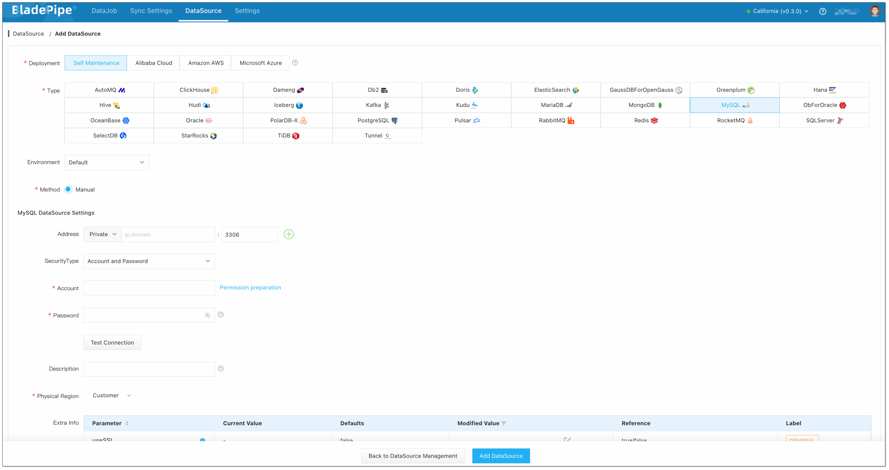
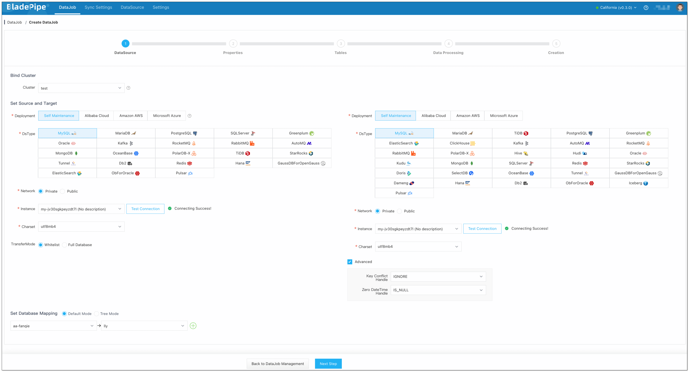
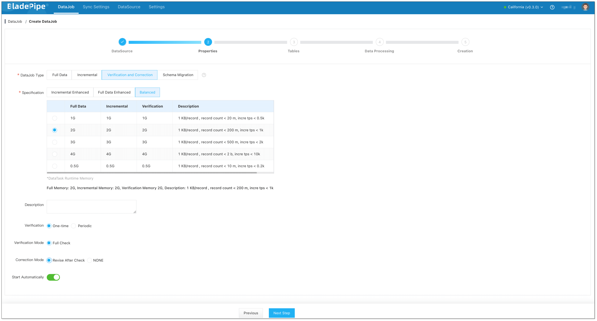
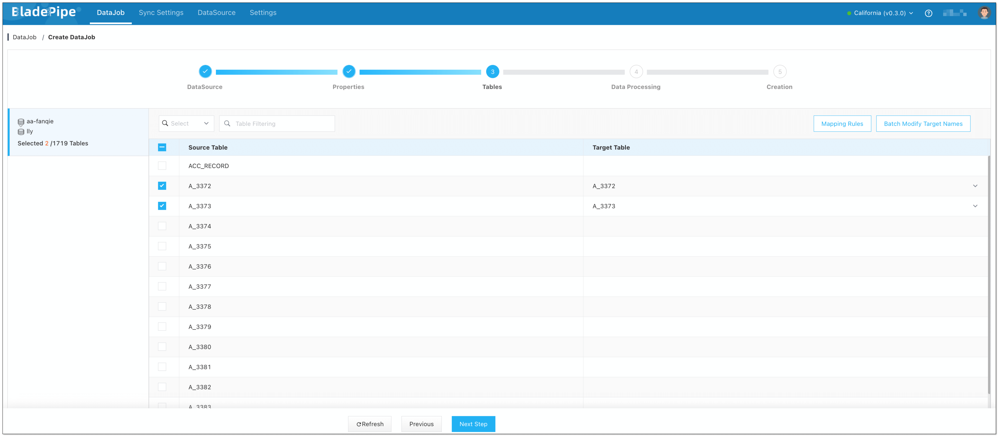
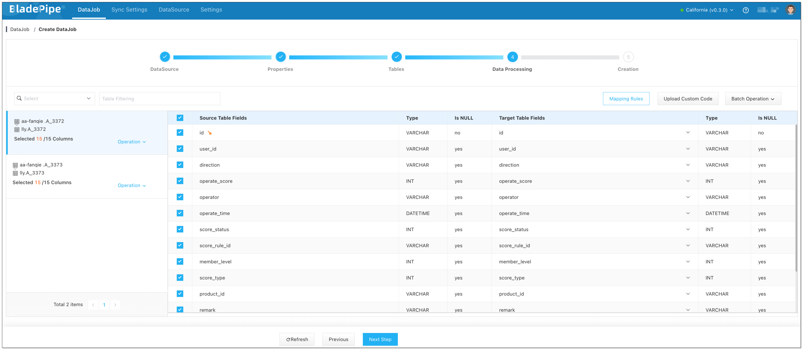
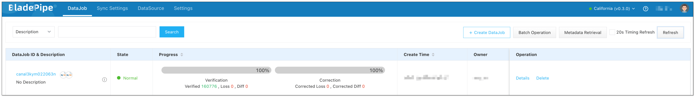

**Data verification** checks whether data in a target system matches the source after migration, replication, synchronization, or ETL processing.

When data moves from one system to another, teams need to answer practical questions: Were all rows copied? Did updates and deletes arrive? Did column values change? Are there duplicate, missing, or corrupted records? Data verification provides the checks needed to prove that source and target data are accurate and consistent.

<!-- truncate -->

## Quick Answer: What Data Verification Checks

Data verification usually checks five areas:

| Check | What it verifies | Example |
| --- | --- | --- |
| Row count | Whether source and target have the same number of rows | `orders` has 10,000,000 rows in both systems |
| Primary key coverage | Whether every source key exists in the target | No missing `order_id` values |
| Field-level values | Whether column values match | `status`, `amount`, and `updated_at` are identical |
| Deletes and updates | Whether changed rows are reflected downstream | Cancelled orders are cancelled in the target |
| Data freshness | Whether replication lag is acceptable | Target is less than 10 seconds behind source |

For database migration and CDC replication, row counts alone are not enough. A table can have the same number of rows while still containing wrong values, missed updates, or duplicated records.

## What is Data Verification?
Data verification is the process of confirming that data has been accurately and completely transferred from a source system to a target system. It validates data integrity, consistency, and correctness so teams can confirm that no data was lost, altered, duplicated, or corrupted during movement.

In database migration and replication projects, source-to-target verification is often performed after:

- Initial full data load
- Incremental CDC synchronization
- Schema migration
- Cutover rehearsal
- Production cutover
- Periodic sync health checks

## Data Verification vs Data Validation vs Data Reconciliation

These terms are often used together, but they do not mean exactly the same thing:

| Term | What it checks | Example in migration or replication |
| --- | --- | --- |
| Data validation | Whether data follows expected rules before or during processing | `email` is not null, `amount` is numeric, `created_at` uses a valid timestamp |
| Data verification | Whether target data matches the source after movement | The same `order_id` exists in both systems and key fields have identical values |
| Data reconciliation | Whether mismatches are identified, explained, and resolved | Missing rows are compared, classified, corrected, and signed off before cutover |

For production migration, all three matter. Data validation prevents bad records from entering the pipeline, data verification proves that the migration or CDC job copied the right records, and data reconciliation closes the gap when the source and target do not match.

## Why Data Verification is Needed?

In data replication or [data migration](best_data_migration_tools.md), a pipeline can finish successfully while the target is still wrong. Common causes include skipped rows, type conversion errors, failed delete handling, duplicate keys, schema drift, replication lag, or manual writes on the target.

Data verification gives teams evidence for three questions:

- **Completeness**: Does every expected source row exist in the target?
- **Correctness**: Do important column values match after type conversion, transformation, or CDC replay?
- **Consistency**: Are inserts, updates, and deletes applied in the right state before the target is used by applications, reports, or downstream pipelines?

Without verification, teams often discover migration problems after cutover, when rollback is harder and the business impact is already visible.

## Data Verification Methods Compared

| Method | Best for | What it catches | Limitation |
| --- | --- | --- | --- |
| Row count comparison | Fast first-pass validation | Missing or extra rows at table level | Misses wrong values, duplicate replacements, and mismatched rows with the same count |
| Checksum comparison | Large tables where full row comparison is expensive | Value changes across selected columns or key ranges | Needs stable ordering, consistent data formatting, and careful handling of nulls, decimals, and timestamps |
| Primary key comparison | Finding missing or extra rows | Source keys absent from the target, or unexpected target keys | Does not prove non-key fields are correct |
| Field-by-field comparison | High-confidence migration validation | Incorrect values in business-critical columns | More expensive on large datasets and should be scoped by table, key range, or changed rows |
| Sampling | Quick checks on very large datasets | Obvious mapping, formatting, or transformation issues | Can miss rare errors and should not be the only check before cutover |
| Automated verification and correction | Production migration and replication | Missing rows, inconsistent rows, and correctable drift | Requires a tool that can compare and repair differences safely |

The right method depends on data volume, latency requirements, risk tolerance, and whether the target is used for analytics, production applications, or compliance reporting.

For low-risk analytics tables, row counts plus sampled field checks may be enough. For customer, payment, inventory, or operational tables, use primary key comparison and field-level comparison on critical columns. For CDC replication, run verification after the full load and repeat it during incremental sync so missed updates and deletes are caught before cutover.

## Common Data Verification Errors

Most verification failures are not caused by one obvious broken job. They usually come from small differences between systems:

| Error | Why it happens | What to check |
| --- | --- | --- |
| Same row count, different values | Updates arrive late, transformations are wrong, or target writes overwrite synced data | Compare checksums or field-level values by primary key |
| Missing deletes | The pipeline captures inserts and updates but ignores delete events | Test deleted source rows and confirm the target removes or marks them correctly |
| Timezone or precision drift | Source and target store timestamps, decimals, or floating values differently | Check timestamp zones, fractional seconds, decimal scale, and rounding rules |
| Schema drift | Source columns change after the migration job starts | Verify column mapping, DDL sync behavior, and default values |
| False mismatch from replication lag | The verifier reads the target before CDC has caught up | Recheck after the lag window or verify against a stable checkpoint |
| Encoding or collation mismatch | Text is converted differently across databases | Compare multilingual text, case sensitivity, sorting, and special characters |
| Duplicate or unstable keys | Tables lack a reliable primary key or use mutable business keys | Define stable unique keys before field-level comparison |

## Data Verification Checklist

Use this checklist before trusting a migration or replication result:

- Source and target schemas are aligned.
- Primary keys or stable unique keys are available.
- Row counts match for critical tables.
- Primary key coverage has no missing or extra rows.
- Important columns pass field-level comparison.
- Deletes and updates are verified, not only inserts.
- Data type conversions are reviewed for precision, timezone, encoding, and null handling.
- Replication lag is within the accepted threshold.
- Mismatches are logged, reviewed, and corrected before cutover.

## When to Verify Data

Run data verification at each point where the cost of a mismatch changes:

| Stage | What to verify |
| --- | --- |
| Before migration | Key availability, schema mapping, type conversions, row counts, and transformation rules |
| After initial full load | Table counts, primary key coverage, checksum results, and critical field values |
| During CDC sync | Inserts, updates, deletes, replication lag, and schema changes |
| Before cutover | Business-critical tables, recent changes, high-value records, and rollback readiness |
| After cutover | New writes, downstream reports, application queries, and recurring drift checks |

This staged approach avoids a common mistake: waiting until the end of a migration to discover that data verification cannot be performed reliably because keys, mappings, or comparison rules were not prepared.

## How to Verify Data?
### Manual Verification
Manual verification works for small datasets, one-off investigations, or records that require human judgment. Teams usually compare row counts, query a set of primary keys, inspect transformed fields, and review exception reports.

The risk is scale. Once tables contain hundreds of thousands or millions of rows, manual checks are slow and easy to miss. Manual verification also becomes unreliable for CDC because the source and target may keep changing while people are comparing records.

### Automated Verification
Automated verification is better for large tables, repeated checks, and production migration. A tool can compare source and target data by primary key, split large tables into batches, detect missing or inconsistent rows, retry checks when replication lag may create false positives, and produce a repeatable report for cutover review.

Some automated tools can also correct discrepancies. Correction should be used carefully: teams should know which side is authoritative, whether the target accepts writes, and whether fixes may affect downstream applications.

## Data Verification Best Practices
For production replication, data verification should be repeatable, scoped, and safe to rerun. [BladePipe](https://www.bladepipe.com) supports automatic data verification and correction after data migration or replication.

BladePipe fetches data from the source instance batch by batch, then uses the primary key to fetch the corresponding data from the target instance using SQL IN or RANGE. The data with no matching data found in the target is marked as Loss, and then each row of data is compared on a field-by-field basis.

By default, all data is verified. You can also narrow the verification range using filters, which is useful for large tables, recent CDC windows, or business-critical partitions. For discrepancies, BladePipe performs two additional verifications to reduce false results caused by sync latency.

With BladePipe, data can be verified and corrected in a few clicks.

### Step 1: Install BladePipe

Follow the instructions in [Install Worker (Docker)](https://www.bladepipe.com/docs/productOP/byoc/installation/install_worker_docker/) or [Install Worker (Binary)](https://www.bladepipe.com/docs/productOP/byoc/installation/install_worker_binary/) to download and install a BladePipe Worker.

### Step 2: Add DataSources

1. Log in to the [BladePipe Cloud](https://cloud.bladepipe.com).
2. Click **DataSource** > **Add DataSource**.
3. Select the source and target DataSource type, and fill out the setup form respectively.

### Step 3: Create a DataJob

1. Click **DataJob** > [**Create DataJob**](https://www.bladepipe.com/docs/operation/job_manage/create_job/create_full_incre_task/).

2. Select the source and target DataSources, and click **Test Connection** to ensure the connection to the source and target DataSources are both successful.

   

3. Select **Verification and Correction** for DataJob Type, and configure the following items:
    - Select **One-time** for Verification.
    - Select Correction Mode: **Revise after Check** / **NONE**.
      - **Revise after Check**: The data will be automatically corrected after the verification is completed.
      - **NONE**: The data will not be automatically corrected after the verification is completed. 
  
   

4. Select the tables to be verified. Only existing tables can be selected.

   
5. Select the columns to be verified.
   
   
6. Confirm the DataJob creation. Then go back to the DataJob page, and check the data verification result.
   
   

## Summary 
Data verification proves whether source and target data match after migration, replication, synchronization, or ETL. Start with row counts, but do not stop there. For reliable migration validation, combine primary key comparison, checksum or field-level comparison, delete and update checks, lag-aware rechecks, and a clear reconciliation process. Automated tools like BladePipe make this easier by comparing data in batches and correcting verified discrepancies after migration or sync.
