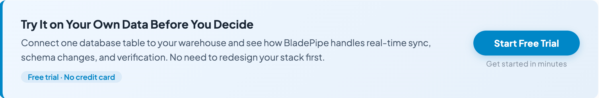

Search for **data warehouse tools** and you will find a confusing mix of products. Some are actual data warehouses. Some move data into a warehouse. Some transform data after it lands. Some monitor quality, schedule jobs, or manage access.

That confusion is not just a wording problem. It leads teams to buy the wrong tool.

A cloud warehouse such as Snowflake, BigQuery, or Redshift can store and query analytical data, but it will not automatically solve ingestion, change data capture, modeling, orchestration, data quality, or governance. A modern warehouse project usually needs a stack, not a single product.

This guide breaks down the main categories of data warehouse tools, what each category is responsible for, and how to decide what you actually need.

## Quick Answer

**Data warehouse tools are software products that help teams store, load, transform, query, manage, and govern analytical data.**

In practice, the phrase includes several different tool categories:

| Tool category | What it does | Common examples |
| --- | --- | --- |
| Data warehouse platforms | Store and query analytical data | Snowflake, BigQuery, Redshift, Azure Synapse |
| Ingestion and ELT tools | Move data from apps, files, and databases into the warehouse | Fivetran, Airbyte, Stitch, Hevo |
| CDC and replication tools | Capture database changes and keep targets fresh | Debezium, BladePipe, AWS DMS, Qlik Replicate |
| Transformation tools | Turn raw data into modeled analytics tables | dbt, SQLMesh, Matillion |
| Orchestration tools | Schedule and coordinate pipelines | Airflow, Dagster, Prefect |
| Data quality and observability tools | Detect broken, late, or inaccurate data | Great Expectations, Monte Carlo, Soda |
| Governance and catalog tools | Manage metadata, lineage, discovery, and access | Collibra, Alation, Atlan |

The important point: **a data warehouse platform is only one part of the warehouse stack**. Most production teams also need at least ingestion, transformation, and monitoring.

## Why "Data Warehouse Tools" Is a Confusing Search Term

The term sounds simple, but people use it in three different ways.

First, some people mean the warehouse itself: the database or cloud service where analytical data is stored and queried.

Second, some people mean tools around the warehouse: [ETL/ELT](/blog/data_insights/etl_vs_elt.md), CDC, reverse ETL, transformation, orchestration, testing, and data cataloging.

Third, some comparison articles mix both groups together. That is why you may see Snowflake, Fivetran, dbt, Airflow, and Tableau in the same list even though they solve different problems.

A better way to think about the problem is this:

**A warehouse stores analytical data. A warehouse stack gets data into shape, keeps it fresh, makes it usable, and helps teams trust it.**

Once you make that distinction, tool selection becomes much clearer.

## The Core Layers of a Modern Data Warehouse Stack

A practical warehouse architecture usually has five core layers:

| Layer | Question it answers |
| --- | --- |
| Storage and compute | Where will analytical data live and be queried? |
| Ingestion | How will data get from sources into the warehouse? |
| Transformation | How will raw data become usable business tables? |
| Orchestration and reliability | How will jobs run, retry, and alert when something breaks? |
| Governance and quality | How will teams know the data is accurate, secure, and understandable? |

Small teams may start with only two or three layers. Larger organizations usually need all five.

## 1. Data Warehouse Platforms

Data warehouse platforms are the foundation. They store structured or semi-structured analytical data and support queries for reporting, dashboards, machine learning, and business analysis.

Common examples include:

- **Snowflake**: Often chosen for ease of use, separation of storage and compute, and broad ecosystem support.
- **Google BigQuery**: Strong fit for teams already using Google Cloud and serverless analytics.
- **Amazon Redshift**: Common in AWS-centered environments and mature enterprise analytics stacks.
- **Azure Synapse Analytics**: Often used by Microsoft-heavy organizations.
- **Databricks SQL / lakehouse platforms**: Useful when analytics, data engineering, and machine learning share the same lakehouse environment.

Choose the warehouse platform first when your main question is:

- Where should analytics data live?
- Which cloud are we standardizing on?
- What query performance and cost model fits our workload?
- Do we need a warehouse, lakehouse, or both?

But do not expect the warehouse alone to solve pipeline reliability. Even the best warehouse becomes messy if data lands late, schemas drift silently, or business logic is duplicated across dashboards.

## 2. Ingestion and ELT Tools

Ingestion tools move data from source systems into a warehouse. In modern analytics stacks, many teams use ELT: extract and load first, then transform inside the warehouse.

Common sources include:

- SaaS applications such as Salesforce, HubSpot, Stripe, Zendesk, and Shopify
- Operational databases such as MySQL, PostgreSQL, Oracle, and SQL Server
- Files and object storage such as CSV, JSON, S3, and GCS
- Event streams and application logs

Common ingestion and ELT tools include Fivetran, Airbyte, Stitch, Hevo, Matillion, and similar platforms.

This category matters most when your problem is connector coverage and setup speed. For example, if your analytics team needs to pull 30 SaaS sources into Snowflake with minimal engineering effort, a managed ELT tool may be more useful than building pipelines manually.

The trade-off is control. Fully managed tools are convenient, but pricing, connector behavior, sync frequency, and transformation flexibility may not match every workload.

## 3. CDC and Replication Tools

[CDC](/blog/data_insights/change_data_capture_cdc.md), or change data capture, captures inserts, updates, and deletes from source systems and applies them downstream. This is especially important when the warehouse needs fresh data from production databases.

CDC tools are different from basic batch ingestion. Instead of reloading whole tables or polling periodically, they track changes from database logs or equivalent change streams.

CDC and replication tools are useful when:

- Dashboards need data within seconds or minutes
- You are moving operational data into a warehouse for near-real-time analytics
- You need a low-downtime migration path
- You need to synchronize databases, warehouses, search engines, queues, or lakes
- Full reloads are too slow, expensive, or risky

Common examples include Debezium, BladePipe, AWS DMS, Qlik Replicate, Oracle GoldenGate, and Striim.

If your warehouse use case is mostly monthly reporting, CDC may be unnecessary. If the business expects live operational analytics, delayed batch loads quickly become a bottleneck.

## 4. Transformation Tools

Raw warehouse data is rarely ready for decision-making. Table names reflect source systems, fields are inconsistent, events are duplicated, and business definitions live in scattered SQL snippets.

Transformation tools solve this by turning raw data into modeled datasets: customer tables, revenue tables, product usage tables, finance metrics, and other analytics-ready structures.

Popular transformation tools include:

- **dbt**: The most common choice for SQL-based analytics engineering.
- **SQLMesh**: A newer option focused on SQL transformation, environments, and data contracts.
- **Matillion**: A visual and cloud-native transformation option often used with warehouse platforms.
- **Native warehouse SQL and stored procedures**: Still common, especially in smaller teams.

Transformation tools matter when you hear questions like:

- Why do two dashboards show different revenue numbers?
- Which table is the source of truth?
- Who changed this metric?
- Can we test analytics logic before it breaks reporting?

In many modern stacks, the warehouse stores data, the ingestion layer loads it, and dbt or a similar tool defines what the data actually means.

## 5. Orchestration Tools

Orchestration tools schedule, coordinate, and monitor data workflows. They answer a simple operational question: what should run, in what order, and what happens if something fails?

Common examples include Airflow, Dagster, Prefect, and cloud-native schedulers.

Orchestration becomes important when pipelines have dependencies:

- Load raw data before transformation runs
- Transform staging tables before reporting models
- Refresh dashboards after key tables are updated
- Retry failed jobs without rerunning everything manually
- Alert the right team when a pipeline misses its expected window

Some ELT tools include basic scheduling. Some transformation tools include job management. But as workflows grow, a dedicated orchestrator often becomes useful because it gives teams a single place to manage dependencies across tools.

## 6. Data Quality and Observability Tools

Getting data into the warehouse does not mean the data is correct.

Common warehouse data failures include:

- A source schema changes without warning
- A pipeline succeeds but loads partial data
- A key metric drops because a join condition changed
- A table arrives late and dashboards refresh with stale numbers
- Duplicate rows inflate revenue or event counts

Data quality and observability tools help detect these problems earlier.

Common examples include Great Expectations, Soda, Monte Carlo, Bigeye, and Anomalo.

This layer is most important when warehouse data is used for executive reporting, finance, compliance, machine learning, or customer-facing analytics. If people are making expensive decisions from the data, quality checks are not optional decoration. They are part of the production system.

## 7. Governance, Catalog, and Lineage Tools

As more teams use the warehouse, discovery and control become harder.

Governance and catalog tools help answer:

- What does this table mean?
- Who owns it?
- Which dashboards depend on it?
- Is this column sensitive?
- Where did this metric come from?
- Which datasets are trusted?

Common examples include Collibra, Alation, Atlan, DataHub, OpenMetadata, and cloud-native catalogs.

Small teams can often start with simple documentation and naming conventions. Larger organizations usually need cataloging, lineage, access policies, and audit trails because the warehouse becomes shared infrastructure across departments.

## How to Choose the Right Data Warehouse Tools

Do not start with a vendor list. Start with the failure mode you are trying to avoid.

| If your main problem is... | Prioritize this tool category |
| --- | --- |
| Slow analytics queries | Warehouse platform and data modeling |
| Too many manual data exports | Ingestion or ELT |
| Stale database data in dashboards | CDC and replication |
| Conflicting business metrics | Transformation and semantic modeling |
| Pipelines fail silently | Orchestration and observability |
| Nobody trusts the data | Data quality and validation |
| Nobody knows which data to use | Catalog, lineage, and governance |
| Cloud bills are growing too fast | Warehouse design, workload management, and pipeline efficiency |

This framing is more useful than asking "What is the best data warehouse tool?" The best tool depends on where your current stack is breaking.

## Recommended Stacks by Team Stage

Different teams need different levels of tooling. Overbuilding too early creates cost and maintenance. Underbuilding too long creates fragile reporting and slow decisions.

| Team situation | Practical stack |
| --- | --- |
| Early-stage team with basic reporting | Managed warehouse + simple ELT + BI tool |
| SaaS analytics team with many app sources | Snowflake/BigQuery/Redshift + managed ELT + dbt |
| Engineering-heavy team wanting control | Warehouse or lakehouse + Airbyte/Debezium + dbt + Airflow/Dagster |
| Real-time operational analytics | Warehouse/lakehouse + CDC replication + streaming or incremental transformations |
| Enterprise data platform | Warehouse/lakehouse + ingestion + CDC + transformation + orchestration + quality + catalog |

The stack should evolve as the questions become more expensive. A small team does not need enterprise governance on day one. A finance team closing the books from warehouse data probably does.

## Data Warehouse Platform vs Data Warehouse Tool

This distinction is worth making explicit.

A **data warehouse platform** is where analytical data is stored and queried. Examples include Snowflake, BigQuery, Redshift, and Synapse. If you are still comparing analytical storage concepts, start with this broader guide to [database vs data warehouse](/blog/data_insights/database_vs_data_warehouse.md).

A **data warehouse tool** can be any tool that supports the warehouse lifecycle: ingestion, CDC, transformation, orchestration, quality, governance, visualization, or cost management.

So when someone asks for "data warehouse tools," clarify whether they mean:

- A place to store analytical data
- A way to load data into that place
- A way to model or transform data
- A way to operate and govern the whole stack

That one clarification can prevent a lot of bad software evaluations.

## Common Buying Mistakes

### Mistake 1: Choosing a warehouse before understanding the workload

Warehouses have different pricing models, performance profiles, and ecosystem strengths. Query volume, data size, concurrency, cloud preference, and workload type all matter.

### Mistake 2: Treating ingestion as an afterthought

Most warehouse projects fail in the messy middle: unreliable connectors, missing deletes, schema drift, late jobs, and unclear ownership.

### Mistake 3: Assuming batch ELT is enough for every use case

Hourly or daily batch loads are fine for many reports. They are not enough for fraud monitoring, operational dashboards, customer-facing analytics, or live inventory visibility.

### Mistake 4: Building transformations directly in dashboards

This creates metric drift. If revenue, retention, or churn logic lives inside dashboards instead of governed models, different teams will eventually report different numbers.

### Mistake 5: Waiting too long to add data quality checks

Bad data is cheapest to fix near the pipeline. It is most expensive after executives, customers, or machine learning systems have already consumed it.

## A Simple Decision Framework

Use this order when evaluating tools:

| Step | Decision | Why it matters |
| --- | --- | --- |
| 1 | Define the data consumers | Analysts, executives, product teams, ML systems, and customers have different freshness and reliability needs. |
| 2 | Define freshness requirements | Daily reporting, hourly dashboards, and second-level operational analytics require different ingestion patterns. |
| 3 | Map source complexity | SaaS apps, production databases, files, and event streams usually need different connector strategies. |
| 4 | Estimate operational ownership | Analyst-managed stacks favor simplicity; engineering-owned stacks can support more control and customization. |
| 5 | Choose the warehouse platform | Cloud preference, workload shape, cost model, ecosystem, and team skills all affect the platform choice. |
| 6 | Choose ingestion and CDC tools | Connector coverage, latency, data volume, schema handling, and reliability determine whether batch ELT is enough. |
| 7 | Add transformation and quality controls | Trusted business tables, tests, and ownership prevent the warehouse from becoming a pile of raw data. |

This keeps tool selection grounded in actual constraints instead of vendor categories.

## Where BladePipe Fits

BladePipe belongs in the real-time data movement layer of the warehouse stack. It is relevant when teams need to move data from operational systems into analytical destinations with low latency, or when they need migration, replication, [data verification](/blog/data_insights/data_verification.md), and correction workflows around databases and warehouse targets.

For example, if your team is loading MySQL, PostgreSQL, Oracle, SQL Server, or other operational data into a warehouse or lakehouse, a CDC-based tool can reduce full reloads, keep downstream data fresher, and make production cutovers safer. BladePipe does not replace the warehouse platform, transformation layer, BI tool, or governance catalog. It solves a specific part of the stack: reliable movement of changing data.

If this is the part of your stack you are evaluating, the easiest next step is to test one real pipeline instead of debating architecture in the abstract. Pick a non-critical source table, sync it into a warehouse target, and check latency, schema handling, and verification behavior with your own data. You can [try BladePipe free](https://www.bladepipe.com/register/) and see whether it fits before committing to a bigger rollout.

## Final Takeaway

The most useful way to evaluate data warehouse tools is not to ask for one universal winner. Ask which layer of the stack you are solving.

If you need a place to store and query analytical data, evaluate warehouse platforms. If your data is hard to collect, evaluate ingestion and CDC tools. If metrics are inconsistent, focus on transformation. If pipelines are unreliable, add orchestration and observability. If teams cannot find or trust data, invest in quality and governance.

A good warehouse stack is not the stack with the most tools. It is the stack where every tool has a clear job.

## FAQ

### What are data warehouse tools?

Data warehouse tools are products that help teams store, load, transform, query, monitor, and govern analytical data. The category includes warehouse platforms, ETL/ELT tools, CDC tools, transformation tools, orchestration tools, quality tools, and catalogs.

### What is the difference between a data warehouse and ETL?

A data warehouse stores and queries analytical data. ETL or ELT tools move data from source systems into the warehouse and may also transform it before or after loading.

### Do I need ETL tools if I already have a cloud data warehouse?

Usually, yes. A cloud warehouse gives you storage and compute, but you still need a way to extract data from sources, load it reliably, handle schema changes, and monitor pipeline health.

### When do I need CDC for a data warehouse?

CDC is useful when warehouse data must stay close to the source system in real time or near real time. It is also useful when full reloads are too slow, too expensive, or too disruptive.

### Is dbt a data warehouse tool?

dbt is not a warehouse platform. It is a transformation tool used inside modern warehouse stacks to build tested, version-controlled analytics models.

### What is the best data warehouse tool?

There is no single best tool for every team. Snowflake, BigQuery, Redshift, and similar platforms solve storage and query needs. ELT, CDC, transformation, orchestration, and governance tools solve different parts of the warehouse lifecycle.
