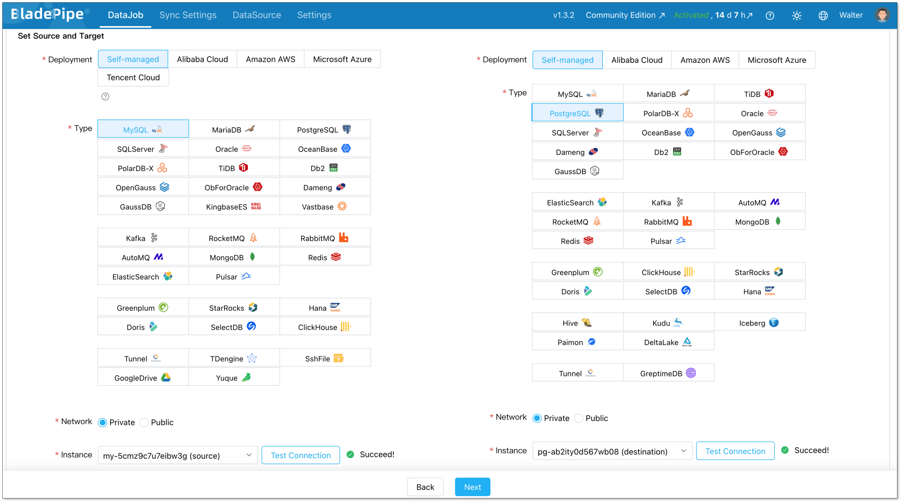

Choosing a database is rarely a simple yes-or-no decision.

If you're a **data engineer or backend architect**, you've probably been there: you picked MongoDB for its flexible schema, only to find yourself writing manual compensation logic when cross-document transactions became a requirement. Or you started with PostgreSQL and it worked perfectly—until user growth caused complex joins to drag down performance at peak hours.

There's no such thing as a one-size-fits-all database. **Transaction systems** demand strong consistency and ACID guarantees. **Social feeds** require millisecond latency and high write throughput. **Analytics workloads** need columnar storage and parallel scan capabilities. Even within a single application, different modules often have competing requirements.

That's why modern architectures embrace **polyglot persistence**—using different types of databases for different jobs.

This guide walks you through the major database categories:

- [**Relational databases**](#relational-databases-the-foundation-of-transactions)—when to choose PostgreSQL vs. MySQL, and where they still make sense
- [**Document databases**](#1-document-stores)—flexible schema storage for content and catalogs
- [**Key-value stores**](#2-key-value-stores)—Redis and its ideal use cases
- [**Wide-column stores**](#3-wide-column-stores)—high-throughput, sparse data workloads
- [**Graph databases**](#4-graph-databases)—specialized tools for social graphs and fraud detection
- [**Time-series databases**](#time-series-databases)—optimized for monitoring and IoT workloads
- [**Search databases**](#search-databases)—full-text search and log analytics
- [**Analytical databases (OLAP)**](#the-workload-spectrum-oltp-vs-olap)—data warehousing and business intelligence
- **[Distributed](#distributed-databases) & [cloud databases](#cloud-databases)**—horizontal scale and managed operations

For each category, I'll cover real-world use cases, key considerations, and a **decision cheat sheet** at the end to help you quickly compare options.

## Relational Databases: The Foundation of Transactions

When people ask, "**what are types of databases** traditionally used for business applications?" the answer is almost always relational databases (RDBMS). Based on the relational model proposed by E.F. Codd in the 1970s, these systems organize data into structured tables with rows and columns.

Relational databases are defined by their schema—a rigid structure that defines data types and relationships before data is ingested. They use SQL (Structured Query Language) for complex queries and adhere to ACID (Atomicity, Consistency, Isolation, Durability) properties to ensure transactional integrity.

- **When to use:** Financial systems, enterprise resource planning (ERP), customer relationship management (CRM), and any application where data integrity and complex joins are non-negotiable.
- **Common Examples:** MySQL, PostgreSQL, Oracle Database, Microsoft SQL Server.
- **Scalability:** Primarily vertical (scaling up by adding more power to a single server).

## Non-Relational Databases (NoSQL): Flexibility at Scale

If relational databases are about rigidity and integrity, **non relational database** systems (often called NoSQL) are about flexibility and horizontal scale. They emerged to handle the volume, velocity, and variety of big data that traditional tables couldn’t accommodate.

Unlike their relational counterparts, NoSQL databases do not require a predefined schema. They are categorized further into **several database types examples** based on how they store data:

### 1. Document Stores

Document databases store data in semi-structured formats like JSON or BSON. Each document can have a unique structure, making them ideal for content management and rapidly evolving applications.

- **Use Case:** E-commerce product catalogs, user profiles, content management systems.
- **Example:** MongoDB, CouchDB.

### 2. Key-Value Stores

This is the simplest form of NoSQL. Data is stored as a collection of key-value pairs. Because of their simplicity, they offer incredibly fast read/write speeds for specific lookups.

- **Use Case:** Caching (Redis), session management for web applications, shopping carts.
- **Example:** Redis, Amazon DynamoDB.

### 3. Wide-Column Stores

Also known as column-family databases, wide-column stores use a column-oriented storage format while allowing each row to have a variable set of columns—making them ideal for sparse, high-throughput workloads. They are optimized for querying large datasets across distributed systems.

- **Use Case:** Time-series data, IoT sensor data, event logging.
- **Example:** Apache Cassandra, HBase.

### 4. Graph Databases

Graph databases prioritize relationships. They use nodes (entities), edges (relationships), and properties to represent data. This structure makes relationship traversal much faster than multi-table joins in SQL.

- **Use Case:** Social networks, fraud detection (identifying rings of collusion), recommendation engines.
- **Example:** Neo4j, ArangoDB.

## The Workload Spectrum: OLTP vs. OLAP

Beyond the data model, **database types** are often defined by the workload they are designed to handle. This is a crucial distinction for data architects designing data stacks. The two primary categories are OLTP (Online Transaction Processing) and OLAP (Online Analytical Processing).

| Feature            | **OLTP (Transactional)**                          | **OLAP (Analytical)**                            |
| :----------------- | :------------------------------------------------ | :----------------------------------------------- |
| **Primary Goal**   | Fast, reliable transaction processing             | Complex querying and data analysis               |
| **Query Type**     | Short, simple reads/writes (e.g., SELECT, INSERT) | Long, complex aggregations (e.g., SUM, GROUP BY) |
| **Data Structure** | Row-oriented storage (normalized)                 | Columnar storage (denormalized)                  |
| **Consistency**    | ACID compliance (strong consistency)              | Read-optimized; weaker transaction guarantees    |
| **Common Use**     | E-commerce checkout, bank withdrawals             | Business intelligence, reporting, forecasting    |
| **Examples**       | PostgreSQL, MySQL, Oracle                         | Snowflake, Amazon Redshift, Google BigQuery      |

Understanding the [**data warehouse vs database**](database_vs_data_warehouse.md) dynamic is critical here. An OLTP database handles daily operations, while a **data warehouse** (an OLAP system) aggregates that data for analysis. Similarly, [**OLTP vs OLAP**](olap_vs_oltp_key_differences.md) represents the split between "running the business" and "analyzing the business."

## Emerging and Specialized Database Types

The evolution of [AI](https://www.bladepipe.com/ai-rag/), [real-time analytics](https://www.bladepipe.com/real-time-analytics/), and global distribution has spawned specialized **list of database types** designed for very specific problems.

### Distributed Databases

A **distributed database** spreads data across multiple physical locations or nodes. This is not a data model per se (a distributed database can be relational or NoSQL), but an architecture for high availability and horizontal scaling. They offer fault tolerance—if one node fails, the system remains operational.

- **Example:** Google Spanner, CockroachDB, Amazon Aurora.

### Cloud Databases

A **cloud database** is any database (relational or NoSQL) that is hosted on a cloud platform. They offer managed services (DBaaS), reducing operational overhead for teams. They allow for elastic scaling, where resources can be scaled up or down based on demand without physical hardware changes.

- **Example:** Amazon RDS, Azure SQL Database, Google Cloud SQL.

### Time-Series Databases

Optimized for handling time-stamped or time-series data. These databases excel at high-volume writes and efficient queries over time intervals. They often use specialized compression algorithms to save space.

- **Use Case:** Monitoring infrastructure metrics, stock market tick data, IoT device telemetry.
- **Example:** InfluxDB, TimescaleDB.

### Search Databases

Also known as search engines, these are built for full-text search, complex queries, and fast retrieval. They are often used to index data stored in other primary databases.

- **Use Case:** Log analytics, application search bars, observability.
- **Example:** Elasticsearch, Apache Solr.

## Database Types List Summary

Here’s a concise **database types list** for quick reference. Use this as a cheat sheet when evaluating options for your next project.

| **Database Type**         | **Best For**                             | **Example Use Case**                                  |
| :------------------------ | :--------------------------------------- | :---------------------------------------------------- |
| **Relational Database**   | Structured data with ACID guarantees     | Banking systems, ERP, inventory management            |
| **Document Database**     | Semi-structured JSON-heavy workloads     | E-commerce catalogs, user profiles                    |
| **Key-Value Database**    | Simple lookups, high-speed caching       | Session storage, shopping carts                       |
| **Wide-Column Database**  | Massive write throughput, sparse data    | IoT telemetry, event logging                          |
| **Graph Database**        | Deep relationship traversal              | Social networks, fraud detection                      |
| **Time-Series Database**  | High-frequency timestamped data          | Infrastructure monitoring, stock tickers              |
| **Search Database**       | Full-text search, log analysis           | Application search bars, observability                |
| **Distributed Database**  | Global availability, horizontal scale    | Multi-region applications, high-availability systems  |
| **Cloud Database**        | Managed operations, elastic scaling      | SaaS platforms, startups avoiding infrastructure mgmt |
| **Data Warehouse (OLAP)** | Complex analytics, business intelligence | Sales reporting, financial forecasting                |

These database types categories cover the most common categories you'll encounter in modern data architectures.

## What BladePipe Supports: Database Integration at Scale

To thrive in a multi-cloud and polyglot persistence environment, your [data integration tool](data_integration_tools.md) must be versatile. [BladePipe](https://www.bladepipe.com/) supports [over 60 data sources](https://www.bladepipe.com/connector/), enabling seamless data flow across different architectural layers.

| **Category**                  | **Supported Types**                                          |
| :---------------------------- | :----------------------------------------------------------- |
| **Relational (RDBMS)**        | MySQL, MariaDB, PostgreSQL, Oracle, SQL Server, Db2, Aurora, PolarDB-X, TiDB, OceanBase, Spanner, GaussDB, OpenGauss, Dameng, KingbaseES, Vastbase, ObForOracle, TdsqlCMysql, TdsqlMySQL, Azure SQL, ADB for PG |
| **NoSQL**                     | MongoDB, DocumentDB, Redis, ElastiCache(redis), DynamoDB, Lindorm, ElasticSearch |
| **Streaming**                 | Kafka, AutoMQ, RocketMQ, RabbitMQ, Pulsar, AmazonMSK         |
| **Analytical (OLAP)**         | Greenplum, Hana, ADB for PG, SelectDB, ClickHouse, StarRocks, Doris |
| **Data Lake Formats**         | DeltaLake, Iceberg, Paimon, Hive, Kudu                       |
| **Lakehouse Platforms**       | MaxCompute, DataLakeFormation                                |
| **File & Object Storage**     | S3File, OssFile, GoogleDrive, SshFile, Yuque                 |
| **Time-Series & Specialized** | TDengine, GreptimeDB, Tunnel                                 |

*For a complete list of supported data sources, [visit our documentation](https://www.bladepipe.com/docs/dataMigrationAndSync/datasource_version/).*

### Why It Matters: The Power of Multi-Type Integration

BladePipe doesn't just "list" these technologies; it enables [**Cross-Type Transformation**](https://www.bladepipe.com/docs/intro/product_scenarios/). This means you can:

- **CDC to Lake:** Capture real-time changes from **PostgreSQL** (Relational) and stream them directly into **Apache Iceberg** (Data Lake).
- **Mainframe to Cloud:** Migrate legacy **DB2** data into **Azure SQL** or **Aurora** with minimal downtime.
- **Transactional to Analytical:** Sync operational data from **MySQL** to **StarRocks** for instant BI reporting.

**Ready to put this into practice?**

Managing data across multiple database types doesn't have to be complex. BladePipe handles the integration layer so you can focus on building, not plumbing. Just start [syncing](https://www.bladepipe.com/docs/quick/quick_start_mgr/) your first database in **under 5 minutes**.

- [**Free Community Edition**](https://www.bladepipe.com/pricing/) — full-featured, self-hosted, no limits
- [**Cloud Trial**](https://www.bladepipe.com/register/) — 90 days, no credit card required, includes managed [CDC pipelines](build_ai_data_pipeline_production.md)

Need any help? Click the [**"Book Demo"**](https://cal.com/bladepipe-xxypci/30min)—we'll walk you through it step by step.

## How to Choose a Database: A Decision Cheat Sheet

Instead of starting with "which database is best," start with four questions about your workload.

### Step 1: Ask the Right Questions

| Question                                     | What It Reveals                                              |
| :------------------------------------------- | :----------------------------------------------------------- |
| **What’s the primary access pattern?**       | Point lookups? Complex joins? Full-text search? Time-range scans? |
| **How strict are consistency requirements?** | Every transaction must be accurate (payments), or eventual consistency is acceptable (likes, views)? |
| **What’s the scale and growth trajectory?**  | Predictable steady growth, or potential for 10x spikes? Single region or global? |
| **Who operates it?**                         | Dedicated DBA team, or small team needing managed services?  |

### Step 2: Match Workloads to Database Categories

| If Your Workload Is...                                       | Recommended Category                                     | Consider If...                                              | Avoid If...                                                  |
| :----------------------------------------------------------- | :------------------------------------------------------- | :---------------------------------------------------------- | :----------------------------------------------------------- |
| **Transactional with complex relationships** (orders, invoices, users) | **Relational** (PostgreSQL, MySQL)                       | You need ACID, joins, and predictable schema                | You expect massive write spikes beyond vertical scale limits |
| **High-volume reads with simple lookups** (session cache, product details) | **Key-Value** (Redis, DynamoDB)                          | Millisecond latency matters; data model is simple key→value | You need complex queries or multi-item transactions          |
| **Evolving schema with nested data** (user profiles, catalogs) | **Document** (MongoDB)                                   | Schema changes frequently; data naturally maps to JSON      | You need cross-document transactions or complex joins        |
| **Massive write throughput, sparse data** (IoT events, clickstream) | **Wide-Column** (Cassandra, HBase)                       | You need high availability and linear scalability           | You run complex aggregations or need secondary indexes       |
| **Deep relationship traversal** (social graph, fraud rings)  | **Graph** (Neo4j)                                        | Queries involve "friends of friends" patterns (3+ hops)     | Your data is mostly tabular with shallow relationships       |
| **Time-stamped data with range queries** (metrics, logs, sensor data) | **Time-Series** (InfluxDB, TimescaleDB)                  | High write volume; queries are time-windowed aggregations   | You need to join with non-time-series data frequently        |
| **Full-text search and log exploration** (app search, observability) | **Search** (Elasticsearch)                               | Users need fuzzy search, faceting, or log analysis          | You need strict ACID transactions                            |
| **Complex analytics on large datasets** (BI dashboards, reporting) | **Analytical (OLAP)** (ClickHouse, StarRocks, Snowflake) | Queries scan billions of rows with aggregations             | You need single-row low-latency updates                      |

### Step 3: Common Scenario Quick Match

| Scenario                                           | Recommended Primary Database | Why                                                          |
| :------------------------------------------------- | :--------------------------- | :----------------------------------------------------------- |
| **E-commerce checkout + order management**         | PostgreSQL / MySQL           | ACID transactions, inventory consistency, complex order relationships |
| **Shopping cart + session cache**                  | Redis                        | Sub-millisecond reads, TTL-based expiration, simple key-value |
| **Product catalog with varying attributes**        | MongoDB                      | Products have different schemas (clothing vs electronics), flexible indexing |
| **Social network feed**                            | Cassandra + Redis            | Cassandra for write-heavy feed storage, Redis for cache      |
| **Fraud detection (transaction network analysis)** | Neo4j                        | Finding rings of collusion requires multi-hop relationship traversal |
| **Infrastructure monitoring + metrics**            | InfluxDB / TimescaleDB       | High-frequency writes, time-windowed aggregations, retention policies |
| **Application search bar**                         | Elasticsearch                | Fuzzy matching, relevance scoring, faceted search            |
| **Sales dashboard + BI reporting**                 | ClickHouse / StarRocks       | Sub-second aggregations on billions of rows, columnar storage |

## Conclusion: The Polyglot Reality

There is no single "best" database. The modern stack is inherently polyglot. A single e-commerce company might use **MySQL** (Relational) for order management, **Redis** (Key-Value) for cart sessions, **MongoDB** (Document) for product catalogs, **Elasticsearch** (Search) for site search, and **Snowflake** (Cloud/OLAP) for analytics.

Managing data across these diverse environments introduces complexity. **BladePipe** provides data synchronization and replication capabilities across these systems—supporting use cases such as [change data capture](change_data_capture_cdc.md) from an Oracle OLTP to a Kafka stream, as well as data integration for [RAG  applications](https://www.bladepipe.com/blog/ai/ragapi_ollama/). Understanding database types is the first step. Once you're managing multiple systems, data integration becomes the next challenge—one that tools like change data capture and real-time sync are designed to solve.

## FAQ

### What are the main types of databases?

While there are many, the major categories based on data model and workload include:

1. **Relational** (SQL-based, tables, ACID)
2. **Document** (JSON/BSON, flexible schema)
3. **Key-Value** (high-speed caching)
4. **Wide-Column** (high-throughput, sparse data)
5. **Graph** (relationship-focused)
6. **Time-Series** (timestamped data)
7. **Search** (full-text indexing)
8. **Analytical/OLAP** (columnar, business intelligence)

### What is the difference between relational and non-relational databases?

Relational databases use strict, table-based schemas and prioritize data integrity (ACID), scaling vertically. Non-relational databases use flexible data models (documents, graphs) and prioritize scalability and performance, typically scaling horizontally across many servers.

### What is the difference between a data warehouse and a database?

A **database** (typically OLTP) is designed for day-to-day operational transactions (like processing orders). A **data warehouse** (OLAP) is designed to aggregate data from multiple databases to support business intelligence, analytics, and complex reporting.

### What is a cloud database?

A cloud database is any database that is hosted, managed, or deployed in a cloud computing environment. Often offered as a managed service (DBaaS), they provide benefits like elastic scalability, high availability, and reduced administrative overhead compared to on-premises deployments.

### [PostgreSQL vs. MySQL](https://www.bladepipe.com/blog/data_insights/mysql_cdc_vs_postgres_cdc/): How do I choose?

Start with **PostgreSQL** if you expect complex queries, custom data types, or need to evolve schema frequently. Start with **MySQL** if you want simplicity, massive community support, and are building a straightforward web application with high read traffic.
