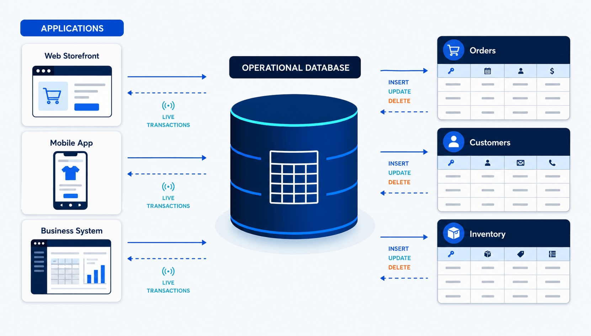
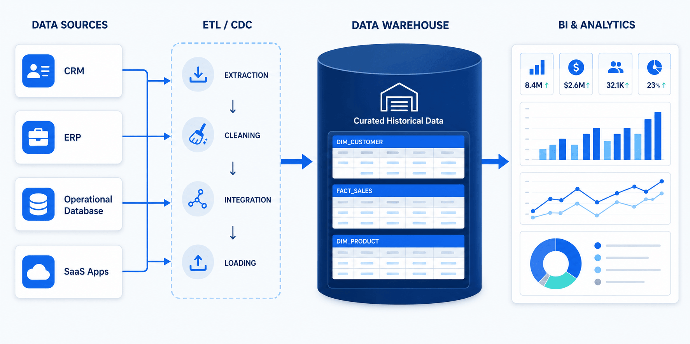
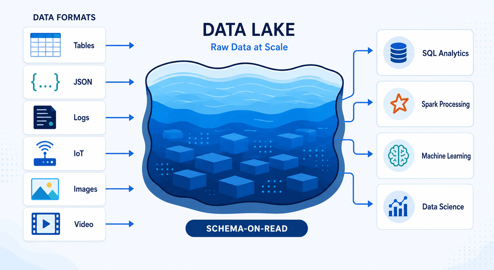
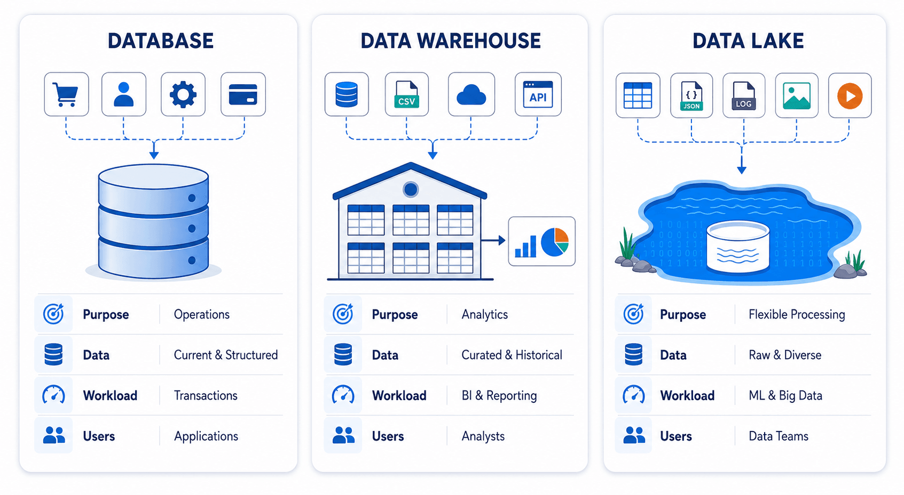

A database runs day-to-day applications, a data warehouse supports structured analytics, and a data lake stores large volumes of raw data for flexible processing. They solve different problems, and many modern data architectures use all three.

The confusion comes from overlap. A cloud database can run analytical queries. A data warehouse can ingest semi-structured data. A data lake can support SQL analytics when paired with a query engine and table format. The underlying distinction is therefore not simply where data is stored. It is what the system is optimized to do, how data is organized, and who needs to use it.

This guide compares a database vs. data warehouse vs. data lake across architecture, workloads, data formats, performance, governance, and cost. We also explain how data moves between them and how to choose the right combination.

## Database vs. Data Warehouse vs. Data Lake at a Glance

| Area | Database | Data Warehouse | Data Lake |
| --- | --- | --- | --- |
| Primary purpose | Run operational applications | Analyze curated business data | Store and process data in many formats |
| Typical data | Current, structured application data | Structured and semi-structured historical data | Structured, semi-structured, and unstructured data |
| Common workloads | Transactions, record lookup, application reads and writes | BI, reporting, dashboards, ad hoc SQL | Data science, machine learning, large-scale processing, archival |
| Data model | Application-oriented tables | Analytical models such as star or snowflake schemas | Files, objects, open table formats, and metadata catalogs |
| Schema approach | Usually schema-on-write | Primarily schema-on-write | Often schema-on-read, with stronger schemas added as data is refined |
| Update pattern | Frequent INSERT, UPDATE, and DELETE operations | Batch, micro-batch, streaming, or CDC-based loads | Batch or streaming ingestion; updates depend on file and table format |
| Typical users | Application developers and operational teams | Analysts, BI teams, and business users | Data engineers, data scientists, ML engineers, and analysts |
| Query pattern | Short, selective, concurrent queries | Large scans, aggregations, joins, and historical analysis | Flexible processing across large and varied datasets |
| Examples | MySQL, PostgreSQL, Oracle, SQL Server, MongoDB | Snowflake, Amazon Redshift, Google BigQuery, ClickHouse, Doris, StarRocks | Amazon S3, Azure Data Lake Storage, Google Cloud Storage, HDFS |

The table provides a useful starting point, but product categories are becoming less rigid. For example, some operational databases include columnar or analytical features, while modern warehouses can query data in object storage. The right choice should be based on the workload rather than the product label.

## What Is a Database?

A [**database**](blog/data_insights/database_types_selection_guide.md) stores and manages the data required by an application or business process. An ecommerce database may hold customer accounts, product inventory, orders, and payments. A banking database may record balances and transactions. These systems usually need to process many small reads and writes with low latency while preserving consistency.

Most relational operational databases use online transaction processing, or OLTP, patterns. Their tables are often normalized to reduce duplication and make updates safer. Indexes help applications find a small number of records quickly, while transactions ensure that related changes either succeed together or fail together.

Not every database is relational. Document databases, key-value stores, graph databases, and time-series databases are also designed for particular operational access patterns. What they share is a focus on serving applications and current operational needs.

### When Should You Use a Database?

Use a database when an application needs to create, retrieve, update, or delete individual records reliably. Common examples include:

- Processing orders and payments
- Managing customer or employee records
- Tracking inventory
- Supporting website and mobile application backends
- Storing configuration or session data
- Running a CRM, ERP, or other transactional system

A production database should not become the default reporting platform simply because the data already exists there. Large analytical queries can scan millions of rows, consume CPU and I/O, and compete with application traffic. Replicating the required data to an analytical system usually provides better workload isolation.

## What Is a Data Warehouse?

A **data warehouse** consolidates data from databases, SaaS applications, files, and other systems for analysis. Instead of optimizing for frequent row-level transactions, it is designed for scans, joins, aggregations, and queries across large historical datasets.

Warehouse data is usually cleaned, standardized, and modeled before it is exposed to business users. A sales table, for example, may combine order data from an ecommerce database, customer details from a CRM, and regional targets from a planning system. This creates a consistent source for dashboards and reporting.

Data warehouses commonly use columnar storage and distributed query processing. Columnar storage allows an analytical query to read only the columns it needs, while distributed execution divides large workloads across multiple compute resources. These characteristics make warehouses more suitable than operational databases for complex SQL analytics.

### When Should You Use a Data Warehouse?

Use a data warehouse when teams need reliable, repeatable analysis of structured business data. Typical use cases include:

- Executive and operational dashboards
- Revenue, cost, and profitability analysis
- Customer segmentation
- Marketing attribution
- Supply chain and inventory reporting
- Regulatory and financial reporting
- Historical trend analysis

A warehouse is especially useful when different departments need the same metrics. Centralized transformation, modeling, access control, and data quality rules reduce the risk that each team calculates revenue, active users, or conversion rates differently.

## What Is a Data Lake?

A **data lake** is a centralized repository for storing data at large scale, often in low-cost object storage. It can retain relational tables, JSON events, application logs, images, audio, video, sensor readings, and other data without requiring every dataset to fit a predefined analytical model before ingestion.

This flexibility is commonly described as schema-on-read: the structure is interpreted when the data is processed. In practice, well-managed data lakes still need schemas, metadata, catalogs, ownership, quality controls, and access policies. Without them, users may struggle to discover trustworthy datasets or understand how they should be used.

Data lakes separate storage from processing. The same data can be accessed by different engines for SQL queries, streaming, machine learning, or large-scale transformations. Open file and table formats can also make data usable across multiple tools, although compatibility still needs to be verified at the feature and engine level.

### When Should You Use a Data Lake?

Use a data lake when you need to retain large volumes of varied data or support processing beyond conventional BI. Common use cases include:

- Machine learning model development
- Log and clickstream analysis
- IoT and sensor data processing
- Long-term storage of raw source data
- Data exploration where future requirements are not yet known
- Large-scale transformation using Spark or similar engines
- Sharing data across multiple analytical tools

A data lake is not automatically cheaper or simpler than a warehouse. Object storage is generally economical, but compute, cataloging, governance, data movement, and maintenance still create costs. A lake only remains useful when its datasets are organized and governed.

## Key Differences Between a Database, Data Warehouse, and Data Lake

### 1. Operational Processing vs. Analytical Processing

The most important difference is workload. A database supports an application as events happen. It may confirm a payment, update stock, or retrieve a user profile. These operations usually touch a small number of rows and must complete quickly.

A data warehouse answers questions across many records, such as total revenue by region over three years. A data lake supports similarly large-scale analysis but also accommodates raw events, files, and unstructured data that may not yet be ready for a warehouse.

If you need a deeper workload-level breakdown, the [OLTP vs OLAP comparison](https://www.bladepipe.com/blog/data_insights/olap_vs_oltp_key_differences/) explains why transactional and analytical systems are engineered differently.

### 2. Current Data vs. Historical Data

Operational databases usually represent the current state of the business, although they may retain transaction history. If a customer changes an address, the application may update the existing record.

Warehouses are built to analyze change over time. Data pipelines may retain snapshots, transaction facts, or slowly changing dimensions so analysts can understand what was true at a particular point. Lakes can preserve raw historical data even before its analytical purpose has been defined.

### 3. Schema-on-Write vs. Schema-on-Read

Databases enforce schemas that protect application behavior. Warehouses also rely heavily on schema-on-write because BI users need stable columns, definitions, and relationships.

Data lakes are more flexible. Raw data can be stored first and interpreted later, but this does not eliminate schema management. As datasets move from raw to cleaned and curated layers, teams usually apply stronger validation and structure.

### 4. Data Types

Databases are most effective when data matches the application’s operational model. Data warehouses traditionally focus on structured data, though many modern platforms also handle semi-structured formats such as JSON.

Data lakes accept the widest range of data, including files and media that do not fit naturally into relational tables. This makes them useful for data science and machine learning, where source material may include text, images, events, and model features.

For a more detailed breakdown of how data format affects system design, see the guide to [structured vs unstructured data](https://www.bladepipe.com/blog/data_insights/structured_data_vs_unstructured_data/).

### 5. Performance

Performance depends on the question being asked. A transactional database is faster for retrieving one order by its ID. A warehouse is better suited to aggregating billions of order lines. A lake can process enormous datasets, but response time depends on file layout, metadata, table format, engine, caching, and workload configuration.

Moving every workload to one system rarely produces the best result. Matching the workload to the storage and processing model is more important than selecting the system with the longest feature list.

### 6. Cost

Database costs are usually driven by transaction volume, availability requirements, storage, backups, and provisioned compute. Warehouse costs depend heavily on analytical compute, query frequency, concurrency, and retained data.

Data lakes can store large volumes economically, but storage price alone is an incomplete comparison. Query engines, data transformation, orchestration, catalogs, governance, observability, and engineering time should be included in the total cost.

### 7. Governance and Data Quality

Operational databases have strong controls because application correctness depends on them. Data warehouses typically contain curated datasets with defined metrics, ownership, lineage, and access policies.

Data lakes require deliberate governance across a much broader range of data. Teams need to know where data came from, whether it contains sensitive information, how fresh it is, and which version is suitable for production use. A lake without these controls can accumulate data faster than users can trust it.

## Do You Need All Three?

Many organizations do. A typical architecture starts with databases that run business applications. Data is then copied to a warehouse for BI and to a lake for raw retention, advanced processing, or machine learning.

For example, an ecommerce company may use MySQL for orders, a cloud data warehouse for sales dashboards, and object storage for clickstream events and product images. Each system serves a different workload, while data pipelines keep them connected.

A smaller team may not need all three on day one. If the main requirement is application reporting, a database plus a warehouse may be enough. If the team mainly collects logs and trains models, a database plus a lake may be more appropriate. Architecture should follow actual workloads, data volume, team skills, governance needs, and latency targets.

## Where Does a Lakehouse Fit?

A lakehouse combines data-lake storage with data-management features associated with warehouses. It typically uses object storage together with a table format, metadata catalog, transaction support, and one or more query engines. The goal is to support BI, data engineering, and machine learning on a shared data foundation.

This approach reduces some of the separation between a data lake and a warehouse, but it does not remove architectural decisions. Teams still need to design ingestion, transformation, governance, workload isolation, and serving layers. A lakehouse is an architecture pattern, not an automatic replacement for every operational database or analytical platform.

For a hands-on example of this pattern, the [real-time lakehouse guide with Paimon and StarRocks](https://www.bladepipe.com/blog/data_insights/paimon_starrocks_lakehouse/) shows how ingestion, table storage, and analytical serving can work together.

## How Data Moves Between These Systems

Data movement is the part that turns separate storage systems into a usable architecture. Common methods include:

- **[Batch ETL](https://www.bladepipe.com/blog/data_insights/etl_steps_explained/):** Extract data on a schedule, transform it, and load it into the target.
- **[ELT](https://www.bladepipe.com/blog/data_insights/etl_vs_elt/):** Load source data first, then transform it inside the warehouse or lakehouse.
- **[Change data capture (CDC)](https://www.bladepipe.com/blog/data_insights/change_data_capture_cdc/):** Capture INSERT, UPDATE, and DELETE activity from a database log and deliver changes continuously.
- **Streaming ingestion:** Move application events through systems such as Kafka before loading them into analytical storage.
- **File-based ingestion:** Export or receive files and load them at scheduled intervals.

Batch loading is suitable when daily or hourly freshness is enough. CDC is more appropriate when dashboards, downstream applications, or migration projects need fresher data and full exports would create unnecessary load.

A production pipeline also needs more than data transfer. It should handle initial loading, incremental positions, schema changes, retries, data mapping, monitoring, and validation. These capabilities determine whether the target remains accurate after the first successful load.

## How BladePipe Supports Modern Data Architectures

[BladePipe](https://www.bladepipe.com/) helps move data between operational databases, analytical databases, data warehouses, and supported streaming or storage systems. It can be used to build migration and replication pipelines without turning the source database into the reporting layer.

For database-to-warehouse or database-to-analytical-database pipelines, the usual pattern is to perform an initial full load and then apply ongoing changes through CDC. This keeps the target current while allowing transactional and analytical workloads to run on separate systems.

BladePipe is most relevant when a team needs ongoing replication, heterogeneous database migration, or lower-latency data delivery. The exact source, destination, data type, and synchronization mode should still be checked against the current connector documentation before designing a production architecture.

## How to Choose the Right System

Start with the workload rather than the platform:

1. **Use a database** if you need reliable, low-latency application transactions.
2. **Use a data warehouse** if business users need governed SQL analytics and consistent reporting.
3. **Use a data lake** if you need to retain large volumes of varied raw data or support data science and machine learning.
4. **Consider a lakehouse** if you want multiple analytical workloads to operate on shared object storage with stronger table management.
5. **Use more than one** when operational, BI, and advanced analytical requirements cannot be served efficiently by the same system.

Before making a final choice, evaluate data formats, query patterns, freshness, concurrency, governance, integration effort, team expertise, and total cost. A technically flexible platform can still be a poor fit if the team cannot operate it reliably.

## Final Takeaway

The database vs. data warehouse vs. data lake decision is not about choosing one universal storage system. A database is built for operational transactions, a data warehouse is optimized for curated analytics, and a data lake provides flexible storage and processing for large, diverse datasets.

The most practical architecture often assigns each workload to the system designed for it, then connects those systems with reliable data pipelines. If you need to move operational data into a warehouse or analytical database with an initial load and ongoing CDC, you can evaluate BladePipe against your required source, destination, latency, transformation, and deployment needs.

## Frequently Asked Questions

### Is a data warehouse a database?

Yes, a data warehouse is a specialized analytical data system, and many warehouses use relational concepts such as tables and SQL. However, it is optimized for large analytical queries rather than the small, frequent transactions handled by an operational database.

### Can a data lake replace a database?

Usually not for transactional applications. A data lake can store application data, but it is not normally the right system for low-latency row-level transactions, constraints, and high-concurrency application reads and writes.

### Can a data warehouse store unstructured data?

Some modern warehouses can reference or process data outside conventional relational tables, but a data lake is generally more suitable for retaining large volumes of raw images, video, audio, logs, and other unstructured data.

### What is the difference between a data lake and a data warehouse?

A data warehouse stores curated data for consistent SQL analytics and BI. A data lake stores a wider range of raw and processed data for flexible analytics, engineering, and machine learning. Modern platforms overlap, so workload, governance, and architecture matter more than labels alone.

### What is the difference between ETL and CDC?

ETL extracts, transforms, and loads data, often on a schedule. CDC identifies row-level changes from a source database and delivers them incrementally. They can be used together: an initial batch load establishes the target, and CDC keeps it updated.
