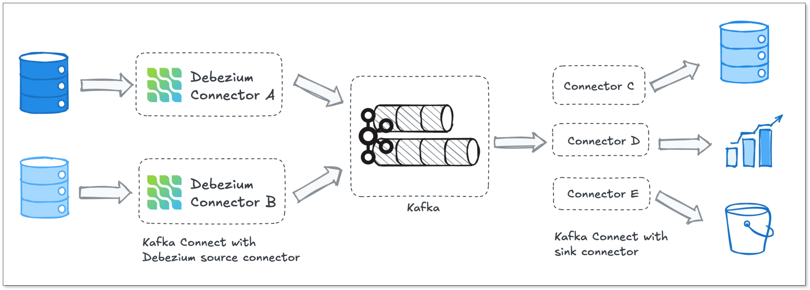
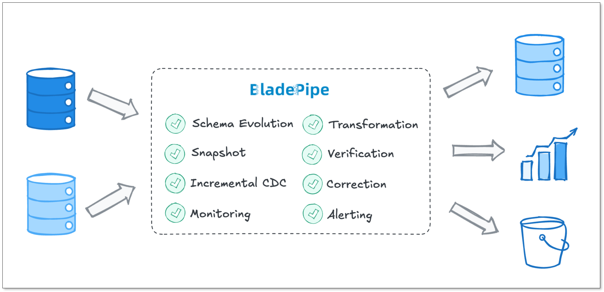

If you've been working with Change Data Capture (CDC), you've almost certainly heard of Debezium. It's the go-to open-source CDC tool for a reason. But it's not always the right fit, and more teams are starting to look elsewhere.

In this guide, I'll dive deep into why this shift is happening and explore the alternatives.

## Key Takeaways
+ Debezium is a proven, enterprise-grade CDC solution, but it’s not a silver bullet.
+ Common challenges teams run into include: **Kafka-heavy operations**, **complex setup**, **limited built-in transformation**, **difficult monitoring**, **slow time-to-value**.
+ Modern alternatives are gaining traction, including free and paid options.
+ Tools like BladePipe aim to simplify the stack, reduce time-to-value, and provide built-in capabilities that Debezium leaves to the user.

## What is Debezium?
Debezium is an open-source distributed platform for [Change Data Capture (CDC)](https://www.bladepipe.com/blog/data_insights/change_data_capture_cdc/).

But it’s not a standalone tool. At its core, Debezium is a set of connectors built on top of **Apache Kafka Connect**. It monitors your database transaction logs (like [MySQL binlog or Postgres WAL](https://www.bladepipe.com/blog/data_insights/mysql_cdc_vs_postgres_cdc/)) and pumps every Insert, Update, and Delete into Kafka topics in real time.

Debezium is battle-tested, widely adopted, and has a strong community. Developers love it for its open-source nature, fine-grained control over CDC events and strong ecosystem around Kafka.

For many teams, this setup works really well. But "works great" comes with some hidden costs. A lot of teams are seeking better options.

## Why Teams Look for Alternatives?
If Debezium is so solid, why leave? 

Here's the honest truth: Debezium is powerful, but it's not plug-and-play. To run Debezium in production, you don't just run Debezium. You have to manage a massive stack.

If you've managed Debezium in production, you've likely encountered these common issues:

+ **Complex setup**: Getting it right the first time takes effort. Connector configs, topic naming strategies, SMTs (Single Message Transforms). There's a lot to get familiar with.
+ **Kafka dependency**: Debezium is tightly coupled with Kafka. You need Zookeeper, Kafka Brokers, and a Kafka Connect cluster just to move data from Point A to Point B.
+ **Operational overhead**: Running Debezium in production means managing Kafka Connect clusters, connectors, offsets, and schema registries. That's a real ops burden.
+ **Limited transformations**: Debezium captures data but doesn't transform it well. Usually, you have to add [**Flink**](https://www.bladepipe.com/blog/data_insights/iceberg_cdc_pipeline/) or **Spark** to the mix just to mask a single column.
+ **No built-in monitoring UI**: You're relying on third-party tools or building your own dashboards.
+ **Slow Time-to-Value**: To get the first pipeline running, you need to configure multiple components. For small teams, it usually takes days or even weeks. That's too long for a simple data sync.

Over time, many teams find the effort to maintain the pipeline starts to outweigh the value of the data itself. And that’s usually the moment teams begin to seriously look for alternatives.

## Popular Alternatives in 2026
To solve the setup and operational complexity issue of Debezium, many tools are emerging in the market. The following are some of the popular free and paid choices.

| **Tool** | **Deployment** | **Real-time CDC** | **Setup Effort** | **Transformation** | **Best For** |
| --- | --- | --- | --- | --- | --- |
| **BladePipe** | Self-hosted/Managed | ✅ | Low | Medium | Simple, fast CDC/ETL pipelines |
| **Airbyte** | Self-hosted/Managed | ⚠️ Near real time | Medium | Limited | ELT & analytics pipelines |
| **Flink CDC** | Self-hosted | ✅ | High | Strong | Streaming ETL use cases |
| **Fivetran** | Managed | ⚠️ Near real time | Low | Limited | Fully managed pipelines |
| **Striim** | Managed | ✅ | Low | Medium | Real-time data sync |
| **Confluent Cloud** | Managed | ✅ | Medium | Medium | Managed Kafka users |

### Open-Source / Freemium Engines
1. **BladePipe**

[BladePipe](https://www.bladepipe.com/) is a modern CDC pipeline tool that doesn't require Kafka to function. You get a clean web UI, end-to-end pipeline management, and solid observability, all without standing up a distributed messaging layer first. It also has [paid plans](https://www.bladepipe.com/pricing/) for enterprise-scale needs.

+ End-to-End ETL/CDC pipelines with sub-second latency
+ Built-in schema migration and data transformation
+ Fast setup with minimal configuration
+ Real-time pipeline monitoring with lag tracking and alerting out of the box

2. **Airbyte**

Airbyte is an open-source ELT platform with growing CDC support. It has one of the largest connector ecosystems around. But it's not pure real-time CDC with minimum latency of around 5 minutes. 

+ 600+ pre-built connectors covering databases, SaaS tools, and APIs
+ Great API and Terraform provider support 
+ Self-hosted or cloud deployment

3. **Flink CDC**

Flink CDC builds on Apache Flink to provide streaming-first CDC pipelines. It’s closer to Debezium in philosophy but more integrated with stream processing. It reads directly from database logs and feeds changes into Flink pipelines for transformation, filtering, or routing.

+ True real-time CDC with exactly-once semantics
+ Deep integration with the Flink ecosystem for complex streaming logic
+ Perform SQL-based transformations while the data is moving

### Fully Managed & Enterprise Solutions
1. **Fivetran**

Fivetran is fully managed ELT. It prioritizes simplicity over flexibility. You connect a source, pick a destination, and Fivetran handles literally everything else. It's expensive, but it saves a lot of engineering time.

+ Automated schema drift handling 
+ 700+ connectors with enterprise SLAs
+ Volume-based pricing, making it easy to start but vital to monitor at scale.

2. **Striim**

Striim is built for enterprise teams that need real-time data movement with compliance requirements attached. It's not the simplest tool in the room, but it's designed for high-stakes environments.

+ Streaming SQL for in-flight transformations without writing custom code
+ HIPAA, SOC 2, GDPR compliant, providing strong support for highly regulated industries
+ Built-in dashboards to see your data flow in real-time

3. **Confluent Cloud**

If you're already in the Kafka world, Confluent Cloud is the managed version of Kafka + ecosystem (including Debezium connectors). It keeps the Kafka model but removes operational burden.

+ Fully managed Kafka with built-in connectors and schema registry
+ ksqlDB for stream processing directly on CDC events
+ Enterprise-grade security, RBAC, and multi-region replication

## How Modern Alternatives Fill the Gap
The gap between Debezium and a modern workflow lies in the "last mile" problems, that is the operational friction that Debezium ignores.

This is exactly the gap we built BladePipe to fill. Let’s look at how a modern, Kafka-less engine like BladePipe solves these exact frustrations head-on.

### No Kafka Dependency
Debezium forces you to deploy a massive stack. You must manage Zookeeper, Kafka Brokers, and Kafka Connect just to sync a few tables.

BladePipe is a standalone engine focusing on end-to-end delivery. It talks directly to your source and target. There is no middleman. This reduces moving parts in your stack and slashes infrastructure costs.

### UI-Driven Configuration
Debugging a missing comma in a Debezium JSON config file is a rite of passage no one wants.

BladePipe provides a clean, native UI to build your pipelines. It validates database permissions before you deploy. This allows you to spend your time on data strategy, not YAML syntax errors.

### Automated Schema Evolution
Schema changes usually kill CDC pipelines. When a DBA adds a column, Debezium often breaks or requires manual Schema Registry updates.

BladePipe detects DDL changes like `ALTER TABLE` automatically. It propagates these changes to the destination without stopping the flow. Your pipelines stay alive even when your data evolves.

### In-flight Transformation
Debezium only captures data. If you need to mask a column, it expects you to add another tool like Flink.

BladePipe includes lightweight ETL features natively. You can filter rows or mask sensitive PII data while it moves. You don't need a whole new streaming SQL language for basic data cleaning. For complex transformation, custom code can be used.

### Real-Time Monitoring
Monitoring Debezium requires setting up JMX, Prometheus, and Grafana. Without them, you are flying blind.

BladePipe offers observability out-of-the-box. The dashboard shows Transactions Per Second (TPS) and latency in real-time. And you don't need to stare at the screen all day. Alert notifications will be sent when certain metrics reach the threshold. 

### Fast Time-to-Value
Setting up Debezium typically takes days of environment configuration. It is a slow, manual process. 

BladePipe is built for speed and results. You can go from downloading the engine to seeing data move in your destination in less than ten minutes. This allows you to prove the value of your project to stakeholders before lunch. 

## The Final Verdict
Choosing a CDC architecture is a long-term commitment. Defaulting to the most starred repo on GitHub isn't always the best engineering decision. You need to align the tool with your team's actual bandwidth and infrastructure.

### When Debezium Still Makes Sense:
+ **Kafka is already your backbone:** You have a mature Kafka ecosystem and the in-house Data Ops expertise to manage Zookeeper/KRaft, Brokers, and Connect clusters.
+ **You are building a central event mesh:** You need multiple microservices to subscribe to and consume the exact same CDC event stream simultaneously.
+ **You need extreme customization:** Your use cases require writing highly complex, custom Single Message Transforms (SMTs) in Java.

### When to Consider Alternatives:
+ **Your goal is simply data replication:** If you just need to sync a database to a data warehouse reliably, introducing a heavy messaging middleman like Kafka is architectural overkill.
+ **You want to move data fast:** You need pipelines running in production today, not next month. You'd rather rely on UI-driven deployments than spend weekends debugging YAML files.
+ **You need lightweight ETL without the overhead:** If you just need to mask a few columns or filter rows, you shouldn't have to deploy a separate Flink or Spark cluster.
+ **You want predictable infrastructure costs:** Stripping a 3-tier distributed system out of your pipeline dramatically lowers your monthly cloud compute bill.

## Next Steps
If you're evaluating alternatives, here's a practical starting point:

1. **Define your latency requirement**: Real-time (sub-second) vs. near-real-time (minutes) narrows your options fast.
2. **Check your source and target**: Not every tool supports every database or destination.
3. **Audit your infrastructure**: Do you already have Kafka? That changes the calculus significantly.
4. **Run a POC**: The tools on this list have free tiers or trials. Spin one up against a test database and see how far you get in an hour.

For BladePipe specifically, the [quickstart docs](https://www.bladepipe.com/docs/quick/quick_start_mgr/) get you to a running pipeline in under 10 minutes. That's a reasonable benchmark for comparing setup complexity across tools.
