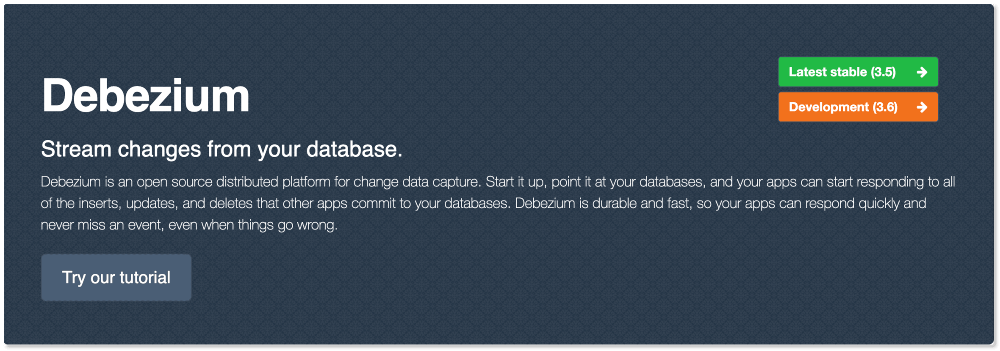
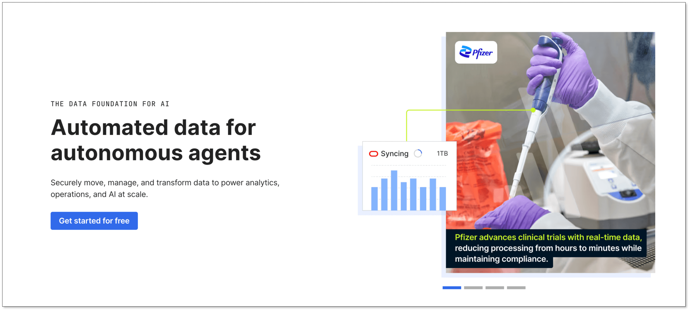
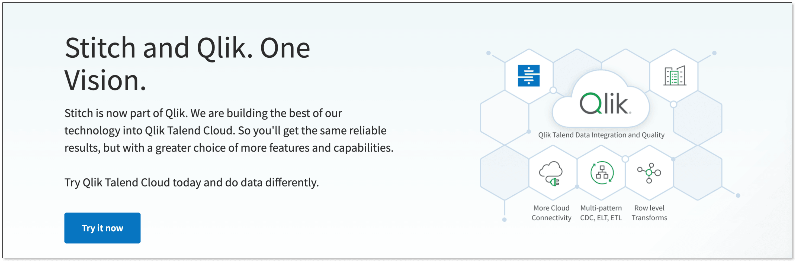

We compared five of the most popular **CDC tools** and data integration tools on the market — Debezium vs Airbyte vs Fivetran vs Stitch vs BladePipe — across **pricing, performance, latency, operational overhead, ease of setup, and data consistency** to help you choose the [best data migration](/blog/data_insights/best_data_migration_tools.md) and data replication solutions for your workloads.

## Why Teams Compare These Tools
These **CDC/data integration tools** always show up together in “[best CDC tools](/blog/data_insights/top_cdc_tool.md)”, “[best ETL tools](/blog/data_insights/best_etl_tool_for_small_business.md)”, and "[Airbyte alternatives](/blog/data_insights/best_airbyte_alternatives.md) / Stitch alternatives" searches for a few reasons:

- The modern data stack (Snowflake/BigQuery/Redshift + dbt) made **ELT** mainstream, so managed SaaS became the default starting point.
- Product and analytics teams increasingly want **near real-time dashboards**, [reverse ETL](/blog/data_insights/reverse_etl.md), and AI/RAG pipelines—pushing latency requirements down.
- Many companies are moving from “a few pipelines” to “hundreds of tables”—and discovering that **ops burden and SaaS pricing** matter as much as features.
- Kafka-based architectures are common, but not every team wants to operate Kafka just to get reliable CDC.

Even though they all sit in the “data integration / data replication / data migration solutions” category, their **positions are different**. 

If you’ve been searching **comparisons** (or “Debezium vs Airbyte” / “Airbyte vs Fivetran vs Stitch”) and feel **overwhelmed** by competing claims, that’s completely normal. We’ll introduce each data replication tool, compare them across the dimensions that matter in production, and then **recommend the best option** for different teams and scenarios—so you can walk away with a clear shortlist.

## Quick Comparison (Cheat Sheet)
Before we dive into the details, here's a quick overview of how Debezium, Airbyte, Fivetran, Stitch, and BladePipe stack up against each other. It compares the **five data integration tools** across pricing, latency, maintenance, deployment options, connector ecosystem, replication architecture, and ideal use cases.

| Category                    | Debezium                                                     | Airbyte                                                      | Fivetran                                                     | Stitch                                                       | BladePipe                                                    |
| :-------------------------- | :----------------------------------------------------------- | :----------------------------------------------------------- | :----------------------------------------------------------- | :----------------------------------------------------------- | :----------------------------------------------------------- |
| **Primary model**           | Log-based CDC engine (Kafka Connect plugin)                  | Connector-based ELT platform (batch + CDC via embedded Debezium) | Managed ELT with log-based CDC (via HVR acquisition)         | Managed ELT (Singer.io-based)                                | CDC-first [data replication](/blog/data_insights/data_replication_solutions.md) platform                          |
| **Typical latency**         | **< 1 second** (to Kafka)                                     | **Minutes to hours** — not real-time; Standard cloud: 1-hour minimum sync | **5–30 minutes** — batches even log-captured changes; 5-min fastest on Enterprise | **5–15 minutes** — batch-oriented, no log-based CDC          | **≤ 3–10 seconds** — CDC-first with built-in latency alerts   |
| **Deployment options**      | Self-hosted only (Kafka + Kafka Connect required)            | Self-hosted (OSS) + Managed Cloud                            | Managed cloud only                                           | Managed cloud only                                           | Self-hosted + BYOC + Managed Cloud                           |
| **Ops effort**              | **High** — you own the stack                                 | **Medium** (OSS: you own infra; Cloud: 0 ops but higher cost) | **Low** — fully managed, zero infrastructure                 | **Low** — fully managed                                      | **Low to medium** — managed options available; self-hosted via Docker |
| **Best for**                | Kafka-centric teams needing sub-second CDC and fan-out to multiple consumers | Teams wanting 600+ connectors and open source flexibility; warehouse ingestion | Analytics ELT with minimal ops; 700+ connectors; SOC 2 certified | Lightweight batch ELT; simple pipelines; budget-conscious teams | Low-latency replication without Kafka ops; built-in verification/correction; predictable pricing |
| **Not ideal for**           | Teams without Kafka expertise; "no-ops" environments; single-destination use cases | Sub-second latency requirements; real-time streaming; teams needing strict SLAs on every source | Cost-sensitive high-volume sync; teams needing sub-minute latency; open source requirements | Large-scale enterprise CDC; delete detection; real-time use cases; sub-hour sync frequencies | Teams needing 600+ SaaS/API connectors; pure batch ELT without CDC requirements |
| **CDC method**              | Log-based (native) — reads WAL/binlog directly               | Log-based (embedded Debezium) — but scheduled batches        | Log-based (via HVR) — but batched delivery                   | Timestamp-based polling — **no log-based CDC**; cannot detect deletes | Log-based — captures, verifies, corrects continuously        |
| **Free version**            | Full open source | Open source (self-hosted) / 14-day cloud trial               | Free tier (500K MAR) — 14-day trial                          | Free tier (5M rows/month) + 14-day trial                     | Community (self-hosted, free) / 90-day cloud trial (no CC required) |
| **Monthly Cost (10M rows)*** | $100–500+7k+ engineering                                     | $1,000–3,000                                                 | $1,350+                                                      | $500–900                                                     | $100–1,000                                                   |
| **Connector count**         | 10+ databases (PostgreSQL, MySQL, MongoDB, Oracle, SQL Server, etc.) | 350–600+ connectors (includes SaaS and databases)            | 700+ pre-built connectors                                    | Limited (Singer.io taps, not maintained by Stitch) | 60+ connectors (focused on databases + messaging)            |

**The Monthly Cost (10M rows) figures shown here are estimates for reference only. For accurate pricing, organizations must contact the sales teams directly through each CDC/ELT tool's official website to negotiate custom quotes.*

Tip: If you’re still fuzzy on the fundamentals, start with [Change Data Capture (CDC)](/blog/data_insights/change_data_capture_cdc.md) and the difference between [ETL vs ELT](/blog/data_insights/etl_vs_elt.md).

## What Is Debezium?
[**Debezium**](https://debezium.io/) is an open-source **log-based CDC** project. It reads database change logs (for example, binlog/WAL equivalents) and emits change events, commonly into Kafka (or compatible streaming infrastructure).

### Key strengths of Debezium
- **Real-time CDC** fundamentals: low-latency change events when correctly tuned.
- **Strong ecosystem** in Kafka-first environments and streaming pipelines.
- **Open source flexibility**: you control how events are routed, transformed, and stored.

### Limitations of Debezium
- **Operational overhead**: running connectors, offsets, scaling, upgrades, and failure handling is on you.
- **You build the “platform” parts**: monitoring, alerting, schema evolution workflows, backfills, and replay strategy often require additional tools.
- Often tied to a **Kafka-style architecture** (even if alternatives exist, the mental model is streaming-first).

### What Debezium is best for?
- Kafka CDC pipelines and event-driven architectures
- Streaming-first teams with strong platform/DevOps capacity
- Use cases where owning the CDC stack is a feature, not a cost

## What Is Airbyte?
[**Airbyte**](https://airbyte.com/) is a connector-driven [data integration platform](/blog/data_insights/data_integration_tools.md). It’s known for a large catalog of connectors and supports multiple sync styles depending on the source (batch incremental, and CDC for some databases/setups).

### Key strengths of Airbyte
- **Connector ecosystem**: good coverage across databases, SaaS, and files.
- **Flexibility**: self-host or managed options (depending on how you adopt it).
- **Extensibility**: you can build/customize connectors and logic when needed.

### Limitations of Airbyte
- **Latency varies**: many pipelines are still scheduled/batch-first in practice; sub-minute “always fresh” is not the default for every source.
- **Maintenance still exists**: you’ll handle connector updates, runtime scaling, and incident response if self-hosted.
- **TCO can surprise teams** when connector quirks and retries show up at scale.

### What Airbyte is best for?
- Teams that want open-source flexibility + broad connectors
- Data teams comfortable owning some operational work
- Mixed workloads (SaaS + DB) where “minutes-level” freshness is acceptable

## What Is Fivetran?
[**Fivetran**](https://www.fivetran.com/) is a widely adopted **managed ELT** platform. It focuses on “set it and forget it” pipelines via managed connectors, typically loading into a warehouse/lake destination with transformations handled downstream (often with dbt).

### Key strengths of Fivetran
- **Low operational burden**: managed connectors, managed upgrades, managed reliability work.
- **Strong connector breadth** (especially for SaaS sources).
- **Analytics-friendly workflow**: warehouse-first ELT and transformation tooling integration.

### Limitations of Fivetran
- **Cost at scale**: usage-based pricing can get expensive for high-change/high-volume datasets.
- **Latency constraints**: some sources and plans are batch-oriented, and “near real-time” may not be guaranteed end-to-end.
- **Less control** over how extraction behaves (which can matter for database load and edge cases).

### What Fivetran is best for?
- Analytics ELT with minimal engineering involvement
- SaaS-heavy data stacks
- Organizations prioritizing speed-to-value over platform control

## What Is Stitch?
[**Stitch**](https://www.stitchdata.com/) is a managed ELT service with a simpler, lighter approach compared to larger “do-everything” platforms. It’s often considered when teams want managed pipelines without building infrastructure.

### Key strengths of Stitch
- **Simple onboarding** for straightforward ELT needs
- **Good fit for smaller teams** and lighter connector requirements
- Lower learning curve than running a full open-source stack yourself

### Limitations of Stitch
- **Not optimized for low-latency CDC** scenarios
- May be less ideal for large-scale, complex enterprise requirements (governance, strict SLAs, multi-region)
- Connector and enterprise feature depth may be limiting as you scale

### What Stitch is best for
- Small to mid-sized teams that need managed ELT
- Standard analytics ingestion where “minutes-to-hours” freshness is fine
- Cost- and complexity-conscious stacks with fewer edge cases

## What Is BladePipe?
[BladePipe](https://www.bladepipe.com) is a data integration and replication platform designed for **low-latency CDC** and production-grade reliability, with options that balance “managed simplicity” and “engineering control”.

If you feel stuck between “Debezium is real-time but heavy” and “Fivetran is easy but expensive”, BladePipe aims to fill that gap: enterprise CDC with simpler setup (no Kafka, no 3-month setup), and more predictable costs (typically 50-70% cheaper for high-volume use cases).

### Key strengths of BladePipe
- **True low-latency CDC**: sub-5-second latency from source to target
- **Production features built in**: real-time monitoring, task alerting, DDL synchronization, and data verification & correction
- [**Predictable pricing**](https://www.bladepipe.com/docs/price/plans_diff/): free Community edition, task-based (Enterprise) or $0.01-10/million rows (SaaS), no hidden costs
- **Multiple deployment choices**: self-hosted and managed options for security/compliance needs
- **AI/RAG-ready**: native PostgreSQL vector support with LLM integration, OpenAI-compatible RagApi service

### Limitations of BladePipe
- If your need 200+ SaaS connectors out of box, Fivetran still wins on breadth.
- Fully open-source DIY (Debezium + Kafka + custom ops) gives maximum control-if you have the team to run it.

### What BladePipe is best for
- Real-time database replication tools for search engines(Elasticsearch), cache(Redis), and analytics platforms(Clickhouse, StarRocks, Doris, Iceberg)
- Low-latency CDC pipelines without building a Kafka-heavy platform — self-contained architecture, single-node deployment
- [AI/RAG applications](https://www.bladepipe.com/blog/ai/ragapi_ollama/) - power RAG pipelines with PostgreSQL vector + LLM integration
- Teams seeking a cost-conscious [Fivetran alternative](/blog/data_insights/best_fivetran_alternatives_for_startups.md) for high-volume replication

## Feature-by-Feature Comparison (Pricing, Latency, Ops)
These five tools can all move data, but they do it in very different ways—especially when you care about **replication latency**, **database load**, and the real cost of operations.

### 1. Pricing & Total Cost of Ownership (TCO)
Pricing models change frequently, so focus on the cost drivers:

#### **Debezium Pricing**

- **Pricing Model**: Open source, free to use under Apache 2.0 license. No software licensing fees. Requires self-managed Kafka + Connect cluster; costs come from infrastructure and operational overhead.
- **Free Version**: Fully open source.
- **Estimated Monthly Cost: Small scale (< 10 tables, 10 GB traffic):** $100–$500  (cloud instances + storage + monitoring), plus engineering time ($7,250–$17,300/month for full deployment).
- **Key Trade-off**: TCO increases linearly with table count and schema changes. Low latency (ms-level) but heavy operational burden.

#### **Airbyte Pricing**

- **Pricing Model**: Open source free; Cloud version priced on "sync frequency + data volume + number of connections."
- **Free Version**: Open source (unlimited); Cloud offers 14-day trial.
- **Estimated Monthly Cost**: Medium scale (10M rows/month, daily sync): Cloud approximately **$1,000–3,000** (Standard plan). Self-hosted similar to Debezium infrastructure costs.
- **Key Trade-off**: Balances open source and commercial options. CDC latency in seconds to minutes. Moderate configuration complexity.

#### **Fivetran Pricing**

- **Pricing Model**: MAR (Monthly Active Rows)-based pricing. Linear and rigid. As of January 1, 2026, includes $5 minimum charge per connection, bills for deletes, and charges repeated updates in history mode.
- **Free Version**: Limited free tier (up to 500,000 MAR).
- **Estimated Monthly Cost**: Medium scale (10M rows/month including updates): **$1,350+** (Standard plan) .
- **Key Trade-off**: High automation, low operational overhead, but costs escalate rapidly with volume. Typically 3-5x more expensive than BladePipe.

#### **Stitch Pricing**

- **Pricing Model**: Row-based pricing with tiered plans.
- **Free Version**: Free up to 5 million rows/month; 14-day unlimited trial available.
- **Estimated Monthly Cost** (2026):
  - Standard: **$100/month** (5-300 million rows)
  - Advanced: **$1,500/month** (100M rows, annual billing)
  - Premium: **$3,000/month** (1B rows, annual billing) 
- **Key Trade-off**: Cost-effective for simple ELT scenarios. Limited CDC support (relies on API limitations). Higher latency (>5 minutes).

#### [**BladePipe Pricing**](https://www.bladepipe.com/pricing/)

- **Pricing Model:** Based on rows processed ($0.01 per 1 million rows for full data, $10 per 1 million rows for incremental data) or per pipeline for Enterprise.
- **Free Version**: [Community edition (self-hosted, free)](https://www.bladepipe.com/docs/quick/quick_start/); [90-day free trial](https://www.bladepipe.com/register/) for managed cloud (no credit card required).
- **Estimated Monthly Cost** (10M rows/month with CDC): **$100–1,000**.
- **Key Trade-off**: More cost-efficient than Fivetran — ideal for high-volume, fixed-table-count scenarios. CDC latency close to Debezium (sub-5 seconds) without Kafka operational overhead. Fewer SaaS/API connectors than Airbyte.

### 2. CDC Capability & Data Latency

#### **Debezium**
**Debezium** is the reference log‑based CDC implementation. It reads transaction logs (binlog/WAL) and delivers row‑level change events to Kafka in **< 1 second** from commit . But this requires operating a Kafka + Kafka Connect cluster. PostgreSQL replication slots must be actively monitored — abandoned slots will fill disk "in hours" . There is no native batch mode; even initial snapshots are streaming operations.

#### **Airbyte**
**Airbyte** supports CDC for some sources via Debezium under the hood. However, it is pull‑based and scheduled: changes are captured and loaded in batches. On the Standard cloud plan, the minimum sync frequency is **1 hour**; only Enterprise plans can go down to **5 minutes**. CDC mode only works for tables with primary keys. Independent evaluations confirm Airbyte is "not designed for real‑time streaming" but for "near‑real‑time to batch mode".

#### **Fivetran**
**Fivetran** can use log‑based capture for select connectors (e.g., Oracle, PostgreSQL). But even then, it buffers and writes changes on a sync schedule — it does not stream continuously. Typical latency is **5–30 minutes**. A customer feature request from January 2026 explicitly asks for lower‑latency Oracle CDC via GoldenGate, acknowledging current limitations. Sub‑second latency is not part of Fivetran's architecture.

#### **Stitch**
**Stitch** is batch‑oriented throughout. It does not implement true log‑based CDC. Change detection relies on timestamp columns or incremental keys, subject to source API rate limits. Latency typically falls in the **5–15 minute** range, making it unsuitable for real‑time use cases.

#### **BladePipe**
**BladePipe** is built CDC‑first. It captures changes from transaction logs and delivers them continuously, with documented latency **≤ 10 seconds** and as low as **< 3 seconds** for supported workloads. Unlike Airbyte, CDC works consistently across all [60+ connectors](https://www.bladepipe.com/connector/). The trade‑off is a smaller connector ecosystem than Airbyte's community‑driven catalog.

If you need sub‑5s latency, your options are Debezium (if you run [Kafka](/blog/data_insights/do_you_really_need_kafka.md)) or BladePipe (if you want managed). Airbyte and Fivetran deliver minutes‑to‑hours, even in CDC mode. Stitch does not do log‑based CDC at all.

### 3. Ease of Setup & Time to First Sync

#### **Fivetran**
**Fivetran** achieves the fastest time to first sync for standard analytics flows among managed tools. Via Snowflake Partner Connect, connectors deploy **in under five minutes**. However, the initial full dump varies dramatically by source: anywhere from 1 hour to 1 month, depending on the application's API limits. For example, Salesforce connectors with API call limits can take days. The default sync frequency is every 6 hours, but you can configure it down to 5 minutes. No infrastructure management required — Fivetran handles schema evolution and data normalization automatically.

#### **Stitch**
**Stitch** is similarly fast to configure for batch ELT. However, after defining an integration, scheduling a replication job can **take up to 30 minutes** before the first sync begins. For real-time audience destinations, the initial sync may take six or more hours to complete, and ongoing syncs run every 2-3 hours. Stitch does not support sub-hour sync frequencies for most sources. This makes it suitable for daily reporting but unsuitable for operational or real-time use cases.

#### **Airbyte**
**Airbyte** offers two very different setup experiences. The open-source version (self-hosted) can be running in a few minutes via Docker, though "installation may take up to 30 minutes depending on your internet connection". With 600+ pre-built connectors and a low-code UI, non-developers can start **syncing in minutes**. However, self-hosting requires DevOps expertise: infrastructure management, monitoring setup, and ongoing maintenance. Airbyte Cloud eliminates the infrastructure burden but introduces volume-based pricing that can lead to unpredictable costs as your data scales.

#### **Debezium**
**Debezium** is rarely fast unless you already have Kafka infrastructure and deep operational expertise. A 2024 survey of 1,200 backend engineers found that 95% of teams building real-time data pipelines waste 40+ hours debugging CDC connector misconfigurations between Kafka Connect, Debezium, and PostgreSQL. The setup requires: Kafka cluster, Kafka Connect workers, Schema Registry, monitoring stack, and a replication slot strategy for each source database. PostgreSQL replication slots will fill disk in hours if abandoned — requiring active monitoring from day one. If you survive the **40+ hour setup gauntlet**, the performance is outstanding: p99 latency of 78ms at 100k events/sec on the 12TB benchmark.

#### **BladePipe**
**BladePipe** is fast to production for CDC replication by packaging operational needs into a managed or self-hosted no-code UI platform. Just as the [SQL Server to Kafka CDC setup guide](/blog/tech_share/sql_server_to_kafka_cdc_guide.md) claims, it is the **easiest 5-minute setup** for a full CDC pipeline. The actual workflow is 3 steps: (1) install BladePipe, (2) add source and destination as Data Sources, (3) create a DataJob with "full + incremental" sync. BladePipe handles offset tracking, DDL synchronization, pipeline monitoring, checkpoints, and recovery automatically — features that would take days to implement with Debezium. However, this ease comes with constraints: it requires CDC to be pre-enabled on sources. 

### 4. Maintenance & Operational Overhead

#### **Debezium**
**Debezium** carries the highest operational burden of any **CDC tool** in this comparison — so high that it often negates the "open source is free" value proposition. Before capturing a single change event, you must deploy and manage **Kafka, ZooKeeper (or KRaft), Kafka Connect, and Schema Registry** — four distributed systems, each with its own failure modes and upgrade paths.

**The most dangerous failure mode is PostgreSQL replication slot bloat**: when Debezium stops consuming, WAL accumulates at **20–50 GB per hour** on busy systems. When the disk fills, **PostgreSQL stops accepting writes** — your production database goes down because of a failed CDC connector. Kafka Connect does **not** auto-restart failed connector tasks; someone must notice and issue a REST API call. Organizations running Debezium at scale (Netflix, Robinhood) dedicate **4–6 full-time engineers** to babysitting these pipelines.

#### **Airbyte**
**Airbyte Open Source** requires running the Airbyte server, a metadata database, and optional Kubernetes. Maintenance includes connector version updates (600+ community connectors of varying quality), upgrade compatibility testing, and sync failure handling at scale. Expect **1–2 FTEs** for maintenance once beyond 50+ pipelines.

#### **Fivetran & Stitch**
**Fivetran and Stitch** are fully managed — no infrastructure to run, no connectors to update, no schema drift to handle manually. Stitch automatically detects schema changes and retries failed loads. Fivetran's hands-free pipelines include automatic schema updates. **Staffing: 0 FTEs** for pipeline maintenance. The trade-off is reduced control (Stitch's minimum 2-3 hour sync intervals) and recurring fees that scale with usage.

#### **BladePipe**
**BladePipe** has low operational overhead while delivering CDC-first latency. It offers three deployment modes: **SaaS (fully managed, lowest ops), BYOC (you own infrastructure, BladePipe runs software), and On-Prem (Docker, you own everything)**. Built-in features reduce maintenance burden: resumable sync with checkpoints (snapshots don't restart from zero on failure), automatic failover, alert notifications, and unique [data verification/correction](/blog/data_insights/data_verification.md).

### 5. Monitoring & Observability
Ask: “When freshness breaks at 2am, how fast can we know why?”

The answer separates "real observability" from "basic monitoring" — and reveals which tools leave you building your own pager from scratch.

#### **Debezium**
**Debezium** exposes metrics through JMX across three categories: snapshot progress (`RowsScanned`), streaming health (`QueueRemainingCapacity`), and schema history (`ChangesApplied`). Per-table operation metrics (creates/updates/deletes/truncates) are available as experimental features starting in 3.0.0. However, **no alerts are built in** — to get paged at 2am, you must build the entire stack: JMX Exporter → Prometheus → Alertmanager → Grafana. Even then, Debezium lacks built-in data verification, backpressure management, or cross-system consistency visibility. **When freshness breaks at 2am, you'll know when your PostgreSQL disk fills because a replication slot bloated — not because Debezium told you**.

#### **Airbyte**
**Airbyte** provides built-in observability at the extraction layer: connection status, schema change detection, sync history with row counts, and real-time progress indicators. Alerting is supported via webhooks to PagerDuty/Slack. External integration exists via REST API for Prometheus, Datadog, and CloudWatch. The critical limitation: Airbyte is "not designed for real-time streaming". Its monitoring reflects this — metrics are collected per sync batch. On Standard cloud with 1-hour sync frequency, you won't know freshness broke until the next scheduled sync fails or completes. **At 2am, you'll get a webhook when a sync fails. You won't see the failure coming.**

#### **Fivetran**
**Fivetran** provides managed visibility through its enterprise platform. You get a ticketing system, SLAs for enterprise clients, and compliance dashboards (SOC 2, GDPR). What you don't get: access to connector internals, ability to instrument custom metrics, or detailed logging (explicitly cited as a weakness). When freshness breaks at 2am, you file a ticket and wait. Enterprise SLAs improve response time, but you're dependent on Fivetran's internal observability — which you cannot see or extend.

#### **Stitch**
**Stitch** offers the most limited observability. You get basic job status in UI and email/chat support during business hours on Standard plan. Detailed logging is listed as a weakness. **When freshness breaks at 2am on a Standard plan, you'll discover it when your morning dashboard is empty. Support doesn't start until 9am.**

#### **BladePipe**
**BladePipe** emphasizes built-in monitoring for CDC workloads. DataJobs display three health indicators: Status (Normal/Abnormal), Progress (auto-transition between stages), and Latency (real-time lag). Alert notifications for latency violations and recovery are supported via IM and email. Heartbeat support distinguishes "no data changes" from "dead pipeline." Prometheus/Grafana integration available for advanced monitoring. **When freshness breaks at 2am with BladePipe, you get a latency alert to your phone with the DataJob name.**

## Which Tool Should You Choose? (By Scenario Comparison)
Not sure which data integration/CDC tool fits your situation? Here’s a decision guide organized by actual use cases — from startup budgets to enterprise SLAs, from Snowflake syncs to Kafka streaming.

### For Startups

| Recommendation                                               | Why                                                          |
| :----------------------------------------------------------- | :----------------------------------------------------------- |
| **BladePipe (Community)** or **Stitch** or **Airbyte (OSS)** | Startups need low upfront cost, quick setup, and minimal ops. |

**Why BladePipe Community**:

- **Free self-hosted version** with 15-day auto-activation, renewable every 3 months 
- **Under 10-minute setup** via one Docker command — no dedicated data engineer required 
- **Sub-3-second CDC latency** — grows with you when real-time becomes necessary
- **Pay-as-you-go cloud** starts at $0.01 per million rows when you outgrow community edition 

**Why Stitch**:

- **$100/month** gets you 5 million rows — affordable for early-stage 
- **Simplest UI** among all five — set up first pipeline in minutes 
- **No infrastructure management** — fully managed

**Why Airbyte OSS**:

- **Completely free** if self-hosted 
- **600+ connectors** — connects to almost any source you'll need 
- Trade-off: you own the infrastructure and maintenance

**Not recommended for startups**: Fivetran (MAR pricing becomes painful at scale), Debezium (requires Kafka expertise you don't have yet).

### For Enterprise

| Recommendation                                             | Why                                                          |
| :--------------------------------------------------------- | :----------------------------------------------------------- |
| **Fivetran** or **BladePipe (Enterprise)** or **Debezium** | Enterprises need SLAs, governance, scalability, and deployment flexibility. |

**Why Fivetran**:

- **600+ fully managed connectors** — Fivetran handles API changes, schema evolution, rate limiting 
- **99.9% uptime SLA** with automatic re-syncing 
- **SOC 2, GDPR, HIPAA compliance** — audit-ready 
- **Native dbt Cloud integration** — triggers transformations after each sync 
- Trade-off: costs scale with MAR; predictable for steady-state but painful for backfills 

**Why BladePipe Enterprise**:

- **On-prem deployment** — data sovereignty, regulatory compliance, full control
- **Built-in data verification and correction** — unique compliance feature 
- **Schema migration + DDL conversion** — handles heterogeneous database migrations 
- **Predictable pricing** — $144/link/month for on-prem enterprise 
- Trade-off: fewer connectors (60+) than Fivetran's 600+ 

**Why Debezium**:

- **Unmatched control** — full access to CDC internals
- **Proven at scale** — used by Netflix, Robinhood 
- Trade-off: requires **4–6 FTEs** to operate at enterprise scale 

**Not recommended for enterprise alone**: Stitch (limited destinations, business-hours support only).

### For Snowflake Sync

| Recommendation              | Why                                                          |
| :-------------------------- | :----------------------------------------------------------- |
| **Fivetran** or **Airbyte** | Both have mature Snowflake integration with automated schema handling. |

**Why Fivetran**:

- **Deep Snowflake partnership** — purpose-built for Snowflake ingestion 
- **Automatic schema drift propagation** — new columns appear in Snowflake automatically 
- **Native dbt Cloud integration** — transforms inside Snowflake 

**Why Airbyte**:

- **600+ connectors** feeding Snowflake 
- **Configurable sync frequency** — down to 1 minute on Cloud 
- **Open source option** — free if you self-host

**Not recommended for Snowflake**: Debezium (adds Kafka complexity you don't need), Stitch (1-hour minimum sync, misses deletes).

### For Kafka Streaming

| Recommendation | Why                                     |
| :------------- | :-------------------------------------- |
| **Debezium**   | The gold standard for Kafka-native CDC. |

**Why Debezium**:

- **Publishes directly to Kafka topics** — native Kafka integration 
- **Sub-second latency** from database commit to Kafka 
- **Proven at scale** — the reference implementation for log-based CDC 
- **Fan-out architecture** — one source, many consumers via Kafka 

**Why BladePipe** (alternative if you don't want Kafka ops):

- **Can write to Kafka** without managing Kafka Connect 
- **Simpler setup** — no Kafka cluster to operate
- Trade-off: less flexible for multi-consumer fan-out

**Not recommended for Kafka streaming**: Airbyte (batch-oriented, minutes latency), Fivetran (not built for Kafka), Stitch (no Kafka support).

### For Low-Latency CDC

| Recommendation                | Why                                              |
| :---------------------------- | :----------------------------------------------- |
| **Debezium** or **BladePipe** | Both deliver sub-second to sub-5-second latency. |

**Why Debezium**:

- **< 1 second** from commit to Kafka 
- **Gold standard** for log-based CDC
- Trade-off: requires Kafka + Connect + Schema Registry 

**Why BladePipe**:

- **< 3 seconds** latency
- **No Kafka required** — captures and delivers directly 
- **Built-in monitoring + alerting** for latency violations 
- Trade-off: fewer connectors, less fan-out flexibility

**Why not Airbyte/Fivetran/Stitch**:

- **Airbyte**: minutes to hours — "not designed for real-time streaming" 
- **Fivetran**: 5–30 minutes — batches even log-captured changes 
- **Stitch**: 5–15 minutes — no true log-based CDC 

### For Non-Technical Teams

| Recommendation                                 | Why                                          |
| :--------------------------------------------- | :------------------------------------------- |
| **Fivetran**, **Stitch** or **BladePipe SaaS** | Fully managed, UI-driven, no infrastructure. |

**Why Fivetran**:

- **Set up connectors in under 5 minutes** via UI 
- **Zero maintenance** — Fivetran handles everything 
- **No SQL required** — point-and-click configuration
- Trade-off: expensive at scale, unpredictable pricing 

**Why Stitch**:

- **Simplest UI** among all five 
- **$100/month** entry point 
- Trade-off: 1-hour minimum sync, misses deletes, limited support 

**Why BladePipe SaaS**:

- **No-code UI** — visual pipeline builder 
- **90-day free trial** — no credit card required 
- Trade-off: CDC requires source DB configuration (DBA involvement) 

**Not recommended for non-technical teams**: Debezium (requires Kafka expertise), Airbyte OSS (self-hosting requires DevOps).

### For Large-Scale [Database](/blog/data_insights/database_types_selection_guide.md) Migration (e.g., MySQL → PostgreSQL)

| Recommendation | Why                                                          |
| :------------- | :----------------------------------------------------------- |
| **BladePipe**  | Purpose-built for migration with validation and low downtime. |

**Why BladePipe**:

- **Full + incremental migration** — initial load + CDC catch-up 
- **Built-in data verification and correction** — ensures target matches source 
- **Schema migration + DDL conversion** — handles MySQL → PostgreSQL differences 
- **Visual pipeline builder** — no YAML 
- **Low-downtime cutover** — CDC captures changes during migration window 

**Why AWS DMS** (if already on AWS):

- **Native to AWS** — RDS, Aurora, Redshift integration 
- **Pay-as-you-go** pricing 
- Trade-off: limited to AWS ecosystem, less validation tooling

**Why Oracle GoldenGate** (for Oracle-centric):

- **Mission-critical replication** — Oracle's enterprise standard 
- Trade-off: complex and expensive 

**Not recommended for migration**: Fivetran (not designed for one-time migration control), Stitch (no CDC for deletes), Airbyte (batch-oriented for migration).

### For Low Maintenance Overhead

| Recommendation                                    | Why                             |
| :------------------------------------------------ | :------------------------------ |
| **Fivetran** or **Stitch** or **BladePipe Cloud** | Zero infrastructure management. |

**Why Fivetran**:

- **Fully managed** — Fivetran owns uptime, schema changes, retries 
- **99.9% SLA** — set and forget 
- **0 FTEs** for pipeline maintenance 

**Why Stitch**:

- **Fully managed** — no infrastructure 
- **Simpler than Fivetran** — fewer knobs 
- Trade-off: less reliable connectors (Singer taps can break without warning) 

**Why BladePipe Cloud**:

- **Fully managed or BYOC** — you choose 
- **Built-in monitoring + alerts** — no DIY observability stack 
- **Automatic failover and recovery** — checkpoints prevent full restarts 
- Trade-off: fewer connectors than Fivetran 

**Not recommended for low maintenance**: Debezium (requires 4–6 FTEs at scale) , Airbyte OSS (self-hosting requires DevOps) .

### Quick Decision Matrix

| Your Priority             | First Choice                 | Second Choice        | Avoid            |
| :------------------------ | :--------------------------- | :------------------- | :--------------- |
| **Lowest cost (startup)** | BladePipe Community / Stitch | Airbyte OSS          | Fivetran         |
| **Enterprise SLAs**       | Fivetran                     | BladePipe Enterprise | Stitch           |
| **Snowflake sync**        | Fivetran                     | Airbyte              | Debezium         |
| **Kafka streaming**       | Debezium                     | Confluent Cloud      | Airbyte/Fivetran |
| **Low-latency CDC**       | Debezium                     | BladePipe            | Airbyte/Stitch   |
| **Non-technical team**    | Fivetran                     | Stitch               | Debezium         |
| **Large migration**       | BladePipe                    | AWS DMS              | Fivetran/Stitch  |
| **Low maintenance**       | Fivetran / BladePipe Cloud   | Stitch               | Debezium         |

No single data integration/CDC tool wins every scenario. Startups should optimize for **cost and simplicity** (Stitch, BladePipe Community). Enterprises need **SLAs and compliance** (Fivetran, BladePipe Enterprise). Low-latency CDC demands **Kafka or CDC-native architecture** (Debezium, BladePipe). And if your team has deep Kafka expertise, Debezium is unbeatable. If not, BladePipe gives you CDC without the ops nightmare.

## FAQ
### Is Airbyte a true alternative to Fivetran?
Often yes—especially if you want more flexibility and can accept more operational work. If you need managed “no-ops” simplicity and broad SaaS connectors, Fivetran is still a common choice. If you primarily need low-latency CDC, evaluate CDC-first options (Debezium or BladePipe) rather than a batch-first ELT baseline.

### Why does my Fivetran bill feel so high?
Usage-based pricing can scale with change volume, connector count, and how often data is re-synced. The most common drivers are high-churn tables, frequent reprocessing/backfills, and a large number of connectors. Compare SaaS fees against the engineering/infrastructure cost of self-hosting before switching.

### Do I really need CDC, or is batch ETL enough?
Batch is often enough for analytics dashboards and BI that can tolerate 15–60 minutes (or more) of delay. You usually need CDC when your product depends on freshness: operational analytics, search indexing, cache sync, microservices read models, or time-sensitive automation.

### Is Debezium production-ready for mission-critical data?
Yes, but it’s not “plug-and-play”. Most reliability and correctness outcomes depend on the end-to-end design: streaming platform operations, backfill strategy, schema evolution handling, and destination idempotency.

### What are the hidden costs of open-source ETL/CDC?
Infrastructure (Kafka/compute/storage), platform engineering time, on-call load, incident response, connector upgrades, and building missing pieces like observability and reconciliation. Open source can be the right answer—but it’s rarely “free” at scale.

If you’re actively evaluating options, consider adding BladePipe to your test list and validating latency, correctness, and ops experience with one production-like pipeline.

*All prices mentioned in this document are based on publicly available information as of May 2026. Prices are subject to change over time and vary based on specific configurations, usage volume, region, contract terms, and selected plan features. The figures provided are for reference only, and please refer to each vendor's official website for current, binding pricing information.*
