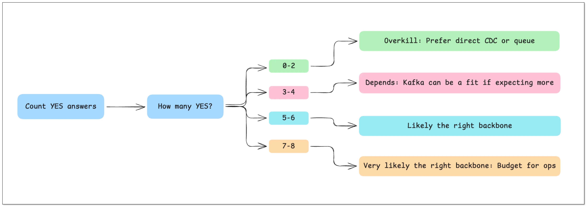
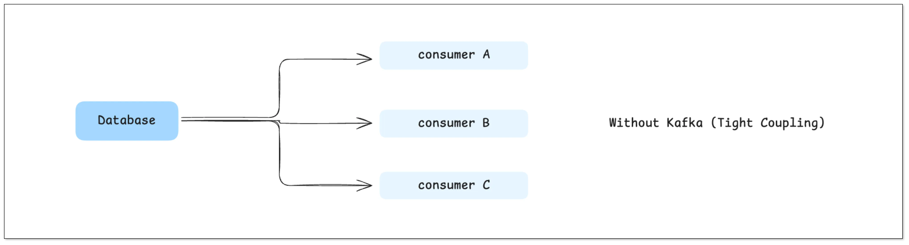
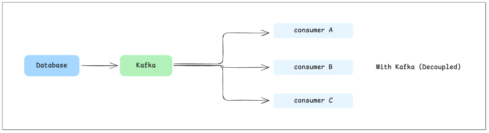

Most teams don't actually need Kafka — they just assume they do.

If you're here, you're probably designing a data pipeline and asking:
**"Do I really need Kafka (an event streaming platform / message bus), or is there a simpler architecture?"**

In the next 5 minutes, you'll get:
- A **decision checklist** you can reuse for any pipeline
- 3 **real-world scenarios** (Kafka vs no Kafka)
- A **step-by-step plan** to ship real-time data *without* operating Kafka

## TL;DR: When to use Kafka (and when to skip it)

- **Use Kafka** if you need **multiple independent consumers**, **replay/backfill**, or **event-driven workflows** at scale (classic pub/sub + durable log).
- **Skip Kafka** if you're mostly doing **data movement from A → B** (one destination, modest scale, low replay needs).
- If you're unsure, use the checklist in the next section and decide in under 5 minutes.

## 5-Minute Kafka Decision Checklist

Answer these questions and count how many times you say **YES**:

1. Do you have **3+ independent consumers** (analytics + search + downstream services)?
2. Do you need **replay/backfill** from a retained log (hours/days) for recovery or new consumers?
3. Is throughput likely to reach **thousands+ events/sec**, or do you have bursty traffic that needs buffering?
4. Do you need **decoupled deployment** (producers shouldn't change when consumers change)?
5. Do you need **fan-out routing** where each consumer can fail/retry independently?
6. Are you willing to **operate Kafka** (or pay for managed Kafka) and monitor it properly?
7. Do you need **ordering guarantees per key** and a clear **at-least-once vs exactly-once** plan?
8. Do you need a **schema evolution** strategy (Schema Registry or strict compatibility rules)?

How to decide (rule of thumb):



- **0–2 YES** → Kafka is usually **overkill**. Prefer direct CDC or a queue.
- **3–4 YES** → It depends. Kafka can be a fit if you expect more consumers or need replay.
- **5–6 YES** → Kafka is likely the **right backbone** (or a Kafka-like streaming system).
- **7–8 YES** → Kafka is very likely the right backbone — budget for doing it properly (operations + schema + consumer correctness).

## 3 Real-World Scenarios (Kafka vs No Kafka)

### Scenario 1: "Just replicate data into a warehouse"

Example: `SQL Server → (CDC) → ClickHouse/Iceberg/StarRocks`

- **Goal:** analytics and reporting
- **Consumers:** usually 1 (the warehouse)
- **Recommendation:** **Skip Kafka** and use a direct CDC pipeline
- **Why:** Kafka adds an extra hop (topics, partitions, retention, ops) without giving you much fan-out value

### Scenario 2: "One event must feed many systems"

Example: `Orders → analytics + search + fraud + notifications`

- **Goal:** event-driven workflows + multiple independent consumers
- **Recommendation:** **Use Kafka**
- **Why:** fan-out + buffering + replay are first-class, and each consumer can fail/retry independently

### Scenario 3: "Bursty traffic and consumers sometimes fall behind"

- If you only need **simple buffering** for one consumer, a queue is often enough.
- If you need **multiple consumers + replay/backfill**, Kafka is the safer long-term choice.

Still unsure? Jump to **"Kafka vs No Kafka Architecture"** and compare the trade-offs.

## What Kafka Actually Adds to Your Pipeline

The checklist above tells you *whether* Kafka fits. Now let's map Kafka's concrete capabilities to real requirements — so you can justify (or reject) Kafka with clarity.

### Decoupling Producers and Consumers

Without Kafka, data pipelines are typically tightly coupled:



This may look simple at first, but it quickly becomes problematic:

- Every new downstream system requires changes upstream
- Your upstream database has to bear the access pressure from multiple consumers
- Failures in downstream systems can impact upstream stability

With Kafka in place:



Kafka becomes a middle layer that cleanly separates producers from consumers.

In real engineering terms, this means:

- Upstream systems only write data once
- Downstream systems can be developed, deployed, and scaled independently
- Adding a new consumer doesn't require changing existing pipelines

This decoupling capability is one of Kafka's most fundamental advantages.

### Buffering and Backpressure Handling

In real-world systems, downstream instability is normal:

- Data warehouses may slow down during heavy writes
- Search systems may rebuild indexes
- Some services may temporarily go offline

In a direct pipeline, this often leads to:

- Failed data writes → data loss
- Upstream gets blocked → entire pipeline stalls

Kafka provides a very critical capability: **Buffering**

Data is written to Kafka first, then consumed by downstream at its own pace:

- Downstream is slow → Kafka stores the data temporarily
- Downstream recovers → consumption resumes from the original position

This effectively solves: **The mismatch in processing speeds between systems (backpressure)**

### Fan-out to Multiple Systems

In most real applications, the same data often serves multiple purposes. For example, a single order event might be:

- Written to a real-time analytics database (e.g., ClickHouse)
- Synchronized to a search system
- Sent to a risk control system
- Used for real-time monitoring

Without Kafka: **All this routing logic has to be handled inside your CDC tool or application**

Which leads to:

- Increasing complexity
- Tight coupling between systems
- Difficult debugging and failure isolation

With Kafka: **One stream → multiple independent consumers**

Each downstream system processes data independently, without affecting others.

### Replay and Fault Recovery

This is a capability many teams underestimate — until they need it.

Kafka retains data for a configurable period (e.g., days or weeks), which means: **You can replay historical data**

This is extremely useful when:

- A downstream bug corrupts data
- You need to recompute metrics
- A new system needs historical backfill

Without Kafka: **Your options are limited:**

- Re-run full data loads (expensive)
- Or accept data loss

With Kafka: **You simply re-consume from a specific offset**

## When You Definitely Need Kafka

The previous section covered capabilities. Now let's be practical. This section covers scenarios where Kafka is clearly the right choice.


### 1. You Have Multiple Downstream Systems

When your data needs to be consumed by multiple systems:

```
MySQL → Kafka → ClickHouse / Elasticsearch / Analytics
```

Kafka becomes highly valuable because:

- Each system consumes data independently
- No need to modify upstream pipelines
- New consumers can be added easily

As a rule of thumb: if you have 3 or more downstream systems, Kafka is worth serious consideration.

### 2. You're Building an Event-Driven Architecture

If your system relies on events, for example:

- User places an order → order triggers inventory, payment, notification
- User behavior → actions trigger real-time recommendations

Kafka can act as: **An event backbone**

Services communicate through events instead of direct calls, improving scalability and flexibility.

Practical tip: if events come from a database write, consider the **transactional outbox pattern** (aka "outbox pattern") so producers publish reliably without dual-write bugs.

### 3. High Throughput and Scale

When data volume reaches a certain scale:

- Tens of thousands or even hundreds of thousands of messages per second
- Distributed systems across multiple nodes

Kafka's partitioning model enables:

- Horizontal scaling
- Parallel processing

This is where Kafka truly shines compared to simpler tools.

If you also need **stream processing** (windowed aggregations, joins, real-time enrichment), Kafka is commonly paired with **Flink/Spark Streaming/Kafka Streams**.

### 4. You Need Replay or Audit Logs

If your system requires:

- Data traceability (audit logs)
- The ability to reprocess historical data

Kafka's log-based design becomes critical.

At this point, Kafka is not just a transport layer — it becomes a "data record layer".

## When Kafka Is Overkill

This is where many teams make the wrong call.


### 1. You Only Have One Destination

If your pipeline looks simple like this:

```
SQL Server → Data Warehouse
```

Then Kafka's value is actually very limited:

- No need for multi-consumer fan-out
- No complex routing
- No replay requirement

In this case, Kafka is just an extra layer.

### 2. Your Data Volume Is Small

If you're handling dozens to a few hundred events per second. Then you don't need Kafka's distributed capabilities at all. Introducing Kafka would instead increase deployment complexity and operational costs

### 3. You're Doing Simple ETL or Reporting

For use cases like daily batch sync and reporting pipelines, real-time streaming is not critical. Kafka becomes unnecessary complexity.

### 4. Your Team Doesn't Want to Operate Kafka

This is a very practical consideration.

Kafka comes with real operational costs:

- Cluster deployment and maintenance
- Monitoring (often using Prometheus and Grafana)
- Partition management
- Failure recovery

Without prior experience, teams often underestimate this cost.

## Kafka vs No Kafka Architecture

Here's the real trade-off:

| Dimension   | With Kafka      | Without Kafka |
| ----------- | --------------- | ------------- |
| Complexity  | High            | Low           |
| Scalability | High            | Moderate      |
| Latency     | Slightly higher | Lower         |
| Cost        | Higher          | Lower         |
| Flexibility | High            | Limited       |

This is not about better vs worse. It's about **fit for purpose**.

## Common Kafka Alternatives (and when they fit)

If you're thinking "Kafka feels heavy," you're not alone. Depending on your requirements, these alternatives can be a better fit:

- **Direct CDC / database replication ([CDC tools like BladePipe](https://www.bladepipe.com/)):** best for **DB → warehouse** or **DB → search** when you mainly need fresh data movement.
- **Traditional queues (RabbitMQ/SQS):** best for **task distribution** and **simple buffering** (usually not for long replay/backfill).
- **Redis Streams:** good for smaller-scale streaming and simple consumer groups (ops is simpler, replay windows are usually shorter).
- **Cloud event streaming (Kinesis / Pub/Sub):** good when you want **managed scaling** and you're already on that cloud.
- **Pulsar / Redpanda:** Kafka-like streaming alternatives if Kafka ops or licensing constraints are driving the decision.

If you skip Kafka, the next section helps you avoid the common failure modes (duplicates, backfill, schema changes, and observability gaps).

## If You Skip Kafka: How to Ship This Reliably (Step-by-Step)

Skipping Kafka is totally valid — but you still need to replace the *useful guarantees* Kafka would have provided (buffering, replay, and consumer isolation). Use this plan to ship a reliable pipeline without Kafka.

### Step-by-step plan

1. **Define the outcome**: destination(s), freshness SLA (seconds/minutes), and acceptable data loss (usually "none").
2. **Choose the delivery shape**: direct CDC/replication, a queue, or a managed streaming service (based on the checklist above).
3. **Define the data contract**: primary key, delete semantics (tombstone vs hard delete), and how schema changes are handled.
4. **Guarantee correctness at the edge**: make writes/consumption **idempotent**; assume retries and duplicates will happen.
5. **Plan bootstrap + replay**: initial snapshot/backfill, plus a repeatable way to re-run history when consumers break.
6. **Add observability**: lag, throughput, error rate, and a clear "stuck" alert.
7. **Harden connectivity & permissions**: least privileges, network allow-lists, and TLS.

### Common failure modes (and what to do)

- **Duplicates show up** → idempotent consumers (upserts by primary key), deterministic keys, and retry-safe processing.
- **Deletes don't propagate** → make delete semantics explicit in the contract and test them end-to-end.
- **Schema changes break consumers** → choose a strategy (ignore/fail/propagate) and enforce compatibility rules.
- **Backfill is impossible under pressure** → keep a tested backfill path (and a retention window if you need replay).

If you skip Kafka, these guides may help you reduce effort and cost: [Data Movement Guides List](https://www.bladepipe.com/blog/tech_share/)

## If You Choose Kafka: Minimum "Do It Right" Checklist

Kafka pays off when you run it intentionally. This is the "minimum viable correctness + ops" bar.

### Data model & contracts

- **Keys & ordering:** choose message keys (usually primary key) and define ordering expectations (ordering is per-partition, not global).
- **Delivery semantics:** assume **at-least-once** and make consumers **idempotent**; be explicit about what "exactly-once" would mean in your system.
- **Schema evolution:** use Schema Registry or a strict compatibility policy (and test schema changes before rollout).

### Topics & retention

- **Partitions:** size for throughput and parallelism; document why the partition count is what it is.
- **Retention/compaction:** pick based on replay/backfill needs; don't "set and forget".
- **Retries & poison messages:** decide what you do with poison messages (retries vs DLQ), and how you recover.

### Operations (the part teams underestimate)

- **Monitoring:** consumer lag, broker health, throughput, error rates, and storage growth.
- **On-call & upgrades:** define an upgrade plan and practice failure recovery (don't wait for the first incident).
- **Security:** TLS/SASL, least privileges, and secret rotation.

If you choose Kafka, these three guides may help you "do it right":
- [SQL Server CDC to Kafka: 5-Minute Setup Guide](../tech_share/sql_server_to_kafka_cdc_guide.md)
- [Stream Oracle to Kafka: 2 Practical Methods](../tech_share/stream_data_from_oracle_to_kafka.md)
- [Stream Data from MySQL to Kafka](../tech_share/mysql_kafka_sync.md)

## Final Thoughts

Kafka is powerful — but it's not the default answer.

The real goal isn't to "use Kafka." The goal is to: **Build the simplest system that solves your problem reliably**

### Remember:

- Kafka = flexibility, scalability, complexity
- No Kafka = simplicity, speed, lower cost

If you choose the right architecture upfront, you won't need to redesign your pipeline later.

And that's what actually matters.

## FAQ

### Do I need Kafka for CDC?

Not always. If you're primarily doing **DB → warehouse** or **DB → search** with one main destination, direct CDC is often enough. Kafka helps most when you need **multiple consumers**, **replay/backfill**, and **independent retries**.

### Is Kafka a message queue?

Kafka can be used like a queue, but it's closer to a **durable log + pub/sub** system. That's why replay/backfill and fan-out are strong — and also why topic/partition design matters.

### Does Kafka guarantee exactly-once delivery?

Not by default. Most pipelines are **at-least-once**, and you design consumers to be **idempotent**. Exactly-once requires careful end-to-end design and is easy to get wrong.

### What's the fastest way to decide?

Use the **5-Minute Kafka Decision Checklist** near the top. If you answer YES to replay, multi-consumer fan-out, and operational readiness, Kafka is usually a good fit.
