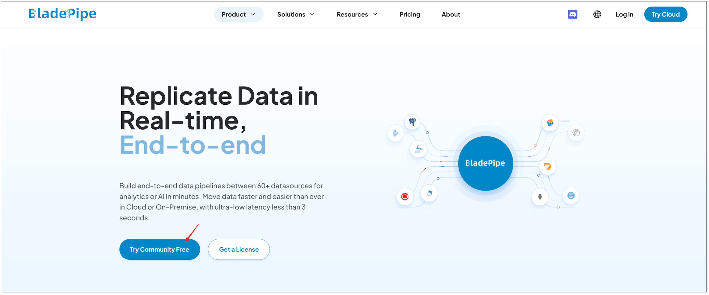
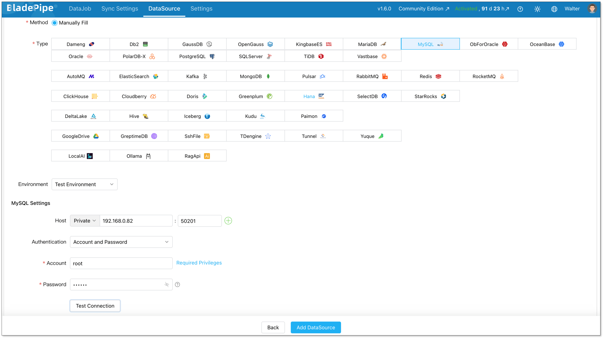
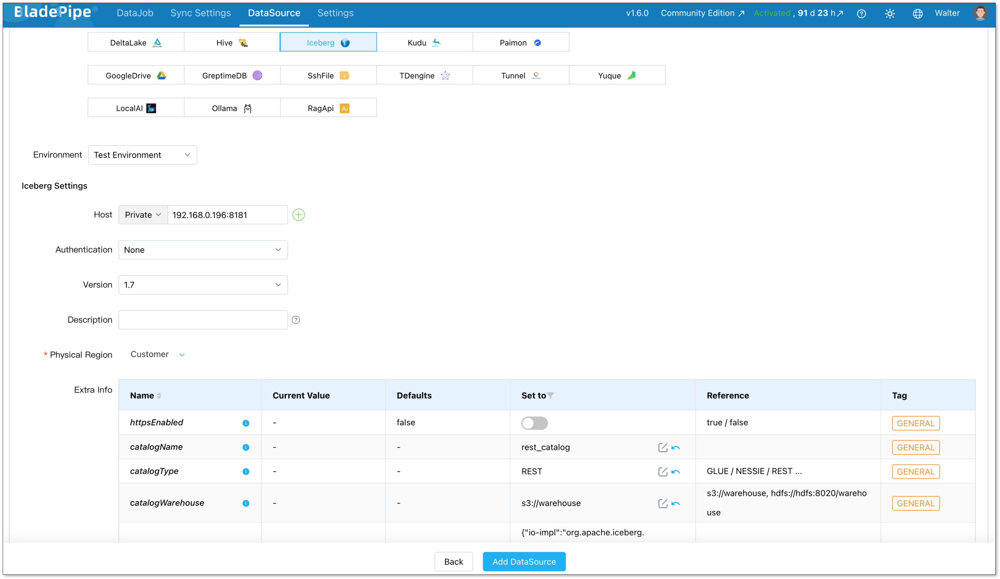
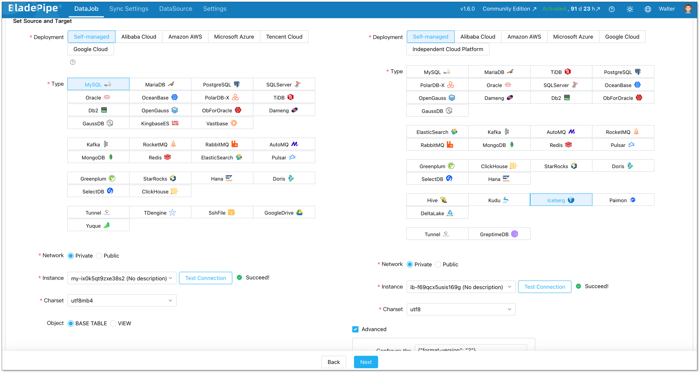
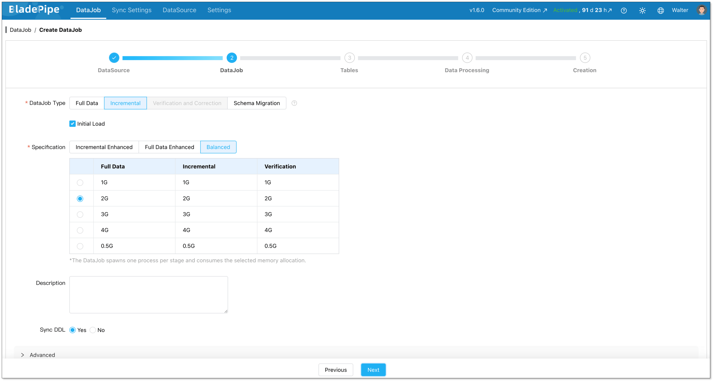
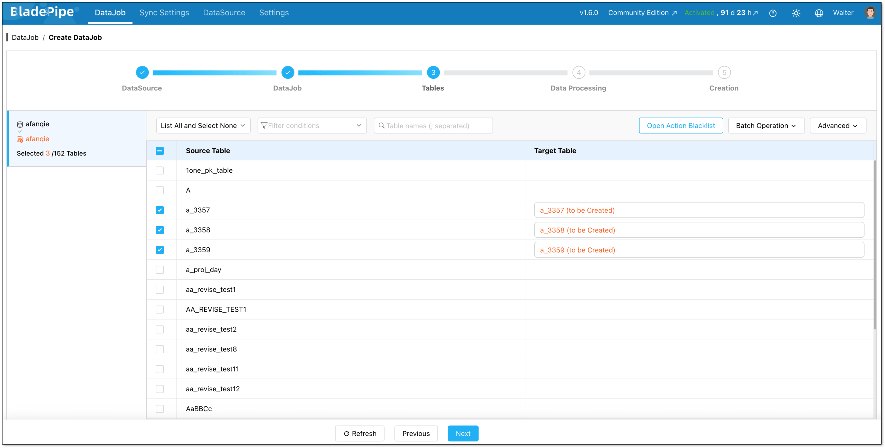
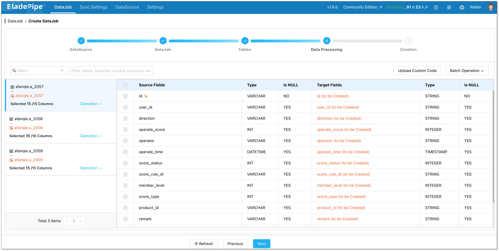
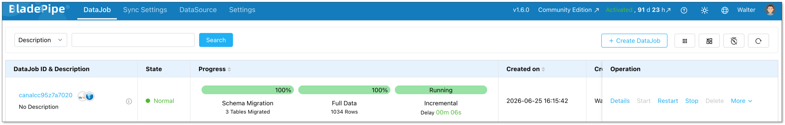

If you work with data, you've probably heard the term ETL pipeline. But what does it actually mean, and do you still need one in 2026?

This guide breaks it down. We'll cover what ETL pipelines are, where they're used, which tools are worth knowing, and how to set one up without writing a lot of code.

## Key Takeaways
- ETL pipelines extract data from a source, transform it, and load it into a destination.
- ETL is not outdated. Growing data volumes and more complex architectures have made reliable pipelines more important, not less.
- AI doesn't replace ETL. It depends on it. Clean, well-structured data movement is what makes AI systems work.
- There are three main types of ETL tools: traditional, fully managed SaaS, and real-time CDC-based platforms. Each suits different use cases.
- For real-time, low-code pipelines, CDC-based platforms like BladePipe can get you up and running in hours.

## What Is an ETL Pipeline?
ETL stands for [Extract, Transform, Load](https://www.bladepipe.com/blog/data_insights/etl_steps_explained/). It's a process for moving data from one place to another, with some cleanup along the way.

Here's what each stage does:

- **Extract**: Pull raw data from a source. This could be a database, an API, a SaaS app, or a flat file.
- **[Transform](https://www.bladepipe.com/blog/data_insights/data_transformation_services/)**: Clean and reshape the data. Think deduplication, type conversion, filtering, or renaming columns.
- **Load**: Write the processed data into a destination, like a data warehouse or a lakehouse.
  
A pipeline can run on a schedule (say, every hour) or continuously in real time. Which mode you choose depends on how fresh your data needs to be.

You might also see the term ELT. That's when you load the raw data first and transform it inside the destination. Cloud warehouses like Snowflake and BigQuery handle this well. In practice, most teams use a mix of both approaches.

Read more: [ETL vs ELT](https://www.bladepipe.com/blog/data_insights/etl_vs_elt/)

## Is ETL Still Relevant Today?

Yes, and arguably more than ever.

The number of data sources has exploded. Teams now pull from cloud apps, microservices, IoT devices, third-party APIs, and more. Every one of those connections needs a pipeline to move data reliably.

What's changed is the standard. A nightly batch job was fine a decade ago. Today, teams expect real-time dashboards, live inventory updates, and fraud detection that works in seconds. ETL hasn't gone away. It's just harder to get right.

So the better question is not whether ETL is outdated. The better question is what kind of ETL pipeline a team needs.

A traditional batch ETL pipeline may be enough for daily reporting. A real-time CDC pipeline may be better for operational analytics. A low-code pipeline platform may be the right choice when the team wants to reduce custom scripts and operational overhead.

## Will AI Replace ETL Pipelines?

No. If anything, AI makes ETL more important.

Training a machine learning model requires clean, well-structured data. So does running inference in production. AI doesn't eliminate the need for data movement, but it adds to it.

What AI does change is the tooling. Smarter schema mapping, automated anomaly detection, and suggested transformations all reduce manual work. But there's still a pipeline running underneath. It just requires less babysitting.

## ETL Pipeline Examples
Let's look at three common scenarios where ETL pipelines show up.

### Database to Data Warehouse

This is the most common use case. You move transactional data from MySQL, PostgreSQL, or Oracle into an analytical warehouse like Snowflake, BigQuery, or [Redshift](https://www.bladepipe.com/connector/redshift/). The goal is to make that data available for reporting and BI tools.

The tricky part is keeping up with changes. Full table scans don't scale once your data gets large. Tracking only new and updated records requires careful incremental logic, and that logic easily breaks whenever someone changes the source schema.

### Operational Replication

Some systems can't rely on a single database. An e-commerce platform might write orders to a primary [MySQL](https://www.bladepipe.com/connector/mysql/) database but need that data replicated to a [PostgreSQL](https://www.bladepipe.com/connector/postgresql/) read replica, an [Elasticsearch](https://www.bladepipe.com/connector/elasticsearch/) search index, or a separate microservice in real time.

The challenge here is latency. A delay of even a few seconds can cause real problems: inventory overselling, order status mismatches, or stale data showing up in customer-facing interfaces. Batch-based pipelines aren't built for this. Continuous, event-driven replication is a better fit.

### Legacy Database Migration

This is moving from an older on-premises database (like [Oracle](https://www.bladepipe.com/connector/oracle/) or [SQL Server](https://www.bladepipe.com/connector/sql-server/)) to a modern cloud platform. It usually happens as part of a larger infrastructure modernization.

The hard part is downtime. You can't take the source system offline for hours while data copies over. The migration has to happen while the system is live, which means continuous replication with a very short final cutover window. Validating that the target data matches the source adds another layer of complexity.

## Common ETL Pipeline Tools
There's no shortage of options. Here's a practical breakdown of the main categories. For specific tool comparison, see [Data Pipeline Tools Compared for 2026](https://www.bladepipe.com/blog/data_insights/best_data_pipeline_tools/).

### Traditional ETL Tools

These tools were built for on-premises environments. They offer deep transformation capabilities and enterprise governance features. They're also mature and well-tested.

The downsides: they typically require significant scripting or proprietary configuration, come with high licensing costs, and don't scale well in cloud-native environments.

**Examples**: Informatica PowerCenter, [Talend](https://www.bladepipe.com/blog/data_insights/top_7_talend_alternatives/), IBM DataStage, Microsoft SSIS

A good fit if your organization already uses these tools and has complex compliance requirements.

### SaaS / Fully Managed ETL Tools

These tools handle the infrastructure for you. No servers to deploy and no pipelines to maintain. You configure your sources, destinations, and transformation logic through a UI, and the platform takes care of the rest.

The tradeoff is flexibility. You're working within the platform's connector catalog and transformation capabilities.

**Examples**: Azure Data Factory, AWS Glue, Matillion, Google Cloud Dataflow

A good fit for teams already in a major cloud ecosystem, or those who need a managed ETL service without building from scratch.

### Real-Time Data Pipeline Platforms

These tools are built for continuous, low-latency data movement. They use [Change Data Capture (CDC)](https://www.bladepipe.com/blog/data_insights/change_data_capture_cdc/), reading directly from the database transaction log instead of querying tables. This means they're non-intrusive, capture every insert, update, and delete, and can propagate changes in near real time.

**Examples**: [BladePipe](https://www.bladepipe.com/), Striim, [Debezium + Kafka](https://www.bladepipe.com/blog/data_insights/debezium_alternatives/)

A good fit for operational use cases, like live dashboards, cross-database sync, database migration with minimal downtime, and event-driven architectures.

### Tool Comparison
|      | Traditional ETL | SaaS / Fully Managed ETL | Real-Time Pipeline |
|------|-----------------|-----------|-------------------|
| **Coding required** | High | Low | Low–Medium |
| **Real-time support** | Limited | Limited | Yes (CDC) |
| **Deployment** | On-premises | SaaS | SaaS / Self-hosted |
| **Best for** | Complex transformations | Cloud-native ETL, no ops | Operational sync, migration |
| **Setup time** | Weeks | Minutes | Minutes-Hours |

## How to Choose an ETL Pipeline Tool

Before you pick a tool, answer these four questions.

**1. How fresh does your data need to be?**     
If you need updates in seconds or minutes, you need a CDC-based real-time pipeline. Batch tools can't reach that threshold without putting heavy load on your source system.

**2. How much engineering time can you spend on this?**     
Traditional tools and self-managed open-source stacks require ongoing maintenance. Managed platforms reduce that burden, but check whether their connector catalog covers your sources and destinations.

**3. Where is your data going?**     
Fully managed tools work well if you're moving data into a cloud warehouse and your cloud provider already offers a native service. If you're syncing between operational databases, running a live migration, or need more control over transformation logic, you need a platform that handles those targets natively.

**4. Does the tool handle schema changes automatically?**
Source schemas change—columns get added, tables get renamed. A tool that requires manual updates every time that happens will slow you down fast.

If you need low latency, minimal coding, and support for both databases and cloud targets, BladePipe is a strong place to start.

## Step-by-Step: Setting Up an ETL Pipeline with BladePipe

BladePipe is a real-time data pipeline platform built on CDC. It supports MySQL, PostgreSQL, Oracle, SQL Server, MongoDB, and more, and can replicate to cloud warehouses, other databases, Kafka, and lakehouses. No pipeline code required.

Here is how to set up a real-time ETL pipeline from [MySQL to Iceberg](https://www.bladepipe.com/blog/tech_share/mysql_iceberg_sync/).

### Step 1: Install BladePipe
Go to BladePipe website and click "Try Community Free". Then you can install it using one command and start to build a pipeline for free.

### Step 2: Connect Your Source and Target
Log in to the BladePipe Console. Go to **DataSource** > **Add DataSource**.

**MySQL source**:    
+ **Deployment**: Self-managed
+ **Type**: MySQL
+ **Host**: Host and port to connect to the instance
+ **Account & Password**: Credentials to log in to your MySQL

**Iceberg target**:    
+ **Deployment**: Self-managed
+ **Type**: Iceberg
+ **Host**: Host and port to connect to the instance

For Iceberg, you need typically configure:

- **httpsEnabled**: If the Catalog is AWS Glue, this parameter must be set to true. For the other two types (Nessie and Rest), set this value based on whether SSL is enabled for the deployed Catalog service.
- **catalogName**: Specify the name of the Catalog.
- **catalogType**: Define the Catalog type (GLUE/NESSIE/REST).
- **catalogWarehouse**: Fill in the root path of the Iceberg file storage.
- **catalogProps**: The configuration varies depending on the combination of Catalog and storage type. See [Add an Iceberg DataSource](../../docs/dataMigrationAndSync/datasource_func/Iceberg/props_for_iceberg_ds.md#parameter-configuration)

### Step 3: Create An ETL Pipeline
Go to **DataJobs** > **Create DataJob**.

Select your MySQL source and Iceberg target.

Choose DataJob type: **Incremental** plus **initial load**. This is the right choice for most cases. Initial Load handles existing data. CDC takes over after that.

Select which tables to sync. You can include everything or pick specific ones.

Select the columns to sync. Here you can process data, like filtering and transformation.

Click **Create DataJob**.    
From this point, BladePipe monitors the pipeline on its own. If the source schema changes, BladePipe detects it and adjusts without manual intervention.

## Wrapping Up
ETL pipelines aren't going away. If anything, they're becoming more central to how modern data teams operate.

The tools have gotten better. You no longer need a team of specialists or weeks of setup to get data moving reliably. Platforms like [BladePipe](https://www.bladepipe.com/login/) make it possible to build a real-time pipeline in a few hours, with minimal code and minimal maintenance.

If you're evaluating your options, start with what you actually need: how fresh your data should be, where it's going, and how much time you can spend keeping the pipeline running. The answers will point you in the right direction.

## FAQ
**Q: What is an ETL pipeline?**    
A process that moves data between systems in three steps: Extract (pull from a source), Transform (clean and reshape), and Load (write to a destination).

**Q: What is the difference between ETL and ELT?**    
In ETL, data is transformed before it's loaded. In ELT, raw data is loaded first and transformed inside the destination. Most modern pipelines use a mix of both.

**Q: Is ETL outdated?**    
No. The tooling has improved, but the need for reliable data movement has only grown. Modern ETL platforms are faster to set up and support real-time replication that older tools couldn't handle.

**Q: How to choose an ETL tool for a data warehouse project?**    
Think about latency requirements, how much maintenance your team can absorb, and which sources and destinations you need. For most warehouse projects, a real-time CDC tool like BladePipe is a solid starting point.

**Q: How to set up an ETL pipeline with minimal coding?**    
Use a low-code platform. With BladePipe, you connect your source, pick your destination and tables, and start replicating with no code needed. See the step-by-step guide above for a full walkthrough.