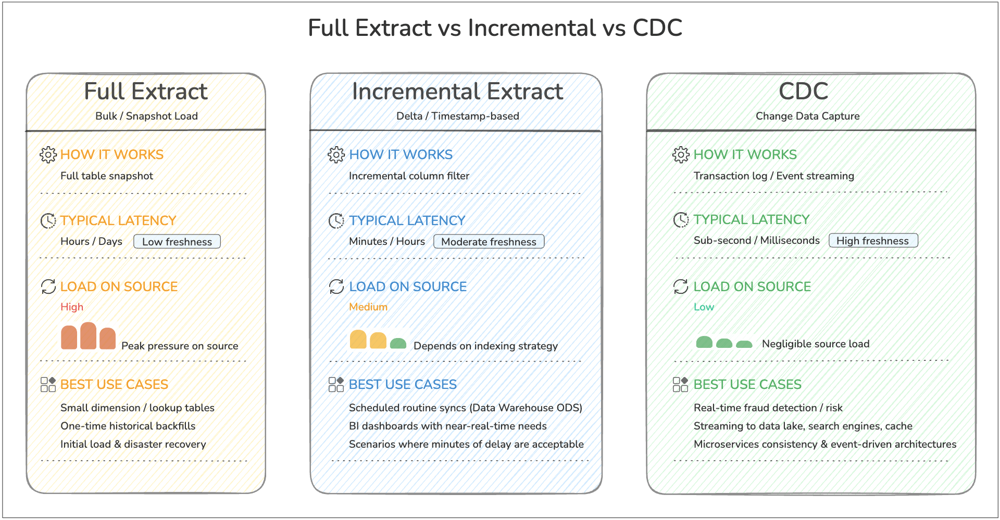
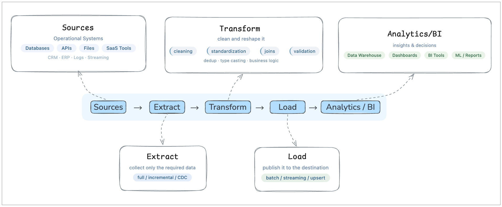

If you've ever searched for **ETL explained for beginners**, you've probably seen the same vague definitions repeated everywhere. People mention *the three ETL steps* or *ETL process steps*, but rarely break them down in a way that actually makes sense.

So let’s fix that.

In this guide, you’ll see what ETL means, why each step exists, and how the flow works in a real pipeline. We’ll use simple analogies, practical SQL examples, and one end-to-end scenario so the process feels concrete instead of abstract.

## What Is ETL in Simple Terms

At its core, ETL stands for:

- **Extract** → Get data from somewhere
- **Transform** → Clean and reshape it
- **Load** → Store it somewhere useful

Think of it like cooking:

- Extract = buying ingredients
- Transform = chopping, seasoning, cooking
- Load = plating the dish

That’s it. But the real value comes from how each step is executed.

## Step 1: Extract – The Foundation of the ETL Steps

The first step is getting data out of source systems.

### What Actually Happens Here

You pull data from:

- Databases (MySQL, PostgreSQL, etc.)
- APIs
- Files (CSV, JSON)
- SaaS tools (Salesforce, Shopify)

The key challenge is not simply "copy the data." It is pulling the right data, at the right time, without slowing down the production system your business depends on.

### Why Extract Is More Than Copying Data

A beginner-friendly way to think about extraction is this:

- The business system is built for transactions
- The analytics system is built for queries
- ETL sits in the middle so one does not overload the other

If you run heavy analytical queries directly on your production database, you can create latency, lock contention, or unnecessary compute costs. Good extraction protects the source system while still making fresh data available downstream.

### How Teams Usually Do It

In practice, teams normally choose one of three extraction patterns:

- **Full extract** for small tables or first-time backfills
- **Incremental extract** for rows added or changed since the last run
- **Log-based capture** when they need very low latency or want to avoid repeated table scans

If you are new to log-based sync, [**Change Data Capture (CDC)**](https://www.bladepipe.com/blog/data_insights/change_data_capture_cdc/) is the modern pattern most teams use for near real-time pipelines.



For most beginners, the key takeaway is simple: start with incremental extraction for routine pipelines, and move to CDC when latency and scale make repeated scans inefficient.

### Simple Example (SQL)

```sql
SELECT id, name, created_at
FROM users
WHERE created_at >= CURRENT_DATE - INTERVAL '1 day';
```

This extracts only *new data* instead of everything—this is called **incremental extraction**, a critical best practice.

### Real-World Analogy

Imagine you run a warehouse. Instead of picking up *all inventory every day*, you only pick up **new shipments**. That’s efficient extraction.

### Common Pitfalls

- Pulling too much data (slow + expensive)
- No change tracking (duplicate data)
- Ignoring API rate limits
- Extracting from replicas or off-peak windows too late, so data arrives stale

## Step 2: Transform – Where Raw Data Becomes Useful

This is the most misunderstood part of ETL.

### What Actually Happens Here

Raw data is messy. Transformation makes it usable by:

- Cleaning (removing nulls, fixing formats)
- Standardizing (dates, currencies)
- Joining datasets
- Aggregating metrics

### Why Transformation Matters

This step is where raw records become business-ready data.

Without transformation:

- The same customer may appear in multiple formats
- Dates may not line up across systems
- Null values and duplicates can distort metrics
- Dashboards may disagree because each team applies different logic

In other words, transformation is how you turn "data that exists" into "data people can trust."

If you want a deeper look at common cleanup and modeling patterns, see [**Data Transformation in ETL: Types, Examples and Benefits**](https://www.bladepipe.com/blog/data_insights/etl_transform/).

### Simple Example (SQL)

```sql
SELECT 
    user_id,
    LOWER(email) AS email,
    DATE(created_at) AS signup_date
FROM raw_users
WHERE email IS NOT NULL;
```

### Python Example (Pandas)

```python
import pandas as pd

df = pd.read_csv("users.csv")

df = df.dropna(subset=["email"])
df["email"] = df["email"].str.lower()
df["signup_date"] = pd.to_datetime(df["created_at"]).dt.date
```

### Real-World Analogy

You bought ingredients (Extract). Now you're:

- Washing vegetables
- Cutting them properly
- Cooking everything into a meal

Without transformation, your “data dish” is inedible.

### How Teams Actually Transform Data

In real pipelines, transformation usually includes a mix of:

- **Cleaning** so invalid rows do not flow downstream
- **Standardizing** so formats match across sources
- **Joining** so isolated records become useful context
- **Modeling** so the final tables match analytics or application needs
- **Validation** so bad outputs are caught before loading

This is also where business logic lives. For example:

- "Active customer" may mean login within 30 days
- Revenue may exclude refunds
- Orders may need currency conversion before reporting

That is why transformation is often the step that determines whether a pipeline is merely moving data or actually creating usable information.

## Step 3: Load – Delivering Data to Its Destination

The final step is loading transformed data into a target system.

### Common Destinations

- Data warehouses (Snowflake, BigQuery)
- Databases
- Data lakes
- BI tools

### Why Loading Is Not Just "Save the Table"

Load sounds simple, but this step decides how reliably downstream teams can use the data.

A good loading strategy answers questions like:

- Should we append new rows or upsert existing ones?
- What happens if the same batch is retried?
- How often should the target be refreshed?
- Do analysts need near real-time data or hourly snapshots?

If these choices are wrong, users may see duplicate records, outdated dashboards, or broken reports even when extraction and transformation were correct.

### Simple Example (SQL Insert)

```sql
INSERT INTO clean_users (user_id, email, signup_date)
SELECT user_id, email, signup_date
FROM transformed_users;
```

### Batch vs Real-Time Loading

- **Batch loading** → periodic (every hour/day)
- **Streaming loading** → near real-time updates

### How Teams Decide What to Load

The loading method usually depends on the destination and the use case:

- Load into a warehouse when analysts need structured, queryable tables
- Load into a data lake when you want low-cost storage and flexible downstream processing
- Load into an operational store or cache when applications need fresh data quickly

The "right" load step is the one that matches how the data will actually be consumed.

### Real-World Analogy

You’ve cooked the meal. Now you plate it and serve it to customers.

If you don’t load the data properly, no one can use it—just like a meal sitting in the kitchen.

## A Simple ETL Process Example Step by Step

Let’s walk through a realistic scenario to tie everything together.

### Scenario

You want to analyze daily user signups from your app.

### Step-by-Step Breakdown

**1. Extract**

```sql
SELECT * FROM app_users WHERE created_at >= CURRENT_DATE;
```

Why this step matters:
You only pull today’s new rows, which keeps the query lightweight and avoids reprocessing historical data every run.

**2. Transform**

```sql
SELECT 
    id,
    LOWER(email) AS email,
    DATE(created_at) AS signup_date
FROM app_users
WHERE email IS NOT NULL;
```

Why this step matters:
You remove unusable records, normalize email values, and reshape timestamps into a reporting-friendly field.

**3. Load**

```sql
INSERT INTO analytics.daily_signups
SELECT * FROM transformed_data;
```

Why this step matters:
You move cleaned data into a destination table designed for analytics, so dashboards and reports do not have to repeat the cleanup logic every time they query.

Now your analytics team can query:

```sql
SELECT signup_date, COUNT(*) 
FROM analytics.daily_signups
GROUP BY signup_date;
```

That is ETL in action: extract only what you need, transform it into a trusted format, and load it where people can use it.

If you want to operationalize this kind of flow without stitching together multiple tools, [BladePipe](https://www.bladepipe.com/) supports ETL-style pipelines for moving and transforming data end to end.

## ETL Workflow Diagram

Now that we have looked at each step individually, it helps to zoom out and see the whole flow in one picture.

This diagram shows ETL as a pipeline with purpose, not just three words in sequence.



Seen this way, ETL is not just a sequence of tasks. It is the control layer that moves data from operational systems into a form that analytics teams can actually use.

## Common Mistakes Beginners Make

Even when people understand the ETL basics, they often make these mistakes:

### 1. Treating ETL as Just Data Movement

It’s not. Moving rows from A to B is the mechanical part, but ETL becomes valuable only when the data arrives in a form that downstream users can trust.

If a pipeline copies dirty, inconsistent records into a warehouse, the team still has a data quality problem. The work has simply moved to analysts, dashboards, or application code.

### 2. Skipping Data Validation

Bad data in = bad insights out.

Validation does not need to be complicated, but it does need to exist. Even simple checks like "email is not null," "amount is non-negative," or "row counts did not suddenly drop 90%" can prevent broken reporting and hard-to-debug downstream issues.

### 3. Overcomplicating Too Early

Many beginners assume a "real" ETL pipeline needs a complex orchestration layer, custom framework, or deeply nested transformations from day one.

In reality, a small and understandable pipeline is usually better than a sophisticated one nobody wants to maintain. Start with a clear flow, then add complexity only when scale, latency, or governance actually require it.

### 4. Ignoring Performance

Efficient queries and incremental loads matter.

A pipeline can be logically correct and still fail in production if it scans too much data, reloads the same records repeatedly, or competes with application traffic on the source system. Performance is not just an optimization topic; it is part of pipeline reliability.

## Why ETL Still Matters Today

Even with modern ELT and data lakes, ETL is still a fundamental pattern in data engineering.

ETL helps:

- Ensure clean, reliable data
- Structure data for analytics
- Power dashboards and decision-making

Whether you use batch pipelines or near real-time pipelines, the core logic remains the same: collect data, improve it, and deliver it in a usable form.

For teams deciding when ETL is better than warehouse-first processing, the tradeoffs are covered in [**ETL vs ELT**](https://www.bladepipe.com/blog/data_insights/etl_vs_elt/).

## FAQ

### When should you use ETL instead of ELT?

ETL is a strong choice when data must be cleaned, validated, masked, or standardized before it lands in the target system. It is especially useful when governance is important, downstream users need curated tables, or you want to reduce bad data before it spreads.

If you want a broader architectural comparison, see [**ETL vs ELT**](https://www.bladepipe.com/blog/data_insights/etl_vs_elt/).

### What is the difference between batch ETL and real-time ETL?

Batch ETL runs on a schedule, such as every hour or every night. Real-time or near real-time ETL processes changes continuously or in very short intervals. The core ETL logic is the same in both cases. The main difference is how quickly data moves and how much freshness the business needs.

### Is ETL hard to learn?

The concept itself is not hard to learn. Most beginners understand ETL quickly once they see one complete example from source to destination. What becomes difficult is production scale: handling retries, schema changes, performance limits, and data quality over time.

## Final Thoughts

Most articles overcomplicate ETL. But when you strip it down, the **ETL process steps** are just a simple flow:

- Get the data
- Clean it
- Store it

The difference between beginners and experts isn’t understanding the steps—it’s how well they execute them. If you truly understand these three steps, you’ve already built the foundation for modern data engineering.