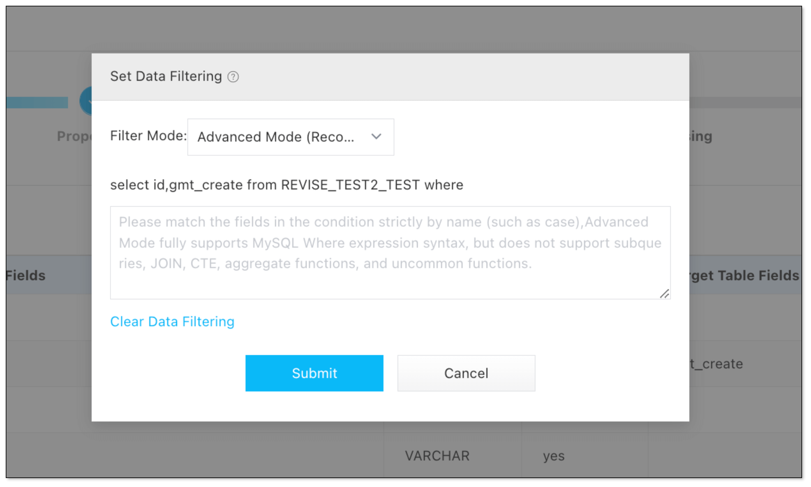
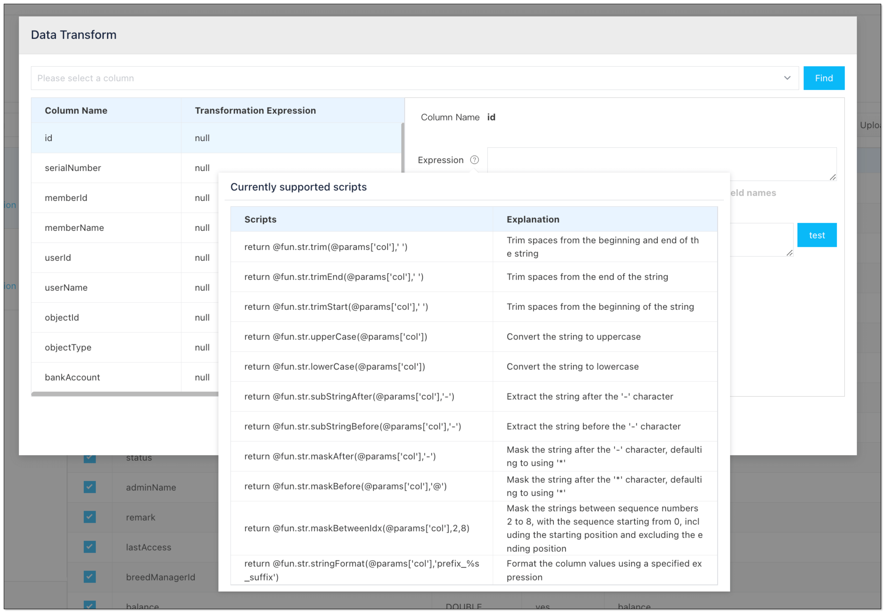
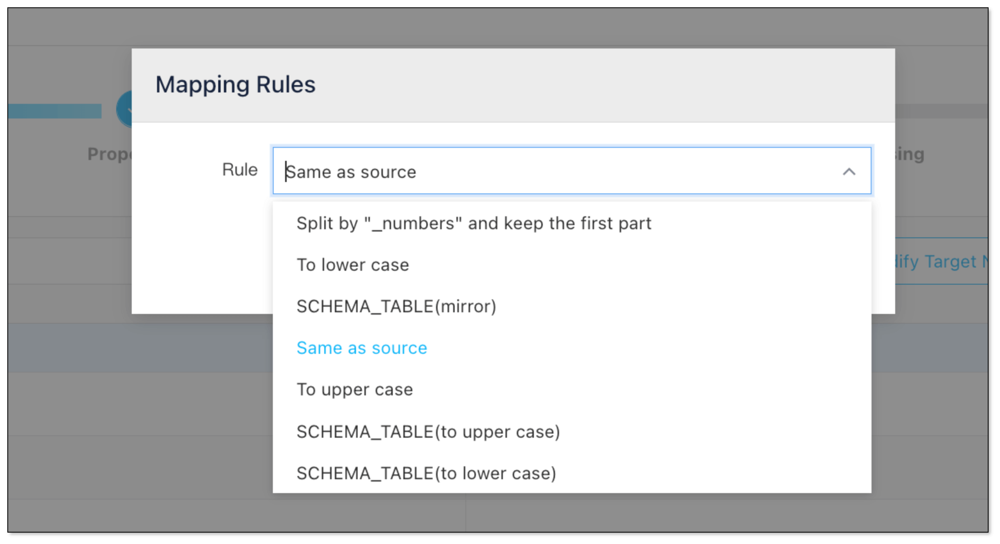

ETL (Extract, Transform, Load) is a fundamental process in data integration and data warehousing. In this process, data transformation is a key step. It’s the stage where raw, messy data gets cleaned up and reorganized so it’s ready for analysis, business use and decision-making. 

In this blog, we will break down data transformation to help you better understand and process data in ETL.

## What is Data Transformation in ETL?

In the [ETL process](etl_steps_explained.md), data transformation is the middle step that turns extracted data from various sources into a consistent, usable format for the target system (like a data warehouse or analytics tool). This step applies rules, logic, and algorithms to:

- Clean up errors and inconsistencies
- Standardize formats (like dates and currencies)
- Enrich data with new calculations or derived fields
- Restructure data to fit the needs of the business or target system

Without transformation, data from different sources would be incompatible, error-prone, or simply not useful for downstream processing like reporting, analytics, or machine learning.

## Why is Data Transformation Important?

- **Ensure Data Quality**: Fix errors, fill in missing values, and remove duplicates so the data is accurate and trustworthy.
- **Improve Compatibility**: Convert data into a format compatible with the target system, and handle schema differences, which are vital for combining data from different sources.
- **Enhance Performance & Efficiency**: Filter unnecessary data early, reducing storage and processing costs. Optimize data structure through partitioning and indexing for faster queries.
- **Enable Better Analytics & Reporting**: Aggregate, summarize, and structure data so it’s ready for dashboards and reports.

## 10 Types of Data Transformation
Here are the most common types of data transformation you’ll find in ETL pipelines, with simple explanations and examples:

| Transformation Type |	Explanation |	Example/Use Case |
| -- | -- | -- |
| **Data Cleaning** |	Remove errors and fixes inconsistencies to improve quality | Replace missing values in a "Country" column with "Unknown" |
| **Data Mapping**	| Match source data fields to target schema so data lands in the right place |	Map “cust_id” from source to “customer_id” in target |
| **Data Aggregation** |	Summarize detailed data into a higher-level view |	Sum daily sales into monthly totals |
| **Bucketing/Binning** |	Group continuous data into ranges or categories for easier analysis |	Group ages into ranges (18–25, 26–35, etc.) |
| **Data Derivation** |	Create new fields by applying formulas or rules to existing fields |	Derive "Profit" by subtracting "Cost" from "Revenue" in a sales dataset |
| **Filtering**	 | Select only relevant or necessary records |	Filter out only 2024 sales records from the entire sales table  |
| **Joining** |	Combine data from multiple sources or tables based on a common key | Join a "Customers" table with an "Orders" table on "CustomerID" to analyze order history |
| **Splitting** |	Break up fields into multiple columns for granularity or clarity |	Split “Full Name” into “First Name” and “Last Name” |
| **Normalization** |	Standardize scales or units |	Convert currencies to USD |
| **Sorting and Ordering** | Arrange records based on one or more fields, either ascending or descending |	Sort a customer list by "Signup Date" in descending order to identify recent users |

## Automate Data Transformation with BladePipe
[BladePipe](https://www.bladepipe.com) is a real-time end-to-end data replication tool. It supports various ways to transform data. With a user-friendly interface, complex end-to-end transformations can be done in a few clicks.

Compared with tranditional data transformation ways, BladePipe offers the following features:

- **Real-time Transformation**: Any incremental data is captured, transformed and loaded in real time, critical in projects requiring extremely low latency. 

- **Flexibility**: BladePipe offers multiple built-in transformation without manual scripting requirements. For special transformation, custom code can cater to personalized needs.  

- **Ease of Use**: Most operations are done in an intuitive interface with wizards. Except transformation via [custom code](https://www.bladepipe.com/docs/operation/job_manage/create_job/create_process_job/), the other data transformations don't require any code.

### Data Filtering
BladePipe allows to specify a condition to filter out data by SQL WHERE clause, so that only relevant records are processed and loaded, improving the ETL performance.

### Data Cleaning
BladePipe has several built-in data transformation scripts, covering common use cases. For example, you can simply remove leading and trailing spaces from strings, standardizing the data format.

### Data Mapping
In BladePipe, the table names and field names can be mapped to the target instance based on certain rules. Besides, you can name each table as you like.

## Wrapping Up
Data transformation is the engine that powers the effective ETL process. By cleaning, standardizing, and enriching raw data, it ensures organizations have reliable, actionable information for decision-making. Whether you’re combining sales data, cleaning up customer lists, or preparing data for machine learning, transformation is what makes your data truly useful.
