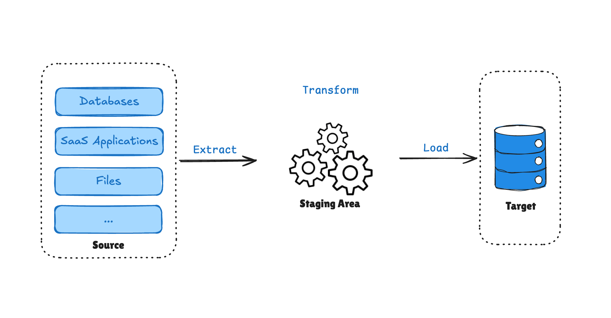
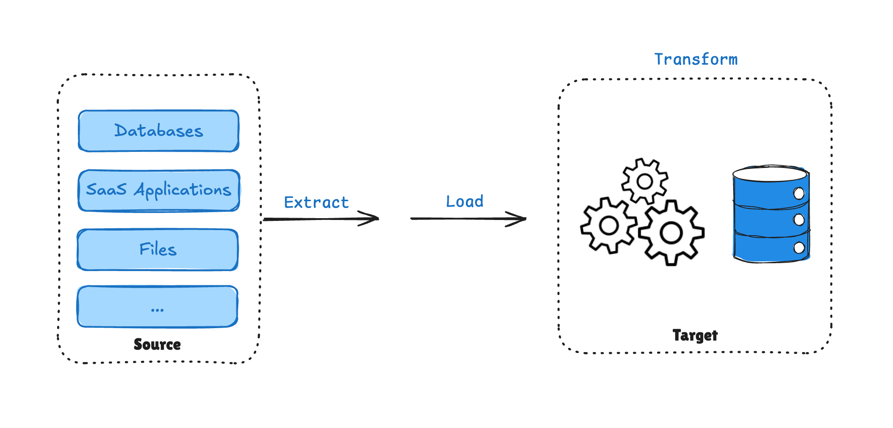

"If we're redesigning our data stack, should we transform data before loading it - or after it lands in the warehouse?"

That single decision shapes performance, cost, scalability, governance, and even how future-proof your architecture is.

The difference between **ETL vs ELT** isn't just the order of letters. It's about **where control lives** in your data pipeline - and where compute power does the heavy lifting.

- **ETL** transforms data *before* it reaches the data warehouse.
- **ELT** loads raw data first, then transforms it *inside* the warehouse.

Both approaches are valid. Both can scale. And neither is universally "better."

Let's break them down properly - technically, practically, and strategically.

## What Is ETL and How Does It Work?

### ETL Meaning and Full Form

**ETL** stands for:

- **Extract**
- **[Transform](https://www.bladepipe.com/blog/data_insights/etl_transform/)**
- **Load**

If you're wondering *"what does ETL mean in data?"* - it refers to a structured data integration process where raw data is extracted from source systems, transformed into a clean and consistent format, and then loaded into a target system such as a data warehouse.

The key idea: **data is shaped before it is stored in the warehouse.**

### The [ETL Process](etl_steps_explained.md) Step by Step

Here's how a typical **ETL process** works:

1. **Extract**

    Data is pulled from sources like:
   - Operational databases
   - APIs
   - CRM systems (e.g., Salesforce)
   - Legacy systems
2. **Transform**

    Data is processed in a staging area or external compute engine:
   - Cleaning
   - Mapping
   - Splitting
   - Deduplication
   - Joining multiple sources
   - Aggregation
   - Schema enforcement
   - Validation and testing
3. **Load**

    Only curated, structured data is loaded into the warehouse.

### Why ETL Was Designed This Way

To understand **why ETL is important**, we need historical context.

Before cloud-native warehouses:

- Storage was expensive.
- Compute inside databases was limited.
- Data warehouses were tightly controlled environments.

Because storage was costly, companies couldn't afford to dump raw data into warehouses. They had to:

- Define schemas upfront
- Know exactly what they wanted
- Remove unnecessary fields
- Model carefully before loading

This had major advantages:

- Strong governance
- Clear data models
- Predictable performance
- Lower storage cost

But also drawbacks:

- Schema changes require pipeline redesign
- Raw data lost, no historical reprocessing
- Upstream transformation engines create compute bottlenecks
- Transform before load slows ingestion
- New sources need engineering to modify pipelines

ETL forced discipline - sometimes beneficial, sometimes restrictive

### When ETL Works Best

ETL is often a strong choice when:

- You have **strict regulatory or compliance requirements**
- Data models must be well-defined upfront
- You need heavy cleansing before storage
- Storage cost control is critical
- Datasets are moderate in size
- Transformations rely on external libraries (e.g., Python, Spark)

Although many associate ETL with batch processing, modern streaming engines allow transformation to occur before loading in near real-time scenarios. Order unchanged, latency drops.

## What Is ELT and Why It Became Popular?

### What Is ELT?

**ELT** stands for:

- **Extract**
- **Load**
- **Transform**

The order changes everything.

Instead of transforming data before loading, ELT loads raw data directly into a warehouse or data lake - and transformation happens *inside* that system.

If ETL is about controlling data before storage, ELT is about leveraging warehouse compute after storage.

### The ELT Process Explained

1. **Extract**
    
    Pull raw data from source systems.
2. **Load**
    
    Immediately load raw data into:
   - Snowflake
   - BigQuery
   - Redshift
   - Data lakes
   - Lakehouses
3. **Transform**
    
    Use SQL or distributed engines (Spark, etc.) to transform data inside the warehouse.

### Why ELT Became Popular

Several shifts made ELT viable:

#### 1. Cheap Cloud Storage

Cloud storage costs dropped dramatically. Storing raw data was no longer expensive.
Instead of discarding raw data during transformation, companies could:

- Store everything
- Change schemas later
- Reprocess historical data

This enabled flexibility and experimentation.

#### 2. Massively Parallel Compute

Modern warehouses like Snowflake and BigQuery provide:

- Distributed compute
- Columnar storage (e.g., Parquet)
- Automatic scaling
- On-demand clusters

Rather than transforming data in limited upstream systems, you could:

- Load quickly
- Let warehouse compute handle transformations
- Scale dynamically

#### 3. Scalability and Data Lake Architectures

ELT aligns naturally with:

- Data lakes
- Lakehouses
- Large-scale analytics
- Machine learning workflows

Instead of blocking on transformation, data teams load first and iterate later.

### The Hidden Tradeoffs of ELT

ELT isn't free of problems.

A practical example illustrates this well:

A team once loaded raw streaming data into Snowflake - storing 3.3TB of JSON in a single VARIANT column. Initially, this was fast and flexible. Two years later:

- The dataset grew significantly
- Queries slowed dramatically
- Downstream models suffered
- Refactoring required heavy compute time

Because everything was "dumped raw," proper modeling was deferred - and technical debt accumulated.

Common ELT downsides:

- Weak upfront data modeling
- Schema chaos
- Rising compute costs
- Performance degradation over time
- Overreliance on warehouse compute

ELT provides flexibility - but without governance, it can create long-term inefficiency.

## Similarities Between ETL and ELT

Although ETL and ELT differ in architecture, they share several foundational principles.

### 1. Both Follow the Same Logical Data Flow

At a conceptual level, both approaches include:

- Extracting data from source systems
- Transforming data into usable formats
- Loading data into analytics environments

The difference lies in *where* transformation happens, not whether it happens.

### 2. Both Require Data Cleaning and Validation

Regardless of order, data must be:

- Deduplicated
- Standardized
- Filtered
- Validated
- Structured

Data quality is essential in both ETL and ELT pipelines.

### 3. Both Support Batch and Streaming Architectures

While ETL is historically batch-oriented and ELT is often associated with modern cloud environments, both models can operate in:

- Scheduled batch workflows
- Near real-time streaming pipelines
- [CDC-based incremental updates](https://www.bladepipe.com/docs/operation/job_manage/create_job/create_full_incre_task/)

The distinction is architectural - not temporal.

### 4. Both Integrate Multiple Data Sources

Modern data environments require combining data from:

- Databases
- SaaS applications
- APIs
- Filesystems
- Event streams

Both ETL and ELT pipelines are designed to unify heterogeneous [data sources](https://www.bladepipe.com/connector/) into analytical systems.

### 5. Both Serve the Same Business Objective

Ultimately, both approaches exist to:

- [Enable analytics and business intelligence](https://www.bladepipe.com/real-time-analytics/)
- Support AI and machine learning workloads, including [RAG systems](https://www.bladepipe.com/ai-rag/)
- Improve data-driven decision-making

They represent different architectural paths toward the same strategic outcome.

## ETL vs ELT Key Differences

While ETL and ELT share similar goals, they differ in architectural design, scalability models, cost structure, and governance implications.

Here's a simplified comparison:

| Dimension                     | ETL                                | ELT                                          |
| ----------------------------- | ---------------------------------- | -------------------------------------------- |
| Processing Order              | Extract -> Transform -> Load       | Extract -> Load -> Transform                 |
| Transformation Location       | External processing layer          | Inside data warehouse                        |
| Ingestion Speed               | Slower (transform before load)     | Faster (load first)                          |
| Scalability & Data Volume     | Limited by ETL engine              | Scales with warehouse compute                |
| Cost Structure                | External compute + reduced storage | Warehouse compute + cheap storage            |
| Raw Data Retention            | Often not preserved                | Raw data preserved                           |
| Schema Flexibility            | Rigid, predefined                  | Flexible, evolving                           |
| Semi-Structured Data Handling | Requires preprocessing             | Natively supported in modern warehouses      |
| Security & Compliance         | Mask before load                   | Requires governance after load               |
| Operational Complexity        | Higher engineering control         | Lower initial setup, but governance required |

### 1. Where Transformation Happens

**ETL** performs transformation outside the data warehouse, typically in a separate processing layer or staging environment.

**ELT** loads raw data directly into the warehouse and performs transformation inside the warehouse using its native compute engine.

**Why this matters:**

- ETL provides stronger upstream control before data enters storage.
- ELT leverages massively parallel warehouse compute for scalability.

This architectural decision affects performance, cost, and flexibility.

### 2. Data Retention Strategy

**ETL** often stores only curated, structured data in the warehouse. Raw source data may not be retained long-term.

**ELT** preserves raw data alongside transformed models, creating a historical archive.

**Implications:**

- ELT enables schema evolution and historical reprocessing.
- ETL reduces storage footprint but limits retrospective modeling.

Raw data retention is one of the defining advantages of ELT in modern analytics.

### 3. Ingestion Speed and Pipeline Latency

**ETL** requires data to be transformed before loading, which couples ingestion speed to transformation performance.

**ELT** decouples ingestion from transformation. Data can be loaded immediately and transformed later, often in parallel.

As a result:

- ELT typically allows faster initial ingestion.
- ETL pipelines may introduce additional latency, especially as dataset size grows.

However, ingestion speed ultimately depends on implementation quality and infrastructure capacity.

### 4. Scalability Model

**ETL scalability** depends on the compute capacity of the transformation engine. Scaling often requires provisioning additional infrastructure.

**ELT scalability** leverages cloud data warehouse capabilities such as:

- Automatic scaling
- Distributed compute clusters
- Serverless architectures

Because transformation occurs inside massively parallel systems, ELT can scale more dynamically for large workloads.

### 5. Handling Semi-Structured and Unstructured Data

Modern analytics increasingly involves:

- JSON
- Log files
- Event streams
- Nested data formats

ELT architectures are often better suited for these formats because raw data can be loaded and processed natively inside systems optimized for semi-structured storage.

ETL workflows may require additional parsing and restructuring before loading.

### 6. Compliance and Sensitive Data Handling

For industries with strict regulatory requirements, transformation order matters.

**ETL advantage:**

- Sensitive data can be [masked](https://www.bladepipe.com/blog/data_insights/data_masking/), encrypted, or removed before storage.
- Reduces risk of non-compliant data entering the warehouse.

**ELT consideration:**

- Raw data is stored first, which may include sensitive fields.
- Requires strong governance policies and access controls.

For environments handling PII or regulated information, ETL's pre-load transformation can reduce compliance risk.

### 7. Governance vs Flexibility

At a strategic level:

- ETL prioritizes governance, structure, and predictability.
- ELT prioritizes flexibility, experimentation, and scalability.

Organizations must decide whether they optimize for upfront control or downstream adaptability.

## ETL vs ELT in Cloud Data Architecture

In modern cloud environments, the question isn't purely ETL vs ELT - it's how they integrate.

With tools like:

- Snowflake
- BigQuery
- Redshift
- Lakehouses
- Streaming platforms
- CDC pipelines

Architectures are increasingly hybrid.

For example:

- Use CDC to replicate operational databases
- Load raw data quickly (EL)
- Apply transformation logic in stages (T)
- Pre-transform sensitive data before load (ET)

This hybrid approach balances:

- Performance
- Governance
- Cost efficiency
- Real-time needs

Some architects even describe modern pipelines as: **EL-ETL** 
Load fast, then refine intelligently.

## A Practical Snowflake Example

Let's make this concrete.

### ELT Scenario

- Extract data from Salesforce
- Load raw JSON into Snowflake
- Use SQL to flatten and transform
- Materialize cleaned tables downstream

Advantages:

- Flexible
- Scalable
- Easy to modify schema later

Risks:

- Raw tables grow large
- Poor modeling leads to expensive queries

### ETL Scenario

- Extract data from Salesforce
- Transform using Spark or external engine
- Clean, deduplicate, validate
- Load curated structured tables into Snowflake

Advantages:

- Strong governance
- Predictable query performance
- Lower warehouse compute cost

Tradeoff:

- Less flexible after load
- Requires careful upfront planning

## ETL vs ELT: Which One Should You Choose?

### Choose ETL If:

- You have strict compliance requirements
- Storage cost must be tightly controlled
- Data models are stable and predictable
- You require advanced transformations using external languages
- Governance and data quality must be enforced early

**Example:** 

You work for a regional healthcare provider and need to generate monthly performance reports that combine data from electronic health records, lab systems, and billing platforms.

Each system structures patient data differently. Diagnosis codes vary, date formats are inconsistent, and duplicate records are common.

Before these reports can be shared with leadership, the data must be standardized, validated, and de-identified to meet privacy regulations.

In this case, **ETL** provides a controlled approach.

Data is extracted from each system, transformed into a unified format - for example, mapping diagnosis codes into a consistent classification model and masking protected health information - and only then loaded into the reporting warehouse.

The result is structured, compliant, and reliable data ready for operational and regulatory reporting.

When accuracy and compliance matter more than rapid experimentation, ETL offers stronger upstream control.

### Choose ELT If:

- You use a scalable cloud warehouse
- You need flexibility for evolving schemas
- You process very large datasets
- You rely heavily on SQL-based transformations
- You prioritize speed of ingestion

**Example:** 

You work at a fast-growing SaaS company collecting large volumes of user events, feature usage logs, and subscription data.

Product teams frequently redefine metrics, test new pricing models, and launch experiments. Business questions change quickly.

If every data model had to be finalized before loading, each metric update would require pipeline redesign.

In this environment, **ELT** offers greater flexibility.

Raw event data is loaded directly into the cloud warehouse as soon as it is generated. Transformations - such as calculating retention rates or cohort metrics - are performed inside the warehouse when needed.

The result is faster ingestion, the ability to reprocess historical data when definitions change, and more room for experimentation.

When agility and rapid iteration matter more than strict upfront schema control, ELT is often the better fit.

### Choose Hybrid If:

- You use CDC pipelines
- You need real-time replication
- Some data requires pre-load cleansing
- You want flexibility without losing governance

In practice, most modern data stacks are hybrid.

## Building Flexible ETL and ELT Pipelines with BladePipe

Modern data integration platforms shouldn't force you to choose rigidly between ETL and ELT.

With [BladePipe](https://www.bladepipe.com/), you can:

- Build real-time CDC pipelines
- Support both ETL-style pre-transform workflows
- Push down transformations into cloud warehouses
- Maintain sub-second synchronization
- Visually orchestrate pipelines
- Scale across hybrid and multi-cloud environments

Instead of choosing one philosophy, you can design pipelines based on workload requirements.

Flexibility is the real advantage. [Create a free account now](https://www.bladepipe.com/login/) and start using ELT and ETL on BladePipe.

## FAQs

### Is ELT better than ETL?

Not inherently. ELT is more flexible and cloud-native, but ETL offers stronger upfront governance and cost predictability.

### Is ETL outdated?

No. ETL remains valuable for compliance-heavy industries, structured data environments, and advanced transformation needs.

### Can ETL be real-time?

Yes. With streaming engines and CDC integration, ETL pipelines can operate in near real-time.

### Is ELT cheaper?

It depends. Storage may be cheap, but warehouse compute for transformations can become expensive at scale.

## Final Thoughts

The debate around **ETL vs ELT** isn't about which acronym wins.

It's about:

- Where you want transformation to happen
- How you manage cost
- How much flexibility you need
- How disciplined your modeling practices are

ETL ensures data is cleaned and compliant before loading. 
ELT leverages cloud warehouses to process raw data at scale. 
Hybrid approaches combine ETL and ELT for diverse needs.

The right choice depends on your architecture, your team maturity, and your long-term data strategy. If you design carefully, you won't just pick ETL or ELT - you'll build a pipeline that uses both intelligently.