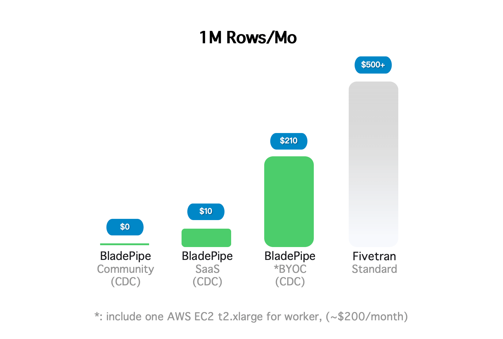

Most data engineers don't actively look for a **Fivetran alternative** - until pricing or architecture constraints make it necessary.

Over the past year, Fivetran has rolled out multiple pricing updates. In March 2025, tiered pricing shifted from the **account level to the connection level**. Then, starting January 1, 2026, another wave of changes introduced a $5 minimum charge per connection, started billing for deletions, and added costs for repeated updates in history mode.

Individually, each update is explained as a necessary adjustment to align pricing with infrastructure costs. From a vendor's perspective, that logic holds up.

But for the customers footing the bill, the experience feels very different.

## Why Teams Look for a Fivetran Alternative?

Teams operating multiple connectors have reported that monthly bills fluctuate more than expected. Some have seen costs increase even when overall data volume decreased. Others describe spending more time forecasting MAR and renewal impact than optimizing pipelines.

Scrolling through data engineering forums, a common sentiment emerges:

- Pricing rules change more often than expected
- Bills become harder to predict
- Each update introduces new billing variables
- Renewal conversations feel uncertain

Even if the platform itself remains technically solid, **cost predictability becomes part of architectural risk**. And when monthly spend hits five figures, it's only natural for teams to start evaluating their options.

If any of this sounds familiar, it might be time to hit pause and rethink the approach. The goal isn't to stick with a famous brand-it's to find a tool that respects both your architecture and your budget.

That's exactly why we built **BladePipe**-a **practical Fivetran alternative**. There's a [free, self-hosted community edition](https://www.bladepipe.com/pricing/) to get you started with no strings attached. And if your team needs more advanced features down the line, our [paid plans](https://www.bladepipe.com/docs/price/product_price/) are priced transparently-and yes, they're significantly more affordable than what you might be used to with Fivetran. No hidden meters, no billing surprises.

## What Is BladePipe?

**[BladePipe](https://www.bladepipe.com/)** is a real-time **data integration and data replication platform** designed for building stable, low-latency, and cost-effective data pipelines.

At its core, BladePipe moves data in real time across homogeneous and heterogeneous systems: from databases and data warehouses to message queues, search engines, and data lakes. It supports **60+ officially maintained [connectors](https://www.bladepipe.com/connector/)**.

What sets it apart is how it balances enterprise-grade capabilities with deployment flexibility:

- **Real-time sync** - CDC-based replication with sub-3s latency
- **Full lifecycle management** - schema migration, [full & incremental data migration](https://www.bladepipe.com/docs/operation/job_manage/create_job/create_full_incre_task/), and built-in [data validation & correction](https://www.bladepipe.com/docs/operation/job_manage/create_job/create_period_verification_correction_job/)
- **Reliability built in** - auto failover, full visibility
- **Deployment choice** - [fully managed cloud](https://www.bladepipe.com/blog/announcement/saas_mode/), [BYOC](https://www.bladepipe.com/docs/productOP/byoc/installation/install_worker_docker/), or self-hosted via Docker, Kubernetes, or binary
- **Low-code operations** - visual interface that reduces manual scripting

Unlike purely SaaS-only tools, BladePipe doesn't lock you into a vendor-controlled environment. You can run it where you need it, on your terms.

And here's the part that matters most for teams tired of unpredictable pricing:
**BladePipe offers a free, self-hosted [Community Edition](https://www.bladepipe.com/docs/price/plans_diff/). No registration. No credit card. Just download and run.**

When you combine cost control with infrastructure ownership, the evaluation of a "Fivetran alternative" starts to look very different.

## BladePipe vs Fivetran: Key Differences

To understand why teams are exploring a **Fivetran alternative**, it helps to compare BladePipe and Fivetran across three dimensions: **features, use cases, and total cost of ownership**.

### Feature Comparison: BladePipe vs Fivetran

| Feature                       | BladePipe                      | Fivetran                        |
| :---------------------------- | :----------------------------- | :------------------------------ |
| **Sync Mode**                 | [CDC-first](change_data_capture_cdc.md), supports ETL        | Primarily ELT, supports ETL     |
| **Data Fetch Model**          | Hybrid (Pull & Push)           | Pull-based                      |
| **Data Connectors**           | 60+ fully maintained           | 700+ (450+ Lite/API connectors) |
| **Extensibility**             | Custom transformation logic    | Limited - closed SaaS           |
| **Schema Change Handling**    | Strong                         | Strong                          |
| **Open Source**               | No                             | No                              |
| **Deployment**                | Managed Cloud/BYOC/Self-hosted | Fully managed Cloud only        |
| **Sync Latency**              | Typically ≤ 10 seconds         | Typically ≥ 1 minute            |
| **Verification & Correction** | Yes                            | No                              |
| **Security Certifications**   | SOC 2, ISO 27001, GDPR         | SOC 2, ISO 27001, GDPR, HIPAA   |
| **SLA**                       | Available                      | Available                       |

Both platforms deliver enterprise-grade integration, but they're built for different realities.

**Fivetran** is optimized for SaaS-to-warehouse ELT. Its massive connector catalog makes it a natural fit for marketing and analytics teams.

**BladePipe**, by contrast, is built for **real-time data replication**. It excels at database-to-database sync and heterogeneous system integration. And because you can deploy it **self-hosted**, you get infrastructure control Fivetran simply doesn't offer.

There's one more difference you'll notice the first time data goes missing: **built-in validation and correction**. In high-consistency environments, that's not a nice-to-have-it's everything.

### Use Case Comparison: BladePipe vs Fivetran

| Use Case                                                     | BladePipe     | Fivetran      |
| :----------------------------------------------------------- | :------------ | :------------ |
| Database-to-database real-time sync                          | **Excellent** | Average       |
| Online business system integration (RDB, DW, MQ, cache, search) | **Excellent** | Average       |
| Data lakehouse ingestion                                     | Average       | Average       |
| SaaS source integration (CRM, marketing tools)               | Average       | **Excellent** |
| Multi-cloud / Hybrid cloud sync                              | **Excellent** | Average       |
| Bidirectional synchronization                                | **Excellent** | Limited       |

**If your world revolves around SaaS applications**-Salesforce, HubSpot, and the like-Fivetran does the job. It pulls data into your warehouse with minimal fuss.

**But if your needs go deeper**, BladePipe is the more practical choice.

](../assets/blog/data_insights/fivetran_alternative/bladepipe_use_cases.png)

Need real-time database replication? [OLTP-to-OLAP sync](https://www.bladepipe.com/blog/data_insights/olap_vs_oltp_key_differences/)? [Data moving across clouds](https://www.bladepipe.com/blog/data_insights/what_is_cloud_data_integration/) or regions? That's where BladePipe excels. It's built for:

- **Cross-region disaster recovery**
- **Bidirectional synchronization**
- **Data architecture modernization**
- **Environments where sub-10-second latency matters**

And if you've been searching for a **self-hosted Fivetran alternative**, the decision gets even simpler. BladePipe gives you infrastructure-level control without the SaaS lock-in-or the monthly surprises.

### Pricing Comparison: BladePipe vs Fivetran

For many teams, pricing is the decisive factor when evaluating a **Fivetran alternative**.

#### Fivetran Pricing Model

Fivetran pricing is primarily based on **Monthly Active Rows (MAR)**, with tiering applied at the **connection level** (since March 2025).

Starting **January 1, 2026**:

- A **$5 minimum monthly charge** applies per connection
- Inserts, updates, **and deletes** count toward paid MAR
- Repeated updates in history mode are billed

This usage-based model aligns cost with data movement-but it also introduces **variability**. Teams operating many connectors with fluctuating row activity often find themselves spending more time forecasting MAR than optimizing pipelines.

#### BladePipe Pricing Model

BladePipe offers multiple options depending on deployment and usage:

| Plan                             | Pricing                        |
| :------------------------------- | :----------------------------- |
| **Community (Self-hosted)**      | **Free**                       |
| Cloud (SaaS/BYOC)                | $0.01 per 1 million rows (ETL) |
| Cloud (SaaS/BYOC)                | $10 per 1 million rows (CDC)   |
| Enterprise (On-premise, hourly)  | $0.20 per pipeline/hour        |
| Enterprise (Monthly example)     | $144 per pipeline/month        |
| Enterprise (5 pipelines example) | **$720 per month**             |

**Volume-based discounts** are available for larger deployments. The more pipelines or data you move, the greater the pricing efficiency. You can [contact sales](https://www.bladepipe.com/about/) for a specific discount.

:::info
Both Community and Enterprise editions are **on-premise, self-hosted**-giving you full control regardless of which tier you choose.
:::

For teams prioritizing **cost predictability and infrastructure ownership**, this distinction is strategically important. A free self-hosted Community Edition means you can start building-and stop guessing what next month's bill will look like.

Here's what that difference looks like in dollars:



## Trusted in Production: Real-World BladePipe Use Cases

Still wondering if a self-hosted Fivetran alternative can actually deliver? These teams already made the switch-and the numbers speak for themselves.

### Healthcare Provider: 40-50% Lower Costs

A leading healthcare provider uses BladePipe to sync data across hundreds of hospitals. With built-in monitoring and simple operations, the team reduced reliance on external support and cut daily operational costs by **40-50%**. Automatic validation ensures data consistency for critical use cases like medical history queries, while sub-second latency holds even as new hospitals are onboarded.

### Telecom Operator: 20% Faster Delivery

A telecom subsidiary needed to migrate **200 million records** from public cloud to on-premise-with zero impact on live operations. BladePipe completed the full migration in **2-3 hours**, followed by continuous real-time sync. The entire process was transparent to the source database, and the project delivered **20% ahead of schedule**.

### E-commerce Provider: 4+ Years, Zero Failures

An e-commerce provider has run BladePipe for over **four years**, managing dozens of pipelines under high traffic. There have been **zero failures** affecting core business, with latency under one minute even during peak shopping festivals. Data integrity is guaranteed-no missing or duplicate records-freeing the team from manual reconciliation.

## Get Started with **BladePipe Community (Free)**

BladePipe Community Edition can be deployed quickly in several ways:

- All-in-one Docker installation
- Kubernetes deployment
- Binary package installation

**No registration or credit card is required.**

For teams comfortable with self-hosting, this allows you to test real-time data synchronization, CDC replication, and cross-database migration in your own environment before committing to a paid plan.

If you later need managed cloud deployment, enterprise SLA, or advanced support, BladePipe also provides commercial options.

Choose your preferred deployment method below and start testing in minutes.

### 1. Install with Docker (All-in-One)

#### Best for: Quick local setup, testing, and evaluation

The all-in-one Docker installation is the fastest way to get BladePipe running in a local or VM environment.

#### Prerequisites

- [Docker installed](https://www.bladepipe.com/docs/productOP/onPremise/maintenance/minimal_docker_for_centos/)
- The following ports must be available:

| Component            | Port  | Purpose           |
| -------------------- | ----- | ----------------- |
| bladepipe-mysql      | 25000 | Metadata database |
| bladepipe-console    | 8111  | Web console       |
| bladepipe-console    | 7007  | Worker console    |
| bladepipe-worker     | 18787 | DataJob debugging |
| bladepipe-prometheus | 19090 | Monitoring        |

#### Installation Steps

Run the installer script:

```bash
curl -fsSL https://bladepipe-docker.s3.ap-southeast-1.amazonaws.com/install_on_docker.sh | bash -s -- 1.3.2 ./bp_home
```

Once completed, you will see:

   ```
███████╗██╗   ██╗ ██████╗ ██████╗███████╗███████╗███████╗
██╔════╝██║   ██║██╔════╝██╔════╝██╔════╝██╔════╝██╔════╝
███████╗██║   ██║██║     ██║     █████╗  ███████╗███████╗
╚════██║██║   ██║██║     ██║     ██╔══╝  ╚════██║╚════██║
███████║╚██████╔╝╚██████╗╚██████╗███████╗███████║███████║
╚══════╝ ╚═════╝  ╚═════╝ ╚═════╝╚══════╝╚══════╝╚══════╝

BladePipe for Docker is ready! visit console http://{ip}:8111 in an web explorer and have fun :)
   ```

#### Access the Web Console

Open in Chrome:

```
http://{your-server-ip}:8111
```

**Default Credentials**

- Account: `walter.bp@bladepipe.com`
- Password: `bp_onpremise_2024`
- Verification Code: `777777`

:::tip
**Security Note**: Change default credentials immediately after first login. See [Change Password](https://www.bladepipe.com/docs/productOP/onPremise/maintenance/change_on_premise_password/) and [Change Verification Code](https://www.bladepipe.com/docs/productOP/onPremise/maintenance/change_verify_code_777777/) docs.
:::

### 2. Install with Kubernetes (All-in-One)

#### Best for: Scalable environments and cloud-native infrastructure

If your team already uses Kubernetes, this method enables production-like testing in a distributed environment.

#### Prerequisites

- [Kubernetes cluster installed](https://www.bladepipe.com/docs/productOP/onPremise/maintenance/minimal_k8s_for_centos/)
- Available ports:

| Component            | Port  | Purpose           |
| -------------------- | ----- | ----------------- |
| bladepipe-mysql      | 32500 | Metadata database |
| bladepipe-console    | 31111 | Web console       |
| bladepipe-worker     | 32727 | DataJob debugging |
| bladepipe-prometheus | 31900 | Monitoring        |

(Optional but recommended) Enable passwordless SSH between the master and all nodes.

```bash
ssh-keygen -t rsa -b 4096 -C "auto-login"
ssh-copy-id user@remote_host1
ssh-copy-id user@remote_host2
# ... repeat for all nodes
```

#### Installation

```bash
curl -fsSL https://bladepipe-docker.s3.ap-southeast-1.amazonaws.com/install_on_k8s.sh | bash -s -- 1.3.2
```

After successful installation:

   ```
███████╗██╗   ██╗ ██████╗ ██████╗███████╗███████╗███████╗
██╔════╝██║   ██║██╔════╝██╔════╝██╔════╝██╔════╝██╔════╝
███████╗██║   ██║██║     ██║     █████╗  ███████╗███████╗
╚════██║██║   ██║██║     ██║     ██╔══╝  ╚════██║╚════██║
███████║╚██████╔╝╚██████╗╚██████╗███████╗███████║███████║
╚══════╝ ╚═════╝  ╚═════╝ ╚═════╝╚══════╝╚══════╝╚══════╝

BladePipe for Kubernetes is ready! visit console http://{ip}:31111 in an web explorer and have fun :)
   ```

#### Access Console

```
http://{k8s-master-ip}:31111
```

**Default Credentials**

- Username: `test@clougence.com`
- Password: `clougence2021`
- Verification Code: `777777`

:::tip
**Security Note**: Change default credentials immediately. See [Change Password](https://www.bladepipe.com/docs/productOP/onPremise/maintenance/change_on_premise_password/) and [Change Verification Code](https://www.bladepipe.com/docs/productOP/onPremise/maintenance/change_verify_code_777777/) docs.
:::

### 3. Install with Binary (Linux)

#### Best for: Advanced users who need full control and custom configuration

The binary installation method is recommended for teams deploying BladePipe in dedicated on-premise environments.

#### System Requirements

| Component         | Specification                                                | Purpose                        |
| :---------------- | :----------------------------------------------------------- | :----------------------------- |
| BladePipe Machine | CentOS 8.5 / RHEL / Cloud Linux, 4 core, 16 GiB Mem, 100 GiB disk | Run Console, Workers, DataJobs |
| Metadata Database | MySQL 8, 2 core, 4 GiB Mem, 100 GiB disk                     | Store metadata                 |
| Alert Channel     | Slack/Discord webhook                                        | Notifications                  |

Required ports:

```
8111, 8084, 8085, 7007, 8083, 9090
```

#### Step 1: Prepare Environment

Install Java (OpenJDK 17), create a `bladepipe` system user, and configure necessary system limits.

#### Step 2: Install Metadata Database (MySQL)

Set up a MySQL 8 instance and create the required databases (`bladepipe_console`, `bladepipe_rdp`) and database user.

#### Step 3: Install BladePipe Console

Download the package, extract it, and configure core settings like database connections and `jwt.secret`.

#### Step 4: Install Prometheus (Monitoring)

To enable system monitoring, install Prometheus and configure it to scrape metrics from BladePipe Console and Worker services. Then start the Prometheus service to begin collecting metrics.

This deployment method provides maximum flexibility for on-premise environments, custom networking, and advanced scaling scenarios.

:::info
For detailed step-by-step commands and configuration examples, please refer to the official installation documentation: **[Full Binary Installation Guide](https://www.bladepipe.com/docs/productOP/onPremise/installation/install_all_in_one_binary/)**
:::

#### Access Console

```
http://${your_bladepipe_console_ip}:8111
```

Default credentials:

- Username: `test@clougence.com`
- Password: `clougence2021`
- Verification Code: `777777`

:::tip
**Security Note**: Change default credentials immediately. See [Change Password](https://www.bladepipe.com/docs/productOP/onPremise/maintenance/change_on_premise_password/) and [Change Verification Code](https://www.bladepipe.com/docs/productOP/onPremise/maintenance/change_verify_code_777777/) docs.
:::

### Next Steps
After installing BladePipe Community, you may proceed with the following actions:
1. **Activate Your Instance**: New installations include a free 15-day automatic activation. After that, renew your free license every 3 months. See the **[Activation Guide](https://www.bladepipe.com/docs/license/)**.
2. **Install a Worker**: Scale your deployment by adding Workers. See **[Add Worker Guide](https://www.bladepipe.com/docs/productOP/onPremise/installation/add_worker_binary/)**.