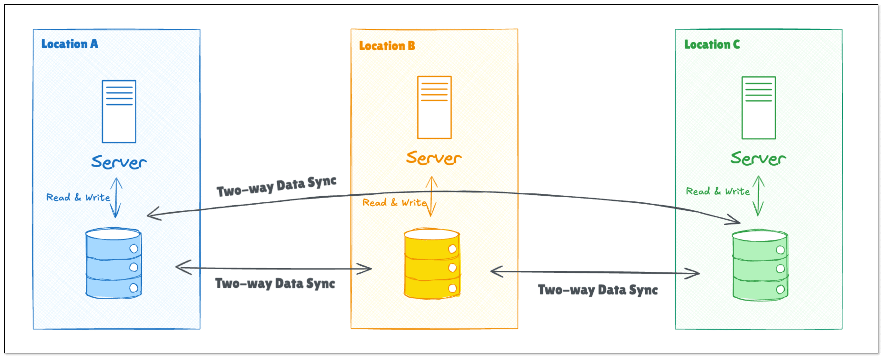

Geo-redundancy is the practice of replicating and storing your critical IT infrastructure and data across multiple locations strategically. 

## Why Geo-Redundancy is Needed?
The main aim is to ensure continuous availability and resilience against local failures or disasters. Imagine that your system is built in a single data center or region, what will happen if a power outage hits the region? A catastrophe for your business. However, if you replicates systems and data in different regions in advance, your data will failover to another available data center, and the service will awalys be online. 

Another vital purpose of geo-redundancy is backing up and data protection. Compared with single-location data storage, geo-redundancy safeguards data by replicating and maintaining copies of data in multiple places, minimizing the risk of data loss.

## How Geo-Redundancy Works?
Geo-redundancy can be implemented using two primary patterns:

- **Active-Active**: All regions are operational and handle requests simultaneously. This ensures load balancing and fault tolerance but requires robust synchronization mechanisms to maintain data consistency.

- **Active-Passive**: A secondary region remains on standby and takes over only if the primary region fails. This is simpler to implement but may result in underutilized resources.

## How to Set Up Geo-Redundancy?
To establish an effective geo-redundant system, the following steps can be considered:

1. **Assess Business Requirements**: Determine the number of data centers to be deployed based on the scale and impact of business. Then, decide the locations of the data centers according to distribution of users and their access needs.

2. **Replicate Data**: Select the data replication mode that is right for your business, and start to replicate data across chosen geographic locations, ensuring that replication methods align with the consistency requirements.

3. **Establish Failover Procedures**: Develop and document procedures for automatic or manual failover to secondary systems, ensuring minimal downtime during transitions.

4. **Monitor and Regularly Test**: Establish a monitoring system to monitor each data center and system components in real time to promptly detect and handle potential problems. Conduct failover and disaster recovery tests periodically to validate the effectiveness of geo-redundant configurations and update procedures based on test outcomes.

## Common Challenges
Setting up and maintaining a running geo-redundant system is a complex process, and the challenges you may concern about include:

- **Data Consistency**: Data is replicated among several data centers, making it hard to track and check the data consistency issue.

- **Cost Management**: Deploying and maintaining multiple data centers can significantly increase operational costs.

- **Complexity of Configuration**: Setting up geo-redundancy requires careful planning and expertise to avoid misconfigurations that could compromise system integrity.

- **Latency and Performance**: Long distance between regions can introduce latency, affecting your system's performance.

## How BladePipe Helps to Achieve Geo-Redundancy?
[BladePipe](https://www.bladepipe.com), a real-time end-to-end data replication tool, presents various features to reduce the complexity of a geo-redundancy solution.

- **Real-time Data Sync**: BladePipe replicates data between databases, data warehouses and other data sources using change data capture (CDC) technique. Only change data is replicated, making latency extremely low.

- **Bidirectional Data Flow**: BladePipe can realize [two-way data sync](https://www.bladepipe.com/docs/bestPractice/mysql_loop_data_sync/) without circular data replication. This functionality plays a key role in realizing Active-Active geo-redundancy.

- **Data Verification and Correction**: The built-in [data verification and correction](https://www.bladepipe.com/docs/operation/job_manage/create_job/create_period_verification_correction_job/) functionality helps to check the data on a regular basis, safeguarding data integrity and consistency.

- **User-friendly Interface**: All operations in BladePipe is done in an intuitive way by clicking the mouse. No code requirements.

## Conclusion
Geo-redundancy is an essential component of modern IT infrastructure. By understanding its key concepts, organizations can build resilient systems capable of withstanding regional failures and minimizing downtime. BladePipe, as a real-time data movement tool, is a perfect choice to help establish a robust geo-redundant system, making the whole process efficient, time-saving and effortless.