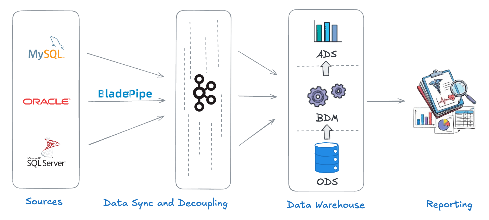
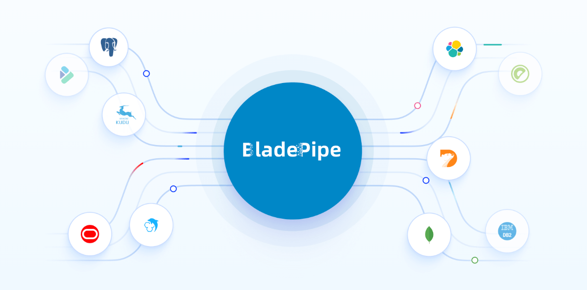

Healthcare organizations don’t have a data shortage. It has a data fragmentation problem.

Most hospitals and healthcare service providers run dozens of systems: EMRs, lab platforms, billing databases, and operational tools. Yet the data remains fragmented across systems, teams, and departments.

That’s where **healthcare data integration** comes in. By unifying data across systems and keeping it continuously in sync, integration enables healthcare teams to move faster, reduce risks, and build data-driven workflows on top of a trusted foundation.

In this page, we’ll explore what healthcare data integration really means, why it matters, the challenges teams face, and how modern data pipelines can make integration both simple and secure.

## What is Healthcare Data Integration?
Healthcare data integration is the process of collecting, synchronizing, and unifying data from multiple sources into a centralized data layer. The goal is to ensure data is accurate, timely, and accessible for downstream use cases such as analytics, clinical decision support, reporting, and compliance.

### Common Healthcare Data Sources
Healthcare data typically comes from a wide range of systems, including:
- **Clinical systems**: EMR / EHR systems (patient demographics, diagnoses, prescriptions), LIS (lab test results), PACS / RIS (imaging metadata), etc.

- **Operational systems**: Hospital Information Systems (HIS), Scheduling and appointment systems, pharmacy management systems, etc.

- **Administrative and external systems**: Billing and insurance claims platforms, public health reporting systems, third-party healthcare SaaS applications, etc.

Each system often uses different databases, schemas, and data standards, making integration non-trivial.

### Major Use Cases of Healthcare Data Integration
Healthcare data integration isn’t just about moving data. It’s about unlocking actionable insights and supporting workflows. Here are some of the most common use cases:
- **Unified Patient 360 Views**   
Integrating data across EMRs, lab systems, imaging platforms, and operational databases allows organizations to create a complete, up-to-date view of each patient. Clinicians can access medical history, lab results, medications, and appointments in one place, reducing errors and improving care coordination.

- **Operational and Resource Analytics**   
By bringing together scheduling, staffing, and patient flow data, hospitals can optimize resource allocation, monitor bed availability, and reduce bottlenecks. Real-time dashboards enable administrators to make faster, data-driven decisions that improve efficiency and lower operational costs.

- **Clinical and Population Health Insights**   
Consolidated data allows for more advanced analytics, such as identifying trends in patient outcomes, monitoring disease outbreaks, or tracking chronic conditions across populations. Integrated data also supports predictive models that can anticipate patient needs or highlight high-risk cases.

## Benefits of Healthcare Data Integration

### Improved Patient Care
Integrated data enables clinicians to make more informed decisions based on a complete and up-to-date view of patient information. [Research](https://eajournals.org/ejbmsr/wp-content/uploads/sites/18/2025/04/Data-Integration.pdf) showed that integrated systems can reduce medication errors by **32%** and improve patient satisfaction by **41%** compared to those operating with fragmented systems. 

### Operational Efficiency and Lower Cost
By automating data flows between systems, healthcare organizations can reduce manual data entry and reconciliation. That frees clinicians time while simplifying cross-department collaboration. Over time, this leads to lower operational overhead and faster time-to-value for new data initiatives.

### Regulatory Compliance and Audit Readiness
Healthcare organizations operate under strict regulatory requirements to protect patient privacy. Integrated, well-governed data help ensure clear data lineage and traceability. That allows faster, more reliable audit and compliance reporting.  Also, in an integrated system, only authorized personnel have access to sensitive information, compliant to regulations such as HIPAA in the United States.

## Key Challenges of Healthcare Data Integration
Healthcare data integration usually face a mix of technical issues. Understanding the challenges upfront is critical to building integration pipelines that are reliable, secure, and scalable.

### Various Legacy Systems
Healthcare IT environments are typically built over decades. It’s common to see modern cloud-native systems running alongside legacy platforms that were never designed for modern data infrastructure. These legacy systems often rely on outdated database versions or proprietary storage engines. The complexity and variety of the legacy systems makes healthcare data integration even harder. 

### Complex Data Formats
Healthcare data is inherently heterogeneous. As we mentioned before, data comes from various systems, and each system has its own data format. Even within a single organization, data may appear in multiple formats and standards:
- Relational data (patient demographics, billing records)
- Semi-structured payloads (JSON, XML)
- Unstructured content (clinical notes, reports)   

On top of that, schemas evolve frequently, making data format compatibility a big issue in healthcare data integration.

### Data Quality and Consistency Issues
Data quality and consistency are critical challenges in healthcare data integration. Once  a row of data is missed during integration, downstream analytics and reporting may be undermined, and it will take a long time for troubleshooting. To ensure data integrity and accuracy, verification and reconciliation mechanism is a step that you can't skip.

### Security, Privacy, and Compliance Risks
Healthcare data is among the most sensitive types of data organizations handle. Before data inetgration, IT teams must have a considerate plan in place to ensure limited access and encrypted transfer. In addition, compliance requirements vary by region and often evolve over time. Pipelines should be traceable to meet the audit and compliance requirements. 

### Real-time Analysis Demand
Traditional batch-based ETL pipelines often introduce hours or even days of delay. Modern healthcare operations increasingly require near real-time visibility. To realize real-time data integration while not harming system stability, IT teams need to design the architecture carefully. Now more teams are moving toward CDC-based approaches that capture changes efficiently without overloading source systems.

## A Real-world Example: How to integrate healthcare data
A healthcare service provider helped many hospitals to modernize their data systems. The historical data was mostly stored in operational databases like MySQL, Oracle, and SQL Server. The provider needed to consolidate the data to a unified platform.

To provide clinicians with up-to-date data, the team redesigned its pipeline around a CDC-based architecture. Changes from source systems were captured in real time via BladePipe and streamed into Kafka, which served as a central layer decoupling sources from downstream consumers. Kafka topics were then ingested into a centralized data warehouse, unifying clinical, lab, and operational data for analytics and reporting.

As a result, data latency was reduced from hours to seconds, data consistency improved across teams, and the ongoing cost of maintaining integrations dropped significantly.

## Secure, Streamlined Healthcare Data Integration with BladePipe
For easy and secure healthcare data integration, you may try [**BladePipe**](https://www.bladepipe.com/). BladePipe is a real-time data integration platform built to help healthcare teams move data reliably and securely. By leveraging a CDC-based approach, BladePipe automates the healthcare data integration with low latency and minimal impact on production systems. This makes it well suited for healthcare environments where data freshness, system stability, and security are all non-negotiable.

**Key Features of BladePipe for Healthcare Data Integration**:
- **[Real-time CDC](https://www.bladepipe.com/real-time-analytics/)**: Capture changes from multiple source systems and deliver data in near real time, with end-to-end latency typically under 3 seconds.
- **Automated pipelines**: Automate the entire flow from schema evolution to incremental synchronization, reducing manual effort and operational complexity.
- **Broad connectors support**: Support [60+ connectors](https://www.bladepipe.com/connector/), each validated for reliability in long-running, production-grade pipelines.
- **Proven security**: Encrypted data transfer, RBAC-based access control, and audit logging, with compliance support for [SOC 2, GDPR, and ISO 27001](https://trust.bladepipe.com/).
- **Flexible deployment options**: Run BladePipe on-premises, in your own cloud (BYOC), or as a fully managed SaaS.
- **Enhanced data consistency**: Built-in data verification and correction help maintain end-to-end data integrity, ensuring data quality.
- **[Predictable cost](https://www.bladepipe.com/pricing/)**: Clear billing and prepaid options make integration costs easier to forecast and control.

## Final Thoughts
Healthcare data integration is an irreversible trend for modern healthcare organizations. While challenges around legacy systems, data quality, and security remain, modern real-time integration approaches make it possible to unify healthcare data at scale.

A right tool makes the inetgration easier to keep data fresh and reliable. That's where  **BladePipe** stands out. It frees your time from building complex pipelines mannually while keeping data delivered securely with high quality. That means teams can spend less time maintaining pipelines and more time actually using their data.

[**Start a free trial**](https://www.bladepipe.com/login/) or [**book a demo**](https://cal.com/bladepipe-xxypci/30min) now to see how it works.

## FAQ
**What should healthcare teams look for when choosing a data integration platform?**   
Key factors include source system support, real-time capabilities, security and compliance features, operational reliability, and predictable cost. Just as importantly, the platform should minimize ongoing maintenance so teams can focus on data use.

**How does CDC-based integration differ from traditional ETL in healthcare?**   
Traditional ETL relies on periodic full or incremental loads, which can introduce latency and increase load on source systems. CDC captures database changes as they happen, enabling low-latency delivery while minimizing impact on production workloads. This is an important factor to consider in healthcare systems.

**How is sensitive healthcare data protected during integration?**   
Security is enforced through encryption in transit and at rest, strict access control, and comprehensive audit logging. Integration platforms should also support compliance frameworks such as SOC 2, GDPR, and ISO 27001 to align with healthcare data protection requirements.