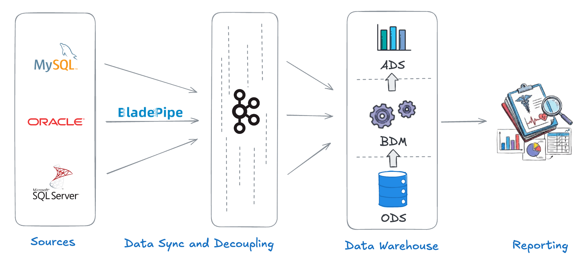
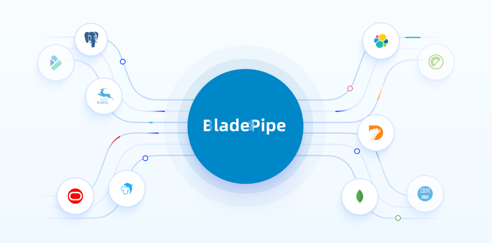

Healthcare organizations do not have a data shortage. They have a data fragmentation problem.

Most hospitals and healthcare service providers run dozens of systems: EMRs, lab platforms, billing databases, and operational tools. Yet the data remains fragmented across systems, teams, and departments.

That’s where **healthcare data integration** comes in: connecting these systems so patient, clinical, billing, claims, and operational data can move securely and stay consistent.

This page explains what healthcare data integration means, the benefits of data integration in healthcare, the challenges teams face, and how CDC-based pipelines can keep healthcare data fresh without overloading production systems.

<!-- truncate -->

## Quick Answer: What Healthcare Data Integration Solves

Healthcare data integration connects clinical, operational, administrative, and analytics systems so trusted data can move between them securely.

| Integration need | Common systems involved | Why real-time or near-real-time sync matters |
| --- | --- | --- |
| Patient 360 view | EMR/EHR, LIS, PACS/RIS, HIS | Clinicians need recent patient history, lab results, and operational status. |
| Operational analytics | Scheduling, staffing, billing, inventory | Administrators need current bed, appointment, and resource data. |
| Compliance reporting | Clinical databases, audit logs, reporting systems | Reports need traceable, consistent, and access-controlled data. |
| Data warehouse integration | Operational databases, warehouses, BI tools | Analytics teams need reliable pipelines instead of manual exports. |
| Cross-system modernization | Legacy databases, cloud platforms, data lakes | Healthcare teams need migration with minimal downtime and source impact. |

## What is Healthcare Data Integration?
Healthcare data integration is the process of collecting, synchronizing, and unifying data from multiple clinical, operational, administrative, and analytics systems. The goal is to make health data accurate, timely, secure, and usable for downstream workflows such as patient care, clinical decision support, reporting, compliance, and healthcare analytics.

The term overlaps with health data integration, medical data integration, clinical data integration, and patient data integration. The difference is usually scope: clinical and patient data integration focus more on care delivery, while healthcare data integration also includes billing, claims, operations, compliance, and analytics.

In practice, healthcare data integration is also an interoperability problem. EMR, EHR, LIS, PACS, billing, claims, and public health systems often use different schemas, data models, interfaces, and update patterns. A useful integration architecture has to move data without breaking privacy rules, overloading production systems, or creating stale patient records.

### Common Healthcare Data Sources
Healthcare data typically comes from a wide range of systems:

| Source type | Examples | Integration challenge |
| --- | --- | --- |
| Clinical systems | EMR/EHR, HIS, care management systems | Patient identifiers, encounter history, diagnoses, prescriptions, and consent rules must stay consistent. |
| Lab systems | LIS, pathology systems, test result databases | Lab results need timely delivery and reliable mapping to orders, patients, and reference ranges. |
| Imaging systems | PACS/RIS, DICOM metadata stores | Imaging metadata is structured differently from large image objects and may need separate handling. |
| Administrative systems | Billing, claims, insurance, scheduling | Claims and billing data often use different identifiers and coding systems from clinical records. |
| Operational systems | Pharmacy, inventory, staffing, bed management | Operational updates need low latency when they affect patient flow or resource availability. |
| Analytics platforms | Data warehouses, data lakes, BI tools | Data must be standardized, verified, and governed before reporting or model training. |

## Healthcare Data Integration Architecture

A practical healthcare data integration architecture usually has five layers:

| Layer | What it does | Common choices |
| --- | --- | --- |
| Source systems | Produce clinical, operational, claims, and medical data | EMR/EHR, LIS, PACS/RIS, billing databases, scheduling systems, SaaS apps |
| Ingestion layer | Captures new and historical data | APIs, batch ETL, [CDC pipelines](change_data_capture_cdc.md), file ingestion, message queues |
| Integration layer | Routes, transforms, and standardizes data | Kafka, integration platforms, mapping logic, terminology normalization |
| Storage and serving layer | Makes integrated data available | Operational databases, data warehouses, data lakes, search indexes, analytics marts |
| Governance layer | Protects and verifies data | RBAC, encryption, audit logs, [data masking](data_masking.md), lineage, [data verification](data_verification.md) |

For many healthcare teams, the hard part is not only building a pipeline. It is keeping the pipeline reliable after schemas change, source systems slow down, new hospitals are added, or clinical and claims systems use different identifiers for the same patient.

### Major Use Cases of Healthcare Data Integration
The most valuable healthcare data integration use cases are workflows where missing, delayed, or inconsistent data creates operational or clinical risk.

| Use case | Systems involved | Why integration matters |
| --- | --- | --- |
| Patient data integration for Patient 360 | EMR/EHR, LIS, PACS/RIS, pharmacy, appointments | Clinicians need recent patient history, lab results, medications, allergies, and visits in one view. |
| Clinical data integration | EHR, lab, imaging, care management systems | Care teams need consistent diagnoses, orders, results, and notes across departments. |
| Claims and billing data integration | Billing systems, insurance claims, EHR, finance tools | Finance and operations teams need clean links between encounters, procedures, claims, and payments. |
| Healthcare analytics and reporting | Operational databases, warehouses, BI tools | Analysts need governed pipelines instead of manual exports from production systems. |
| Public health and compliance reporting | Clinical databases, audit logs, reporting systems | Reports need traceable data lineage, correct access control, and repeatable delivery. |
| Multi-hospital data consolidation | Hospital branches, legacy databases, central platforms | Healthcare groups need consistent patient, operational, and reporting data across locations. |

If the workflow depends on fresh updates, traditional batch loads may be too slow. Real-time or near-real-time healthcare data integration is more relevant when clinicians, administrators, or downstream systems need recent changes instead of yesterday's export.

## Benefits of Data Integration in Healthcare

The benefits of data integration in healthcare come from making fragmented data usable at the point of care, in operations, and in analytics.

| Benefit | What improves | Example |
| --- | --- | --- |
| Better patient care | Clinicians see more complete and recent patient data | Lab results, medication history, and visit records are available in the same workflow. |
| Faster clinical decisions | Clinical teams reduce manual lookups across systems | A physician does not wait for a separate lab portal export before reviewing results. |
| Lower operational cost | Teams reduce manual entry, spreadsheet exports, and reconciliation | Scheduling, billing, and patient flow dashboards update from integrated systems. |
| Better healthcare analytics | Analysts work from governed datasets instead of fragmented extracts | Population health, quality metrics, and financial reports use consistent source data. |
| Stronger compliance reporting | Data lineage, access control, and audit logs are easier to prove | Reporting teams can trace which systems contributed to a compliance report. |
| Safer modernization | Legacy systems can be connected to cloud or warehouse platforms gradually | Hospitals can migrate or consolidate systems without relying on one risky big-bang cutover. |

Integrated data can also reduce patient safety risk when it prevents stale or incomplete records from driving decisions. [Research](https://eajournals.org/ejbmsr/wp-content/uploads/sites/18/2025/04/Data-Integration.pdf) showed that integrated systems can reduce medication errors by **32%** and improve patient satisfaction by **41%** compared with fragmented systems.

## Key Challenges of Healthcare Data Integration
Healthcare data integration usually fails for concrete technical reasons: legacy interfaces, inconsistent identifiers, incompatible formats, weak data quality checks, and security gaps.

### Various Legacy Systems
Healthcare IT environments are typically built over decades. A single hospital group may run modern SaaS applications alongside legacy EHR modules, older Oracle or SQL Server databases, proprietary HIS platforms, and department-specific systems. Integration work becomes harder when these systems expose different interfaces, support different update patterns, or cannot tolerate heavy read load.

### Complex Data Formats
Healthcare data is inherently heterogeneous. Even within one organization, data may appear in multiple formats and standards:
- Relational data (patient demographics, billing records)
- Semi-structured payloads (JSON, XML)
- Unstructured content (clinical notes, reports)
- HL7 messages for clinical system exchange
- FHIR resources for API-based healthcare interoperability
- DICOM metadata for imaging workflows
- ICD, CPT, LOINC, or local code sets for diagnoses, procedures, and lab results

On top of that, schemas evolve frequently. Even when two systems both claim to support the same standard, fields may be optional, mapped differently, or customized by each hospital. That makes healthcare data interoperability a practical data engineering problem, not just a standards checkbox.

### Data Quality and Consistency Issues
Data quality and consistency are critical challenges in healthcare data integration. Once a row is missed during integration, downstream analytics, claims reporting, or clinical workflows may be affected, and troubleshooting can take a long time. To maintain data integrity, teams need a repeatable verification and reconciliation mechanism.

### Security, Privacy, and Compliance Risks
Healthcare data is among the most sensitive types of data organizations handle. Before data integration, IT teams need a clear plan for access control, encrypted transfer, and auditability. In addition, compliance requirements vary by region and often evolve over time.

At minimum, healthcare integration pipelines should support:

- Encryption in transit and at rest
- Role-based access control and least-privilege permissions
- Audit logs for data access and pipeline changes
- Data masking or tokenization for PHI/PII where needed
- Clear retention and deletion policies
- Deployment options that match security requirements, such as on-premises or BYOC for restricted environments

### Real-time Analysis Demand
Traditional batch-based ETL pipelines often introduce hours or even days of delay. Modern healthcare operations increasingly require near real-time visibility. To realize real-time data integration without harming system stability, IT teams need to design the architecture carefully. More teams are moving toward CDC-based approaches that capture changes efficiently without overloading source systems.

## A Real-world Example: How to integrate healthcare data
A healthcare service provider helped many hospitals to modernize their data systems. The historical data was mostly stored in operational databases like MySQL, Oracle, and SQL Server. The provider needed to consolidate the data to a unified platform.

To provide clinicians with up-to-date data, the team redesigned its pipeline around a CDC-based architecture. Changes from source systems were captured in real time via BladePipe and streamed into Kafka, which served as a central layer decoupling sources from downstream consumers. Kafka topics were then ingested into a centralized data warehouse, unifying clinical, lab, and operational data for analytics and reporting.

As a result, data latency was reduced from hours to seconds, data consistency improved across teams, and the ongoing cost of maintaining integrations dropped significantly.

## Secure, Streamlined Healthcare Data Integration with BladePipe
For healthcare teams, a data integration platform should support real-time movement, secure deployment, operational monitoring, and source-target consistency checks. [**BladePipe**](https://www.bladepipe.com/) is a real-time data integration platform built to help teams move healthcare data reliably and securely. By using a CDC-based approach, BladePipe keeps healthcare data integration pipelines current with low latency and minimal impact on production systems.

**Key Features of BladePipe for Healthcare Data Integration**:
- **[Real-time CDC](https://www.bladepipe.com/real-time-analytics/)**: Capture changes from multiple source systems and deliver data in near real time, with end-to-end latency typically under 3 seconds.
- **Automated pipelines**: Automate the entire flow from schema evolution to incremental synchronization, reducing manual effort and operational complexity.
- **Broad connectors support**: Support [60+ connectors](https://www.bladepipe.com/connector/), each validated for reliability in long-running, production-grade pipelines.
- **Proven security**: Encrypted data transfer, RBAC-based access control, and audit logging, with compliance support for [SOC 2, GDPR, and ISO 27001](https://trust.bladepipe.com/).
- **Flexible deployment options**: Run BladePipe on-premises, in your own cloud (BYOC), or as a fully managed SaaS.
- **Enhanced data consistency**: Built-in data verification and correction help maintain end-to-end data integrity, ensuring data quality.
- **[Predictable cost](https://www.bladepipe.com/pricing/)**: Clear billing and prepaid options make integration costs easier to forecast and control.

## Final Thoughts
Healthcare data integration works best when teams treat it as both a data engineering and governance problem. The pipeline has to connect fragmented systems, keep data fresh, verify consistency, and protect sensitive health records at the same time.

BladePipe is most relevant when healthcare teams need real-time database movement, CDC-based synchronization, flexible deployment, monitoring, and built-in verification without building every pipeline component manually.

[**Start a free trial**](https://www.bladepipe.com/login/) or [**book a demo**](https://cal.com/bladepipe-xxypci/30min) now to see how it works.

## FAQ
**What is healthcare data integration?**
Healthcare data integration is the process of connecting clinical, operational, administrative, and analytics systems so healthcare data can move securely between them. It commonly involves EMR/EHR, LIS, PACS/RIS, billing, claims, warehouse, and reporting systems.

**What are the benefits of data integration in healthcare?**
The main benefits include better patient views, faster clinical decisions, lower manual reconciliation, more reliable healthcare analytics, stronger compliance reporting, and safer modernization of legacy systems.

**What are common data integration challenges in healthcare?**
Common challenges include legacy EHR systems, inconsistent patient identifiers, HL7/FHIR/DICOM variation, schema drift, PHI/PII protection, audit requirements, and keeping data fresh without overloading production databases.

**What is clinical data integration?**
Clinical data integration connects patient-facing systems such as EHR, EMR, LIS, PACS/RIS, pharmacy, and care management platforms. The goal is to make diagnoses, orders, results, medications, and clinical notes available in a consistent and timely way.

**How does CDC-based integration differ from traditional ETL in healthcare?**
Traditional ETL relies on periodic full or incremental loads, which can introduce latency and increase load on source systems. CDC captures database changes as they happen, enabling low-latency delivery while minimizing impact on production workloads.

**How is sensitive healthcare data protected during integration?**
Security is enforced through encryption in transit and at rest, strict access control, audit logging, and masking or tokenization where needed. Integration platforms should also support deployment and compliance requirements that match the organization's privacy and governance policies.
