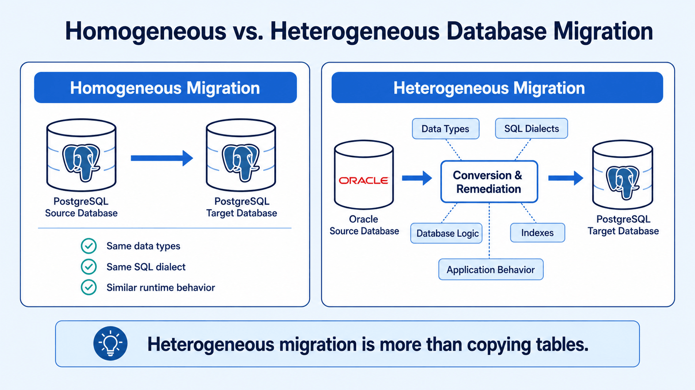
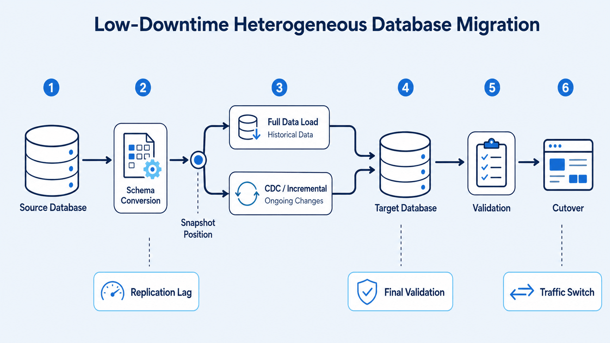
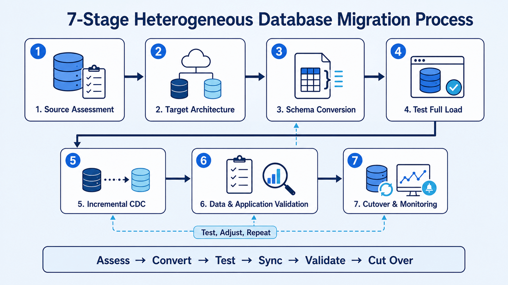
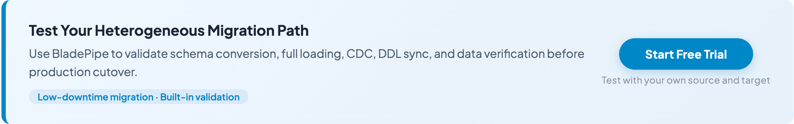

Heterogeneous database migration moves data between different database engines, such as [Oracle to PostgreSQL](https://www.bladepipe.com/blog/tech_share/migrate_oracle_to_postgresql/), SQL Server to MySQL, or [MySQL to ClickHouse](https://www.bladepipe.com/blog/tech_share/mysql_clickhouse_sync/). It is harder than copying tables because the target may use different data types, SQL syntax, procedures, indexes, sequences, transactions, and application behavior.

Teams start these projects to reduce license costs, move workloads to the cloud, adopt open-source databases, replace legacy systems, or build analytics stacks.

The main risk is not the first data load. It is proving the target is structurally correct, consistent, performant, and ready for cutover within the allowed downtime.

## What Is Heterogeneous Database Migration?

Heterogeneous database migration moves schemas, data, and sometimes database logic between different engines.

Examples:

- [Oracle to PostgreSQL](https://www.bladepipe.com/blog/tech_share/migrate_oracle_to_postgresql/)
- [SQL Server to PostgreSQL](https://www.bladepipe.com/blog/tech_share/migrate_sqlserver_to_postgresql/)
- [MySQL to PostgreSQL](https://www.bladepipe.com/blog/tech_share/migrate_mysql_to_postgresql/)
- [MySQL to ClickHouse](https://www.bladepipe.com/blog/tech_share/mysql_clickhouse_sync/)
- Oracle to OceanBase

Homogeneous migration keeps the same engine, such as moving PostgreSQL from on-premises to managed PostgreSQL. Heterogeneous migration changes the engine, so it must account for different data types, SQL dialects, objects, and runtime behavior.

A full heterogeneous migration may include:

1. Converting the source schema.
2. Loading historical data.
3. Capturing inserts, updates, and deletes during the full load.
4. Transforming records that cannot be copied directly.
5. Validating source and target data.
6. Migrating application queries and database-side logic.
7. Switching production traffic to the target.

Treating these steps as one data copy is a common failure pattern.

## Why Heterogeneous Database Migration Is Harder

A homogeneous migration can often preserve the original schema and behavior. A heterogeneous migration cannot.

Even when both systems support relational tables and SQL, they may implement the same concept differently. A familiar data type may use different precision rules. A function may exist in both databases but return different results. An index or constraint may have no equivalent.

The main risks fall into five areas:

| Migration area | Typical risk |
| --- | --- |
| Schema conversion | Unsupported or incorrectly mapped objects |
| Data conversion | Precision loss, truncation, encoding issues, or null-handling differences |
| Database logic | Stored procedures, triggers, and functions cannot run on the target |
| Continuous replication | Source changes are missed, duplicated, or applied out of order |
| Application compatibility | Queries behave differently after cutover |

Moving every row does not prove the migrated system will behave correctly.

## Challenge 1: Schema and Data Type Conversion

Schema conversion is usually the first visible problem.

Source and target databases rarely provide perfect type mappings. Oracle `NUMBER`, for example, may become a PostgreSQL integer, `NUMERIC`, or floating-point type depending on precision and usage. SQL Server `DATETIME`, PostgreSQL `TIMESTAMP`, and MySQL `DATETIME` also differ in range, precision, and time-zone behavior.

Common conversion risks include:

- Numeric precision or scale loss
- Character truncation
- Date and time range differences
- Time-zone conversion errors
- Binary and LOB handling differences
- Boolean values stored as numbers or strings
- Defaults that use unsupported functions
- Auto-increment columns implemented differently
- Unsupported spatial, XML, JSON, array, or user-defined types

Review data type conversion at the column level. Default mappings save time, but still need tests.

Oracle's migration documentation separates schema migration from data migration and highlights procedures, triggers, and views. See the [Oracle Database Migration Guide](https://docs.oracle.com/database/121/DRDAA/E22508-11.pdf).

A practical schema assessment should classify each object as:

- Directly compatible
- Automatically convertible but requiring validation
- Requiring manual redesign

This gives architects a better estimate than table counts.

## Challenge 2: SQL Dialects and Database Logic

SQL is standardized only to a point. Production systems often depend on database-specific syntax and features.

Typical differences include:

- Pagination syntax
- String and date functions
- Null-handling behavior
- Identifier case sensitivity
- Sequence and identity generation
- Temporary table behavior
- Merge or upsert syntax
- Transaction isolation
- Locking behavior
- Error codes and exception handling

Stored procedures, packages, triggers, functions, and scheduled jobs add work. Oracle PL/SQL cannot move directly into PostgreSQL or MySQL. Even when a tool converts the syntax, the result needs functional and performance testing.

Inventory database logic before choosing a migration method:

- How many stored procedures and functions are active?
- Which triggers affect critical data?
- Does the application depend on database-generated identifiers?
- Are materialized views or specialized indexes involved?
- Which SQL statements use proprietary functions?
- Can some logic move into the application layer?

With heavy server-side logic, schema and code conversion may take more effort than data movement.

## Challenge 3: Keeping Source and Target in Sync

A one-time export and import works only when the source stays offline or read-only.

In production, transactions continue while historical data is copied. If the load takes hours or days, the target is stale when it finishes.

[Change data capture (CDC)](blog/data_insights/change_data_capture_cdc.md) solves this by reading incremental changes from source transaction logs and applying them to the target. Depending on the source, CDC may read [Oracle redo logs](https://www.bladepipe.com/blog/data_insights/oracle_change_data_capture/), [MySQL binlogs](https://www.bladepipe.com/blog/data_insights/mysql_cdc/), [PostgreSQL WAL](https://www.bladepipe.com/blog/data_insights/postgresql_change_data_capture/), or [SQL Server transaction logs](https://www.bladepipe.com/blog/data_insights/sql_server_change_data_capture/).

A low-downtime migration usually follows this sequence:

1. Prepare the target schema.
2. Record a consistent source position.
3. Start the full load.
4. Capture changes produced during the full load.
5. Apply accumulated changes to the target.
6. Continue incremental replication until lag is low enough.
7. Pause writes or enter a controlled cutover window.
8. Apply final changes.
9. Validate the target and redirect the application.

This creates a continuous data path from snapshot to cutover.

CDC across different engines still requires careful handling of:

- Transaction boundaries
- Operation ordering
- Tables without primary keys
- Large transactions
- DDL changes
- LOB columns
- Unsupported data types
- Source log retention
- Replication checkpoints
- Restart and recovery behavior

The CDC engine must preserve source transaction meaning and produce operations the target accepts.

## Challenge 4: Schema Changes During Migration

Production schemas often change during long migrations. Developers may add columns, modify types, rename fields, or create tables while the target is being prepared.

If the migration captures data but ignores schema changes, incremental replication may fail or write incomplete records.

Native logical replication does not always replicate DDL. PostgreSQL documentation states that logical replication does not replicate schemas or DDL commands; these changes must be synchronized separately. See [PostgreSQL logical replication restrictions](https://www.postgresql.org/docs/current/logical-replication-restrictions.html).

Teams should define how DDL is governed during migration:

- Freeze DDL until cutover.
- Apply each schema change to both systems.
- Capture supported DDL and convert it automatically.
- Route schema changes through an approval workflow.
- Stop replication when an unsafe change appears.

A freeze is simple but may not work for long projects. Automated DDL synchronization reduces manual work, but converted objects still need review because target semantics may differ.

## Challenge 5: Data Validation

A completed migration job does not prove the target is correct.

Row counts catch obvious omissions but miss changed values, duplicates, encoding problems, and incorrect type conversions. A table can contain the right number of rows and still contain wrong data.

[Validation](https://www.bladepipe.com/blog/data_insights/data_verification/) can run at several levels:

| Validation method | What it detects |
| --- | --- |
| Schema comparison | Missing tables, columns, indexes, or constraints |
| Row-count comparison | Missing or duplicated rows |
| Checksums or hashes | Row or column value differences |
| Key-range comparison | Errors inside large partitioned tables |
| Business queries | Incorrect totals, balances, or application results |
| Continuous comparison | Drift during ongoing CDC |

Validation must account for intentional transformations. If an Oracle date, numeric value, or empty string is represented differently in PostgreSQL, raw byte comparison may report a false mismatch.

Use target-aware normalization rules. The goal is semantic consistency, not identical physical representation.

Each mismatch needs a resolution path. For large migrations, reloading a table because a few records differ is inefficient. Record-level correction or range-based resynchronization reduces rework.

## Challenge 6: Performance After Migration

Matching data does not guarantee matching performance.

Source and target databases may use different query planners, indexes, storage layouts, concurrency models, and optimization strategies. A fast Oracle query may need different indexes or rewritten SQL in PostgreSQL. An analytical workload moved from SQL Server to ClickHouse may need a new table design, not a direct schema copy.

Performance testing should cover:

- High-frequency application queries
- Large joins and aggregations
- Batch jobs
- Write-intensive transactions
- Concurrent reads and writes
- Index maintenance
- Failover and recovery
- Peak workload behavior

Test with production-like data volume. A query that works against one million rows may behave differently against several billion.

Target schema design should not be purely mechanical. Preserving the source model may speed cutover, while selected tables may need redesign to use the target well.

## A Practical Heterogeneous Database Migration Plan

A practical plan should make each stage measurable instead of treating migration as one data-copy task.

1. Assess compatibility across schemas, data types, database objects, stored procedures, application SQL, table keys, LOB columns, transaction volume, and downtime limits.
2. Define the target architecture before conversion, including database version, character set, naming rules, partitioning, indexes, capacity, security, high availability, and recovery objectives.
3. Convert and review the schema. Confirm that precision, defaults, keys, constraints, indexes, object names, and identity or sequence values still work on the target.
4. Test a full load with realistic data volume. Measure source impact, network throughput, target write performance, transformation cost, restart behavior, and total migration duration.
5. Add incremental CDC from a known source position. Test inserts, updates, deletes, large transactions, rollbacks, key updates, LOB changes, schema changes, and recovery after interruption.
6. Validate data and applications while replication is active. Cover schema consistency, row-level differences, business totals, application queries, transaction behavior, performance, access control, and monitoring.
7. Execute cutover only when thresholds are met. Define acceptable replication lag, unresolved mismatches, test results, rollback conditions, decision owners, and post-cutover monitoring metrics.

## How to Choose a Heterogeneous Database Migration Tool

The best tool depends on the database pair, downtime target, data volume, deployment environment, and conversion scope.

Enterprise architects should compare five areas:

| Evaluation criterion | Questions to ask |
| --- | --- |
| Connector coverage | Does the tool support the exact source, target, editions, and versions? |
| Schema conversion | Can it convert data types, defaults, indexes, constraints, and database objects? |
| CDC and DDL handling | Can it capture source changes, preserve ordering, and handle schema changes during migration? |
| Validation and recovery | Can it compare data before cutover and resume safely after interruption? |
| Deployment and security | Does it fit cloud, BYOC, or on-premises requirements for credentials, networking, and encryption? |

Connector coverage alone is not enough. A tool may connect to both databases but lack schema conversion, CDC, validation, or production-grade recovery for that path.

If you are comparing vendors, this overview of [database migration tools](https://www.bladepipe.com/blog/data_insights/best_data_migration_tools/) explains how options differ by CDC support, deployment model, downtime risk, pricing, and use case.

## Using BladePipe for Heterogeneous Database Migration

[BladePipe](https://www.bladepipe.com) supports heterogeneous migration workflows that combine schema migration, full loading, incremental CDC, and verification and correction.

For heterogeneous projects, the main value is keeping the critical migration stages in one workflow:

- Schema conversion for supported data types and SQL dialects
- Full and incremental migration with log-based CDC
- DDL synchronization for supported schema changes
- Built-in data verification, correction, monitoring, alerts, and checkpoint recovery

BladePipe documentation describes Schema Migration, Full Data, Incremental, and Verification and Correction as separate task stages. See [BladePipe concepts](https://www.bladepipe.com/docs/intro/product_nouns/).

Tool selection should still start with the exact migration path. Verify database versions, supported objects, CDC prerequisites, and transformation requirements before finalizing production design.

## Final Thoughts

Do not estimate heterogeneous migration as a simple data transfer. Estimate it as four connected workstreams: schema conversion, CDC, validation, and cutover.

The tool should reduce conversion and operational work, but it cannot replace architecture decisions. The source-target pair, database logic, downtime tolerance, and validation requirements should determine the final design.
