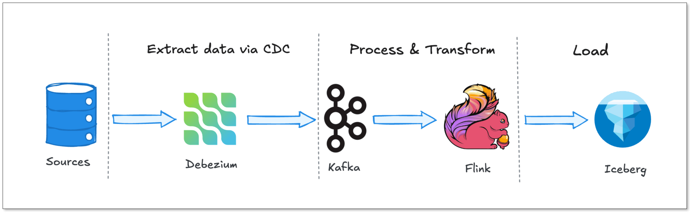
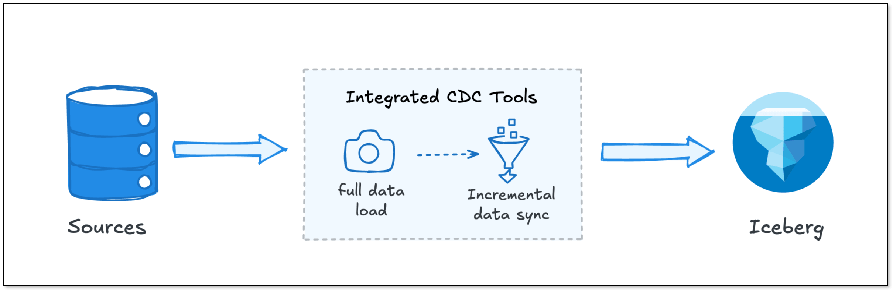

Most Iceberg pipelines today are overengineered.

To move data from a transactional database into [Iceberg](https://www.bladepipe.com/blog/tech_share/mysql_iceberg_sync/), many teams default to a stack built on Debezium, Kafka, and Flink, the so-called “holy trinity” of real-time data infrastructure. It’s a powerful architecture, but one designed for companies operating at massive scale.

The problem is, most teams don’t operate at that scale. They don’t need multi-stage streaming pipelines, distributed message queues, and stateful processing engines just to keep their data fresh.

Yet they still end up paying the operational and cognitive cost of running them.

In this post, we are going to break down why this stack became the default, the hidden costs of running it, and why a simpler pipeline architecture might be exactly what your team actually needs.

## Key Takeaways
+ The Debezium + Kafka + Flink stack is powerful, but designed for extreme scale.
+ Most teams only need simple CDC replication, not full stream processing.
+ This stack introduces hidden costs: operational overhead, small file issues, latency and over-engineering issue.
+ Flink CDC simplifies architecture but still inherits Flink’s operational burden.
+ Integrated CDC tools offer a simpler, more efficient alternative for most use cases.

## Why is This Stack the Industry Standard? 
Before we tear it down, we need to understand why the Debezium-Kafka-Flink stack is so popular. It didn't become the standard by accident.

When companies realized that nightly batch jobs were no longer fast enough, they looked for ways to stream database changes in real-time. This is where this architecture shines. Let's look at the components:

+ **Debezium:** This is the reader. It connects to your database (like PostgreSQL or MySQL), pretends to be a replica, and reads the transaction logs (WAL or binlog). It turns raw database events into a neat stream of inserts, updates, and deletes.
+ **Apache Kafka:** Kafka acts as a durable buffer between producers and consumers. Debezium writes its events into Kafka topics. If your downstream systems go offline, Kafka holds onto the data.
+ **Apache Flink:** This is the processor. Flink reads from Kafka, applies transformations, handles stateful aggregations, and writes the final data to your target destination, like Snowflake, BigQuery, or Apache Iceberg.

The benefits of this architecture are very real for enterprise-scale deployments:

+ **Decoupling:** Your source database never talks to your data warehouse. Kafka sits in the middle. You can add five different consumers to the same Kafka topic without adding any extra load to your primary database.
+ **Fault Tolerance:** If Flink crashes, Kafka still has the data. When Flink restarts, it picks up exactly where it left off.
+ **Massive Scalability:** You can scale Debezium, Kafka, and Flink independently. If you have millions of events per second, this stack can handle it.

If you are Uber, Netflix, or LinkedIn, you need this stack. But what if you just want to replicate 50 tables from MySQL to Iceberg with a five-minute latency?

## The Hidden Costs
The problem with adopting this enterprise-scale architecture is that you also adopt enterprise-scale operational burdens. The hidden costs of this stack rarely show up in the "Getting Started" tutorials.

### Operational Overhead
Running this stack means you are maintaining at least three complex distributed systems：

+ **Debezium:** Kafka Connect
+ **Kafka:** Brokers, ZooKeeper (or Kraft), and Schema Registry.
+ **Flink:** JobManagers, TaskManagers, and Checkpointing state.

This requires a massive amount of infrastructure code. You need Terraform scripts, Helm charts, and custom CI/CD pipelines just to deploy the infrastructure. Once it is running, you have to monitor it.

You need alerts for Kafka consumer lag. You need dashboards for Flink memory usage. You have to handle Debezium snapshotting failures. Keeping this stack running smoothly requires deep expertise in Java, networking, and distributed consensus. For a small or medium-sized data team, this is practically a full-time job.

### The "Small File" Problem
Iceberg loves big files. Flink, by its nature as a streamer, loves small commits. That creates a problem. 

If you have a slow trickle of updates happening 24/7, Flink will continuously write these changes to your object storage (like Amazon S3). S3 is not designed for tiny files.

If Flink writes thousands of tiny parquet files every hour, your query engine (like Trino or Athena) will crawl to a halt. It has to open and close thousands of files just to run a simple `SELECT` query. The metadata overhead becomes crushing.

To fix this, you have to build _another_ service just to compact those files. This adds even more operational complexity to your pipeline.

### Unpredictable Latency
We build streaming pipelines for low latency. But ironically, this complex stack can often introduce unpredictable delays.

In this three-hop system, debugging lag becomes a guessing game. Every hop is a chance for latency to spike.

+ If a Kafka partition becomes skewed, latency spikes.
+ If a Flink TaskManager runs out of memory and has to restart from a savepoint, latency spikes.
+ If Debezium loses its connection and has to re-snapshot a table, latency spikes.

You wanted a five-minute SLA on your lakehouse. Now you are spending three hours trying to figure out if the bottleneck is Debezium, Kafka, or Flink.

### Over-Engineering For Most Teams
This stack assumes you need a fully-fledged streaming platform. It assumes your use case requires complex event processing, stateful computations, and fine-grained control over streaming semantics.

But many teams don’t.

They’re not building fraud detection systems or real-time recommendation engines. They’re syncing operational data into analytics systems. They’re feeding dashboards, BI tools, and increasingly, AI applications.

For those use cases, the full Debezium + Kafka + Flink stack often feels like overkill.

## Is Flink CDC Actually Simpler?
To address the complexity of this architecture, the community introduced "**Flink CDC**".

The promise of Flink CDC is tempting. Instead of running Debezium and Kafka and Flink, what if you just run Flink?

Flink CDC bypasses Kafka entirely. It embeds Debezium directly inside the Flink job as a source connector. Flink connects directly to the database binlogs, reads the data, and writes it directly to the target.

On the surface, this sounds like a perfect solution. You only have one system to manage: Flink.

But is it actually simpler? Not necessarily.

+ **JVM Tuning Still Exists:** You are still running Apache Flink. You still need to tune task managers, job managers, and memory pools.
+ **State Backend Management:** Flink CDC uses RocksDB to store its state (like the database snapshot progress). If you have large tables, your RocksDB state can grow to hundreds of gigabytes. Managing RocksDB on Kubernetes is notoriously difficult.
+ **Checkpointing Nightmares:** If Flink CDC tries to run an initial snapshot on a 500GB table, it has to store that progress in a checkpoint. If the checkpoint times out, the entire job restarts from the beginning.
+ **Schema Evolution Handling:** If someone adds a column to your PostgreSQL table, Flink CDC can struggle. Often, the job fails, and you have to manually restart it from a savepoint with an updated schema.

Flink CDC removed Kafka from the architecture diagram, but it did not remove the operational complexity of distributed stream processing. You just moved the complexity entirely into Flink.

## A Simpler Path: The Integrated Pipeline
So, if the Holy Trinity is too complex, and Flink CDC is still too operationally heavy, what is the alternative?

What if we stopped trying to use generic streaming engines for data replication? This is where the industry is heading: **Integrated [CDC](https://www.bladepipe.com/blog/data_insights/change_data_capture_cdc/)**. Tools in this category, like **[BladePipe](https://www.bladepipe.com/)**, collapse the entire CDC, buffering, and loading process into a single, specialized engine. 

Let's look at how a unified architecture like BladePipe replaces the heavy stack component by component.

### Instead of Debezium
Debezium is a powerful tool, but it requires a lot of hand-holding. It runs on Java, and it requires Kafka Connect.

A unified platform like BladePipe uses an integrated, high-performance CDC reader that handles initial snapshots and incremental sync in one go. It doesn't require complex connector configurations or massive memory footprints. It just reads the changes efficiently and passes them along.

### Instead of Kafka
Kafka is incredible for decoupling microservices. But for CDC pipelines, it is often just an incredibly expensive, over-engineered buffer.

Instead of running a dedicated Kafka cluster just to hold your CDC data for five minutes, BladePipe  handles the buffering internally. It manages the queue between the reader and the writer without requiring a separate distributed broker.

### Instead of Flink
Flink is built for complex stateful logic: joining streams, computing five-minute sliding windows, and handling late-arriving data.

If your goal is just to replicate raw tables to Iceberg, you do not need Flink, which brings RocksDB state backends and complex checkpointing configurations.

A unified tool like BladePipe replaces Flink with a streamlined writer. It takes the changes from the source and applies them to the target. For data lakes like Iceberg, it natively handles batching and compaction to prevent the "small file problem" without requiring you to write custom Flink SQL jobs. It manages schema evolution out-of-the-box. If a column is added to the source, the target table is updated automatically.

Furthermore, BladePipe gives you full flexibility by seamlessly supporting various catalogs and storage backends for Iceberg:

- AWS Glue + AWS S3
- Nessie + MinIO / AWS S3
- REST Catalog + MinIO / AWS S3

## Quick Comparison
Let's look at what your life looks like before and after switching from the Debezium-Kafka-Flink stack to a unified architecture like BladePipe.

| **Feature** | **Kafka + Flink + Debezium** | **Flink CDC** | **BladePipe** |
| --- | --- | --- | --- |
| **Infra Components** | 4-5 Clusters (Kafka, ZK, Connect, Flink, Registry) | 1 Cluster (Flink) | 1 Worker Process (Single-engine) |
| **Setup Time** | **Weeks.** Requires deep YAML/SQL config & infra provisioning. | **Days.** Requires writing Flink SQL or Java/Scala jobs. | **5 Minutes** via UI |
| **Small File Problem** | **High Risk.** Requires manual tuning of Flink checkpoints & compaction. | **Moderate.** Requires careful sink tuning to avoid metadata bloat. | **Low.** Automatically batches writes/commits for Iceberg efficiency. |
| **Schema Evolution** | **Brittle.** Requires manual intervention | **Manual/Restart.** Most DDL changes require job restarts or manual DDL. | **Automated.** Propagates DDL (Add/Drop/Modify) without downtime. |
| **End-to-End Latency** | **Seconds to Minutes** (multiple hops & buffers) | **Sub-second** (single hop) | **Sub-second.** Direct source-to-target path. |
| **Debugging** | **Difficult.** Must check logs across 3+ different systems to find lag. | **Complex.** Requires deep knowledge of Flink UI and state backends. | **One-Stop.** End-to-end observability in a single dashboard. |

## Trade-offs: When to use which stack?
I am not saying that you should never use Kafka, Debezium or Flink. They are incredibly powerful tools. But like all tools in engineering, it is about trade-offs.

**When should you use the Debezium + Kafka + Flink stack?**

+ **Complex Stream Processing:** If you need to join a MySQL stream with a Postgres stream in-flight before the data reaches Iceberg, you need Flink.
+ **Extreme Scale**: If you are processing tens of millions of events per second, the decoupling of Kafka provides necessary isolation.
+ **Massive Fan-out:** If fifty different teams need to read the exact same database changes simultaneously, a Kafka topic is the best way to distribute that data without killing your source database.

**When should you use a Unified Platform (like BladePipe)?**

+ **Data Warehouse / Data Lake Replication:** If your primary goal is simply to land raw data into Iceberg, Snowflake or Hudi for analytics.
+ **Database Migration:** If you are migrating from on-premise PostgreSQL to Iceberg in Databricks and need zero-downtime replication.
+ **Small/Medium Data Teams:** If you do not have the engineering bandwidth to dedicate two full-time engineers to maintaining Kafka and Flink clusters.
+ **Simplicity and Speed:** If you value getting pipelines to production in minutes rather than weeks.

## Final Thoughts
We engineers love building complex systems. There is a certain satisfaction in connecting Debezium to Kafka, writing a clever Flink job, and watching the data flow.

But our goal isn't to build complex systems. Our goal is to deliver data, fast and cheaply.

If you’re tired of managing Kafka clusters just to move some rows, it’s time to look at integrated tools. **BladePipe** offers [a free community version](https://www.bladepipe.com/pricing/) that you can spin up in a Docker container to see just how simple a sub-second Iceberg pipeline can actually be.
