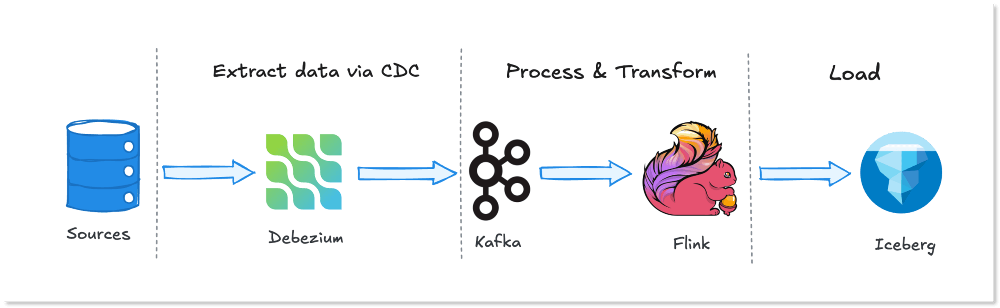
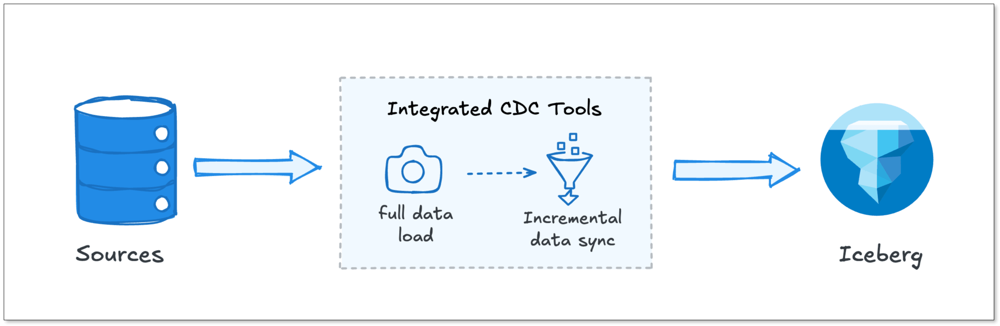

An **Iceberg CDC pipeline** captures changes from operational databases such as MySQL, PostgreSQL, Oracle, or SQL Server and applies those inserts, updates, and deletes to [Apache Iceberg](https://www.bladepipe.com/connector/iceberg/) tables.

The hard part is preserving change semantics, handling schema evolution, avoiding small-file buildup, and keeping the table queryable by engines such as Spark, Flink, Trino, Athena, or Snowflake.

Many teams start with Debezium, Kafka, and Flink. That stack is powerful, but it is not the only way to build CDC into Iceberg. This guide explains how Iceberg CDC works, where it gets tricky, when Kafka and Flink are worth the complexity, and when direct CDC is enough.

<!-- truncate -->

## Key Takeaways

- Iceberg CDC usually combines an **initial snapshot** with **incremental change capture** from database logs.
- The main challenge is mapping database `INSERT`, `UPDATE`, and `DELETE` operations into Iceberg tables correctly.
- Kafka and Flink are useful when you need fan-out, replay, stateful stream processing, or complex transformations.
- For straightforward database-to-Iceberg replication, Kafka + Flink + Debezium can be heavier than necessary.
- Small files, compaction, schema evolution, and recovery matter as much as raw ingestion latency.
- Direct CDC platforms can simplify Iceberg ingestion when the goal is reliable replication, not custom stream processing.

## What Is an Iceberg CDC Pipeline?

A [CDC pipeline](./change_data_capture_cdc.md) into Iceberg replicates row-level changes from a source database into an Iceberg lakehouse table.

The pipeline has two phases:

| Phase | What Happens | Why It Matters |
| :--- | :--- | :--- |
| Initial snapshot | Existing rows are read from the source database and written to Iceberg files. | The target starts with a complete baseline. |
| Incremental CDC | New inserts, updates, deletes, and sometimes DDL changes are captured from transaction logs. | Iceberg stays fresh without repeatedly reloading full tables. |

For example, a [MySQL-to-Iceberg pipeline](../tech_share/mysql_iceberg_sync.md) may read existing MySQL rows first, then continue from the MySQL binlog. A PostgreSQL-to-Iceberg pipeline may start with a snapshot, then continue from WAL through logical replication. SQL Server and Oracle use their own transaction log mechanisms.

## How CDC Events Map to Iceberg Tables

CDC events look like row-level changes:

```json
{
  "op": "UPDATE",
  "table": "orders",
  "before": {
    "id": 1001,
    "status": "pending"
  },
  "after": {
    "id": 1001,
    "status": "paid"
  },
  "source_position": "mysql-bin.000123:456789"
}
```

An Iceberg sink must turn those events into table changes:

- `INSERT` events become new rows.
- `UPDATE` events become upserts, so the latest row for a primary key is visible.
- `DELETE` events must remove or mask the matching row.
- DDL events may need to add, drop, rename, or alter columns in the Iceberg schema.

This is where Iceberg differs from simply appending Parquet files. Append-only writes are easy; CDC requires correct update and delete behavior.

Apache Iceberg supports row-level operations such as `MERGE INTO`, `UPDATE`, and `DELETE` in engines that implement them. Iceberg v2 also supports row-level deletes, including equality deletes and position deletes. The exact behavior depends on the engine and sink.

## Why Iceberg CDC Is Hard

### Upserts Need Stable Keys

CDC pipelines need stable row identifiers, usually primary keys. Without a key, updates and deletes are hard to apply correctly because the sink cannot reliably find the previous row.

For Iceberg, make sure the pipeline and query engines agree on the table's identifier fields or merge keys. This is especially important for CDC formats emitted by Debezium, Canal, or custom log readers.

### Deletes Are Not Just Missing Rows

Deletes must be represented explicitly. A CDC stream may carry a delete operation, a tombstone record, or a before image. The Iceberg writer then needs to translate that into a row-level delete or a rewrite of affected data files.

If delete handling is incomplete, downstream queries may keep seeing rows that were already deleted from the source database.

### Small Files Can Destroy Query Performance

Iceberg works best with reasonably sized data files and maintained metadata. Low-latency CDC can commit many small changes.

This can create:

- Too many small Parquet files
- Too many delete files
- Frequent metadata snapshots
- Slower planning and query execution in engines such as Trino, Athena, or Spark

Iceberg CDC pipelines need batching, commit control, file compaction, snapshot expiration, and orphan file cleanup. Read the [Apache Iceberg maintenance docs](https://iceberg.apache.org/docs/latest/maintenance/) before putting CDC workloads into production.

### Schema Evolution Must Be Coordinated

Iceberg supports schema evolution, but a CDC pipeline still has to decide what to do when the source table changes.

Common cases include:

- Add a nullable column
- Drop a column
- Rename a column
- Change a column type
- Change primary keys or unique constraints

Some changes can be propagated automatically. Others need review because they may break consumers or require a backfill.

### Exactly-Once Is a System Property

Many engines and sinks discuss exactly-once writes, but end-to-end correctness depends on the whole pipeline: source offsets, checkpoints, retries, object storage commits, Iceberg snapshot commits, and downstream reads.

For most analytics pipelines, practical correctness usually means:

- No gaps in source log consumption
- Retry-safe writes
- Idempotent upserts or deterministic merge behavior
- Observable checkpoints
- Clear recovery behavior after failures

## Common Architecture: Debezium + Kafka + Flink + Iceberg

The classic CDC architecture looks like this:



The stack is popular because:

- **Debezium** captures changes from databases such as MySQL and PostgreSQL and emits CDC events.
- **Kafka** provides buffering, replay, retention, and fan-out for multiple consumers.
- **Flink** reads CDC events, performs transformations, manages state, and writes to Iceberg.

This architecture fits larger streaming platforms. If multiple teams consume the same changes, or if the pipeline performs joins, enrichment, windowed aggregation, or complex routing before writing Iceberg, Kafka and Flink can be the right tools.

## Hidden Costs of the Classic Stack

### Operational Overhead

Running this stack means operating several distributed systems:

- Debezium and Kafka Connect
- Kafka brokers and topic management
- Schema Registry or equivalent schema handling
- Flink JobManagers, TaskManagers, checkpoints, and savepoints
- Iceberg catalog and storage maintenance

Monitor connector health, Kafka consumer lag, Flink checkpoint duration, failed Iceberg commits, object storage errors, and compaction backlog.

### More Places for Latency to Hide

A multi-hop pipeline gives you flexibility, but it also makes troubleshooting harder.

Latency can come from:

- Source connector snapshot or log-reading lag
- Kafka partition skew
- Consumer lag
- Flink checkpoint delays
- Iceberg commit contention
- Small-file compaction pressure

When the SLA is "Iceberg should be queryable within a few minutes", debugging across multiple systems can become the expensive part of the pipeline.

### More Tuning for Small Files

Flink streaming jobs can write frequently to maintain low latency. Iceberg still needs healthy file sizes and metadata. Without tuning, the pipeline may write fast but query poorly.

Many Iceberg CDC projects add maintenance jobs for compaction, snapshot expiration, metadata cleanup, and delete-file rewriting.

## Alternative 1: Flink CDC Direct to Iceberg

[Flink CDC](https://nightlies.apache.org/flink/flink-cdc-docs-release-3.5/docs/connectors/pipeline-connectors/iceberg/) removes Kafka from the diagram:

```text
Source database
  -> Flink CDC
  -> Iceberg catalog + object storage
```

This can be simpler than Debezium plus Kafka plus Flink. Use it when:

- You already operate Flink
- You want CDC capture and Iceberg writes in one Flink pipeline
- Your team is comfortable with Flink SQL, checkpoints, savepoints, and state backends
- You need transformations that fit naturally in Flink

Flink CDC still means operating Flink. Large snapshots, checkpoint tuning, savepoints, RocksDB state, schema changes, and Iceberg sink behavior need engineering attention.

The real question is not "Can Flink CDC write to Iceberg?" It can. The better question is: "Should Flink be the operational center of this replication pipeline?"

## Alternative 2: Direct CDC to Iceberg with BladePipe

For straightforward database-to-Iceberg replication, direct CDC can remove unnecessary infrastructure.

In this model:

```text
Source database
  -> CDC engine
  -> Iceberg catalog + object storage
```



[BladePipe](https://www.bladepipe.com/) follows this integrated approach. It handles CDC reading, initial full load, incremental sync, schema migration, DDL synchronization, buffering, writing, monitoring, and recovery in one platform.

For Iceberg targets, BladePipe supports common catalog and storage combinations, including:

- AWS Glue + AWS S3
- Nessie + MinIO / AWS S3
- REST Catalog + MinIO / AWS S3

See [Add an Iceberg DataSource](/docs/dataMigrationAndSync/datasource_func/Iceberg/props_for_iceberg_ds/) for the target configuration details.

This model fits when:

- You mainly need to replicate database tables into Iceberg
- You do not need Kafka fan-out for many independent consumers
- You do not need complex stateful stream processing
- You want fewer moving parts to monitor and upgrade
- You need schema handling, retry, and recovery without building custom orchestration

For concrete examples, see [MySQL to Apache Iceberg Sync](../tech_share/mysql_iceberg_sync.md) and [SQL Server to Apache Iceberg](../tech_share/sql_server_to_apache_iceberg.md).

## Architecture Comparison

| Architecture | Best For | Strengths | Watch Outs |
| :--- | :--- | :--- | :--- |
| Debezium + Kafka + Flink + Iceberg | Large streaming platforms with multiple consumers and complex processing | Durable replay, fan-out, flexible stream processing | Highest operational complexity; multiple systems to tune |
| Flink CDC direct to Iceberg | Teams already comfortable with Flink | Fewer components than Kafka-based architecture; strong transformation layer | Still requires Flink operations, checkpoint tuning, and state management |
| Direct CDC tool to Iceberg | Database-to-lakehouse replication and analytics ingestion | Simpler operations, faster setup, integrated monitoring and recovery | Less suitable if Kafka topics are the product or many teams need independent replay |
| Batch ETL + periodic MERGE | Low-freshness analytics workloads | Simple when hourly or daily freshness is enough | Higher latency; repeated scans; delete handling can be incomplete |

## When Kafka and Flink Are Worth It

Kafka and Flink make sense when your requirements justify them.

Use the classic stack when:

- Many downstream teams need to consume the same CDC stream independently
- You need replay and long retention as a core product capability
- The pipeline performs joins, enrichment, aggregations, or routing before Iceberg
- You already have mature Kafka and Flink operations
- Your event volume is high enough to benefit from independent scaling across components

For a broader decision framework, see [Do You Really Need Kafka?](./do_you_really_need_kafka.md).

## When a Simpler Iceberg CDC Pipeline Is Enough

Direct CDC often fits analytics lakehouses.

Choose a simpler architecture when:

- The main goal is to keep Iceberg tables fresh
- Source tables map mostly one-to-one to Iceberg tables
- Transformations are light or can happen after ingestion
- You want initial load plus incremental CDC in one workflow
- Your team wants lower operational overhead than Kafka + Flink + Debezium

Kafka and Flink are not bad choices. Choose them for their strengths, not because every CDC architecture has to look like a streaming platform.

## Iceberg CDC Best Practices

### Start with Tables That Have Primary Keys

CDC works best when each source table has a stable primary key. This makes upserts and deletes much safer.

### Separate Raw Landing from Curated Tables

For complex analytics, consider landing CDC changes into raw Iceberg tables first, then creating curated tables with Spark, Flink, Trino, or another transformation layer.

### Control Commit Frequency

Lower latency is useful, but extremely frequent commits can create too many small files and snapshots. Tune batch size and commit frequency based on query needs, not only ingestion speed.

### Schedule Iceberg Maintenance

Plan compaction, snapshot expiration, and orphan file removal as part of the pipeline design.

### Test Deletes and Schema Changes

Before production, test inserts, updates, deletes, column additions, type changes, restarts, and checkpoint replay. CDC bugs often show up in edge cases, not in the first load.

### Keep Query Engines in Mind

Iceberg is an open table format, but feature support varies by engine and version. Verify how your chosen query engine handles row-level deletes, MERGE, schema evolution, and metadata planning.

For table-format trade-offs, see [Iceberg vs Delta Lake vs Paimon](./iceberg_vs_deltalake_vs_paimon.md).

## FAQ

### What is an Iceberg CDC pipeline?

An Iceberg CDC pipeline captures row-level changes from a source database and applies them to Apache Iceberg tables. It includes an initial snapshot followed by incremental CDC from database logs.

### Does Apache Iceberg support CDC?

Iceberg can store the results of CDC pipelines through row-level inserts, updates, deletes, and merge operations when supported by the writing engine. The CDC capture and delivery logic still comes from tools such as Debezium, Flink CDC, Spark jobs, or a dedicated CDC platform.

### How are updates and deletes written to Iceberg?

Updates are commonly applied as upserts or `MERGE INTO` operations based on a primary key or identifier fields. Deletes may be written as row-level delete files or handled through file rewrites, depending on the engine, table format version, and sink behavior.

### Do I need Kafka for Iceberg CDC?

Not always. Kafka is useful when you need replay, fan-out, retention, and independent consumers. If your main goal is database-to-Iceberg replication, a direct CDC pipeline can be simpler. Flink is also optional unless you need streaming transformations, stateful processing, or a Flink-native CDC pipeline.

### What causes small files in Iceberg CDC pipelines?

Small files usually come from frequent low-latency commits, many small update/delete events, high partition cardinality, or poorly tuned streaming sinks. Compaction and commit tuning are important for keeping Iceberg query performance healthy.
