In the era of big data, data lakes became a popular choice for large-scale analytics, thanks to their flexibility, low cost, and separation of storage and compute. But they’ve also struggled with consistency, schema drift, and complex query optimization.

That’s where modern lake formats like **Apache Iceberg**, **Delta Lake**, and **Apache Paimon** come in.

They introduce an independent **metadata layer** on top of data files, bringing database-like features such as **ACID transactions**, **schema evolution**, and **time travel** to object storage.

This blog breaks down how these lake formats work under the hood, what makes them different, and how you can build your own real-time data lake with BladePipe. Whether you are evaluating these formats for your 2026 architectures or deciding between them for real-time streaming, this guide covers the key differences.

## How Modern Data Lakes Work
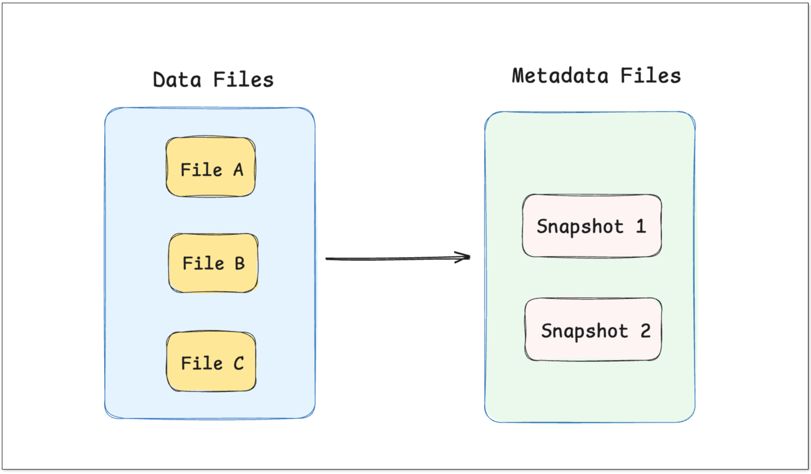

At the heart of these data lake formats is **metadata**.

When data is written to a table, the engine creates immutable data files (usually Parquet or ORC) and records their state in metadata snapshots. Each snapshot represents a consistent view of the entire table at a point in time.

Instead of rewriting data files directly, updates and deletes are performed through atomic metadata operations, switching the table pointer to a new snapshot.

Key concepts:
- **Metadata**: Record the state of every **snapshot**, including which files were written, where they reside, etc. This metadata may live in a file system (JSON, Avro, etc.) or in a managed service (e.g., Hive Metastore).
- **Data files**: Immutable Parquet/ORC files containing actual rows.

### Data Writing
Here’s a simplified example to illustrate how a lake-format works. 

Suppose we have a user table (**users**) and perform the following operations:
1. Initially write 2 user records.
2. Insert a new user record.
3. Update one user record.

**Step 1: Write 2 user records**

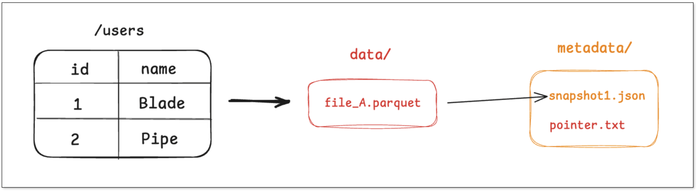

1. The engine writes the two records into a new Parquet file, say **file_A.parquet**.
2. It then creates a metadata file capturing **snapshot_1**, listing **file_A**.
3. Finally, it atomically updates a pointer to reference that **metadata**.

Any query on **users** will look up the **pointer**, read **snapshot_1**, then open **file_A** for results.

**Step 2: Insert 1 new record**

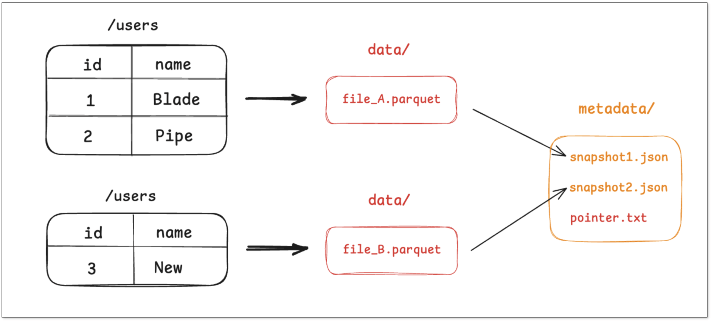

1. A new Parquet file **file_B.parquet** is written with the inserted record.
2. Metadata for **snapshot_2** is created, now pointing to both **file_A** and **file_B**.
3. The **pointer** is atomically updated and refer to **snapshot_2**.

The old snapshot (**snapshot_1**) still exists, enabling version-based reads.

**Step 3: Update and merge**

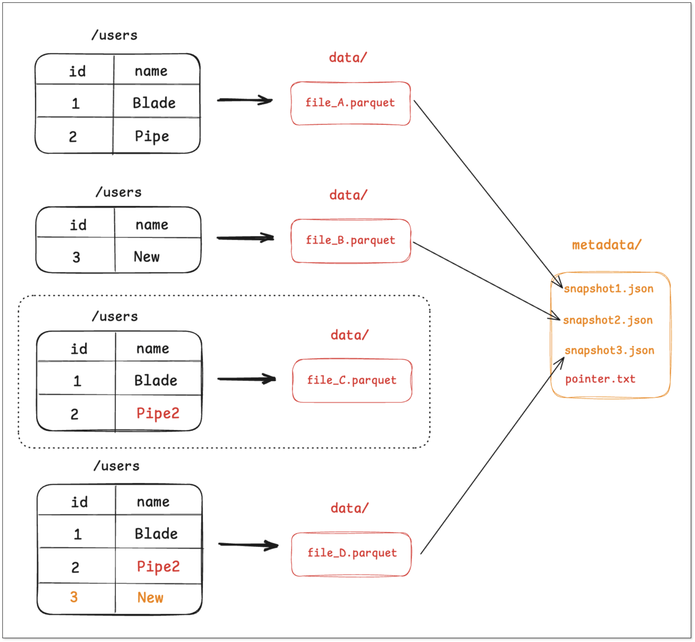

1. Since Parquet files are immutable, the engine reads **file_A**, applies the update in memory, and writes a new file **file_C.parquet**.
2. It may also trigger a compaction job that merges **file_B** and **file_C** into a larger file **file_D.parquet**.
3. Then **snapshot_3** is created, listing only **file_D**.
4. The **pointer** is updated atomically to **snapshot_3**.

Files no longer referenced (e.g., **file_A**, **file_B**) become candidates for garbage-collection. This design shifts complex operations into atomic metadata actions, thus supporting **ACID** guarantees.

### Data Querying
When querying a lake‐format table, the engine follows roughly these steps:

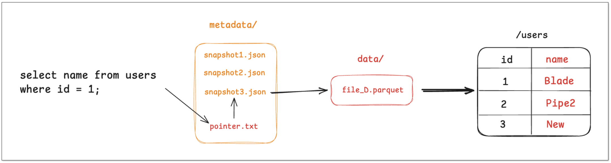

1. Read the **pointer.txt** to find the current snapshot or a specified historic snapshot.
2. From the snapshot, obtain the list of data files and their statistics (partitions, row count, min/max per column, bloom filters, etc.).
3. Based on the predicates, perform **partition pruning** and **column-statistics pruning**, retaining only files or rows that may match, and then apply **column projection and predicate pushdown** into the Parquet/ORC layer.
4. Merge file reads:
    1. Copy-On-Write (CoW): Read the latest set of files directly.
    2. Merge-On-Read (MoR): Read base files + incremental/delete-vector files and **apply merges/deletes** during read.

In summary, the essence of a data lake format is to transform complex data operations into atomic metadata updates, thus achieving ACID transactions and efficient queries. 

## Apache Iceberg vs Delta Lake vs Apache Paimon: 2026 Comparison
Although they share the same goal, the three lake formats diverge in design philosophy and metadata structure. Throughout this Apache Iceberg vs Delta Lake 2026 comparison and Paimon vs Iceberg evaluation, we'll see exactly how these differences impact performance.

Let’s look at how each handles metadata, updates, and queries.

### Apache Iceberg
**Metadata**

Iceberg uses a hierarchical **tree-based metadata structure** that makes metadata pruning highly efficient.
- A **top-level metadata file** defines schema, partitioning, and the list of all snapshots.
- Each snapshot has a **manifest list**, an index pointing to multiple manifest files and their partitions.
- Each **manifest** contains the actual data file list, with detailed column statistics, min/max values, and file-level metadata.

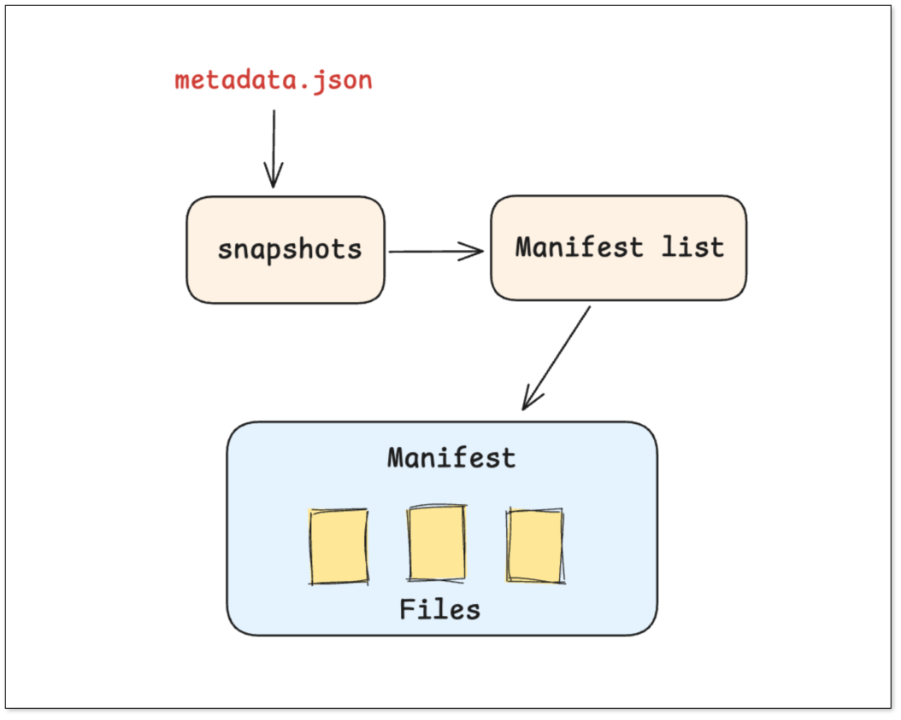

**Data Updates**

+ Create a new **Delete file**, such as **del_file_A.parquet**, to record that the Nth row of **file_A** or rows with user_id = 1 have been deleted. 
+ Create a **v2 snapshot**, which includes both **file_A.parquet** and **del_file_A.parquet**. When reading, the query engine will automatically filter out the deleted rows based on the Delete file.

**Querying**

+ The engine reads the top-level metadata, finds the **manifest list** for the version, prunes based on partition info to select only relevant **manifest files**, then reads only those data files.

### Delta Lake
**Metadata**

With recent **Delta Lake updates**, its metadata approach remains highly robust. Delta Lake is built around a strictly time-ordered **transaction log (_delta_log/)**.
+ **Transaction Log**: Each write/update/delete produces a new **JSON file** documenting which files were **added** and **removed**.
+ **Checkpoint File**: When the log grows large, a **checkpoint Parquet file** is created for faster reads.

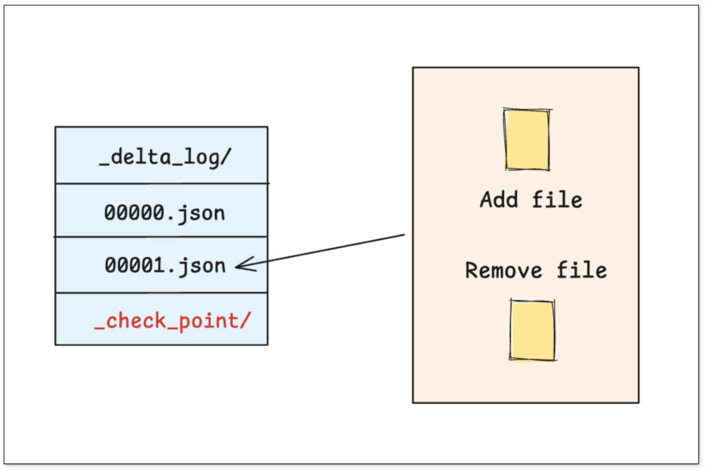

**Data Updates**
+ **Copy-On-Write**: The engine reads the old file, applies changes, writes a **new file**, and logs the change in **/_delta_log**.
+ **Delete vector**: Instead of rewriting, the engine can append a **delete vector** record in **/_delta_log**.

**Querying**
+ The engine locates the latest **checkpoint**, then applies subsequent transaction logs to compute the final state of the table.

### Apache Paimon
**Metadata**
Paimon draws on a database-style **LSM-tree** architecture, particularly optimized for continuous real-time ingestion.

+ **Write-Buffer / L0 Level**: Newly arriving data is written into L0 small files for very low-latency writes.
+ **Background Compaction**: A background process merges L0 files into larger L1, L2 files while deduplicating by primary key, keeping only the latest version.
+ **Snapshot**: A metadata snapshot records what file layers compose the table at any point.

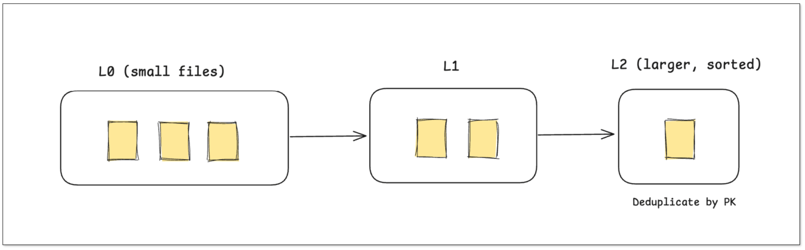

**Data Updates**

+ A **new version** for a key is written into **L0** (a small file).
+ Later, **compaction** merges L0 files, retaining only the most recent version and generating a larger L1 file.

**Querying**

+ The engine reads all levels (L0, L1, …) and merges/deduplicates in memory to return the latest data.

### The Evolution of Compute Bottlenecks

All three formats rely on metadata stored as files, which means merging and compaction often happen on the compute nodes. This can create performance bottlenecks in self-managed setups.

- **Copy-on-Write (CoW)**: Frequent updates cause file rewrites and small-file compaction, stressing write nodes.
- **Merge-on-Read (MoR)**: Queries must merge data and delete files at runtime, putting pressure on query nodes.
- **LSM-style (Paimon)**: Fast writes, but background merges consume compute and I/O resources.

To offload these costs, cloud providers are increasingly pushing optimization logic into managed services:

- **AWS Glue + Iceberg**: Offer **automatic small file compaction** and **table optimization**.
- **Databricks + Delta Lake**: Provide built-in **automatic merging** and **OPTIMIZE/ZORDER** operations to merge small files in the background.
- **Alibaba Cloud DLF + Paimon**: DLF, as a **managed metadata platform**, offers **storage optimization strategies** to reduce maintenance overhead.

These managed optimizations make a big difference in stability and performance, but actual gains depend heavily on cloud provider **capabilities and configuration strategy**.

### Summary
| Feature | Apache Iceberg | Delta Lake | Apache Paimon |
| --- | --- | --- | --- |
| **Design Philosophy** | Open standard, engine-agnostic | Simple and efficient, deeply integrated with Spark | Unified stream & batch, real-time updates prioritized |
| **Core Contributors** | Netflix, Apple, Dremio | Databricks | Flink community |
| **Metadata Structure** | Tree structure (Metadata -> Manifest List -> Manifest) | Linear transaction log (JSON + Parquet Checkpoint) | LSM-Tree-like structure |
| **Key Strengths** | Strong schema evolution, partition evolution, efficient metadata pruning | Easy to use, seamless integration with Spark/Databricks ecosystem | Excellent real-time upsert/delete performance |
| **Concurrency Control** | Optimistic Concurrency Control (OCC) | Optimistic Concurrency Control (OCC) | Optimistic Concurrency Control (OCC) |
| **Best Suited for** | Large-scale, multi-engine analytical batch workloads | Spark-centric batch and streaming pipelines | Flink CDC, real-time data lake, unified stream & batch |
| **Openness** | Very high, widely supported by Flink, Spark, Trino, StarRocks, etc. | High, but more tightly bound to Databricks ecosystem | High, closely integrated with Flink/Spark ecosystem |

In short, the core differences among the three formats lie in their **metadata organization** and **update models**.

+ **Apache Iceberg** is ideal for **batch-heavy**, **multi-engine analytics**.
+ **Delta Lake** excels in **Spark-based pipelines** with auditable logs.
+ **Apache Paimon** dominates in **real-time CDC** and **streaming** use cases.

## Building a Real-Time Data Lake
So how do you bring your database changes into a modern data lake in real time?

That’s where [BladePipe](https://www.bladepipe.com/) comes in.

BladePipe is a real-time data integration platform that can continuously sync database changes into Paimon, Iceberg, or Delta Lake. The platform recently launched [SaaS Managed](../announcement/saas_mode.md) mode, which comes with a 90-day free trial. With it, you can start moving data after logging in. No deployment or maintenance is required.

Next, we'll set up a real-time data lake using BladePipe SaaS Managed and DeltaLake.

### Data Sync
#### Add Data Sources
1. Log in to the [BladePipe Cloud](https://cloud.bladepipe.com). Select **Fully Managed mode** in the upper right corner.
2. Click **DataSource** > **Add DataSource** for both MySQL and Delta Lake.

    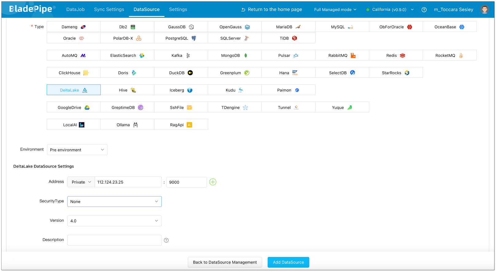
    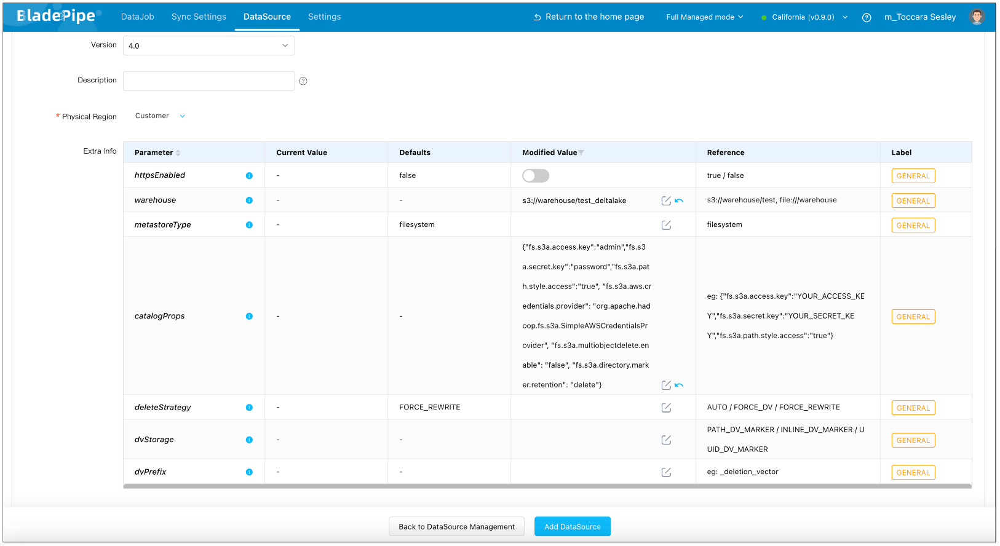

#### Create Sync Job
1. Click **DataJob** > [**Create DataJob**](https://www.bladepipe.com/docs/operation/job_manage/create_job/create_full_incre_task/).
2. Select the source and target DataSources, and click **Test Connection** to ensure the connection to the source and target DataSources are both successful.

    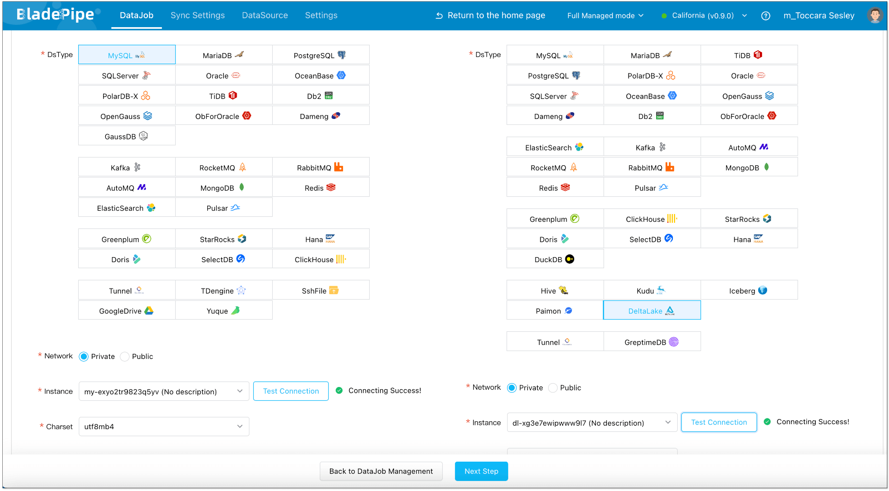

3. In **Properties** Page:  Select **Incremental** for DataJob Type, together with the **Initial Load** option.  

    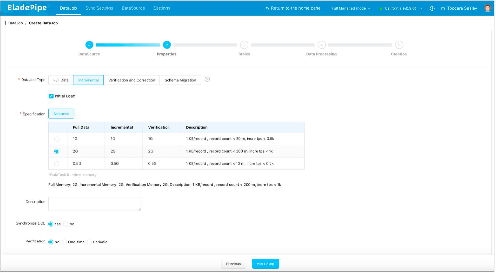

4. Select the tables to be replicated.

    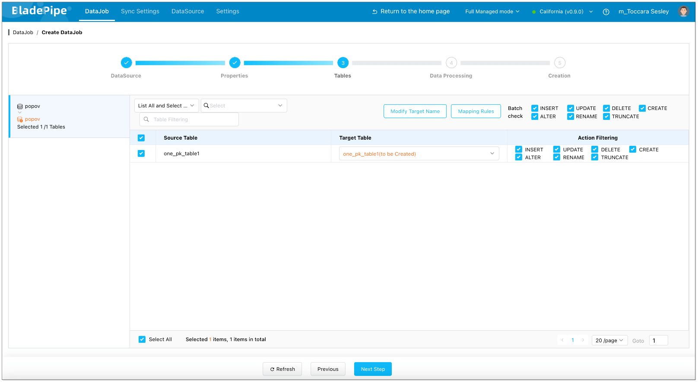

5. Select the columns to be replicated.  

    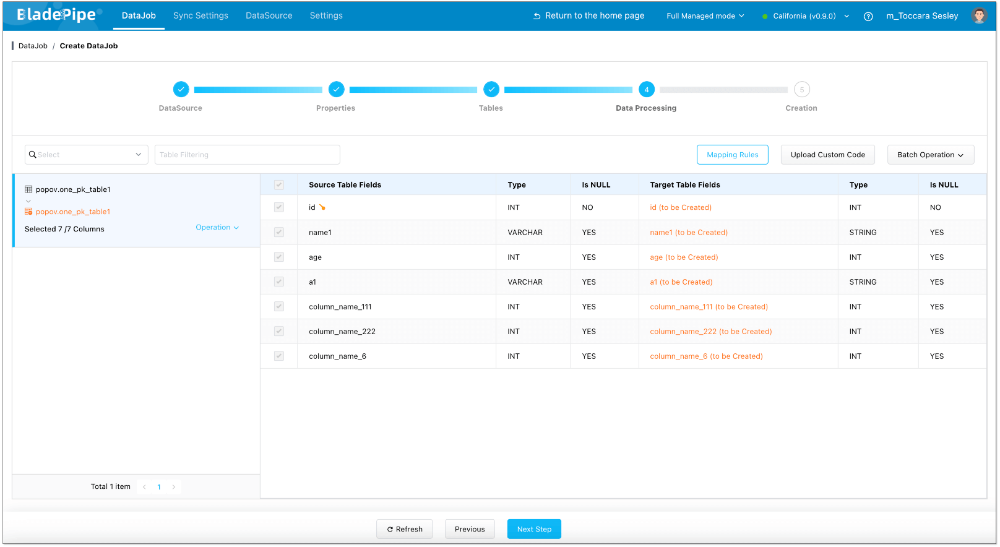

6. Confirm the DataJob creation.  

    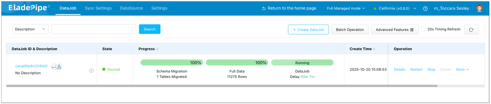

Once started, **BladePipe** will handle full-load initialization and capture incremental changes in real time into **Delta Lake**.

## Takeways
Iceberg, Delta Lake, and Paimon each represent a different path toward a more consistent, real-time, and scalable data lake architecture.
- **Iceberg**: open, analytical, and highly flexible.
- **Delta Lake**: operationally simple and deeply Spark-integrated.
- **Paimon**: streaming-native and real-time ready.

With tools like BladePipe, teams can connect operational databases directly to these lake formats, enabling [near-zero-latency analytics](https://www.bladepipe.com/real-time-analytics/) and simplifying the entire data pipeline.

## Further reading

- [MySQL to Iceberg Sync Guide](https://www.bladepipe.com/blog/tech_share/mysql_iceberg_sync/)
- [How to Build a Real-Time Lakehouse with BladePipe, Paimon and StarRocks](https://www.bladepipe.com/blog/data_insights/paimon_starrocks_lakehouse/)