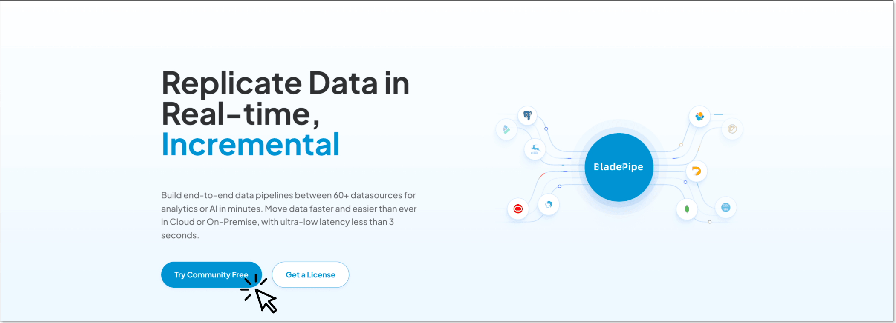
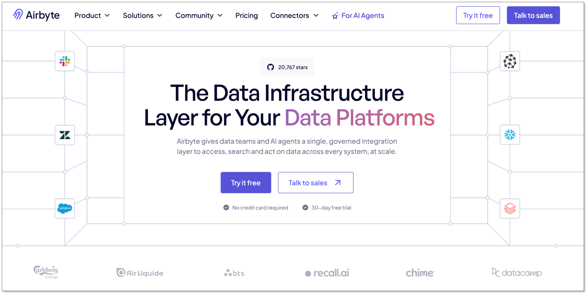
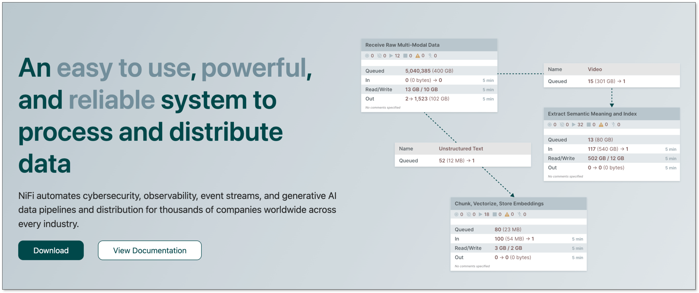
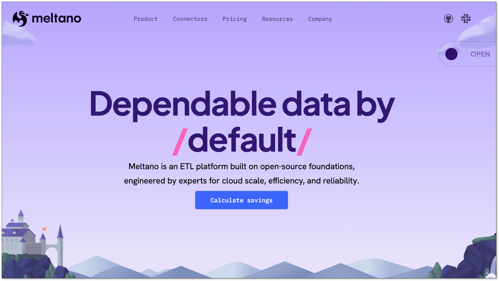
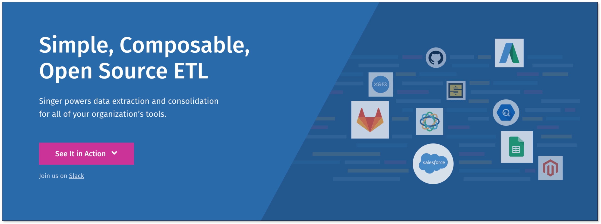
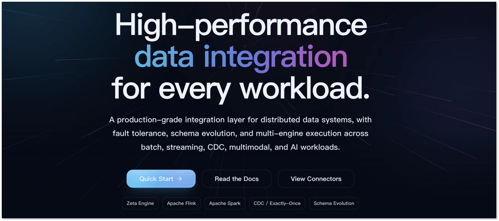
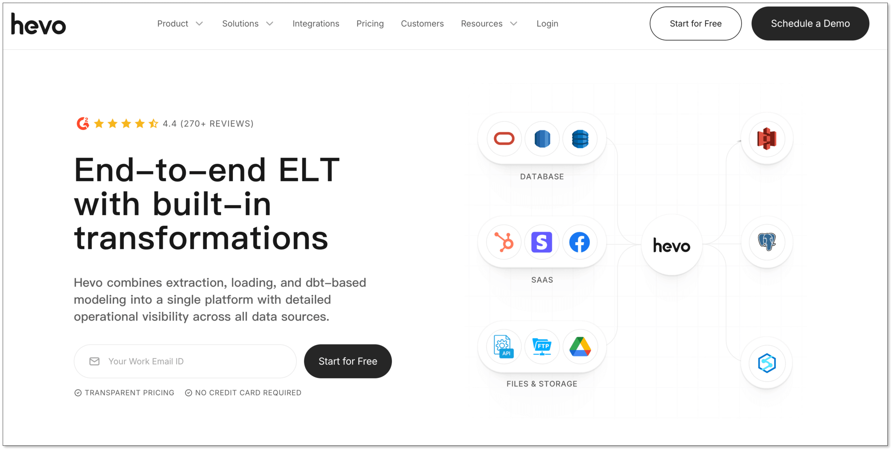
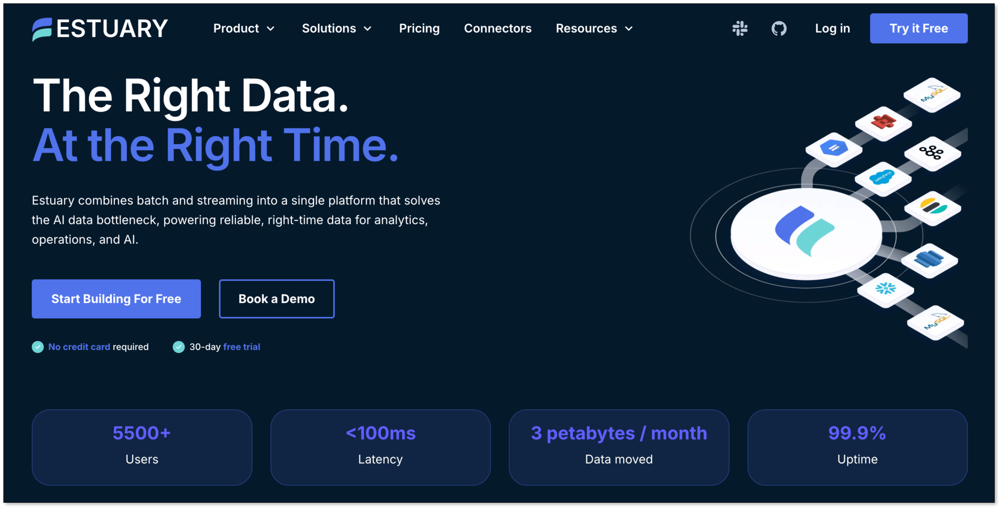

Informatica is powerful, but many teams only need a narrower data integration workload: warehouse ELT, database replication, [CDC](change_data_capture_cdc.md), or [migration](best_data_migration_tools.md). In those cases, a lower-cost Informatica alternative can be easier to deploy and cheaper to operate.

If you only need warehouse ELT, database replication, CDC, or migration, you probably do not need another full enterprise suite.

**Before you dive into the table, here's a 10-second decision guide:**

- **You need real-time database sync (CDC) to a warehouse or lake, and you don't want to build it yourself** → Start with BladePipe or Estuary
- **You have a technical team and want an open-source ELT foundation you can customize** → Start with Airbyte, Meltano, or Singer
- **You have dedicated ops/infra engineers and prefer visual data flow orchestration** → Start with Apache NiFi
- **You're an SMB or non-technical team that just wants managed ELT with minimal setup** → Start with Hevo Data
- **You're running large-scale batch and streaming workloads on your own infrastructure** → Start with Apache SeaTunnel

Use the table to rule out tools that do not fit your deployment model or budget, then jump to the few that remain.

| Tool | Best for | Open source | Managed option | Pricing | Biggest catch |
| --- | --- | --- | --- | --- | --- |
| **BladePipe** | Real-time DB migration and replication, DBA-friendly | No | Yes | [Community: Free](https://www.bladepipe.com/pricing/); Cloud: $0.01/million rows (ETL) or $10/million rows (CDC); Enterprise: custom | Narrow ecosystem; not a fit for non-database workloads |
| **Airbyte** | Open-source ELT with broad connector coverage | Yes | Yes | Core: Free; Standard: from $10/month; Team: $299/month; Enterprise: custom | Connector quality varies widely—test before trusting |
| **Apache NiFi** | Visual flow automation for data movement | Yes | No | Free; infra only | Ops-heavy; not designed for warehouse-first ELT |
| **Meltano** | Developer-led ELT with native dbt integration | Yes | Yes | Open: Free; Cloud: compute-hour based, public dollar pricing not listed | Steep setup curve; needs engineering ownership |
| **Singer** | Building custom connector pipelines | Yes | No | Free; infra only | Not a complete platform—you wire it yourself |
| **Apache SeaTunnel** | Large-scale batch + streaming on self-managed infra | Yes | Limited | Free; infra only | Maturing ecosystem; fewer production battle scars |
| **Hevo Data** | Managed ELT for SMBs needing quick time-to-value | No | Yes | Free: $0 up to 1M events/month; Starter: $239/month annually or $299/month monthly; Professional: $679/month annually or $849/month monthly; Business Critical: custom | Less control; hard to customize beyond UI |
| **Estuary** | Low-latency CDC and real-time streaming use cases | No | Yes | Free: 10 GB/month and 2 connector instances; Cloud: $0.50/GB + $100/connector instance; Enterprise: custom | Overkill if you only need batch ETL |

The table above helps you filter out the wrong fit. This next one helps you compare what each tool will actually cost your team—not just the software bill, but the time and effort to get it running.

If you already know which 1–2 tools fit your use case, skip ahead to those sections. If you're still unsure, read on.

## Deployment Model and TCO Comparison

Before the detailed reviews, compare the three cost layers that matter most:

* Software cost: license, subscription, or usage-based billing
* Deployment cost: the time and skill needed to get a first production pipeline running
* Ongoing cost: maintenance effort, troubleshooting, and the amount of platform ownership your team takes on

| Tool | Deployment model | Typical time to first production pipeline | Ongoing maintenance burden |
| --- | --- | --- | --- |
| BladePipe | Managed, BYOC, or enterprise deployment | Minutes to a few hours | Low to medium |
| Airbyte | Self-hosted open source or managed cloud | Hours to days | Medium to high if self-hosted |
| Apache NiFi | Self-managed | Days to weeks | High |
| Meltano | Self-managed developer workflow or managed Cloud | Days | High |
| Singer | Self-managed components | Days to weeks | High |
| Apache SeaTunnel | Self-managed | Days to weeks | Medium to high |
| Hevo Data | Managed SaaS | Hours to a day | Low |
| Estuary | Managed cloud | Hours to a few days | Low to medium |

If you want low ownership, managed tools usually win on TCO. If you have strong engineering bandwidth, open source can cut software spend.

## 1. BladePipe

**Best for:** Teams replacing Informatica specifically for real-time CDC, database migration, or operational replication.

BladePipe is strongest when your main requirement is moving data between databases, warehouses, queues, and analytics systems with low latency. In that use case, it's a meaningfully lighter alternative than a full enterprise ETL suite.

Rather than trying to replace every Informatica feature, BladePipe focuses narrowly on replication, CDC, and migration workflows. That narrower scope is exactly why it makes sense for teams that want faster deployment and lower operational complexity.

**Choose BladePipe if:** Your primary job is database-to-database sync, migration, or low-latency CDC — and you don't want to pay for transformation features you won't use.

**Skip BladePipe if:** (1) You need broad SaaS ELT (Salesforce, HubSpot, etc.) — Airbyte or Hevo are stronger fits. (2) You require enterprise governance, MDM, or workflow breadth — that's not BladePipe's focus.

## 2. Airbyte

**Best for:** Organizations that want open-source flexibility and broad connector coverage.

Airbyte is one of the most common alternatives for teams that want to reduce software licensing cost without giving up access to a large connector catalog. It's especially attractive for data teams that are comfortable self-hosting or that want to start with open source and later move to a managed option.

Its biggest advantage is flexibility — you can run it anywhere, connect to hundreds of sources, and extend it with custom connectors. Its biggest downside is that flexibility pushes more responsibility onto the user, especially if you self-manage. Connector quality varies significantly across the catalog, so production use requires testing.

**Choose Airbyte if:** You want open-source ELT with broad SaaS and database coverage, and your team can handle some operational ownership.

**Skip Airbyte if:** (1) You're a small team with no dedicated ops/engineering bandwidth — the self-hosted version will cost more in labor than you save in licensing. (2) You need guaranteed connector quality and support SLAs across all sources — stick with commercial vendors.

## 3. Apache NiFi

**Best for:** Teams that want visual data flow automation across many systems.

Apache NiFi is a free, graphical tool for routing, transforming, and monitoring data flows across diverse systems. It's broader than ELT and works well in integration-heavy environments where flow control matters as much as loading data into a warehouse.

That said, it's not designed for modern warehouse-first ELT. It's an older paradigm — powerful but ops-heavy. If your team already knows NiFi, it can be a cost-effective workhorse. If not, the learning curve and maintenance overhead are real.

**Choose NiFi if:** You need visual flow orchestration across many on-prem and cloud systems, and you have the engineering staff to own it.

**Skip NiFi if:** (1) You simply want fast warehouse ingestion from SaaS apps with minimal setup — modern ELT tools are easier. (2) You don't already have NiFi expertise in-house — the learning curve is steep.

## 4. Meltano

**Best for:** Engineering teams that prefer Git-based ELT workflows and already use dbt.

Meltano is an open-source ELT framework that brings software engineering practices to data integration. It's a more structured alternative to stitching Singer taps and targets manually, and it natively integrates with dbt for the transformation layer.

The cost profile is attractive — zero licensing — but only if your team is comfortable owning the workflow. Meltano is command-line and Git-first, not point-and-click. It fits best in engineering-led organizations with established DevOps habits.

**Choose Meltano if:** Your team uses dbt, works in Git, and wants ELT as code with no per-seat licensing costs.

**Skip Meltano if:** (1) You're a non-technical team or need a visual UI for pipeline building — Meltano is CLI-first. (2) You want a managed, low-touch solution — the open-source version requires active engineering ownership.

## 5. Singer

**Best for:** Teams that want lightweight building blocks for custom pipelines.

Singer is an open connector standard ("taps" extract, "targets" load), not a complete platform. It's useful if your team wants to assemble custom pipelines without enterprise licensing, but you'll need to add orchestration, scheduling, monitoring, and operational conventions yourself.

It keeps software spend near zero, but labor adds up fast. Think of Singer as LEGO bricks — flexible, but you're the architect and the builder.

**Choose Singer if:** You have strong Python skills, want maximum flexibility, and your team is comfortable wiring together open-source components.

**Skip Singer if:** (1) You want an end-to-end platform with built-in scheduling and monitoring — Singer isn't that. (2) Your team isn't comfortable owning the full pipeline lifecycle.

## 6. Apache SeaTunnel

**Best for:** Teams needing open-source batch and streaming integration at larger scale.

Apache SeaTunnel supports both batch and streaming workloads, giving it broader scope than some lighter open-source ELT tools. It's an increasingly solid option for teams that want modern architecture without proprietary licensing.

For teams comfortable with self-managed infrastructure, it can reduce software cost significantly while still handling serious data movement. The ecosystem is maturing — still smaller than Airbyte's, but growing.

**Choose SeaTunnel if:** You're running large-scale batch or streaming workloads on your own infrastructure and want an open-source alternative with no per-seat licensing.

**Skip SeaTunnel if:** (1) You're a lean team with little platform ownership — the setup and maintenance will be heavier than you expect. (2) You need a broad, battle-tested connector ecosystem — Airbyte has more production mileage.

## 7. Hevo Data

**Best for:** Small and medium-sized businesses that want managed ELT with fast setup.

Hevo Data is a fully managed SaaS ELT platform. It's easier to adopt than most enterprise integration tools — a polished UI, cloud-managed infrastructure, and quick access to analytics pipelines without building much internally.

The main limitation is that costs scale with volume. At small scale, it's easy to justify. As data grows, the bill grows too. It's also less flexible than open-source options — you're limited to what the UI supports.

**Choose Hevo if:** You're an SMB or non-technical team that wants quick time-to-value with minimal maintenance overhead.

**Skip Hevo if:** (1) You're running high-volume workloads — costs can become unattractive as you scale. (2) You need deep customization or infrastructure control — Hevo is a managed black box.

## 8. Estuary

**Best for:** Organizations prioritizing low-latency streaming and CDC pipelines.

Estuary is a cloud-native platform built for real-time architectures. Compared with classic ETL tools, it's much more aligned with streaming, event-driven systems, and continuously updated downstream use cases.

That makes it compelling for some Informatica replacement projects, but also means it's overkill if you just need simple batch ELT. Freshness is its core value proposition.

**Choose Estuary if:** Your core requirement is low-latency streaming or CDC to a warehouse/lake, and you're moving toward real-time architectures.

**Skip Estuary if:** (1) You need conventional batch ELT from SaaS apps — simpler tools like Airbyte or Hevo are easier to evaluate and operate. (2) You're not ready for streaming-first operations — Estuary is opinionated about real-time.

## Why We Did Not Recommend Some Popular Informatica Alternatives

We excluded Fivetran, Talend Data Fabric, Qlik Replicate, IBM DataStage, and Oracle Data Integrator because they bring the same enterprise cost and complexity that most teams looking for alternatives want to leave behind. If you want another enterprise platform, evaluate them. If you want lower TCO, start here.

## Open Source vs Managed: Which Path Lowers TCO?

The main decision isn't which tool — it's **who owns the operation**.

| | Self-managed (open source) | Managed (SaaS) |
| --- | --- | --- |
| **Software cost** | Low to zero | Higher, scales with volume |
| **Maintenance burden** | High — your team owns uptime, scaling, upgrades | Low — vendor handles infrastructure |
| **Flexibility** | High — modify code, run anywhere | Limited to UI and API capabilities |
| **Best for** | Teams with engineering/ops bandwidth | Small teams, non-technical users, fast time-to-value |
| **Tools in this guide** | Airbyte (self-hosted), NiFi, Meltano, Singer, SeaTunnel | Hevo, Estuary, BladePipe Cloud, Airbyte Cloud |

Open source lowers license cost. Managed lowers ownership cost. Neither is universally cheaper — it depends on what your team has more of: budget or engineering time.

## Still Choosing Between 2-3 Tools? Here's the Final Narrowing

- **BladePipe vs. Estuary** — Both do CDC. Choose BladePipe if you're focused on database migration and operational replication. Choose Estuary if you're building toward real-time streaming architectures and event-driven systems.

- **Airbyte vs. Hevo** — Both do ELT. Choose Airbyte if you have engineering bandwidth and want open-source flexibility (self-hosted) or a managed option with broad connectors (cloud). Choose Hevo if you want fully managed, fast onboarding, and your team is smaller or non-technical.

- **Open-source toolkit vs. full platform** — NiFi, Meltano, Singer, and SeaTunnel are all self-managed. Choose one of these only if you have dedicated ops/engineering ownership. If you don't, go with one of the managed options above.

## FAQs

### Why do companies replace Informatica?

High licensing cost, implementation complexity, and infrastructure overhead. Many teams also find they only need a subset of Informatica's capabilities — warehouse ELT, database replication, or CDC — and don't want to pay for a full enterprise suite.

### What is the cheapest alternative to Informatica?

Open-source tools usually have the lowest software cost, but the real cheapest option depends on your team. If you have engineering time to self-host and maintain, open source wins. If you don't, the labor cost of self-hosting often exceeds the SaaS subscription — so managed tools like Hevo or BladePipe Cloud may actually be cheaper in total.

### Is there an open-source alternative to Informatica?

Yes. Airbyte, Apache NiFi, Meltano, Singer, and Apache SeaTunnel are open source.

### Which Informatica alternative is best for real-time CDC?

BladePipe and Estuary are both strong fits. BladePipe is better for migration and operational replication; Estuary is better for low-latency streaming.

### Which Informatica alternative is best for small teams?

For smaller teams, Hevo is the safer choice — it minimizes operational burden and time-to-value. Choose Airbyte instead only if you have at least one engineer who can own pipeline maintenance; otherwise, the labor cost will offset the license savings.
