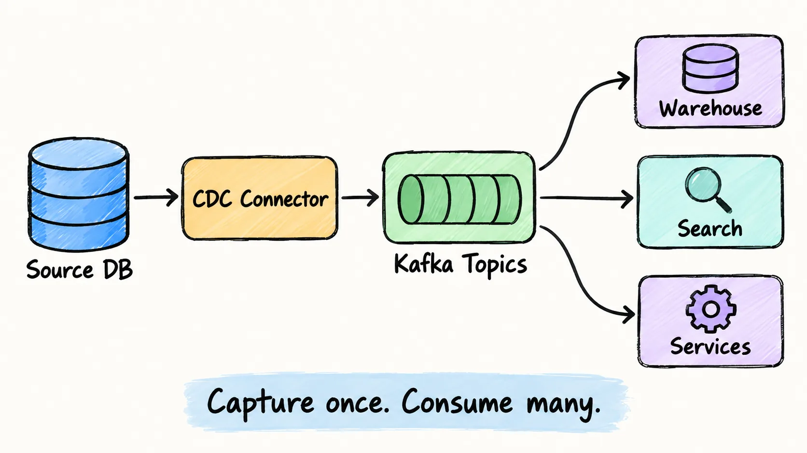
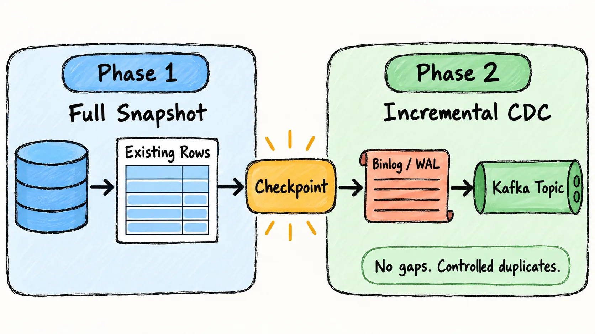
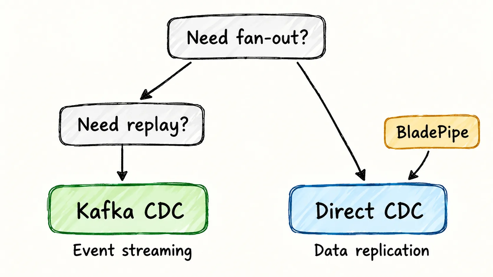

**Kafka CDC** is a pattern for capturing database changes and publishing them to Apache Kafka as ordered event streams. Instead of batch-exporting full tables, a CDC connector reads inserts, updates, and deletes from database logs, then writes those changes into Kafka topics for downstream systems to consume.

The usual architecture is:

```text
Source database -> CDC connector -> Kafka topics -> consumers / sinks
```

For example, a MySQL order update can be read from the binlog, converted into a change event, written to Kafka, and then consumed by a data warehouse, search index, cache, or microservice.

Kafka CDC is useful when you need real-time data movement, replayable event history, and multiple independent consumers. It is not automatically the best choice for every replication task. If you only need to move data from one database to one destination, a direct [CDC pipeline](change_data_capture_cdc.md) may be simpler.

<!-- truncate -->

## What Does Kafka CDC Mean?

Kafka CDC combines two ideas:

- **Change Data Capture (CDC)** tracks row-level changes in a database.
- **Apache Kafka** stores and distributes those changes as durable event streams.

In most production setups, Kafka does not read the database by itself. A CDC tool such as Debezium, Kafka Connect, Flink CDC, or a commercial data replication platform captures changes from the source database and publishes them to Kafka.



The change source depends on the database:

| Database | Common CDC source |
| --- | --- |
| MySQL | Binary log, usually row-based binlog |
| PostgreSQL | Write-ahead log through logical replication |
| SQL Server | SQL Server CDC tables and transaction log |
| Oracle | Redo logs, archived logs, or LogMiner/XStream-style mechanisms |
| MongoDB | Oplog or change streams |

Log-based CDC reads the database's own change record. It avoids table scans and captures deletes, transaction order, and low-latency updates more reliably than polling.

## How Kafka CDC Works

A Kafka CDC pipeline usually has six stages.

### 1. The Source Database Records a Change

An application writes to the database:

```sql
UPDATE orders
SET status = 'paid'
WHERE id = 1001;
```

The database records that operation in its transaction log. For MySQL, that means the binlog. For PostgreSQL, it means WAL. For SQL Server, CDC relies on SQL Server's change capture mechanism.

### 2. A CDC Connector Reads the Log

The connector keeps a checkpoint, often called an offset, so it knows which log position has been processed. This lets the pipeline resume after a restart.

With Debezium, the connector typically runs inside Kafka Connect. Each source connector reads one database server or cluster and writes change events into Kafka.

### 3. Initial Snapshot and Incremental Changes Are Combined

Most pipelines need historical data and future changes. The connector first snapshots existing rows, then reads new changes from the log.

This handoff is critical. A weak implementation can miss or duplicate rows during the transition from full load to incremental capture. A production-grade CDC pipeline must make it recoverable and observable.



### 4. Changes Become Kafka Events

A typical CDC event includes:

- Operation type: create, update, delete, or snapshot read
- Source metadata: database, table, log position, timestamp
- Key fields: usually the primary key
- Row values: before and/or after state, depending on the connector and database

Example:

```json
{
  "op": "u",
  "source": {
    "db": "shop",
    "table": "orders"
  },
  "before": {
    "id": 1001,
    "status": "pending"
  },
  "after": {
    "id": 1001,
    "status": "paid"
  }
}
```

### 5. Kafka Stores Events in Topics

Kafka topics are usually organized by table or business entity. A common Debezium-style pattern is:

```text
server.database.table
```

For example:

```text
mysql01.shop.orders
```

Partitioning matters. If events for the same primary key go to different partitions, consumers may see them out of order. For row-level CDC, the Kafka message key should usually include the primary key.

### 6. Consumers Apply or React to Changes

Consumers can:

- Load changes into a data warehouse or lakehouse
- Update a search index
- Refresh a cache
- Feed a fraud detection or recommendation service
- Trigger event-driven workflows
- Replicate data to another operational database

Kafka's main value is fan-out. One source change can feed several systems without each system reading the source database.

## When Kafka Is the Right Choice for CDC

Kafka fits when your CDC pipeline needs at least one of these capabilities:

- **Multiple consumers**: analytics, search, services, and monitoring all need the same changes.
- **Replay**: a new consumer may need to rebuild state from retained Kafka events.
- **Buffering**: downstream systems may slow down while the source database keeps writing.
- **Decoupling**: producers and consumers should evolve independently.
- **High throughput**: the pipeline must absorb sustained or bursty write volume.
- **Event-driven architecture**: database changes are part of a broader event backbone.

Kafka is often unnecessary when the requirement is simply:

```text
Database A -> Database B
```

If there is one destination, limited fan-out, and no replay need, adding brokers, topics, partitions, Connect workers, Schema Registry, monitoring, and retention management may create more work than value. See [Do You Really Need Kafka?](do_you_really_need_kafka.md) for a broader decision checklist.

## Kafka CDC with Debezium

Debezium is the most common open-source tool associated with Kafka CDC. It provides source connectors for MySQL, PostgreSQL, SQL Server, Oracle, MongoDB, and others.

A typical Debezium architecture looks like this:

```text
MySQL / PostgreSQL
  -> Debezium connector
  -> Kafka Connect
  -> Kafka topics
  -> sink connector or custom consumer
```

For a MySQL CDC to Kafka pipeline, the practical setup usually includes:

1. Enable row-based binlog on MySQL.
2. Create a database user with replication privileges.
3. Start Kafka and Kafka Connect.
4. Install the Debezium MySQL connector.
5. Register a connector configuration through the Kafka Connect REST API.
6. Verify that table topics are created.
7. Consume events and write them to the target system.

For PostgreSQL, the setup is similar, but you enable logical replication, configure WAL retention, and create a replication slot. If a connector stops too long, retained WAL can pressure disk space.

Debezium is flexible and battle-tested, but it is not a complete data platform by itself. Teams still need to operate Kafka Connect, manage offsets, handle schema changes, monitor lag, design topics, configure sinks, and test recovery behavior. If you want CDC with less Kafka operations, compare it with [Debezium alternatives](debezium_alternatives.md) such as [BladePipe](https://www.bladepipe.com/).

## Production Pitfalls Most Guides Skip

Many Kafka CDC tutorials show a Docker Compose demo, then stop before the hard parts. In production, these details decide whether the pipeline can be trusted.

### Delivery Semantics

Most CDC pipelines should be treated as **at-least-once** unless you have designed end-to-end exactly-once behavior. Consumers should be idempotent, usually by upserting primary keys and applying deletes explicitly.

### Deletes and Tombstones

A delete is not just "missing data." CDC events must preserve delete operations so downstream systems can remove or mark records correctly. Some Kafka CDC formats also emit tombstone messages for log-compacted topics. Consumers need to understand both patterns.

### Schema Changes

Real databases change. Columns are added, renamed, widened, or dropped. Kafka CDC pipelines need a schema evolution strategy: Schema Registry, compatible event contracts, automated DDL handling, or controlled migrations.

### Ordering

Kafka preserves order within a partition, not across all partitions. If order matters per row, partition by primary key. If order matters across tables or transactions, the design becomes harder and may require transaction metadata, single-partition trade-offs, or downstream reconciliation.

### Initial Snapshot Load

The initial snapshot can be heavier than the ongoing stream. Large tables may need chunked snapshots, throttling, or off-peak execution to avoid source load or early lag.

### Lag and Backpressure

CDC lag should be monitored at several layers:

- Source log position
- Connector processing delay
- Kafka topic lag
- Consumer lag
- Target write latency

A green Kafka cluster does not mean the end-to-end pipeline is healthy. The business question is whether the target reflects the source within the required delay.

### Reprocessing and Backfill

Kafka retention is finite. If a consumer is down longer than the retained event window, it may need a fresh snapshot or targeted backfill. Define this procedure before an incident.

## Kafka CDC vs Direct CDC

The right architecture depends on the workload.

| Requirement | Better fit |
| --- | --- |
| One source, one target | Direct CDC |
| Several independent consumers | Kafka CDC |
| Need replayable event history | Kafka CDC |
| Low-ops database replication | Direct CDC |
| Existing Kafka platform | Kafka CDC |
| Small team without Kafka expertise | Direct CDC or managed CDC |
| Event-driven services | Kafka CDC |
| Simple analytics sync | Direct CDC or managed ELT |

Kafka CDC is not "more advanced" by default. It is more appropriate when Kafka's durable log, buffering, replay, and fan-out solve real problems.



For teams focused on database replication or warehouse sync rather than event streaming, BladePipe provides no-code CDC with full load, incremental sync, monitoring, schema handling, and data verification without requiring Kafka for every pipeline.

## Best Practices for Kafka CDC

Use Kafka CDC as a system, not just a connector demo:

- Keep message keys stable and based on primary keys.
- Choose topic names that encode source, database, and table clearly.
- Make consumers idempotent and restart-safe.
- Monitor source log retention, connector offsets, and consumer lag.
- Test connector restart, Kafka outage, target outage, and schema change scenarios.
- Document how to resnapshot or backfill a table.
- Avoid putting sensitive fields into Kafka unless access control, masking, and retention are designed.
- Do not assume every downstream system can process raw CDC events directly.

If transformations are required, decide whether they belong in Kafka Streams, Flink, a sink connector, or a dedicated CDC platform. The wrong choice can turn CDC into fragile custom scripts.

## FAQ

### Is Kafka a CDC tool?

No. Kafka is an event streaming platform. A CDC connector captures database changes and writes them to Kafka. Debezium plus Kafka Connect is the most common open-source combination.

### Is Debezium required for Kafka CDC?

No. Debezium is popular, but not mandatory. You can also use Flink CDC, managed connectors, or commercial replication tools that publish changes to Kafka.

### Can Kafka CDC guarantee no data loss?

It can be designed for reliable delivery, but guarantees depend on the whole pipeline: database log retention, connector offsets, Kafka durability settings, consumer logic, target writes, and recovery procedures. The weakest component defines the real guarantee.

### Should every CDC pipeline use Kafka?

No. Use Kafka when you need fan-out, buffering, replay, and event-driven consumers. For simple database-to-database or warehouse sync, direct CDC tools such as BladePipe are often easier to operate.

## Bottom Line

Kafka CDC is a powerful architecture when database changes need to become durable, replayable, multi-consumer event streams. It works especially well for event-driven systems, high-throughput pipelines, and teams that already operate Kafka.

But Kafka is not the CDC layer by itself, and it is not free operationally. A high-quality Kafka CDC design must cover snapshots, offsets, ordering, schema changes, deletes, lag, replay, and idempotent consumers. If those requirements are real, Kafka is worth the complexity. If the goal is reliable data movement from one source to one destination, a simpler CDC pipeline such as BladePipe may deliver the same business value with less infrastructure.
