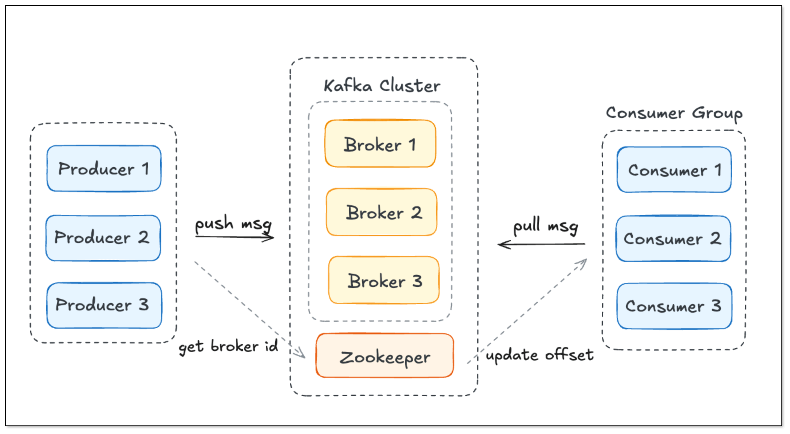
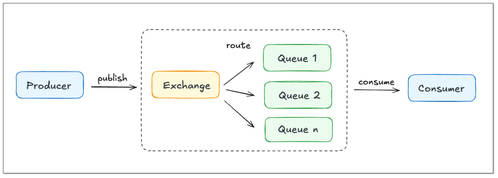
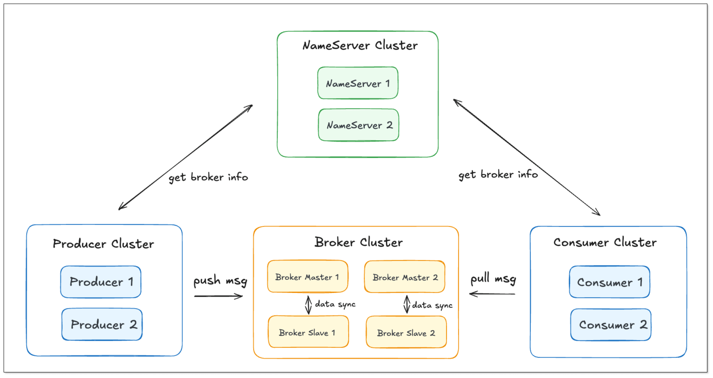
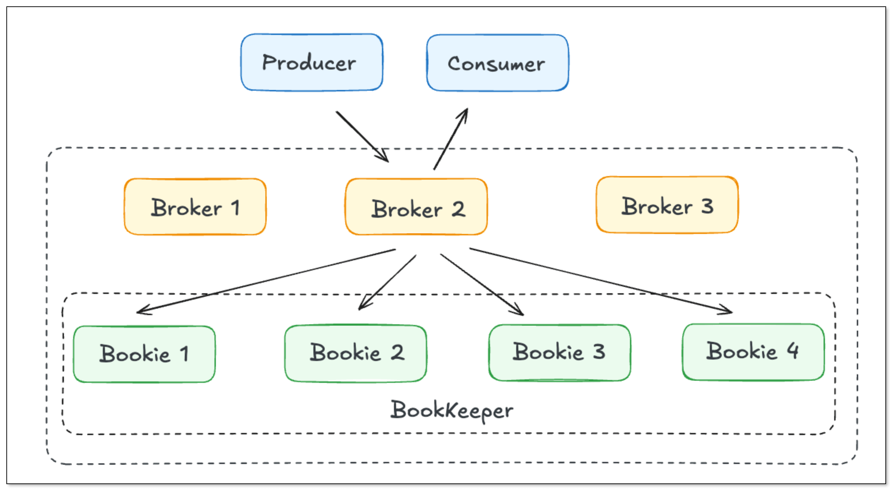
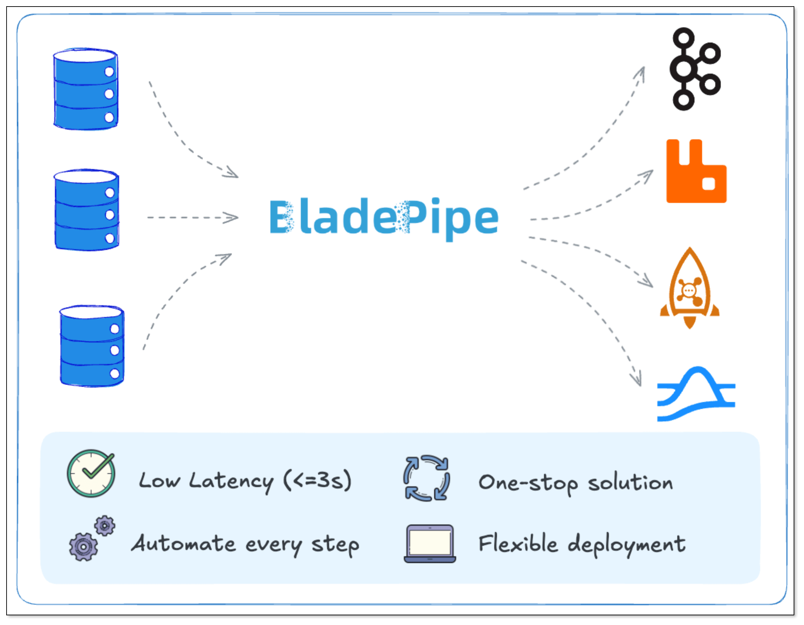

Message brokers are foundational to modern distributed systems, but choosing the right one in 2026 is far from trivial. [**Kafka**](do_you_really_need_kafka.md), **RabbitMQ**, **RocketMQ**, and **Pulsar** are all popular open-source options, yet they differ significantly in architecture, throughput performance, and operational trade-offs.

In this guide, we compare **Kafka, RabbitMQ, RocketMQ, and Pulsar** using real-world performance insights and benchmark data. You’ll see how they differ in throughput, latency, scalability, and real use cases—so you can confidently choose the right one for your architecture.

### TL;DR

- **Kafka** → Best for high-throughput data streaming and analytics  
- **RabbitMQ** → Best for low-latency messaging and complex routing  
- **RocketMQ** → Best for transactional systems and strict ordering  
- **Pulsar** → Best for cloud-native, large-scale distributed systems  

## Architecture at a Glance

**Kafka**   
Kafka is built around a distributed log. Producers write to Brokers, which store messages in partitioned logs. Consumers pull messages sequentially. Kafka originally relied on ZooKeeper for metadata but is moving toward its own metadata service (KRaft).

**RabbitMQ**   
RabbitMQ implements the AMQP protocol. Messages first go to an Exchange, which routes them to Queues based on rules. Consumers then pull from these queues. Its flexible routing (direct, topic, fanout, headers) makes it a great fit for complex messaging patterns.

**RocketMQ**    
RocketMQ uses a lightweight NameServer and Broker architecture. Producers fetch routing information from NameServers, then write to Broker queues. It supports transactional and ordered messages, making it popular in e-commerce and finance.

**Pulsar**     
Pulsar features an architecture with separated compute (Brokers) and storage (BookKeeper). This design enables infinite storage scaling, tiered storage, and is cloud-native by default.

## Performance

When it comes to performance, three aspects matter most: throughput, latency, and backlog handling.

| Metric |	Kafka	| RabbitMQ	| RocketMQ	| Pulsar |
| -- | -- | -- | -- | -- |
| Throughput	| Very high (hundreds of thousands to millions TPS)	| Moderate (tens of thousands per node)	| High (hundreds of thousands TPS)	| High (hundreds of thousands TPS) |
| Latency	| Low (tens of ms)	| Very low (single-digit ms)	| Low (tens of ms)	| Low (tens of ms) |
| Backlog handling	| Excellent, support long-term storage and replay	| Limited, backlog can cause performance issues |	Strong, support large-scale backlogs	| Strong, with tiered storage for long-term retention |

PS: The numbers are for reference. For precise performance statistics, please check official benchmark reports.

## Scalability

**Kafka**   
Kafka scales horizontally via **partitions**. A single topic can be split into many partitions, processed in parallel across brokers and consumers. In a cluster, brokers can be added up to thousands in production to support real-time data streaming.

**RabbitMQ**   
RabbitMQ scales through **clustering**, but queues must replicate across nodes, adding significant overhead. This makes it less ideal for massive-scale workloads.

**RocketMQ**   
RocketMQ scales by **adding brokers and queues**. Storage and consumers can expand independently, and nodes can be added without downtime, which is well-suited for large distributed systems.

**Pulsar**   
Pulsar leverages **compute-storage separation**. That means a great scalability. To increase throughput, you can add brokers. To expand storage, you can add BookKeeper nodes. Combined with multi-tenancy, Pulsar scales smoothly in cloud-native environments.

## Reliability

**Kafka**   
Kafka relies on **partition replicas** for durability. It guarantees *at-least-once* delivery by default, with *exactly-once* possible via idempotence and transactions. Kafka is very mature in large-scale distributed environments.

**RabbitMQ**    
RabbitMQ uses message persistence and replicated queues. Since 3.8, [**Quorum Queues**](https://www.rabbitmq.com/docs/quorum-queues) (based on Raft) is introduced to improve reliability. It guarantees *at-least-once* delivery, but duplicates are possible, which requires idempotence.

**RocketMQ**    
RocketMQ uses **master-slave replication** and **configurable flush** strategies (sync/async). The [**DLedger**](https://rocketmq.apache.org/docs/bestPractice/02dledger/) mode, based on Raft, enables automatic leader failover and stronger fault tolerance.

**Pulsar**    
Pulsar stores messages in BookKeeper with multi-replica persistence. That means broker failures don’t affect stored data. Its multi-tenancy and strong isolation make it a natural fit for cloud-native setups.

## Feature Comparison Table

To better understand the **differences between Kafka, RabbitMQ, RocketMQ, and Pulsar**, the table below provides a side-by-side comparison of their key features, performance characteristics, and typical use cases.

| Feature           | Kafka             | RabbitMQ        | RocketMQ            | Pulsar          |
| ----------------- | ----------------- | -------------- | --------- | --------------------- |
| Language          | Java/Scala           | Erlang           | Java           | Java                 |
| Message consumption       | Pull             | Push          | Pull              | Pull + Push           |
| Throughput        | Very high         | Moderate         | High         | High                   |
| Latency           | Low              | Very low                   | Low            | Low            |
| Backlog handling  | Excellent (replayable)      | Limited     | Strong        | Strong (tiered storage)      |
| Scalability       | Excellent (partitions)  | Moderate    | Strong     | Excellent (compute-storage separation)     |
| Reliability       | Excellent (replication, EOS support)   | Good (Quorum Queue)        | Strong (DLedger)      | Excellent (BookKeeper)      |
| Protocols         | Kafka protocol    | AMQP, MQTT, STOMP    | Native + extensions    | Native + extensions       |
| Ecosystem         | Richest, strongest community    | Stable, plugin-rich   | Strong in Asia, good cloud support | Growing fast, cloud-native    |
| Use cases         | Log ingestion, real-time analytics, data bus | Real-time communication, task scheduling, RPC | E-commerce, finance, payments | SaaS platforms, multi-datacenter streaming |

## Which Messaging System Should You Choose?

Choosing the right broker depends heavily on your use case and priorities:

- **Choose Kafka if** you need extremely high throughput, large-scale data ingestion, or replayable logs for analytics. It’s the de facto standard in big data ecosystems.

- **Choose RabbitMQ if** your workloads demand very low latency, flexible routing, or traditional message queue patterns like task scheduling or RPC. It’s also beginner-friendly and battle-tested in smaller systems.

- **Choose RocketMQ if** you need strict ordering, transactional messaging, or operate in financial/e-commerce domains where consistency is critical. 

- **Choose Pulsar if** you’re building cloud-native, multi-tenant, or geo-distributed systems. Its compute-storage separation and tiered storage make it ideal for modern, elastic deployments.

## BladePipe: Simplifying Data Streaming into Message Brokers

Picking a message broker is only half the battle. The next challenge is **moving data into it reliably and in real time**. 

That’s where [**BladePipe**](https://www.bladepipe.com) comes in. BladePipe is a real-time end-to-end [data integration platform](data_integration_tools.md) built for developers and DBAs. Key benefits include:

* **Real-time, low latency**: It captures database changes via [CDC](change_data_capture_cdc.md) and syncs them into Kafka, RabbitMQ, RocketMQ, and Pulsar within seconds.
* **One-stop support**: A single tool to feed [multiple brokers](https://www.bladepipe.com/connector/), no custom sync pipelines required.
* **Automation & visibility**: A clean UI for configuration, monitoring, and operations, reducing maintenance overhead.
* **Flexible deployment**: It is available in both [self-hosted and SaaS](https://www.bladepipe.com/pricing/) versions, fitting startups and enterprises alike.

Read more: 
- [Stream Data from MySQL to Kafka](https://www.bladepipe.com/blog/tech_share/mysql_kafka_sync/)
- [Stream Data from SQL Server to Kafka](../tech_share/sql_server_to_kafka_cdc_guide.md)

With BladePipe, teams can focus less on building fragile data pipelines and more on building value on top of their data. Whether you’re powering a real-time data warehouse or supporting multi-cloud active-active systems, BladePipe ensures your data keeps flowing smoothly.

Ready to test real-time streaming across Kafka, RabbitMQ, RocketMQ, or Pulsar? Download [free BladePipe Community Edition](https://www.bladepipe.com/) or schedule a [technical demo](https://cal.com/bladepipe-xxypci/30min).