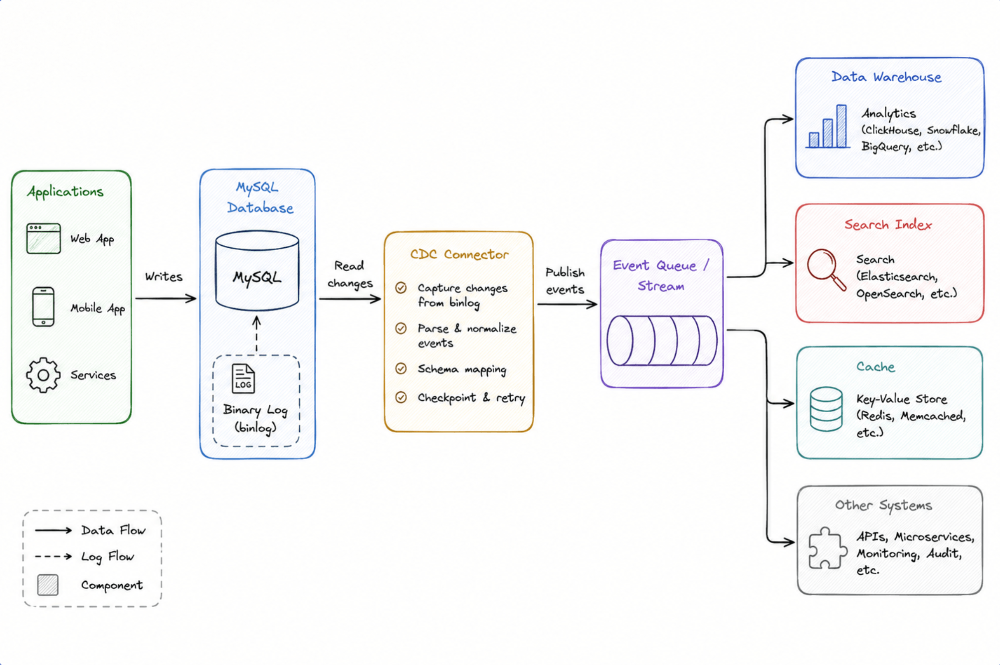
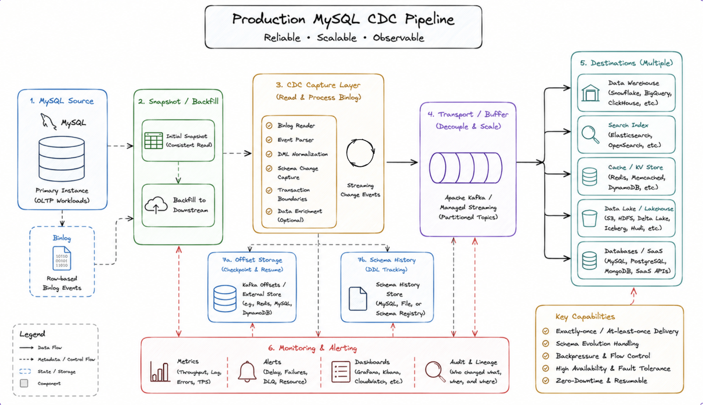

**MySQL CDC (Change Data Capture)** is the process of reading inserts, updates, and deletes from MySQL's binary log so those changes can be delivered to downstream systems in near real time. If you need fresher analytics, lower source-database load, or zero-downtime data movement, MySQL CDC is usually the right pattern because it captures only what changed instead of repeatedly re-querying entire tables.

The harder question is what makes **MySQL change data capture** reliable in production. The answer is not just "turn on binlog." A workable pipeline also needs the right binlog format, an initial snapshot strategy, offset tracking, schema-change handling, backpressure control, and retention planning.

This guide covers all of that in one place:

- what MySQL CDC is
- how MySQL CDC works under the hood
- common CDC methods and why binlog-based CDC usually wins
- production architecture and best practices
- the operational mistakes that cause lag, data loss, or full resyncs

If you are new to the broader pattern, start with our guide on [Change Data Capture (CDC)](change_data_capture_cdc.md). If you are evaluating engines, our comparison of [MySQL CDC vs PostgreSQL CDC](mysql_cdc_vs_postgres_cdc.md) goes deeper on architecture differences.

## What Is MySQL CDC?

MySQL CDC captures data changes from a MySQL database and turns them into a stream of change events that another system can consume.

Instead of running a query like:

```sql
SELECT * FROM orders WHERE updated_at > last_sync_time;
```

every few minutes, a CDC system reads changes from MySQL's internal transaction log. That means downstream systems can react to row-level changes faster and with less waste.

In practice, a MySQL CDC event often contains: the table name, the operation type (`INSERT`, `UPDATE`, or `DELETE`), the row values before and/or after the change, transaction metadata, and the log position or GTID used for recovery and replay.

This is why **mysql cdc** is not just another [ETL](blog/data_insights/etl_steps_explained.md) tactic. It is the foundation for: real-time data replication, operational analytics, event-driven architectures, continuously updated data warehouses, and application-side search and cache synchronization.

## Why MySQL CDC Matters

The main reason teams adopt MySQL CDC is simple: batch syncs create stale data and unnecessary load.

When a warehouse or search index is refreshed every hour, "fresh enough" quickly becomes a business problem. Sales dashboards lag. Fraud systems see old signals. Product catalogs update late. Engineering teams add more incremental SQL jobs, and the system becomes harder to trust.

MySQL CDC fixes that by shipping only committed changes.

### 1. Lower Source Load

The [MySQL binary log](https://dev.mysql.com/doc/refman/8.0/en/binary-log.html) already records data modifications for replication and recovery. Reading from that log is usually less intrusive than repeatedly scanning application tables with timestamp-based queries.

According to the MySQL documentation, the binary log records events describing data changes and is primarily used for replication and point-in-time recovery. That makes it a natural source for CDC pipelines, because the database is already producing the information you need.

### 2. Lower Latency

Polling every 5 or 15 minutes always introduces a floor on freshness. Binlog-based CDC can shrink that delay dramatically because changes are consumed as the log advances.

### 3. Better Consistency Than Ad Hoc Incremental Queries

Timestamp-based sync sounds simple until clocks drift, rows update out of order, or late transactions land outside the query window. CDC systems track log positions rather than hoping query windows line up cleanly.

### 4. Better Fit for Modern Data Architectures

Whether you are feeding Kafka, Snowflake, ClickHouse, Elasticsearch, Iceberg, or caches, CDC creates a reusable stream of truth. That is much easier to standardize than dozens of per-table cron jobs.

## How MySQL CDC Works

At a high level, **MySQL change data capture** works by reading committed changes from the binlog, converting those raw log events into structured records, and sending them to a destination.



Here is the flow in plain English.

### Step 1: A Transaction Commits in MySQL

An application inserts, updates, or deletes rows in MySQL. Once the transaction commits, MySQL records the change in the binary log.

Per the [MySQL 8.0 Reference Manual](https://dev.mysql.com/doc/refman/8.0/en/binary-log.html), the binary log contains events that describe database changes, including table data changes and schema-related operations.

### Step 2: A CDC Reader Connects as a Replication Client

A CDC tool connects to MySQL similarly to a replication consumer. It does not need to lock the source tables for every new change event; instead, it tracks the binlog position and continuously consumes new records.

### Step 3: The Tool Parses Binlog Events

The raw log must be decoded into row-level change events that downstream systems can understand. This is where connector behavior matters. Good CDC tools preserve ordering, transaction boundaries, and delete semantics.

### Step 4: An Initial Snapshot Seeds Existing Data

CDC alone only captures future changes. Most pipelines also need a starting copy of existing rows. That initial load is often called a **snapshot** or **backfill**.

This stage is trickier than many articles admit. If the snapshot and the live stream are not coordinated carefully, you can duplicate rows, miss updates, or create inconsistent downstream state.

The Debezium MySQL connector documentation spends significant detail on snapshot coordination and incremental snapshots, which is a strong signal that snapshot design is one of the real production problems, not a side note.

### Step 5: The Pipeline Tracks Offsets for Recovery

The system stores the last consumed binlog file/position or GTID so it can resume after restarts. Without durable offsets, even a brief outage can turn into a full reload.

## The 3 Main MySQL CDC Methods

If someone searches for "how to do mysql cdc", they usually encounter three patterns.

### 1. Query-Based CDC

This approach periodically queries for rows changed since the last run using timestamps or version columns.

Example:

```sql
SELECT * FROM orders WHERE updated_at > :last_checkpoint;
```

Pros:

- easy to understand
- fast to prototype
- no need for binlog access

Cons:

- misses deletes unless you add extra logic
- depends on reliable timestamps or version columns
- introduces latency by design
- adds read load to source tables
- struggles with exact ordering and replays

This can work for lightweight internal jobs, but it is usually not the best long-term answer for **real-time mysql replication**.

### 2. Trigger-Based CDC

Triggers write changes to shadow tables or audit tables whenever source rows change.

Pros:

- can capture inserts, updates, and deletes
- works even if binlog access is unavailable

Cons:

- adds write-path overhead
- increases operational complexity
- becomes painful across many tables
- still requires downstream transport logic

The Estuary reference article highlights the same drawback: triggers can have a noticeable performance impact and still leave you with the job of building the delivery pipeline.

### 3. Binlog-Based CDC

This is the method most teams mean when they say **MySQL CDC**. It reads changes directly from the binlog.

Pros:

- near real-time
- lower overhead than repeated table scans
- better ordering and replay semantics
- natural fit for replication and streaming pipelines

Cons:

- requires MySQL configuration changes
- needs reliable offset management
- schema evolution and snapshots still require careful handling

For most serious use cases, binlog-based CDC is the strongest option.

## MySQL Binlog Settings That Matter for CDC

A surprising number of broken MySQL CDC setups come down to configuration.

The [Debezium MySQL connector documentation](https://debezium.io/documentation/reference/stable/connectors/mysql.html) recommends these core settings for binlog-based CDC:

```ini
server-id                 = 223344
log_bin                   = mysql-bin
binlog_format             = ROW
binlog_row_image          = FULL
binlog_expire_logs_seconds= 864000
```

Those values are useful beyond Debezium because they reflect the practical needs of most MySQL CDC pipelines.

### `binlog_format=ROW`

Row-based logging is usually the right choice because CDC cares about actual row changes, not just SQL text. Statement-based logging can be ambiguous for non-deterministic operations and harder for downstream systems to replay safely.

### `binlog_row_image=FULL`

This helps CDC tools capture enough information for updates and deletes, especially when downstream systems need the previous state or complete row content.

### `binlog_expire_logs_seconds`

This one is easy to overlook and expensive to ignore. Debezium documents a default value of `2592000` seconds, which equals **30 days**. If your CDC consumer is offline longer than your retention window, old binlogs may be purged before the pipeline catches up. At that point, a full resync is often the only recovery path.

### GTIDs

Debezium also notes that **GTIDs are not strictly required**, but they simplify replication and make it easier to reason about consistency and failover in clustered MySQL environments. If you expect topology changes or failover events, GTID-based recovery is worth serious consideration.

## What a Production-Ready MySQL CDC Architecture Looks Like

A production design usually includes more than just MySQL and a connector. 

Typical components: 1. **MySQL source**, 2. **Snapshot/backfill stage**, 3. **CDC capture layer** that reads binlog, 4. **Transport or buffer** such as Kafka, or a managed streaming layer, 5. **Destination systems** such as warehouses, search engines, caches, or databases, 6. **Monitoring and alerting**, and 7. **Offset and schema history storage**.



This architecture is what enables multiple business outcomes from the same change stream: MySQL to warehouse sync, MySQL to Kafka event streaming, MySQL to search index updates, MySQL to lakehouse ingestion, and MySQL zero-downtime migration.

If your use case is destination-specific, these related guides may help:

- [How to Migrate Data from MySQL to Snowflake: 4 Proven Methods](../tech_share/migrate_data_from_mysql_to_snowflake.md)
- [How to Sync Data From MySQL to Iceberg in Real Time？](../tech_share/mysql_iceberg_sync.md)

## Common MySQL CDC Use Cases

### Real-Time Analytics

CDC keeps operational data available in analytical systems without putting analysts on the production database. This is one of the most common reasons teams implement MySQL CDC.

### Zero-Downtime Migration

You can backfill a target system, keep it synchronized with CDC, validate the data, and cut over when ready. This is a much safer path than exporting a static dump and hoping the downtime window holds.

### Search Index Synchronization

Applications often need product, customer, or catalog data reflected quickly in Elasticsearch or OpenSearch. CDC makes that sync automatic.

### Cache Invalidation and Read Models

If downstream services or caches depend on current state, CDC provides a cleaner pattern than dual writes from application code.

### Event-Driven Applications

MySQL CDC can act as a bridge between transactional systems and event platforms. Instead of rewriting the application first, teams can stream changes out of the database and evolve toward event-driven consumers over time.

## The Hard Parts Most MySQL CDC Articles Skip

This is where teams often get surprised.

### Snapshot Consistency

Initial load is not just a bulk copy. It must line up with the live stream. If the connector snapshots too early or too late relative to streaming offsets, the downstream copy can drift on day one.

### Schema Evolution

Adding a column sounds harmless until the source, CDC connector, and destination disagree about schema timing. Mature CDC pipelines need explicit DDL handling or schema propagation rules.

### Large Transactions

Very large transactions can create lag spikes because the connector may need to process a huge batch before moving on. This is especially visible on high-write tables or bulk update jobs.

### Binlog Retention Risk

If the pipeline is down too long and binlogs are purged, resume may become impossible. Retention settings should be aligned with recovery objectives, not left at defaults without review.

### Failover and Recovery

CDC looks simple when everything is healthy. Production value comes from what happens after a restart, replica switch, connector crash, or destination outage.

### Delete Semantics

Deletes are where many DIY pipelines break. A downstream warehouse or search engine needs to know whether to hard-delete, soft-delete, tombstone, or version records.

## MySQL CDC Best Practices

If you want MySQL CDC to stay boring in production, these are the habits that matter most.

### 1. Prefer Log-Based CDC Over Polling for Critical Pipelines

Polling is fine for small internal syncs. For customer-facing or analytics-critical flows, binlog-based CDC is usually the more dependable long-term design.

### 2. Use Row-Based Logging

This is the practical default for CDC correctness.

### 3. Design Snapshot and Streaming as One System

Do not treat the initial load as an unrelated script. Snapshot correctness directly affects trust in the entire pipeline.

### 4. Track Durable Offsets

Offsets, GTIDs, and schema history should survive restarts and redeploys.

### 5. Monitor Lag and Binlog Retention Together

Lag by itself is not enough. The dangerous question is: "How much retention runway remains before we lose recoverability?"

### 6. Test Schema Changes Before Production Rollout

Run CDC validation for added columns, renamed fields, altered types, and dropped columns.

### 7. Validate Destination Consistency

For high-value pipelines, compare counts, checksums, or business-critical aggregates. Silent drift is worse than loud failure.

## MySQL CDC Tools: Build Yourself or Use a Platform?

There are two broad paths.

### DIY Stack

A common build is MySQL + Debezium + Kafka Connect + Kafka + consumer logic. 

The benefits are flexibility, an open ecosystem, and a good fit for teams already invested in Kafka. On the tradeoff side, however, you get more moving parts, greater operational ownership, and added complexity around monitoring, schema evolution, replay, and incident recovery. 

If you are evaluating options, our guide to the [best CDC tools](blog/data_insights/top_cdc_tool.md) compares common choices.

### Managed or Productized CDC Platform

If your main goal is to move data reliably rather than operate streaming infrastructure, a platform can compress time-to-value. 

[BladePipe](https://www.bladepipe.com/) is designed for this second path, supporting real-time replication across [60+ ecosystems](https://www.bladepipe.com/connector/), including databases, warehouses, queues, and lakehouse-style targets. And **it's free**—so teams implementing MySQL CDC can spend less time assembling connectors and more time validating business outcomes.

Teams choose a platform for MySQL change data capture for practical reasons: unified UI, built-in snapshot and incremental sync, faster destination onboarding, and simplified offset and failure handling—all with far less operational overhead than a self-managed Kafka stack.

For product details, BladePipe's MySQL connection documentation is available here: [MySQL source connection docs](https://www.bladepipe.com/docs/dataMigrationAndSync/connection/mysql-to-mysql/).

## FAQ

### Is MySQL CDC better than polling?

For most production pipelines, yes. CDC is usually lower-latency, less wasteful, and more reliable for ordering and replay. Polling can still be acceptable for simple low-frequency sync jobs.

### Does MySQL CDC affect database performance?

Any additional work has some cost, but reading the binlog is generally lighter than repeated full or incremental table scans. The [MySQL documentation](https://dev.mysql.com/doc/refman/8.0/en/binary-log.html) notes that enabling binary logging makes performance slightly slower, but the replication and recovery benefits usually outweigh that overhead.

### What is the best binlog format for MySQL CDC?

Usually `ROW`. It is the safest default for row-level change capture.

### Can MySQL CDC capture deletes?

Yes, if the CDC method and downstream system are designed to preserve delete semantics. This is one reason log-based CDC is stronger than naive timestamp polling.

### Can I use MySQL CDC for migration?

Yes. It is one of the best patterns for low-downtime or near-zero-downtime migrations because you can keep the target continuously synchronized before cutover.
