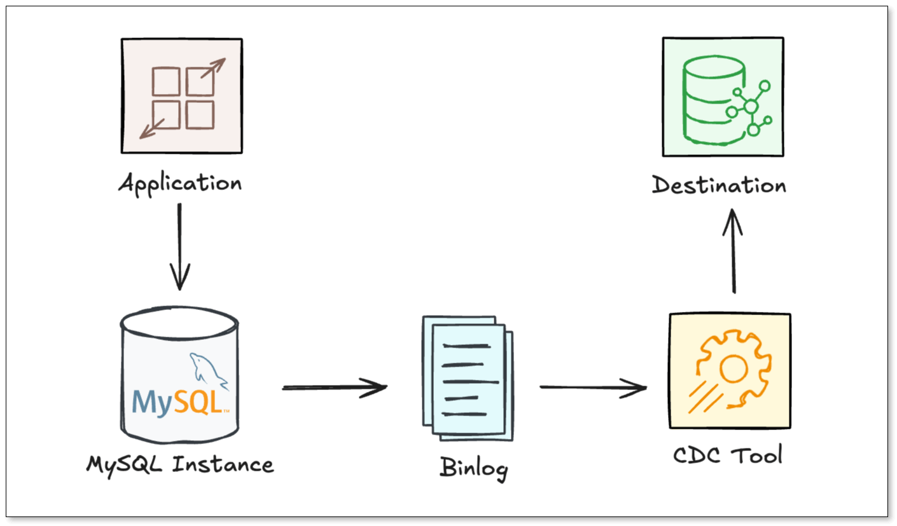
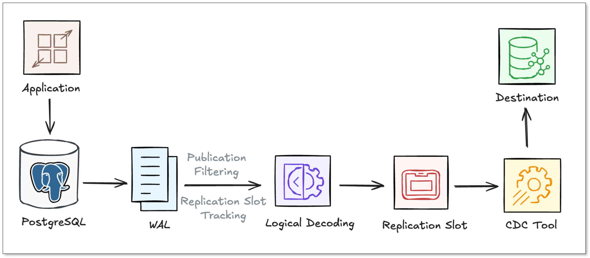

**Change Data Capture (CDC)** has become a core building block of modern data pipelines. Instead of repeatedly querying tables for changes, CDC streams modifications directly from database transaction logs.

But while the concept sounds straightforward, its implementation differs significantly across databases.

Two of the most widely used relational systems—**MySQL** and **PostgreSQL**—both support CDC natively. However, their underlying architectures are quite different. Is reading the MySQL binlog really equivalent to using PostgreSQL logical replication?

In this article, we'll break down how MySQL CDC and PostgreSQL CDC work under the hood, compare their architectures, and explore the operational tradeoffs you may encounter in production.

## TL;DR
+ **CDC (Change Data Capture)** captures database changes directly from transaction logs instead of querying tables repeatedly.
+ **MySQL CDC** works by reading the **binlog**, which records all database modifications.
+ **Postgres CDC** works through **logical replication**, decoding changes from the WAL.
+ MySQL binlog is generally **simpler and widely supported**, while PostgreSQL logical replication is **more structured and flexible**.
+ In production environments, CDC pipelines must handle **schema changes, log retention, and large transactions**.
+ Tools like **BladePipe** automate these complexities and provide reliable CDC pipelines with minimal operational overhead.

## What is CDC in Practice
At its core, **Change Data Capture (CDC)** is a software design pattern that identifies and tracks changes made to data in a database. Instead of "polling" a table every few minutes with a `SELECT * FROM table WHERE updated_at > ...` query, CDC taps into the database's internal transaction logs. 

In modern pipelines, [CDC](https://www.bladepipe.com/blog/data_insights/top_cdc_tool/) is the default when you need:

+ Latency in seconds (or sub-second for critical flows)
+ Lower source load than frequent full/incremental queries
+ Ordered, replayable change events
+ Better lineage and auditability

The magic of CDC is that it is **asynchronous** and **non-intrusive**. It doesn't slow down your application's `INSERT` or `UPDATE` queries because it reads from logs that the database was going to write anyway.

## How MySQL CDC Works
MySQL's approach to CDC centers around the [**binlog** (Binary Log)](https://dev.mysql.com/doc/refman/8.0/en/binary-log.html). The binlog is a set of files that records information about data modifications made to the MySQL server instance. 

### Binlog Formats
When a transaction is committed in MySQL, the engine writes the change to the binlog. Binlog has three formats: 

+ **Statement-Based:** Logs the SQL query itself (e.g., `UPDATE users SET status='active'`). This is not good for CDC because non-deterministic functions (like `NOW()`) can cause inconsistencies.
+ **Row-Based:** Logs the actual data changes for each row. This is the gold standard for CDC as it provides the "before" and "after" state of the data. 
+ **Mixed**: Logs most queries in SQL statements, and switches automatically to row-based format in certain cases.

### The CDC Pipeline
For most effective CDC, MySQL should be configured to use **Row-Based Replication (RBR)**. To enable high-fidelity CDC, you typically need to set:

+ `binlog_format = ROW`: Ensures row-level changes are captured.
+ `binlog_row_image = FULL`: Records both the "before" and "after" images of the row, which is vital for `UPDATE` events.

To create a CDC pipeline, you usually need CDC tools to:

1. Connect to MySQL as a **replication client**
2. Start reading binlog from a specific **offset**
3. Parse row change events
4. Convert them into structured messages

A simplified flow from the source to the destination looks like this:

## How PostgreSQL CDC Works
PostgreSQL handles CDC using a combination of its **Write-Ahead Log (WAL)** and **Logical Decoding**.

### WAL and Logical Decoding
Every change in Postgres is first written to the [**WAL**](https://www.postgresql.org/docs/current/wal-intro.html). While WAL is primarily used for crash recovery and physical replication (byte-for-byte copies), **Logical Decoding** allows us to extract row-level changes from the WAL, and "decoding" them into a logical format (like JSON or Protobuf) via an output plugin.

**Key Components**: 

+ **Logical Replication Slots:** Maintains a "bookmark" (Log Sequence Number or LSN) on the primary server that ensures the WAL files needed by a consumer aren't deleted until they are processed.
+ **Publications:** A grouping of one or more tables whose changes you want to track.
+ **Output Plugins:** Plugins (like `pgoutput`standard in Postgres 10+) that decodes the raw WAL bytes into a readable format for the CDC consumer.

Unlike MySQL, where the binlog is relatively flat, Postgres requires you to explicitly create a **slot** and a **publication**. This provides finer control (table-based change tracking), but it introduces the risk of "WAL bloat" where unconsumed slots can cause WAL growth.

### Logical Replication vs Physical Replication
To understand PostgreSQL CDC, it's important to distinguish between the two ways Postgres moves data. While they both read from the **WAL**, their goals are entirely different.

**Physical Replication** copies database disk blocks to create an exact byte-for-byte replica of the entire database. This is perfect for high availability and disaster recovery, but you cannot pick specific tables or send the data to a different system like Snowflake or Kafka.

[**Logical Replication**](https://www.postgresql.org/docs/current/logical-replication.html), by contrast, decodes WAL records into row-level data changes (e.g., "Row 5 in the `orders` table was updated"). This is the **foundation of CDC**, as it allows for the granular filtering and cross-platform streaming that modern data pipelines require.

### The CDC Pipeline
A typical Postgres CDC pipeline usually goes through the following steps:

1. Postgres writes the change to the **WAL.**
2. The **Publication** acts as a filter, identifying which specific tables and operations are "opted-in" for the CDC stream.
3. A **Replication Slot** maintains LSN to ensure that the WAL files required by the CDC tool are not deleted.
4. A logical decoding **plugin** decodes the raw binary data from the WAL into a structured, row-level format.
5. The **CDC Tool** connects to the replication slot, pulls the decoded stream, and propagates the data to the target destination in real-time.

## MySQL CDC vs PostgreSQL CDC: At a Glance
| **Feature** | **MySQL CDC (Binlog)** | **PostgreSQL CDC (WAL)** |
| --- | --- | --- |
| **Log Source** | Binary Log (binlog) | Write-Ahead Log (WAL) |
| **CDC Mechanism** | Binlog parsing | Logical replication |
| **Setup Complexity** | Simple | Moderate |
| **Retention Policy** | Time/Size based (Auto-delete) | Slot-based (Retain until consumed) |
| **Impact on Source** | Very Low | Moderate (due to slot management) |
| **DDL Support** | Captured in log, requires parser support | Not natively supported in logical replication |
| **Operational Risk** | Binlog retention | WAL growth |
| **Ecosystem** | Mature | Rapidly growing |

## Key Technical Differences
### Log Retention and Disk Risk
In MySQL CDC, the database deletes binlogs based on a retention period (e.g., 7 days). If your CDC tool lags behind for more than 7 days, it will fail, and you’ll need a full resync.

In Postgres CDC, the **Replication Slot** is "sticky." Postgres will keep WAL files forever until the slot reports that it has received the data. While this prevents data loss, it carries a heavy risk: if your CDC consumer stops working, Postgres will continue to accumulate WAL files until the disk is full, potentially crashing the entire database.

### Handling Schema Changes
MySQL's binlog contains DDL statements (like `ALTER TABLE`). Modern CDC tools can parse these and automatically update the target schema.

Postgres's native logical replication does not stream DDL. If you add a column to a Postgres table, the CDC stream won't automatically reflect it unless you use specialized plugins or manual orchestration.

### Impact on Performance
MySQL binlog-based approach is generally "lighter" because it reads from a file that is already being written for replication purposes. 

Postgres logical replication requires the database to perform the decoding work. Additionally, managing replication slots and ensuring WAL logs don't bloat the disk requires more active monitoring from DBAs.

## Operational Tradeoffs in Production
Most “MySQL CDC vs Postgres CDC” comparisons stop at internals. In production, the bigger differences are operational.

### Handling Schema Evolution (DDL)
What happens when you `ALTER TABLE`?

+ **MySQL**: The binlog captures the change, but many CDC tools struggle to map the new schema on the fly.
+ **Postgres**: Logical replication does not natively replicate DDL. If you add a column, the CDC stream might break or skip the new data until the publication is updated.

### Log Retention
+ **MySQL**: MySQL's binlog retention is usually time-based. If your CDC tool stays down longer than your retention period (e.g., 3 days), you lose data and must perform a full snapshot again.
+ **Postgres**: If your CDC tool goes down, the Replication Slot will prevent the primary database from deleting old WAL files. If left unchecked, your database disk will fill up, causing a total production outage.

### Large Transactions
In production, CDC pipelines often encounter **large transactions**, which are hard to handle.

+ In **MySQL**, these are serialized in the binlog, so a CDC tool may get stuck processing a single massive event, causing significant replication lag. 
+ **PostgreSQL** can be even more sensitive: logical decoding must reconstruct the entire transaction, and if it exceeds `logical_decoding_work_mem`, it spills to disk, creating heavy I/O and CPU pressure on the primary database.

## How BladePipe Simplifies CDC
Building a DIY CDC pipeline usually involves setting up Kafka, Zookeeper, Debezium, and a fleet of connectors. This manual approach is brittle and hard to monitor.

[**BladePipe**](https://www.bladepipe.com/) simplifies this by providing a professional, end-to-end CDC platform that handles schema changes, data verification, auto failover recovery, and other workloads. It turns the complexities of [**MySQL CDC**](https://www.bladepipe.com/docs/dataMigrationAndSync/connection/mysql2/) and [**PostgreSQL CDC**](https://www.bladepipe.com/docs/dataMigrationAndSync/connection/postgresql2/) into a "plug-and-play" experience.

+ **Zero-Downtime Setup**: Automatically handles initial snapshots and seamlessly transitions to incremental CDC.
+ **Automatic DDL Sync**: Seamlessly handles schema changes so your downstream tables always stay in sync.
+ **Ultra-low Latency**: Sub-second latency for high-volume data streaming to 40+ targets (ClickHouse, Kafka, DynamoDB, etc.).
+ **Unified Management**: Captures changes from MySQL and Postgres using the same intuitive visual interface.
+ **Security**: Operates within your private network; no need to expose your production DB to the public internet.
+ **Disaster Recovery**: Tracks offsets and ensures reliable recovery after failures; supports resuming from where it stops.

Instead of spending weeks writing custom scripts to handle PostgreSQL replication slots or MySQL binlog offsets, BladePipe allows you to create a production-ready pipeline in minutes via a visual interface.

## Wrapping Up
Both **MySQL CDC** and **Postgres CDC** provide powerful mechanisms for capturing database changes in real time. However, building reliable CDC pipelines involves much more than simply reading logs. Production systems must deal with schema evolution, failover, log retention, and data consistency. That's why many teams choose a dedicated CDC platform.

Whether you are syncing from the "Dolphin" or the "Elephant", BladePipe ensures your data flows smoothly, reliably, and in real time.

Ready to simplify your data replication? [Start to use BladePipe for free.](https://www.bladepipe.com/pricing/)

## FAQ
**Q: Is MySQL CDC faster than Postgres CDC?**

Not universally. Performance depends more on write patterns, connector design, batching, and destination throughput than on source engine alone. In many real systems, both can meet sub-10-second targets when tuned properly.

**Q: Is Postgres CDC harder to operate?**

It can be if replication slots are not monitored closely, because stalled consumers can retain WAL and consume disk rapidly. With clear slot lag alerts and automated remediation, Postgres CDC can be highly reliable.

**Q: Can I filter specific tables?**

Yes. PostgreSQL handles this via Publications. In MySQL, filtering is typically handled by the CDC tool itself (like BladePipe) after reading the binlog.

**Q: Can one pipeline platform support both MySQL CDC and Postgres CDC?**

Yes. That is usually the best approach for mixed environments. A unified layer like BladePipe helps standardize observability, transformations, and recovery workflows across engines.

> **Suggested Reading:**
>+ [SQL Server Change Data Capture](https://www.bladepipe.com/blog/data_insights/sql_server_change_data_capture/)
>+ [7 Best CDC Tools in 2026](https://www.bladepipe.com/blog/data_insights/top_cdc_tool/)

