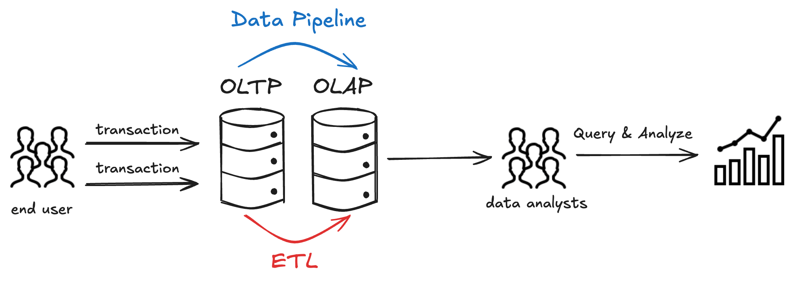

If you search for “OLAP vs OLTP”, you’ll find countless explanations.

Most of them repeat the same ideas: *OLTP handles current data, OLAP handles historical data; OLTP is fast, OLAP is complex.*

The problem is that these descriptions don’t really explain **why** the two behave differently.

This article takes a different approach. Instead of starting with abstract definitions, we’ll focus on **what actually happens under the hood**:
what kinds of queries are executed, how data is stored, and why certain workloads perform well—or very poorly—on one system versus the other.

## What Is OLTP? (Online Transaction Processing)
OLTP systems are built to handle **day-to-day operations**.

Think of actions like placing an order, updating inventory, or recording a payment.

### Key Features of OLTP Systems
An OLTP workload usually looks like this:
- Read or modify **a small number of rows**
- Use a **primary key or index** to find data quickly
- Perform **many operations per second**
- Guarantee **atomicity and consistency** (no partial updates)

A typical query might be:
- Insert one row
- Update one row
- Fetch one row by ID

These operations are small, frequent, and must finish quickly.

### Typical OLTP Use Cases
- E-commerce order processing
- Banking and payment systems
- Inventory and logistics systems
- User authentication and account management

In all of these cases, the system must respond immediately and correctly.

If a transaction is slow or fails halfway, users notice—and business breaks.

## What Is OLAP? (Online Analytical Processing)
OLAP systems are designed for **analysis**, not operations.

Instead of focusing on individual records, OLAP focuses on **patterns across large volumes of data**.
### Key Features of OLAP Systems
An OLAP workload usually looks very different:
- Scan **many rows at once**
- Read **only a few columns**
- Perform **aggregations** (SUM, COUNT, AVG, GROUP BY)
- Run **fewer queries**, but each query touches much more data

A typical query might be:
- “What was the total revenue by region last quarter?”
- “What is the average order value across 50 million transactions?”

These queries are heavier, but they don’t need to update data row by row.
### Typical OLAP Use Cases
- Business intelligence and reporting
- Sales and marketing analysis
- Financial forecasting
- Trend analysis and dashboards

Here, speed still matters—but **scanning efficiency** matters more than single-row latency.
## Key Differences Between OLAP and OLTP
At a high level, OLTP and OLAP solve different problems.

The real difference becomes clear when you look at **how data is accessed and modified**.

| Dimension | OLTP | OLAP |
|-----------|------|------|
| **Primary goal** | Process day-to-day business transactions | Analyze data to support reporting and decision-making |
| **Query pattern** | Many short, simple queries | Fewer but large and complex queries |
| **Data access pattern** | Targets specific rows, often by primary key | Scans large numbers of rows to aggregate data |
| **Write operations** | Frequent inserts and updates | Rare updates, often handled in batches |
| **Read operations** | Small result sets, usually single-row or few-row reads | Large result sets with aggregations and groupings |
| **Data freshness** | Current, real-time operational data | Mostly historical or periodically refreshed data |
| **Data characteristics** | Detailed, discrete, transaction-level records | Aggregated, integrated, multi-dimensional data |
| **Storage orientation** | Row-oriented storage optimized for fast point lookups | Often column-oriented storage optimized for scans and aggregations |
| **Data model** | Highly normalized schemas | Denormalized schemas (e.g., star or snowflake) |
| **Performance focus** | Low latency and high concurrency | High throughput for analytical workloads |
| **Data volume** | Relatively small compared to analytical systems | Very large, commonly ranging from TBs to PBs |
| **Time requirements** | Strong real-time processing requirements | Less strict latency requirements, based on business needs |
| **Typical users** | Applications and end users | Data analysts, BI tools, and decision-makers |

This table is useful—but it still doesn’t answer the most important question:

**Why do these differences exist?**

## Why OLTP and OLAP Behave So Differently
The key reason comes down to **what you touch when you run a query**.
### OLTP: Optimized For Rows
In an OLTP system, queries usually target **one specific row**:
- Update invoice `#12345`
- Deduct 1 item from inventory
- Mark an order as paid

Row-oriented storage works well here because:
- All data for one record is stored together
- The database can quickly locate a row using indexes
- Updating a single value only touches a small amount of data

This makes OLTP systems very efficient **for frequent, small changes**.
### OLAP: Optimized For Columns
In OLAP queries, you usually don’t care about individual rows.

Instead, you care about:
- One column across **millions of rows**
- Aggregations like sums and averages

Column-oriented storage is powerful here because:
- Values from the same column are stored together
- The engine can read only the columns it needs
- Compression works better on similar data

This means an OLAP system can scan and aggregate massive datasets efficiently.

But there’s a trade-off.
### Why OLAP Is Bad at Transactions
Imagine updating a single row in a column-oriented system.

That update may require:
- Reading large chunks of column data
- Rewriting data blocks
- Updating metadata or versioned files

What is cheap in a row store becomes **expensive in a column store**.

That’s why transactional workloads perform poorly on OLAP systems—and why mixing heavy transactions and analytics in one system often causes problems.
## Real-World Examples of OLTP vs OLAP
### OLTP Example: E-commerce Order Processing
A customer places an order:
1. Insert a new order row
2. Update inventory quantity
3. Record payment status

Each step:
- Touches a few rows
- Must be fast
- Must succeed or fail as a unit

This is exactly what OLTP systems are built for.

### OLAP Example: Sales Performance Analysis Across Regions
A business analyst asks:
- “What were total sales by region over the past 12 months?”

This query:
- Scans millions of order records
- Reads only a few columns (amount, region, date)
- Aggregates results

Running this directly on a transactional system can slow down order processing.

Running it on an OLAP system is far more efficient.
## When Should You Use OLTP and OLAP? 
### When Should You Use OLTP?
Designed to handle **high-concurrency, low-latency day-to-day business transactions**, with a focus on fast and reliable reads and writes on individual or small sets of records.
### Typical Scenarios Include:
- Order creation and payment processing
- User registration and authentication
- Inventory updates and real-time status changes
### Why OLTP Fits These Use Cases:
- Frequent inserts, updates, and deletes
- Short, atomic transactions
- Strong consistency and fast response times

**In short:** Use OLTP when your system needs to run the business in real time.
### When Should You Use OLAP?
Designed to support **complex queries, historical analysis, and decision-making**, with a focus on extracting trends, patterns, and insights from large volumes of data.
### Typical Scenarios Include:
- Business intelligence dashboards
- Sales, marketing, and finance analysis
- Trend analysis and forecasting
### Why OLAP Fits These Use Cases:
- Large-scale, read-heavy workloads
- Complex queries across many rows and columns
- Optimized for aggregation and analytical performance

**In short:** Use OLAP when your system needs to understand the business.

In practice, most organizations use both OLTP and OLAP systems as part of a single data architecture.

OLTP systems handle real-time operations.

OLAP systems handle analysis and reporting.

The challenge is not choosing one or the other—**it’s connecting them effectively**.

## Bridging OLTP and OLAP with Real-Time Data Pipelines
Data typically flows **from OLTP systems into OLAP systems** for analysis.

Traditionally, this was done using batch ETL jobs: 
- Run once per day
- High latency
- Complex to maintain

As businesses move toward real-time analytics, this approach becomes a bottleneck.

Modern data pipelines aim to:
- Stream changes as they happen
- Reduce latency between operations and insights
- Keep analytical systems up to date without impacting OLTP performance

Tools like **[BladePipe](https://www.bladepipe.com/)** are designed for this purpose.

They enable real-time data pipelines between OLTP and OLAP systems, reducing the need for heavy batch ETL and allowing each system to focus on what it does best.

BladePipe is a **[real-time data pipeline platform](https://www.bladepipe.com/docs/intro/product_intro/)** that moves data from transactional databases (like PostgreSQL, MySQL, SQL Server) to analytics systems (such as Redshift, ClickHouse, Doris) in real time.

It replaces nightly batch ETL jobs with continuous Change Data Capture (CDC), streaming inserts, updates, and deletes as they happen. This ensures low-latency sync and keeps your analytics fresh.

Key features:
- Real-time CDC pipelines with low latency
- Schema-aware data integrity across databases
- Supports managed [SaaS](https://www.bladepipe.com/docs/quick/quick_start_mgr/), [BYOC](https://https://www.bladepipe.com/docs/quick/quick_start_byoc/), and [on-premise](https://www.bladepipe.com/docs/quick/quick_start/) deployment

If you want to explore real-time data synchronization between transactional and analytical systems, you can [try BladePipe’s free trial](https://www.bladepipe.com/login/) to see how it fits into your architecture.

If you want to see how this works in practice, here are a few examples of moving data from OLTP to OLAP systems using BladePipe:

- [Move data from Oracle to ClickHouse](https://www.bladepipe.com/blog/tech_share/oracle_clickhouse_sync/)

- [Move data from MySQL to StarRocks](https://www.bladepipe.com/blog/tech_share/mysql_starrocks_sync/)

- [Move data from MySQL to ClickHouse](https://www.bladepipe.com/blog/tech_share/mysql_clickhouse_sync/)

## Popular OLTP and OLAP Databases
### Common OLTP Database Examples
- MySQL
- PostgreSQL
- SQL Server
- Oracle
- MariaDB

These systems are optimized for transactional workloads and strong consistency.
### Common OLAP Database Examples
- Snowflake
- BigQuery
- Redshift
- ClickHouse
- StarRocks
- Greenplum

These systems are optimized for large-scale analytical queries and column-based processing.

## FAQs
**What is the difference between OLAP and OLTP?**

OLTP focuses on fast, atomic operations on individual rows, while OLAP focuses on analyzing large volumes of data through scans and aggregations.

**Is SQL Server OLAP or OLTP?**

SQL Server is primarily an OLTP database, but it can also support analytical workloads, especially when used with analytical schemas or extensions.

**Is Snowflake OLAP or OLTP?**

Snowflake is an OLAP-oriented system, optimized for analytical queries on large datasets rather than high-frequency transactional updates.