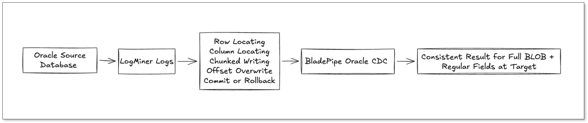
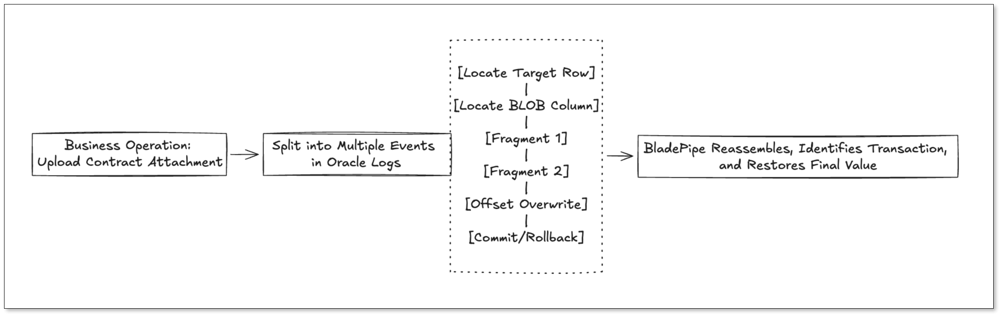
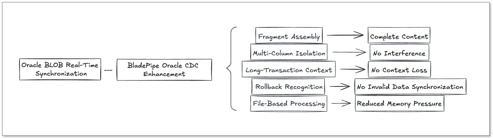

If your Oracle database stores contracts, scanned invoices, images, or application attachments in `BLOB` columns, sooner or later you'll face the same question:

How do you replicate those large objects in real time without breaking consistency?

At first glance, Oracle BLOB synchronization looks like a normal CDC problem. But in production, it is much more demanding than syncing ordinary columns. If the pipeline mishandles large objects, the result may look successful while the target already contains corrupted files, incomplete content, or data from rolled-back transactions.

That is why **Oracle BLOB CDC** is not just about moving binary data. It is about reconstructing the final committed value of a large object from fragmented log events while preserving transaction semantics.

In this article, we'll walk through the **five core technical challenges behind Oracle BLOB replication**, and explain what a production-ready CDC pipeline must do to handle them safely.

## TL;DR

+ **Oracle BLOB changes are not logged like ordinary row updates.** A single business update may appear as multiple low-level log events that must be reassembled correctly.
+ **Fragment order, column ownership, and offset-based writes all matter.** Simple concatenation is not enough to rebuild the final BLOB value.
+ **Long transactions make BLOB CDC harder.** Context may span multiple LogMiner windows, so the pipeline must retain transaction state across reads.
+ **Rollback handling is critical.** If uncommitted BLOB data reaches the target too early, source and target will diverge silently.
+ **Large-object replication must balance correctness and stability.** A practical design needs transaction awareness plus resource-safe buffering for large binary payloads.

## A Typical Oracle BLOB Sync Scenario

Imagine an enterprise application that stores contract originals, invoice images, and approval attachments in Oracle `BLOB` columns.

When a user uploads a new contract, the application may do all of the following in a single transaction:

+ Update the attachment content
+ Change the contract status
+ Write approval metadata
+ Update multiple BLOB columns at once

From the application's point of view, this is a normal transaction.

From Oracle's log perspective, however, the BLOB update may not appear as one clean `UPDATE` event. Instead, the CDC pipeline may need to interpret multiple lower-level operations: row location, column location, fragment writes, offset-based overwrites, and finally transaction commit or rollback.

If a sync system simply forwards raw log events downstream, several things can go wrong:

+ The contract status is replicated, but the file content is incomplete
+ Fragments from one BLOB column are written into another
+ A rolled-back attachment still appears on the target

This is the real difficulty of **real-time Oracle BLOB replication**: the target must reflect the source's **final committed result**, not an intermediate log sequence.

## Why Oracle BLOB CDC Is Different from Normal CDC

For ordinary columns, CDC usually looks like a row-level change with a relatively clear before/after state.

`BLOB` columns are different. A single business update can be split into multiple log fragments. To reconstruct the actual result, the CDC engine must understand:

+ Which fragments belong to the same BLOB object
+ Which table, row, and column each fragment belongs to
+ The correct write order and offset semantics
+ Whether the transaction ultimately committed or rolled back
+ How to buffer and assemble large objects without exhausting resources

So the real test is not whether a tool can "transfer a file." It is whether the entire **Oracle CDC pipeline** can preserve **log context, transaction semantics, rollback safety, and final-value reconstruction** for large objects.

## Challenge 1: Reassembling Fragmented BLOB Writes

Oracle BLOB changes may be split across multiple log fragments. If the pipeline misses one fragment or assembles them in the wrong order, the target may end up with a file that cannot be opened or whose contents differ from the source.

This is why BLOB CDC is not just a matter of appending chunks together. The pipeline must identify all events that belong to the same large object and rebuild them according to Oracle's logging semantics.

In practice, that means the CDC system needs to preserve BLOB assembly inside the **transaction context**, so the downstream side receives the full final payload instead of a partial intermediate state.

## Challenge 2: Isolating Multiple BLOB Columns and Offset Writes

Real systems often update more than one BLOB column in the same transaction. A table may contain a contract file, an ID scan, and an approval attachment, all stored as separate large objects.

That creates multiple groups of BLOB fragments inside one transaction. If the pipeline cannot distinguish them precisely, fragment contamination becomes possible:

+ Content from file A is written into column B
+ Fragments from one row are mixed into another row
+ Multiple BLOB columns overwrite each other

The problem is even harder when Oracle logs **offset-based writes**. In those cases, the final value is not simply the concatenation of all fragments in arrival order. The CDC engine must apply writes at the correct position to reproduce the source-side result.

For production safety, BLOB state needs to be isolated by **transaction, table, row, and column**, with write operations replayed using the correct offset rules.

## Challenge 3: Preserving Context Across Long Transactions

Oracle CDC pipelines often rely on LogMiner to parse redo and archive logs continuously. In large business systems, long transactions are common. A transaction may stay open for minutes or even hours.

That is already challenging for ordinary CDC. For BLOB columns, it is even riskier because BLOB reconstruction depends heavily on context.

The transaction start, BLOB locator information, fragment writes, and the final commit or rollback may all appear in different LogMiner parsing windows. If the pipeline only resumes from the previous read position without retaining the necessary state, it may lose the context needed to interpret later fragments correctly.

That can lead to several failures:

+ Later fragments cannot be mapped to the right BLOB column
+ Earlier locator information disappears before the transaction finishes
+ Rolled-back large objects are mistaken for committed ones

Any robust **Oracle LogMiner BLOB replication** design needs explicit transaction-state retention across parsing windows.

## Challenge 4: Preventing Rolled-Back BLOB Data from Reaching the Target

Many data-consistency failures do not happen at commit time. They happen at rollback time.

Suppose a user uploads an attachment, but a validation rule fails later in the same transaction. Oracle rolls back the entire operation. From the source database's perspective, the attachment never existed.

But if the CDC pipeline already pushed the BLOB content downstream before the transaction outcome was known, the target now contains invalid data that the source never committed.

This is why **transaction-aware CDC** is mandatory for large objects. BLOB data should only be released downstream after the pipeline confirms that the transaction committed successfully. If the transaction rolls back, any cached fragments or temporary files must be discarded cleanly.

Without this safeguard, **Oracle BLOB synchronization** can produce subtle and persistent data drift.

## Challenge 5: Handling Large Objects Without Sacrificing Stability

BLOB data is often much larger than ordinary columns. A single field may contain a multi-megabyte image, a large scanned document, or a business file tens or hundreds of megabytes in size.

If the CDC engine holds too much of that data in memory, memory growth and garbage-collection pressure can destabilize the entire sync task.

That means BLOB replication is not only a correctness problem. It is also a runtime stability problem.

A practical implementation usually needs:

+ Resource-aware buffering for large payloads
+ Temporary persistence during assembly
+ Cleanup logic for rolled-back or abandoned objects
+ Stable long-running behavior under sustained traffic

One common approach is to assemble BLOB fragments in temporary files rather than keeping the entire payload in memory. After the transaction commits, the completed object can be written to the destination. If the transaction rolls back, the temporary artifacts are removed.

This design reduces memory pressure while preserving correctness for large binary objects.

## What This Means for Oracle CDC Tool Selection

If you're evaluating a tool for **Oracle BLOB real-time replication**, it is not enough to ask whether the product "supports BLOB."

The real questions are:

+ Does it capture changes directly from Oracle logs rather than relying on application-side compensation?
+ Can it reconstruct fragmented LOB writes correctly?
+ Does it isolate multiple BLOB columns and rows within the same transaction?
+ Can it preserve long-transaction context across parsing windows?
+ Does it enforce commit/rollback semantics before delivering data downstream?
+ Can it process large objects without destabilizing the pipeline?

These are the capabilities that determine whether the target reflects the true committed state of the source.

## How BladePipe Helps with Oracle BLOB Replication

At [BladePipe](https://www.bladepipe.com/), we treat BLOB handling as part of the CDC engine itself rather than as an afterthought layered on top of generic row replication.

For Oracle workloads that include large objects, the goal is straightforward: keep the complexity inside the replication pipeline so downstream systems receive trustworthy data with less custom engineering.

That means focusing on:

+ Transaction-aware BLOB handling
+ Fragment assembly within the correct context
+ Isolation across tables, rows, and columns
+ Safer rollback processing
+ Stable execution for large binary payloads

If your broader goal is Oracle migration or continuous replication to another system, you may also want to read our guide to [Oracle CDC](oracle_change_data_capture.md).

## When This Matters Most

These issues matter most in environments where Oracle stores business-critical binary objects and the downstream copy must stay consistent over time.

Typical examples include:

+ Real-time replication of contracts, invoices, images, scans, and application attachments
+ Oracle migration projects that include `BLOB` or `CLOB` columns
+ Disaster recovery pipelines that must preserve committed large-object state
+ High-consistency systems in finance, government, manufacturing, or healthcare
+ Workloads with long transactions, multi-column updates, or frequent rollbacks

In these scenarios, BLOB support is not a checkbox feature. It is a core data-consistency requirement.

## Conclusion

Oracle BLOB CDC is hard because it is not just about moving binary data from one database to another.

To replicate BLOBs correctly, a CDC pipeline must continuously handle **fragment assembly, multi-column isolation, long-transaction context, rollback safety, and large-object resource control**. Only then can the target approach the true final committed state of the Oracle source.

That is the real standard for **production-grade Oracle BLOB replication**.

If your Oracle environment includes attachments, document images, invoice scans, or other large objects, make sure your CDC design is evaluated against these deeper requirements, not just a marketing claim that it "supports BLOB."
