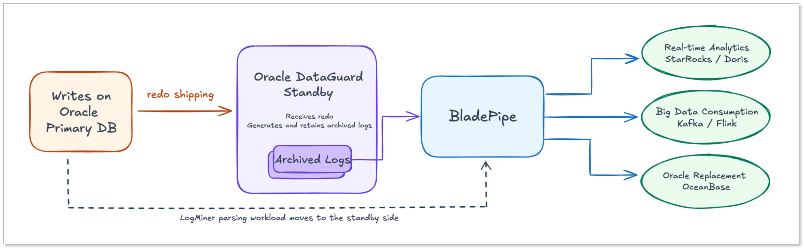
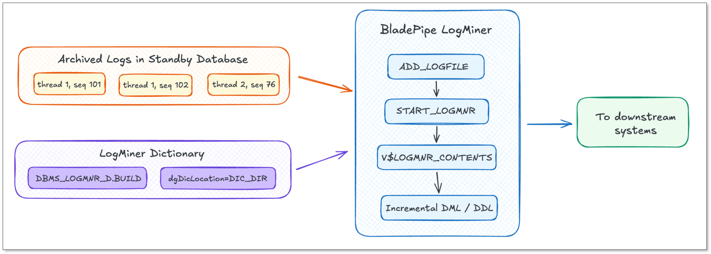

In [Oracle](https://www.bladepipe.com/connector/oracle/) real-time data replication, the simplest setup is often to connect directly to the production primary database.

It works well when the data volume is small, the number of tables is limited, and there are only a few replication jobs. The path is short. The setup is straightforward. Latency is easier to control.

But production environments are rarely that simple.

For core systems such as CRM, ERP, order management, inventory, and finance, the Oracle primary database is already handling heavy business traffic. Adding a long-running CDC job on top of it may introduce extra overhead, especially when LogMiner is used to parse redo logs.

That is why more teams are asking a practical question:

**Can we read Oracle changes from a DataGuard standby database instead of the primary database?**

The answer is yes.

And in many production scenarios, it is a safer architecture.

## Why Avoid Reading CDC Directly from the Primary Database?

[Oracle CDC](https://www.bladepipe.com/blog/data_insights/oracle_change_data_capture/) pipelines often need to run 24/7.

They may support [real-time analytics](https://www.bladepipe.com/blog/tech_share/oracle_clickhouse_sync/), risk control, operational dashboards, [data lake ingestion](https://www.bladepipe.com/blog/tech_share/migrate_oracle_to_snowflake/), or continuous replication during database migration. These jobs are not short-lived batch tasks. They sit beside the production database and continuously read changes.

When the data replication platform [BladePipe](https://www.bladepipe.com/) uses Oracle as a source, it relies on Oracle LogMiner to read redo logs, start LogMiner sessions, query `V$LOGMNR_CONTENTS`, and use dictionary information to decode objects, columns, and data types.

This process brings additional work to the database side.

During business peaks, large transactions, frequent table changes, or RAC environments with multiple redo threads, LogMiner may add CPU, I/O, and dictionary parsing overhead. For a busy Oracle primary database, even a small amount of extra pressure needs to be evaluated carefully.

This is especially true for mission-critical systems. Transaction systems care about stability more than anything else. Any additional component connected to the primary database may become a concern for DBAs.

So the real challenge is not just whether Oracle CDC works.

It is whether the CDC pipeline can stay reliable without affecting the production primary database.

That is where Oracle DataGuard becomes useful.

## Moving Oracle CDC Workloads to a DataGuard Standby

The idea is simple:

**Business writes still happen on the primary database, but redo parsing is moved to the standby database.**

The primary database continues to handle application traffic. Redo data is shipped to the DataGuard standby database. The standby receives redo, generates and retains archived logs, and becomes the place where the replication tool reads changes.

BladePipe can connect to the standby database, read the archived logs available on the standby side, use LogMiner dictionary files to decode incremental changes, and then write the data to downstream systems such as Kafka, Flink, StarRocks, Doris, OceanBase or a data lake.

In this architecture, the long-running parsing workload is moved away from the primary database.



For DBAs, this means the CDC job no longer consumes LogMiner parsing resources on the production primary. The primary database stays cleaner and more isolated.

For data teams, the standby database still receives changes from the primary, so downstream systems can continue to get near real-time data.

It is a better balance between production stability and data freshness.

## The Hidden Challenges of Reading CDC from a Standby Database

Switching Oracle CDC from the primary database to a DataGuard standby database is not just changing a connection string.

There are several technical details that need to be handled carefully.

BladePipe has supported Oracle DataGuard standby replication in real production environments. Below are some of the common challenges and how BladePipe handles them.

### How to Read Archived Logs Reliably?

In a DataGuard setup, BladePipe reads incremental changes based on **archived logs** visible on the standby database.

Compared with online redo logs, archived logs are already persisted to disk. Their SCN ranges are clear, which makes them more stable for CDC consumption.

For this reason, BladePipe uses an **Archive-only mode** in Oracle DataGuard standby scenarios. It reads only the archived logs available on the standby side. This helps reduce uncertainty during log switches and makes the replication process more predictable.

The challenge becomes more complex in Oracle RAC.

Oracle RAC may have multiple redo threads. Each thread has its own sequence numbers. If these logs are not merged and parsed in the correct order, the replication task may read duplicate data, miss changes, or fail to cover one of the redo threads correctly.

BladePipe handles this by merging archived logs based on thread and sequence. It also checks log ranges to avoid repeated parsing or missing redo from a specific thread.

This is critical for production-grade Oracle CDC.

### What If the Standby Has Multiple Archive Destinations?

A DataGuard standby database may have more than one local archive destination.

The default archive path may not contain all logs needed by the replication task. If a CDC tool only watches one directory, it may fail to find logs after log switches, retention changes, or archive policy adjustments.

BladePipe supports the `archiveDestName` parameter, which allows users to specify one or more archive destinations explicitly.

For example:

```plain
archiveDestName=LOG_ARCHIVE_DEST_2
archiveDestName=LOG_ARCHIVE_DEST_1,LOG_ARCHIVE_DEST_2
```

This gives the replication task a clear view of where to read archived logs.

For environments with multiple local archive paths, this reduces the risk of path mismatch and improves task stability.

### How to Keep the LogMiner Dictionary Stable?

LogMiner needs dictionary information to decode redo records.

Without a stable dictionary, object IDs in redo cannot be reliably mapped back to table names, column names, and data types.

In a standby database environment, dictionary stability becomes even more important. If the dictionary source changes unexpectedly, or if DDL changes are not reflected in time, LogMiner output may no longer match the real table schema.

To avoid this, BladePipe uses a **Flat File dictionary** in Oracle DataGuard standby mode.

The dictionary file is generated through `DBMS_LOGMNR_D.BUILD`, and LogMiner uses this file when parsing redo data.

This has two benefits.

First, the dictionary source becomes explicit and predictable. Second, LogMiner parsing is less affected by changes in the online dictionary, which makes it more suitable for standby-based CDC.



However, there is still one more problem.

If DDL happens frequently on the source database, there may be a short gap between the actual schema change and the next dictionary refresh.

BladePipe handles this by supporting scheduled dictionary generation. Users can build dictionaries at fixed time points or at hourly intervals. BladePipe also maintains table schema information inside the replication task to help restore LogMiner output correctly.

For example:

```plain
oraBuildRedoDicStrategy=INTERVAL_HOUR
oraBuildDicValue=4
```

With this design, even if dictionary refresh has a short delay, incremental data can still be decoded correctly.

### How to Recover After a Task Interruption?

A long-running CDC pipeline must be able to recover.

Network issues, task upgrades, downstream failures, archive delays, or temporary database problems may all interrupt the replication job.

A production-ready standby replication pipeline needs to know exactly which SCN has been consumed. It also needs to restart from the correct position after an exception.

BladePipe records the consumed SCN and resumes from the checkpoint after task restart.

It also checks the starting SCN and RAC multi-thread log ranges. If archived logs are not continuous, BladePipe reports a clear error instead of silently skipping the problem.

This matters a lot. Silent skipping is dangerous in CDC. It may create data inconsistency that is hard to notice until much later.

With checkpoint recovery, archive continuity checks, data verification, data correction, and task alerts, a DataGuard-based CDC pipeline becomes much easier to operate in production.

## When Should You Consider Oracle DataGuard Standby CDC?

Reading Oracle CDC from a DataGuard standby database is especially useful when:

* The Oracle primary database is highly sensitive to additional workload.
* The CDC pipeline needs to run 24/7.
* There are many downstream consumers.
* The system supports real-time analytics, data lake ingestion, or operational reporting.
* The team is migrating from Oracle to another database and needs continuous incremental replication.
* The environment uses Oracle RAC and requires careful redo thread handling.
* The DBA team wants to isolate replication workload from the production primary.

It may not be necessary for every Oracle replication job.

For smaller environments, direct primary connection can still be the simplest option. But as the workload grows, moving redo parsing to a standby database gives teams more room to protect the primary system.

## Final Thoughts

Oracle DataGuard is often treated as a disaster recovery resource.

But it also works for real-time data replication.

By reading archived logs from the standby database, teams can reduce long-running parsing pressure on the production primary while still delivering fresh data to downstream systems.

The key is implementation.

A reliable Oracle standby CDC solution must handle archived log reading, RAC thread merging, archive destination configuration, LogMiner dictionary management, DDL changes, checkpoint recovery, and data consistency checks.

[BladePipe](https://www.bladepipe.com/login/) is designed to support these production requirements.

If your Oracle CDC pipeline is putting pressure on the primary database, or if you are planning an Oracle migration that needs stable continuous replication, DataGuard standby replication is worth considering.

## FAQ

**Q: Can Oracle CDC read from a DataGuard standby database?**

Yes. Oracle CDC can read changes from a DataGuard standby database if the replication tool supports standby-side archived log reading and LogMiner-based parsing. In this setup, the primary database continues to handle business writes, while the CDC pipeline reads archived logs from the standby database.

**Q: Why use Oracle DataGuard for CDC instead of reading from the primary database?**

Reading CDC directly from the Oracle primary database is simple, but it may add CPU, I/O, and LogMiner parsing overhead to a system that is already handling business traffic.

Using a DataGuard standby database allows teams to move the CDC workload away from the primary database. This is especially useful for core systems such as CRM, ERP, finance, order management, and inventory systems, where database stability is critical.

**Q: Does reading CDC from a standby database affect replication latency?**

It may add a small delay compared with reading directly from the primary database, because redo needs to be shipped from the primary database to the standby database first.

In many production scenarios, this trade-off is acceptable. Teams get better isolation for the primary database while still maintaining near real-time data replication for analytics, data lake ingestion, reporting, or migration use cases.

**Q: When should I consider Oracle DataGuard standby CDC?**

You should consider Oracle DataGuard standby CDC when your primary database is sensitive to extra workload, your CDC pipeline needs to run 24/7, or your downstream systems require continuous data updates.