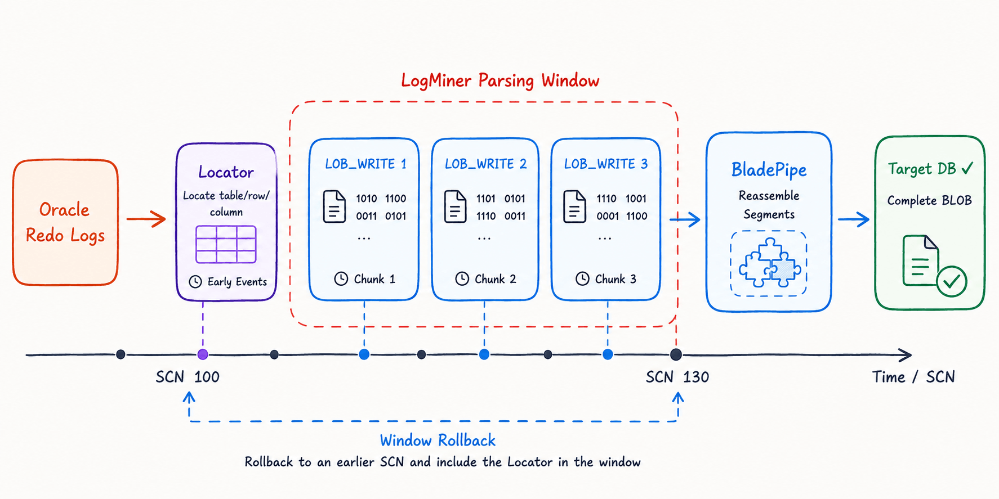
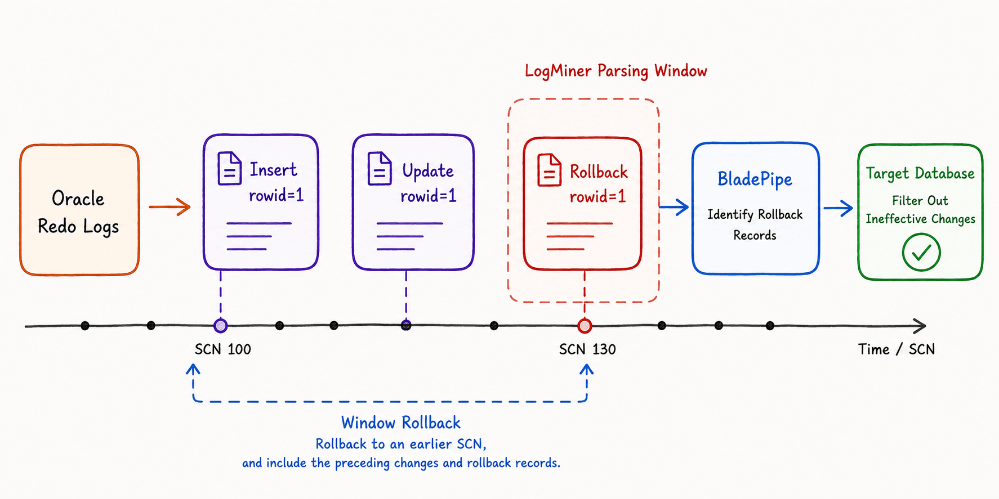

Data inconsistency in [Oracle CDC](/blog/data_insights/oracle_change_data_capture.md) can have many causes, but **long-running transactions** are among the most difficult to diagnose.

A single transaction may span multiple LogMiner sessions. A large SQL statement can be split into multiple fragments. A BLOB update may first generate a locator before writing its contents through multiple `LOB_WRITE` records. The transaction may even end with a rollback instead of a commit.

If the synchronization pipeline loses the transaction context from the beginning of the operation, it may no longer be able to reconstruct the final committed state correctly.

This article explains three key topics:

- Why long-running transactions affect Oracle CDC accuracy
- How BLOB updates, fragmented SQL (`CSF`), and rollbacks lead to inconsistent replication
- What capabilities a CDC platform needs to handle these scenarios reliably

## Why Long-Running Transactions Affect Oracle CDC

Oracle LogMiner performs incremental CDC by continuously reading redo logs within a specified SCN range. For short transactions, this usually works well because the transaction starts, modifies data, and commits within roughly the same mining window.

Long-running transactions behave very differently.

A transaction may begin at an early SCN, execute many DML operations over an extended period, span multiple LogMiner sessions, and commit much later. If each mining cycle simply continues from the previous ending SCN, the current session may only see the latter part of the transaction while missing the earlier context needed to interpret it correctly.

An important detail is often overlooked:

The starting SCN passed to `START_LOGMNR` determines which logical events are reconstructed in `V$LOGMNR_CONTENTS`. It is **not** equivalent to simply filtering records where `SCN >= start_scn`.

If LogMiner starts in the middle of a long transaction, a BLOB update sequence, or a fragmented SQL statement, the missing earlier context may prevent LogMiner from reconstructing otherwise valid DML events.

As a result, you may encounter subtle problems such as:

- A BLOB update is split into a locator and multiple `LOB_WRITE` operations. Without the locator, later writes cannot be associated with the correct row or column.
- A long SQL statement is divided into multiple redo records. Missing earlier fragments prevents LogMiner from reconstructing the complete statement.
- Rollback records appear without the corresponding original DML operations, making them impossible to interpret correctly.
- Changes from long transactions remain in the target even though they were ultimately rolled back.

In other words, the real challenge is **incomplete transaction context**, not whether a particular redo record was successfully read.

## Common Symptoms of Oracle CDC Data Inconsistency

When a [CDC pipeline](/blog/data_insights/best_data_pipeline_tools.md) cannot properly preserve transaction context, the symptoms are often subtle rather than catastrophic.

Typical signs include:

- **Extra rows appear in the target database** because the source transaction was rolled back after changes had already been replicated.
- **Incomplete column values**, especially for large text fields or complex updates.
- **Corrupted or inconsistent BLOB data**, such as attachments, images, or documents that cannot be opened correctly.
- **Intermittent failures** that occur only during batch jobs, bulk imports, large object updates, or periods of heavy workload.
- **Healthy-looking replication tasks** that report no errors while data validation still reveals inconsistencies.

The common pattern is that the target database receives an intermediate or incomplete transaction state rather than the final committed result.

## BLOB Updates: Losing Locator and LOB_WRITE Context

Applications that store attachments, images, scanned documents, or other binary content typically expose BLOB-related issues first.

Unlike ordinary column updates, Oracle does not record a BLOB modification as a single SQL statement in the redo logs.

Instead, the operation usually consists of two stages:

1. A locator identifies the target row and column.
2. Multiple `LOB_WRITE` records write the actual binary data.

If LogMiner begins reading in the middle of this sequence, the locator may already be outside the current mining window.

Without that locator, subsequent `LOB_WRITE` records can no longer be associated with the correct table, row, or column.

The result is often not a replication failure but damaged or incomplete binary data on the target database.

Handling BLOB replication therefore involves much more than transferring large objects. A reliable CDC pipeline must preserve transaction context, row identification, write ordering, and commit status throughout the entire operation.

## Fragmented SQL_REDO (CSF): When Long SQL Statements Cannot Be Reassembled

.png)

Long SQL statements introduce another challenge.

When a `SQL_REDO` record exceeds Oracle's internal limits, LogMiner may split it into multiple fragments using the Continued SQL Flag (CSF).

Only after all fragments are collected can the original DML statement be reconstructed.

If the mining session starts halfway through those fragments—and the statement also belongs to a long-running transaction—the missing context may prevent LogMiner from rebuilding the original SQL.

Instead of producing a valid DML event, LogMiner may return an `UNSUPPORTED` record that cannot be parsed into meaningful column-level changes.

This issue becomes more common for:

- Wide tables with many columns
- Large text columns
- Bulk update operations
- Compensation or data repair jobs that update many fields simultaneously

A robust CDC engine therefore needs more than sequential log reading. It must determine whether all fragments belong to the same SQL statement, whether the entire statement has been collected, and whether sufficient transaction context exists before parsing the event.

## Rollbacks: A Rollback Record Cannot Be Understood in Isolation

Rollbacks introduce a different kind of complexity.

A rollback record often cannot be interpreted without the original DML operations that preceded it.

If the current LogMiner session contains the rollback but the earlier INSERT or UPDATE statements have already fallen outside the mining window, the rollback may no longer be applied correctly.

The replication pipeline sees that something happened but cannot determine exactly what should be undone.

As a result, changes that never became permanent in the source database may still appear in the target.

To avoid this problem, many enterprise CDC systems delay publishing transaction changes until the corresponding commit is received.

If a rollback occurs, the system can discard cached changes, temporary files, and pending events before they reach downstream systems.

## Why Simply Moving the SCN Back Isn't Enough

A common troubleshooting approach is to restart LogMiner from an earlier SCN.

While this can reduce some context loss, it has clear limitations.

Long-running transactions have no fixed duration. Some batch jobs can run for tens of minutes or even several hours. The missing BLOB locator or SQL fragment may still fall outside a fixed rollback window.

A small SCN rollback may still begin in the middle of a transaction.

A large rollback increases duplicate log processing, hurts performance, and requires additional deduplication logic.

Simply reading more redo logs does not solve the underlying problem.

A reliable CDC pipeline must maintain transaction state across mining sessions, identify unfinished transactions, preserve required context, and postpone downstream processing until the transaction outcome is known.

In practice, this is the difference between a connector that merely reads redo sequentially and one that reconstructs Oracle transaction semantics correctly.

## What Capabilities Are Needed to Handle These Scenarios?

Supporting [Oracle](https://www.bladepipe.com/connector/oracle/) CDC reliably requires more than continuous redo log parsing.

### Transaction State Tracking

The CDC engine should track every active transaction rather than simply advancing through SCN windows.

For each transaction, it should know:

- Which DML operations have been seen
- Whether BLOBs or fragmented SQL are involved
- Whether the transaction has committed or rolled back

### Preserving Context for Incomplete Transactions

Critical transaction metadata should remain available until the transaction finishes.

This includes information such as:

- BLOB locators
- ROWIDs
- Column metadata
- SQL fragments
- Temporary large object contents

### Reassembling Special Log Records

Records such as BLOB locators, `LOB_WRITE` operations, and fragmented `SQL_REDO` entries should be reconstructed before processing.

These records only make sense when interpreted together within the same transaction.

### Delayed Processing Until Commit

Changes from uncommitted transactions should not be published immediately.

If a rollback occurs, all associated changes should be discarded before reaching downstream systems.

### Large Transaction Persistence and Recovery

Very large transactions can consume significant memory.

Instead of keeping everything in memory, the CDC engine should support controlled persistence so unfinished transaction state can survive task restarts or failures.

## What to Evaluate When Troubleshooting or Choosing an Oracle CDC Solution

If you're investigating Oracle CDC inconsistencies or comparing CDC tools, consider the following questions:

- Does the platform process changes at the transaction level instead of relying solely on SCN windows?
- Can it preserve and recover long-running transactions?
- Does it correctly handle BLOBs, CLOBs, fragmented SQL (`CSF`), and rollback scenarios?
- Does it delay downstream processing until transactions are committed?
- Does it provide data validation and repair mechanisms for detecting inconsistencies?
- Does it expose operational metrics such as active transaction count, LogMiner throughput, replication latency, and transaction cache size?

Reliable Oracle CDC is not just about reading redo logs.

It is about reconstructing the **exact transaction semantics** that Oracle ultimately committed.

If you're evaluating a CDC platform for Oracle, this is also a useful litmus test: ask not only whether it supports LogMiner or redo parsing, but how it preserves incomplete transaction context across session boundaries.

## Conclusion

When Oracle replication produces corrupted attachments, incorrect column values, unapplied rollbacks, or unexpected extra rows, the root cause may be lost transaction context rather than a parsing failure.

Long-running transactions naturally span multiple LogMiner sessions. BLOB updates, fragmented SQL statements, and rollback operations further increase the complexity.

If a CDC pipeline simply processes redo logs window by window without preserving transaction state, it can easily replicate incomplete or incorrect intermediate results.

Ultimately, accurate Oracle CDC depends not only on reading redo logs, but on correctly understanding the transaction semantics behind them.

Only by combining transaction-aware processing, special record reconstruction, commit and rollback handling, and reliable large transaction management can a CDC pipeline consistently reproduce the final committed state of the Oracle source database.