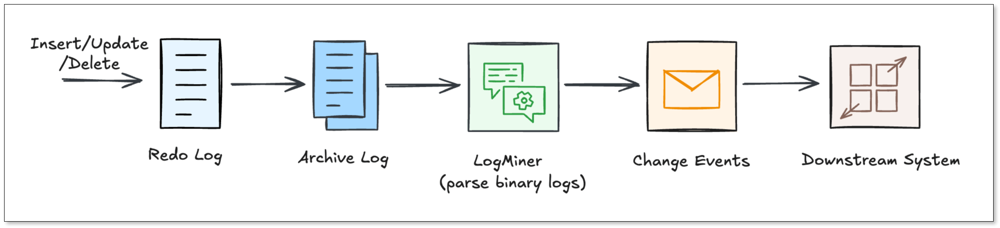

Your Oracle database knows everything that happened. The question is whether the rest of your systems do too. 

[Change Data Capture (CDC)](change_data_capture_cdc.md) is the technique that closes that gap. Instead of periodically asking "what does the table look like now?", CDC continuously asks "what just changed?" It reads directly from Oracle's redo log, captures every insert, update, and delete at the row level, and streams those changes to wherever they need to go.

In this guide, we'll walk through how Oracle CDC works under the hood, compare the most common implementation approaches, and cover the production challenges you'll need to plan for before you go live.

## TL;DR
+ Oracle CDC reads from the **redo log**, making it far more efficient and complete than traditional batch ETL, which may miss deletes and introduces data lag.
+ **Supplemental logging must be configured correctly** before you start. It's the most common setup mistake, and getting it wrong silently breaks UPDATE and DELETE tracking.
+ Three main approaches are **LogMiner connectors**, **XStream/GoldenGate**, and **external log readers like OpenLogReplicator**. Each come with different trade-offs on cost, latency, and operational complexity.
+ The hardest production challenges are **schema evolution**, **log retention during outages**, and **LogMiner CPU overhead at scale**. All require deliberate planning regardless of which tool you use.
+ **BladePipe** is a managed CDC platform that supports both LogMiner and OpenLogReplicator as parsing engines, making it adaptable to a wide range of Oracle environments and workload sizes.

## What is Oracle CDC?
### Oracle CDC Basics
Every time a row changes in Oracle, Oracle doesn't write directly to the data file on disk first. It writes to the [**redo log**](https://docs.oracle.com/html/E25494_01/onlineredo001.htm).

The redo log is Oracle's write-ahead log: a durable, sequential record of every single change made to the database. Its original purpose is crash recovery. But it turns out to be the perfect foundation for CDC too, because it already contains everything, including who changed what, when, and in what order.

To read that log meaningfully, you need two more concepts:

+ **SCN (System Change Number)**: Oracle's global transaction clock. Every committed change is stamped with a monotonically increasing SCN. It's not a timestamp in the traditional sense. It's a precise ordering mechanism that tells you exactly which change came before which.
+ **Commit order**: Because every event carries an SCN, downstream consumers can always reconstruct the exact sequence in which changes were committed. This is what makes CDC safe for data consistency.

So when a CDC tool reads the redo log, it's reading a stream of ordered, durable, row-level change events stamped with SCNs, ready to be replayed downstream.

### CDC vs Batch ETL
That's fundamentally different from what batch ETL does. [Batch ETL](https://www.bladepipe.com/blog/data_insights/etl_vs_elt/) reads the current state of a table. CDC reads the history of changes to it. The difference matters more than it might seem:

| | **Batch ETL** | **CDC** |
| --- | --- | --- |
| **How it runs** | Scheduled jobs | Continuous, event-driven |
| **Granularity** | Table snapshot | Row-level: INSERT / UPDATE / DELETE |
| **Captures DELETEs?** | No — deleted rows vanish | Yes — every delete is an event |
| **Data freshness** | Minutes to hours of lag | Sub-second to seconds |
| **Load on source DB** | Heavy — full table scans | Minimal — reads logs, not tables |

## How Oracle CDC Works Under the Hood
Now that you know what CDC reads, let's walk through how it actually works - from the moment a row changes to the moment a downstream system sees it.

### Step 1: The change hits the redo log
When a DML statement executes, here's what happened: 

1. Oracle writes the change to the **redo log buffer** in memory.
2. The **Log Writer (LGWR)** process flushes that change to a physical **redo log file** on the disk.
3. When those files fill up, Oracle archives them, producing the **archive log stream** that CDC tools mine continuously.

This is the key insight: CDC tools never touch your application tables. They read the archive logs. That's why CDC has almost zero impact on your production workload.

### Step 2: LogMiner parses the raw binary
The Redo Logs are written in a binary format that humans (and most tools) can’t read. Oracle provides a utility called [**LogMiner**](https://docs.oracle.com/en/cloud/paas/autonomous-database/serverless/adbsb/autonomous-logminer.html).

LogMiner acts as a translator. It reads the binary logs and turns them back into logical SQL statements like `INSERT`, `UPDATE`, and `DELETE`. Most CDC connectors use LogMiner because it is the "official" way to access changes.

### Step 3: Supplemental logging fills in the gaps
Here's where a lot of teams get tripped up.

By default, Oracle only writes the minimum data needed for crash recovery into the redo log. That minimum is often not enough for CDC. For example, without extra configuration, an UPDATE event might only record that something changed in a row, but not which columns and what the old values were.

**Supplemental logging** fixes this. It tells Oracle to write additional column data into redo records. There are two levels:

+ **Minimal supplemental logging**: It records enough to uniquely identify which row changed. This is the required baseline for any CDC setup.
+ **All-column supplemental logging**: It records full before and after images of every changed row. Required if you want to know what an UPDATE actually changed.

Without supplemental logging enabled, your CDC pipeline will either fail or produce incomplete, misleading data. It has to be configured before you start capturing.

### Step 4: Change events flow downstream
Once supplemental logging is on and LogMiner is reading the archive logs, each change becomes a structured event with a predictable shape:

+ **INSERT** > after-image of the new row, plus SCN and commit timestamp
+ **UPDATE** > before-image (old values) and after-image (new values), so consumers know exactly what changed
+ **DELETE** > before-image of the deleted row, giving downstream systems a tombstone to act on

Every event also carries the table name, transaction ID, and SCN. That's everything needed to replay changes in order on any destination.

## Three Common Oracle CDC Approaches
With the mechanics understood, the next question is: which tool or approach do you actually use? There are three main paths, each with a different set of trade-offs.

### LogMiner-Based Connectors
This is the most popular open-source approach. Tools like **Debezium** poll `V$LOGMNR_CONTENTS` at regular intervals, convert the rows into change events, and publish them to Kafka. From there, any number of downstream consumers can subscribe.

**Good for:** teams already running Kafka who want a free, community-backed solution.

**Watch out for:** It can be slow if your database has a massive volume of changes. LOB column handling and DDL changes require extra care. And you're responsible for the full Kafka infrastructure.

### XStream / GoldenGate-Licensed Paths
Oracle's own answer to low-latency CDC. **XStream Out** is a streaming API that pushes change events directly to a Java client. The latency is much lower than polling LogMiner. **Oracle GoldenGate** builds on top of that with enterprise features: multi-target fan-out, conflict detection, schema evolution handling.

**Good for:** organizations with existing Oracle enterprise contracts who need carrier-grade reliability.

**Watch out for:** GoldenGate licensing is expensive. Setup is complex. And you're locked into Oracle's ecosystem.

### External Redo-Log Readers
This is the approach fits for high-throughput environments. Instead of going through LogMiner, tools like [**OpenLogReplicator**](https://github.com/bersler/OpenLogReplicator) read Oracle's redo and archive log files directly at the binary level.

**OpenLogReplicator** is written in C++. It parses the raw log format itself, converts change events into JSON or Protobuf, and delivers them to Kafka or flat files. The result is very high throughput, low memory footprint, and sub-second latency.

**Good for:** teams with high change rates who need lean, fast, infrastructure-light CDC.

**Watch out for:** it's more hands-on to configure, and the community is smaller than Debezium's.

## BladePipe: Managed Oracle CDC Without the Operational Overhead
If the options above sound like a lot of work, that’s because they usually are. You need to configure the connectors, manage the infrastructure, and debug pipelines when they fall behind.

[**BladePipe**](https://www.bladepipe.com/) is a managed CDC platform that removes that burden. What sets it apart from other all-in-one CDC tools is that it doesn't lock you into a single log-reading mechanism. For Oracle, BladePipe supports two complementary parsing engines.

**Engine 1: LogMiner-Based Parsing** 

BladePipe uses Oracle's native `DBMS_LOGMNR` API to feed redo and archive log files into an analysis queue and extract structured change events. 

The advantage here is compatibility. No extra software needs to be installed on the database host. It works across Oracle versions and environments. For most standard workloads, this is the right default.

Learn more in [**LogMiner Setup Guide**](https://www.bladepipe.com/docs/dataMigrationAndSync/datasource_func/Oracle/prepare_for_oracle_logminer/).

**Engine 2: OpenLogReplicator-Based Parsing** 

For high-throughput environments where LogMiner's CPU overhead becomes a bottleneck, BladePipe offers a second engine powered by **OpenLogReplicator (OLR)**. 

OLR reads Oracle's redo and archive log files directly at the OS level, bypassing Oracle's internal APIs entirely. The result is extremely low latency and near-zero additional load on the database engine.

Learn more in [**OpenLogReplicator Setup Guide**](https://www.bladepipe.com/docs/dataMigrationAndSync/datasource_func/Oracle/prepare_for_oracle_olr/).

**What Else BladePipe Handles**

On top of the dual-engine architecture, BladePipe also includes:

+ **Real-time CDC**: The latency is usually less than 3 seconds.
+ **Automatic schema evolution**: DDL changes are propagated to destinations without restarts
+ **Wide** [**destination support**](https://www.bladepipe.com/connector/): MySQL, PostgreSQL, Kafka, ClickHouse and more
+ **Full change event coverage**: INSERT, UPDATE, DELETE with before and after images
+ **Built-in observability**: latency dashboards, alerts, and pipeline health monitoring

Setup takes minutes, not weeks. And it offers a community version for [free use](https://www.bladepipe.com/pricing/).

You may also want to read:

+ [Oracle to Kafka](https://www.bladepipe.com/blog/tech_share/stream_data_from_oracle_to_kafka/)
+ [Oracle to SQL Server](https://www.bladepipe.com/blog/tech_share/oracle_sqlserver_sync/)
+ [Oracle to ClickHouse](https://www.bladepipe.com/blog/tech_share/oracle_clickhouse_sync/)

## Key Challenges & Limitations of Oracle CDC 
Even with the best tools, Oracle CDC has some operational rough edges. Let’s look at the most common ones and how we solve them.

### LogMiner CPU Overhead at Scale 
**Challenge:** LogMiner runs inside the Oracle engine and is largely single-threaded through Oracle 18c. At high change rates, it consumes significant CPU, sometimes enough to affect production query performance during peak hours. 

**How to address it:** For standard workloads, LogMiner is perfectly adequate. For high-throughput pipelines, switching to an OpenLogReplicator-based engine (available in BladePipe) reads log files at the OS level, completely outside the Oracle process. This approach adds near-zero load to the database engine regardless of change volume.

### Schema Evolution Breaking Pipelines 
**Challenge:** A routine `ALTER TABLE ADD COLUMN` mid-stream can crash a connector or silently drop data at the destination. With open-source tools, fixing this usually means pausing the pipeline and restarting connectors manually.

**How to address it:** Whichever tool you use, verify that it handles DDL events in the redo log before you go live. BladePipe detects DDL changes and propagates them to the destination schema automatically, without restarts or manual intervention.

### Log Retention and Pipeline Outages 
**Challenge:** Oracle recycles archive logs on a schedule. If your pipeline goes down even briefly, those logs can be overwritten before they're consumed. When the pipeline restarts, the missed events are gone permanently.

**How to address it:** Extend your archive log retention to cover your maximum expected outage window, plus a safety margin. Monitor pipeline lag in real time so you can react before logs are purged. Use high-availability deployment modes for your CDC infrastructure where possible. BladePipe includes built-in lag alerting and HA support to help manage this.

## Wrapping Up
Mastering Oracle CDC is about balancing performance and complexity. While the internal mechanics of Redo Logs are intricate, they are the foundation of a real-time enterprise. The challenge lies in managing operational hurdles like CPU overhead and schema changes.

This is where a dual-engine solution like **BladePipe** excels. By supporting both official native mechanisms and high-performance external readers, it removes the technical barriers that stall most projects, and you'll get a strategy that turns your Oracle logs into a true competitive advantage.

## FAQ
**Q: Does CDC affect my Oracle database performance?**

If configured correctly, the impact is very low. Because CDC reads logs rather than querying tables, it is much lighter than traditional batch jobs.

**Q: What Oracle versions are supported?** 

Most tools support Oracle 11g R2 and above. XStream requires Enterprise Edition. BladePipe supports [10g and above](https://www.bladepipe.com/docs/dataMigrationAndSync/datasource_version/). Always verify version compatibility for your specific tool. 